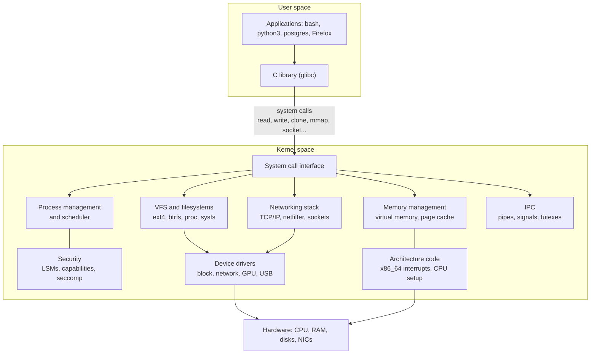
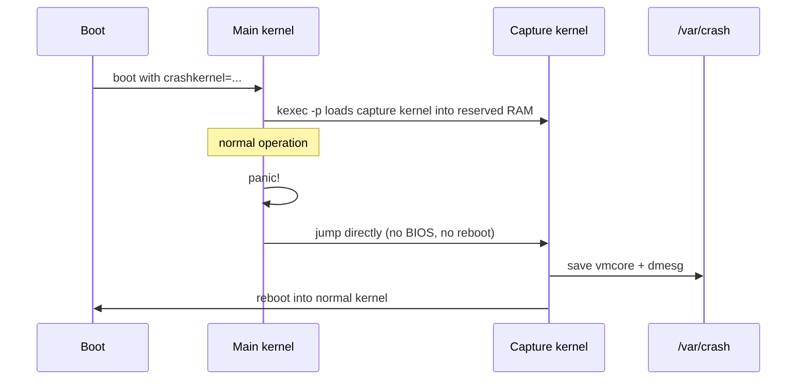

# Kernel basics

> **Level 6 · Chapter 4** · ⏱️ ~65 min read · Prerequisites: [The boot process](../03-internals/01-boot-process.md), [Devices, /proc, and /sys](../03-internals/05-devices-proc-sys.md), [System calls and strace](../05-programming/01-system-calls-strace.md)

Everything in this handbook ultimately runs on one program: the Linux kernel. This chapter looks at the kernel itself: what its parts do, how Ubuntu and Mint version and ship it, how to load and configure modules, how to tune it at runtime with `sysctl`, how to read its log with `dmesg`, and what to do when it crashes. You'll finish by writing, building, and loading your own kernel module.

## Why it matters

Alex's team runs Elasticsearch on an Ubuntu 22.04 VM (24.04 raised the default this story hinges on, but the lesson is the same for any setting). It refuses to start with `max virtual memory areas vm.max_map_count [65530] is too low, increase to at least [262144]`. A colleague finds a Stack Overflow answer, runs `sudo sysctl -w vm.max_map_count=262144`, and it works. The next morning, after a kernel update and reboot, Elasticsearch is down again: the setting was never made persistent.

A week later, the same VM's new 10 GbE network card isn't detected at all. `ip link` doesn't show it. Alex runs `dmesg | grep -i firmware` and sees `ixgbe 0000:03:00.0: firmware: failed to load`. Someone had put `blacklist ixgbe` in `/etc/modprobe.d/` during an earlier troubleshooting session and forgotten about it.

Neither problem was hard. Both cost hours, because nobody on the team knew where the kernel keeps its settings, how modules get loaded, or how to read the kernel's own log. That's what this chapter fixes.

## Concepts

### What the kernel does

The **kernel** is the core program of the operating system. It starts first (after the bootloader), runs with full control of the hardware in **kernel mode** (also called kernel space or ring 0), and stays in memory until shutdown. Every other program runs in **user mode**, where it can't touch hardware or other programs' memory directly. When a program needs something only the kernel can do, it makes a **system call**.

The kernel's job splits into a few large **subsystems**:



- **Process management and the scheduler** create processes and threads (`clone()`), and decide which runnable thread gets each CPU and for how long. Namespaces and cgroups live here too.
- **Memory management** gives each process its own virtual address space, maps it to physical RAM through page tables, handles page faults, runs the page cache, swaps, and runs the OOM killer when memory runs out (see [Memory](../03-internals/03-memory.md)).
- **The VFS** (virtual file system) is a common layer that lets `open()` and `read()` work the same on ext4, btrfs, NFS, `/proc`, and `/sys`.
- **The networking stack** implements sockets, TCP/IP, routing, and the netfilter firewall that `ufw` configures.
- **IPC** (inter-process communication): pipes, signals, shared memory, futexes (the building block of locks).
- **Security**: permission checks, capabilities, LSMs like AppArmor, seccomp (see [Security](03-security.md)).
- **Device drivers** talk to specific hardware. They make up the majority of the kernel's source code.
- **Architecture code** handles CPU-specific details: interrupts, context switching, early boot.

### Monolithic, but modular

Linux is a **monolithic kernel**: all those subsystems, including drivers, run together in one address space in kernel mode. A function call between the filesystem and the disk driver is just a function call. That's fast. The alternative, a **microkernel** (like MINIX or QNX), runs drivers and filesystems as separate user-space processes that exchange messages. That's more isolated but slower.

Linux gets much of a microkernel's flexibility from **loadable kernel modules**: pieces of kernel code (usually drivers, filesystems, or network protocols) compiled as separate `.ko` ("kernel object") files that can be loaded into the running kernel and unloaded again, without rebooting. Ubuntu's kernel is built with about 300 things compiled in (**built-in**) and over 6,000 available as modules under `/lib/modules/$(uname -r)/`. On Ubuntu they're compressed: `bridge.ko.zst`.

Important: once loaded, a module is not isolated. It runs in kernel mode with full privileges. A buggy module can crash the whole system, and a malicious one can do anything. That's why loading modules requires root (`CAP_SYS_MODULE`) and, with Secure Boot, a trusted signature.

**udev** (the device manager, part of systemd) loads most modules automatically. When the kernel detects hardware, it announces the device with a **modalias** string (identifying vendor and device IDs). udev looks up which module claims that alias and runs `modprobe` for it. You rarely load drivers by hand.

### Kernel versions on Ubuntu and Mint

`uname -r` prints something like `6.8.0-45-generic`. On Ubuntu, that reads as:

| Part | Meaning |
|---|---|
| `6.8.0` | The upstream kernel version Ubuntu's kernel is based on (major 6, minor 8) |
| `45` | Ubuntu's **ABI number**: it increases when the kernel's internal interface for modules changes. Each ABI has its own `/lib/modules/` directory |
| `generic` | The **flavour**: `generic` for desktops and servers, `lowlatency`, `aws`, `azure`, `raspi`, and so on |

`cat /proc/version_signature` shows the exact Ubuntu package version and the upstream **stable** release it includes, for example `Ubuntu 6.8.0-45.45-generic 6.8.12`.

Ubuntu LTS releases ship two kernel tracks:

- **GA** (general availability): the kernel the release shipped with. For Ubuntu 24.04 that's **6.8**, supported for the whole life of the release. Package: `linux-generic`.
- **HWE** (hardware enablement): newer kernels backported from later Ubuntu releases, to support newer hardware. Each point release (24.04.2, 24.04.3, ...) brings a newer one (6.11, 6.14, 6.17, ...), and the HWE track rolls forward automatically. Package: `linux-generic-hwe-24.04`.

Linux Mint 22 lets you choose in **Update Manager → View → Linux kernels**, which lists GA and HWE kernels with their support status. Recent Mint 22.x releases install an HWE kernel by default. Whatever you choose, **keep at least one older working kernel installed** so you can pick it from the GRUB menu if a new one fails to boot.

The kernel files live in `/boot`: `vmlinuz-VERSION` (the compressed kernel), `initrd.img-VERSION` (the initial RAM disk from [The boot process](../03-internals/01-boot-process.md)), `config-VERSION` (the build configuration, which you can grep), and `System.map-VERSION` (the symbol table).

### sysctl and /proc/sys

The kernel has hundreds of tunable parameters, called **sysctls** (system controls), exposed as files under `/proc/sys/`. The file path and the dotted sysctl name are the same thing:

```text
/proc/sys/vm/swappiness          <->  vm.swappiness
/proc/sys/net/ipv4/ip_forward    <->  net.ipv4.ip_forward
/proc/sys/kernel/pid_max         <->  kernel.pid_max
```

Top-level groups: `kernel` (core behaviour), `vm` (virtual memory), `fs` (filesystems), `net` (networking), `dev` (devices), `user` (per-user namespace limits). Reading them is always safe. Writing them changes the running kernel immediately, and the change is **lost at reboot** unless you also write it to a config file.

Persistence works through **`/etc/sysctl.d/*.conf`**. At boot, `systemd-sysctl.service` applies files from `/usr/lib/sysctl.d/` (package defaults), `/run/sysctl.d/`, and `/etc/sysctl.d/` (yours), in filename order, with `/etc/sysctl.d/` overriding a same-named file elsewhere. Later files win, which is why local settings often go in a file named `99-something.conf`.

The tunables you'll actually meet:

| sysctl | Ubuntu/Mint default | What it does |
|---|---|---|
| `vm.swappiness` | `60` | How eagerly to swap out process memory vs dropping page cache (0–200). Lower favours keeping apps in RAM |
| `vm.overcommit_memory` | `0` | `0` heuristic, `1` always allow allocations, `2` strict accounting. See [Memory](../03-internals/03-memory.md) |
| `vm.dirty_ratio` | `20` | Percent of memory that can be dirty (unwritten) before writers are forced to flush |
| `vm.max_map_count` | `1048576` | Max memory mappings per process. Elasticsearch and some JVM apps need it high; Ubuntu 24.04 raised the default |
| `net.ipv4.ip_forward` | `0` | Route packets between interfaces. Needed for routers, VPN servers, and container NAT (Docker turns it on) |
| `net.core.somaxconn` | `4096` | Max listen backlog for sockets |
| `fs.file-max` | `9223372036854775807` | System-wide limit on open files. Effectively unlimited on 64-bit; the real limit is per-process (`ulimit -n`) |
| `fs.file-nr` | (read-only) | Open files: allocated, free, maximum |
| `fs.inotify.max_user_watches` | depends on RAM | How many files one user can watch for changes. IDEs and `webpack` exhaust it on big projects |
| `kernel.pid_max` | `4194304` | Highest PID before wrapping around. Ubuntu raised it from the old 32768 |
| `kernel.panic` | `0` | Seconds to wait before rebooting after a panic. `0` means hang forever |
| `kernel.sysrq` | `176` | Bitmask of allowed Magic SysRq keyboard functions |
| `kernel.dmesg_restrict` | `1` on Ubuntu, `0` on Mint | Whether reading the kernel log requires root |

### The kernel log and dmesg

The kernel writes its messages into a fixed-size in-memory **ring buffer** (when it's full, the oldest messages are overwritten). `dmesg` reads that buffer. systemd-journald also copies it into the journal, so `journalctl -k` shows the same messages, persisted across reboots if the journal is persistent.

Each message has a **log level**, from most to least severe:

| Level | Number | Used for |
|---|---|---|
| `emerg` | 0 | System is unusable |
| `alert` | 1 | Action must be taken immediately |
| `crit` | 2 | Critical conditions (hardware failures) |
| `err` | 3 | Errors (I/O errors, driver failures) |
| `warn` | 4 | Warnings (deprecated features, recoverable problems, `WARN_ON` stack traces) |
| `notice` | 5 | Normal but significant |
| `info` | 6 | Informational (device detected, link up) |
| `debug` | 7 | Debugging (usually compiled out or hidden) |

`kernel.printk` (`4 4 1 7` on Ubuntu) controls which levels are also printed to the console: the first number means "print to the console only messages more severe than level 4". That's why `warn` and below don't spam your screen during boot.

Timestamps in `dmesg` are **seconds since boot** (`[ 3987.826934]`). `dmesg -T` converts them to wall-clock time, but the conversion can drift after suspend/resume; `journalctl -k` timestamps are always correct.

### Kernel taint

The kernel keeps a **taint** flag set: a record of events that make bug reports less trustworthy. Once set, a flag stays until reboot. Kernel developers will usually ignore crash reports from tainted kernels unless the taint is explained. `/proc/sys/kernel/tainted` holds a number whose bits are the flags (`0` = clean). The common ones:

| Bit | Value | Letter | Meaning |
|---|---|---|---|
| 0 | 1 | P | A proprietary (non-GPL) module was loaded, such as NVIDIA's driver |
| 1 | 2 | F | A module was force-loaded |
| 7 | 128 | D | The kernel died recently (an oops or BUG) |
| 9 | 512 | W | The kernel issued a warning (`WARN_ON`) |
| 12 | 4096 | O | An out-of-tree (externally built) module was loaded |
| 13 | 8192 | E | An unsigned module was loaded on a kernel that supports signatures |
| 15 | 32768 | K | The kernel has been live-patched |

Oops and warning messages print the flags as letters: `Tainted: P           O      6.8.0-45-generic`. Crash messages that say `Not tainted` come from a clean kernel.

### The kernel command line

The bootloader passes the kernel a **command line**: a list of parameters that configure it before anything else runs. `/proc/cmdline` shows the one the running kernel received:

```text
BOOT_IMAGE=/boot/vmlinuz-6.8.0-45-generic root=UUID=... ro quiet splash
```

- `root=UUID=...`: which filesystem to mount as `/`.
- `ro`: mount it read-only at first (systemd remounts it read-write after `fsck`).
- `quiet`: show only serious messages on the console during boot.
- `splash`: show the graphical boot splash.

Other parameters you'll meet: `nomodeset` (don't load GPU drivers early; a classic fix for black screens on install), `systemd.unit=rescue.target` (boot into rescue mode), `init=/bin/bash` (emergency shell, no systemd), `module_blacklist=name` (stop a module loading at all), `crashkernel=...` (reserve memory for kdump), `mitigations=off` (disable CPU vulnerability mitigations; faster, much less safe), and `panic=10` (reboot 10 s after a panic). Parameters for built-in modules use `module.param=value`, for example `usbcore.autosuspend=-1`.

On Ubuntu and Mint the command line is set in `/etc/default/grub` (`GRUB_CMDLINE_LINUX_DEFAULT="quiet splash"`) and applied with `sudo update-grub`. To test a parameter once, press ++e++ on the entry in the GRUB menu (hold ++shift++ or press ++esc++ during boot to show the menu on Mint), edit the `linux` line, and boot with ++ctrl+x++.

### Oops, panic, and kdump

When the kernel hits a bug, it reports it in one of two ways:

- **Oops**: the kernel detected an error (like dereferencing a NULL pointer) in some code path. It prints a register dump and stack trace, kills the offending process, sets the `D` taint, and tries to keep running. The system may be unstable afterwards.
- **Panic**: an error the kernel cannot recover from (for example, an oops in the interrupt handler, or the init process dying). Everything stops. The screen shows `Kernel panic - not syncing: ...` and, unless `kernel.panic` is set, the machine hangs.

A panic leaves no log on disk, because nothing can be written once the kernel has stopped. **kdump** solves this: at boot, memory is reserved (with the `crashkernel=` parameter) and a second, small "capture kernel" is loaded into it with `kexec`. On panic, the system jumps straight into the capture kernel, which saves the crashed kernel's memory (a **vmcore**) to `/var/crash/`, then reboots. Developers analyze it later with the `crash` tool.



On Ubuntu, `sudo apt install linux-crashdump` sets this up (it installs `kdump-tools`, adds `crashkernel=` to GRUB, and asks for a reboot). `kdump-config show` reports whether it's ready.

## Commands and examples

### Identify your kernel

```bash
uname -r
uname -a
cat /proc/version_signature
```

```text
6.17.0-42-generic
Linux mint 6.17.0-42-generic #42-Ubuntu SMP PREEMPT_DYNAMIC Thu Jul 23 19:56:28 UTC 2026 x86_64 x86_64 x86_64 GNU/Linux
Ubuntu 6.17.0-42.42-generic 6.17.13
```

- `6.17.0-42-generic`: upstream 6.17, Ubuntu ABI 42, generic flavour. This is an HWE kernel; a GA kernel on 24.04 starts with `6.8.0`.
- `#42-Ubuntu SMP PREEMPT_DYNAMIC`: the build number, multi-processor support, and the preemption model (selectable at boot).
- `6.17.13` in the signature: the upstream stable release this Ubuntu kernel includes.

Which kernels are installed, and which meta-package keeps you updated?

```bash
dpkg -l 'linux-image-*' | awk '/^ii/ {print $2, $3}'
ls /boot
```

```text
linux-image-6.17.0-35-generic 6.17.0-35.35~24.04.1
linux-image-6.17.0-42-generic 6.17.0-42.42
linux-image-generic-hwe-24.04 6.17.0-42.42
config-6.17.0-35-generic
config-6.17.0-42-generic
efi
grub
initrd.img
initrd.img-6.17.0-35-generic
initrd.img-6.17.0-42-generic
initrd.img.old
System.map-6.17.0-35-generic
System.map-6.17.0-42-generic
vmlinuz
vmlinuz-6.17.0-35-generic
vmlinuz-6.17.0-42-generic
vmlinuz.old
```

Two kernels are installed, the current one and a fallback. `vmlinuz` and `vmlinuz.old` are symlinks to the newest and previous kernels. The build configuration answers "is this feature in my kernel, and is it built-in (`=y`) or a module (`=m`)?":

```bash
grep -E 'CONFIG_EXT4_FS=|CONFIG_BTRFS_FS=|CONFIG_MODULE_SIG=|CONFIG_HZ=' /boot/config-$(uname -r)
```

```text
CONFIG_HZ=1000
CONFIG_MODULE_SIG=y
CONFIG_EXT4_FS=y
CONFIG_BTRFS_FS=m
```

ext4 is built in (it has to be: the root filesystem uses it), btrfs is a loadable module, and module signing is supported.

### List and inspect modules

```bash
lsmod | head -8
```

```text
Module                  Size  Used by
nf_log_syslog          20480  0
nft_log                12288  0
nft_limit              16384  0
nft_ct                 24576  0
udp_diag               12288  0
tcp_diag               12288  0
inet_diag              32768  2 tcp_diag,udp_diag
```

`lsmod` formats `/proc/modules`. **Size** is the module's memory in bytes. **Used by** is a reference count followed by the modules that depend on this one: `inet_diag` is used by 2 others, `tcp_diag` and `udp_diag`. A module with a non-zero count can't be unloaded. Built-in features (like ext4 here) never appear in `lsmod`; they're listed in `/lib/modules/$(uname -r)/modules.builtin`.

```bash
modinfo bridge
```

```text
filename:       /lib/modules/6.17.0-42-generic/kernel/net/bridge/bridge.ko.zst
description:    Ethernet bridge driver
alias:          rtnl-link-bridge
version:        2.3
license:        GPL
depends:        llc,stp
intree:         Y
name:           bridge
vermagic:       6.17.0-42-generic SMP preempt mod_unload modversions
sig_id:         PKCS#7
signer:         Build time autogenerated kernel key
sig_hashalgo:   sha512
signature:      B0:EC:83:68:3D:2D:0E:1B:93:B7:26:DD:B6:24:BC:ED:AD:EA:D7:B1:
...
```

- **filename**: where the module file is.
- **depends**: modules that must load first. `modprobe` handles this automatically.
- **intree: Y**: built as part of the kernel source tree (your own module won't have this).
- **vermagic**: the exact kernel version and options the module was built for. A module only loads into a kernel with a matching vermagic.
- **signer/signature**: the module is signed with the key Ubuntu generated when building this kernel.
- **parm** lines (not shown for `bridge`): options you can pass to the module. `modinfo -p usbcore` lists them for `usbcore`.

See what `modprobe` would do, without doing it:

```bash
modprobe --show-depends bridge
```

```text
insmod /lib/modules/6.17.0-42-generic/kernel/net/llc/llc.ko.zst
insmod /lib/modules/6.17.0-42-generic/kernel/net/802/stp.ko.zst
insmod /lib/modules/6.17.0-42-generic/kernel/net/bridge/bridge.ko.zst
```

Current parameters of a loaded module are in `/sys/module/NAME/parameters/`:

```bash
cat /sys/module/usbcore/parameters/autosuspend
```

```text
2
```

USB devices are suspended after 2 seconds of inactivity.

### modprobe vs insmod, and /etc/modprobe.d

There are two tools for loading modules:

- **`insmod FILE.ko`**: loads exactly that file. No dependency handling, no config files. Used for modules you just built.
- **`modprobe NAME`**: looks up the module by name in `/lib/modules/$(uname -r)/`, loads its dependencies first, and applies options from `/etc/modprobe.d/`. This is what you normally use. `modprobe -r NAME` unloads it and any dependencies no longer needed. (`rmmod NAME` unloads one module only.)

`/etc/modprobe.d/*.conf` files configure modprobe. Real examples from Mint:

```bash
grep -v '^#' /etc/modprobe.d/iwlwifi.conf | grep .
grep -v '^#' /etc/modprobe.d/blacklist-firewire.conf | grep .
```

```text
options iwlwifi power_save=0
options iwlmvm power_scheme=1
blacklist ohci1394
blacklist sbp2
blacklist dv1394
blacklist raw1394
blacklist video1394
```

- **`options MODULE param=value`**: pass parameters every time the module loads.
- **`blacklist MODULE`**: don't load this module *automatically* through its device aliases. It can still be loaded explicitly, or as a dependency of another module.
- **`install MODULE /bin/false`**: a stronger block. Any attempt to load the module runs `/bin/false` instead and fails.

Modules that should load at every boot, regardless of hardware, are listed one per line in `/etc/modules-load.d/*.conf` (or the older `/etc/modules`).

!!! danger "⚠️ VM only"
    Run module loading and unloading in your throwaway VM. Unloading the wrong module (a storage, network, or GPU driver) can drop your disk, network, or display instantly. A bad blacklist can leave a machine without network or unable to boot.

```bash
sudo modprobe dummy                 # a harmless virtual network device driver
lsmod | grep dummy
ip -brief link show type dummy
sudo ip link add dummy0 type dummy  # create one interface
ip -brief link show type dummy
sudo ip link del dummy0
sudo modprobe -r dummy
lsmod | grep dummy || echo "dummy unloaded"
```

```text
dummy                  12288  0
dummy0           DOWN           3a:5f:10:c2:9e:41 <BROADCAST,NOARP>
dummy unloaded
```

The first `ip` command prints nothing (no dummy interfaces yet). To block a module (for example, to stop a misbehaving driver loading at boot), add a file and rebuild the initramfs, because the initramfs carries its own copy of modprobe config for drivers loaded early:

```bash
echo "blacklist dummy" | sudo tee /etc/modprobe.d/blacklist-dummy.conf
sudo update-initramfs -u
```

!!! warning "Common mistake: forgetting a blacklist"
    Blacklist files outlive the problem they were created for. When hardware mysteriously stops working, check for forgotten blacklists: `grep -r blacklist /etc/modprobe.d/` and look for anything that isn't from a package. `dpkg -S /etc/modprobe.d/FILE` tells you whether a package owns the file.

### sysctl: read, change, persist

Reading is safe and needs no root:

```bash
sysctl vm.swappiness
cat /proc/sys/vm/swappiness
sysctl -a 2>/dev/null | wc -l
sysctl -a 2>/dev/null | grep -E '^net.ipv4.ip_forward|^kernel.pid_max|^fs.file-'
```

```text
vm.swappiness = 60
60
1384
fs.file-max = 9223372036854775807
fs.file-nr = 19240	0	9223372036854775807
kernel.pid_max = 4194304
net.ipv4.ip_forward = 0
```

Over 1,300 tunables. (`2>/dev/null` hides "permission denied" for the few that only root can read.) `fs.file-nr` shows 19,240 file handles allocated system-wide, 0 free, and the maximum.

!!! danger "⚠️ VM only"
    Run kernel parameter changes in your throwaway VM. Some parameters can cut off networking (`net.*`), destabilize memory management (`vm.*`), or weaken security (`kernel.*`). Changes take effect instantly for the whole system.

Change a value until the next reboot:

```bash
sudo sysctl -w vm.swappiness=10
sysctl vm.swappiness
```

```text
vm.swappiness = 10
vm.swappiness = 10
```

`sudo sysctl -w` prints the new value when it succeeds. Writing the file directly (`echo 10 | sudo tee /proc/sys/vm/swappiness`) does the same thing.

Make it persistent with a drop-in file, then apply all config files now without rebooting:

```bash
sudo tee /etc/sysctl.d/99-local.conf > /dev/null <<'EOF'
# Keep application memory in RAM; this box has plenty and slow swap.
vm.swappiness = 10
# IDEs and build watchers on big repos run out of inotify watches.
fs.inotify.max_user_watches = 524288
EOF
sudo sysctl --system | tail -4
```

```text
* Applying /etc/sysctl.d/99-local.conf ...
* Applying /etc/sysctl.conf ...
vm.swappiness = 10
fs.inotify.max_user_watches = 524288
```

`sysctl --system` reapplies every file in the same order as at boot and prints each one. `sudo sysctl -p FILE` applies a single file. Always add a comment explaining *why*: future you won't remember.

!!! warning "Common mistake: values that look persisted but aren't"
    `sysctl -w` (or writing to `/proc/sys`) only changes the running kernel. If you can't find the setting in `/etc/sysctl.d/` or `/etc/sysctl.conf`, it will be gone after the next reboot. Also check you didn't set the same key in two files: the one applied last wins, and `systemd-sysctl` applies files sorted by name.

### dmesg: reading the kernel log

```bash
dmesg | head -3
```

```text
[    0.000000] Linux version 6.17.0-42-generic (buildd@lcy02-amd64-022) (x86_64-linux-gnu-gcc-13 (Ubuntu 13.3.0-6ubuntu2~24.04.1) 13.3.0, GNU ld (GNU Binutils for Ubuntu) 2.42) #42-Ubuntu SMP PREEMPT_DYNAMIC Thu Jul 23 19:56:28 UTC 2026 (Ubuntu 6.17.0-42.42-generic 6.17.13)
[    0.000000] Command line: BOOT_IMAGE=/boot/vmlinuz-6.17.0-42-generic root=UUID=... ro quiet splash
[    0.000000] KERNEL supported cpus:
```

The first lines are always the kernel version, the compiler that built it, and the command line. On plain Ubuntu you need `sudo dmesg` (because `kernel.dmesg_restrict = 1`); Mint sets it to `0` in `/usr/lib/sysctl.d/50-mint.conf` ("let users access dmesg"), so it works without `sudo`.

The options you'll use most:

| Command | Does |
|---|---|
| `dmesg -T` | Human-readable timestamps |
| `dmesg -H` | Human-friendly: colours, relative times, paged |
| `dmesg -w` | Follow: keep printing new messages (like `tail -f`). Great while plugging in a USB device |
| `dmesg -l err,warn` | Only errors and warnings (`--level`) |
| `dmesg -x` | Show facility and level on each line |
| `journalctl -k` | Kernel messages from the journal, with correct timestamps and history |
| `journalctl -k -b -1 -p err` | Errors from the *previous* boot. The way to investigate a crash after rebooting |

Watch a device appear:

```bash
dmesg -w
```

Plug in a USB stick, and you'll see something like:

```text
[ 9312.511422] usb 3-2: new high-speed USB device number 7 using xhci_hcd
[ 9312.662188] usb 3-2: New USB device found, idVendor=0781, idProduct=5581, bcdDevice= 1.00
[ 9312.662203] usb 3-2: Product: Ultra
[ 9312.664105] usb-storage 3-2:1.0: USB Mass Storage device detected
[ 9313.689511] sd 0:0:0:0: [sda] 60063744 512-byte logical blocks: (30.8 GB/28.6 GiB)
[ 9313.711230]  sda: sda1
[ 9313.711502] sd 0:0:0:0: [sda] Attached SCSI removable disk
```

Each line names the subsystem (`usb`, `usb-storage`, `sd`) and the device. This is how you find out which device name (`sda`) a new disk got. Press ++ctrl+c++ to stop.

### Reading common kernel messages

**OOM kills.** When memory runs out, system-wide or in a cgroup:

```text
[ 3987.826700] dd invoked oom-killer: gfp_mask=0xcc0(GFP_KERNEL), order=0, oom_score_adj=0
[ 3987.826712] CPU: 0 UID: 1000 PID: 151507 Comm: dd Not tainted 6.17.0-42-generic #42-Ubuntu
...
[ 3987.826890] memory: usage 65536kB, limit 65536kB, failcnt 19
[ 3987.826921] oom-kill:constraint=CONSTRAINT_MEMCG,...,task=dd,pid=151507,uid=1000
[ 3987.826934] Memory cgroup out of memory: Killed process 151507 (dd) total-vm:104804kB, anon-rss:64640kB, file-rss:928kB, shmem-rss:0kB, UID:1000 pgtables:172kB oom_score_adj:0
```

- **`invoked oom-killer`** names the process that *asked* for memory. It isn't necessarily the one killed.
- **`constraint=CONSTRAINT_MEMCG`** means a cgroup limit was hit (a container or systemd unit limit). `CONSTRAINT_NONE` means the whole machine ran out.
- **`Killed process ... (dd)`** is the victim. `anon-rss` is its private memory, the main thing the OOM killer weighs.
- The process sees `SIGKILL` (exit code 137). Search for these with `journalctl -k | grep -i 'killed process'`.

**I/O errors.** A failing disk or cable:

```text
[52101.338120] ata2.00: exception Emask 0x0 SAct 0x10000 SErr 0x0 action 0x0
[52101.338135] ata2.00: failed command: READ FPDMA QUEUED
[52101.338301] sd 1:0:0:0: [sdb] tag#16 Add. Sense: Unrecovered read error - auto reallocate failed
[52101.338310] I/O error, dev sdb, sector 98234880 op 0x0:(READ) flags 0x0 phys_seg 1 prio class 2
[52101.338399] EXT4-fs error (device sdb1): __ext4_get_inode_loc:4519: inode #2883591: block 11796512: comm python3: unable to read itable block
```

Read from the bottom up: an application (`python3`) hit a filesystem error, caused by a block-layer `I/O error` on `sdb` at a specific sector, caused by an unrecoverable read error reported by the drive over the `ata2` link. That's a failing disk: back it up now and check it with `sudo smartctl -a /dev/sdb` (package `smartmontools`). Repeated errors with `link reset` or `hard resetting link` instead often point to a bad cable.

**Segfaults.** A user-space program accessed memory it shouldn't:

```text
[61022.104455] python3[48210]: segfault at 0 ip 00007f3a1c2b9d41 sp 00007ffd8a1e2f10 error 4 in libparquet.so.1500[7f3a1c200000+1a3000] likely on CPU 2 (core 1, socket 0)
```

- `python3[48210]`: process name and PID.
- `segfault at 0`: it tried to access address 0, a NULL pointer.
- `ip` is the instruction pointer (where it crashed), `sp` the stack pointer.
- `error 4`: a bitmask: 4 = the fault happened in user mode, on a read of a page that wasn't mapped.
- `in libparquet.so.1500[...]`: the crash was inside that library. That's a bug in the native library (or a version mismatch), not in your Python code.

**Other messages worth recognizing**: `INFO: task NAME:PID blocked for more than 120 seconds` (a task stuck in `D` state: storage or NFS hangs), `watchdog: BUG: soft lockup - CPU#3 stuck for 22s!` (kernel code looping without yielding), `nf_conntrack: table full, dropping packet` (raise `net.netfilter.nf_conntrack_max`), and `WARNING: CPU: 1 PID: ... at ...` followed by a stack trace (a kernel warning; sets the `W` taint, usually a driver bug).

### Check taint

```bash
cat /proc/sys/kernel/tainted
```

```text
0
```

`0` is a clean kernel. If it isn't zero, decode it bit by bit:

```bash
t=$(cat /proc/sys/kernel/tainted)
for i in $(seq 0 18); do (( (t >> i) & 1 )) && echo "bit $i set"; done
```

```text
bit 12 set
bit 13 set
```

Bits 12 and 13 (value 12288) are `O` and `E`: an out-of-tree, unsigned module was loaded. That's exactly what you're about to cause. The kernel source also ships `tools/debugging/kernel-chktaint`, a script that prints a full explanation.

### Walkthrough: build and load a hello-world kernel module

You need a compiler and the headers for your running kernel. Both are usually present on Mint; if not:

```bash
sudo apt install build-essential linux-headers-$(uname -r)
```

Building is safe and needs no root. Make a directory and write the module source:

```bash
mkdir -p ~/lab/hello-module && cd ~/lab/hello-module
```

```c
// SPDX-License-Identifier: GPL-2.0
// hello.c - a minimal kernel module with one parameter.
#include <linux/init.h>
#include <linux/module.h>
#include <linux/kernel.h>
#include <linux/utsname.h>

static char *who = "world";
module_param(who, charp, 0444);
MODULE_PARM_DESC(who, "Who to greet");

static int __init hello_init(void)
{
	pr_info("hello: Hello, %s! Loaded into kernel %s\n", who, utsname()->release);
	return 0;
}

static void __exit hello_exit(void)
{
	pr_info("hello: Goodbye, %s!\n", who);
}

module_init(hello_init);
module_exit(hello_exit);

MODULE_LICENSE("GPL");
MODULE_AUTHOR("Alex <alex@example.com>");
MODULE_DESCRIPTION("A hello-world kernel module");
MODULE_VERSION("0.1");
```

Line by line:

- **Kernel headers, not libc.** Kernel code can't use `printf`, `malloc`, or anything from the C library. It uses the kernel's own functions.
- **`module_param(who, charp, 0444)`** declares a parameter named `who` of type "char pointer" (a string). `0444` makes it readable by everyone under `/sys/module/hello/parameters/who`.
- **`hello_init`** runs when the module loads. Returning `0` means success; a negative error code (like `-ENOMEM`) aborts the load. `__init` lets the kernel free this function's memory after loading.
- **`pr_info(...)`** is shorthand for `printk(KERN_INFO ...)`: **printk** is the kernel's logging function, and it writes into the ring buffer that `dmesg` reads, at level `info`.
- **`hello_exit`** runs on unload. It must undo everything `init` did (here, nothing).
- **`MODULE_LICENSE("GPL")`** matters: without a GPL-compatible license the module can't use many kernel functions and taints the kernel with `P`.

The **Makefile** uses the kernel's own build system (**kbuild**), found through the headers package. The indented lines must start with a real tab character, not spaces:

```makefile
obj-m += hello.o

KDIR ?= /lib/modules/$(shell uname -r)/build

all:
	$(MAKE) -C $(KDIR) M=$(CURDIR) modules

clean:
	$(MAKE) -C $(KDIR) M=$(CURDIR) clean
```

`obj-m += hello.o` says "build `hello.o` as a module". `make -C $(KDIR)` runs the kernel's Makefile from the headers directory, and `M=$(CURDIR)` tells it to build the external module in your directory.

```bash
make
```

```text
make -C /lib/modules/6.17.0-42-generic/build M=/home/alex/lab/hello-module modules
make[1]: Entering directory '/usr/src/linux-headers-6.17.0-42-generic'
make[2]: Entering directory '/home/alex/lab/hello-module'
warning: the compiler differs from the one used to build the kernel
  The kernel was built by: x86_64-linux-gnu-gcc-13 (Ubuntu 13.3.0-6ubuntu2~24.04.1) 13.3.0
  You are using:           gcc-13 (Ubuntu 13.3.0-6ubuntu2~24.04.1) 13.3.0
  CC [M]  hello.o
  MODPOST Module.symvers
  CC [M]  hello.mod.o
  CC [M]  .module-common.o
  LD [M]  hello.ko
  BTF [M] hello.ko
Skipping BTF generation for hello.ko due to unavailability of vmlinux
make[2]: Leaving directory '/home/alex/lab/hello-module'
make[1]: Leaving directory '/usr/src/linux-headers-6.17.0-42-generic'
```

The compiler "warning" is harmless: it's the same GCC under a different name. The BTF message is also harmless (BTF is type information used by eBPF tools). The result is `hello.ko`:

```bash
modinfo ./hello.ko
```

```text
filename:       /home/alex/lab/hello-module/./hello.ko
version:        0.1
description:    A hello-world kernel module
author:         Alex <alex@example.com>
license:        GPL
srcversion:     5EFE6A92B43680B13E673A3
depends:
name:           hello
retpoline:      Y
vermagic:       6.17.0-42-generic SMP preempt mod_unload modversions
parm:           who:Who to greet (charp)
```

The `vermagic` matches your running kernel, and there's no `signer` line: the module is unsigned.

Loading is where it becomes risky.

!!! danger "⚠️ VM only"
    Load your own modules only in your throwaway VM. A module runs with full kernel privileges: a bug in it can crash or corrupt the whole system, and loading it taints the kernel until reboot. Use a VM without Secure Boot for this first test (or see the signing note below).

```bash
sudo insmod hello.ko who=Alex
lsmod | grep hello
cat /sys/module/hello/parameters/who
sudo dmesg | tail -3
```

```text
hello                  12288  0
Alex
[ 5123.441201] hello: loading out-of-tree module taints kernel.
[ 5123.441207] hello: module verification failed: signature and/or required key missing - tainting kernel
[ 5123.441530] hello: Hello, Alex! Loaded into kernel 6.17.0-42-generic
```

Your message is in the kernel log, and the kernel has noted that it is now tainted: once for out-of-tree (`O`) and once for unsigned (`E`). Unload it:

```bash
sudo rmmod hello
sudo dmesg | tail -1
cat /proc/sys/kernel/tainted
```

```text
[ 5160.902113] hello: Goodbye, Alex!
12288
```

The module is gone, but the taint (4096 + 8192 = 12288) stays until reboot. `make clean` removes the build files.

### A note on Secure Boot and module signing

If the VM (or your machine) boots with **Secure Boot** enabled, Ubuntu's kernel runs in **lockdown** mode and refuses unsigned modules:

```text
insmod: ERROR: could not insert module hello.ko: Key was rejected by service
```

Check with `mokutil --sb-state`. You have two options: disable Secure Boot in the VM's firmware settings (easiest for a lab VM), or sign the module with a key the firmware trusts. Signing uses a **MOK** (Machine Owner Key) that you enroll yourself:

```bash
openssl req -new -x509 -newkey rsa:2048 -nodes -days 36500 \
    -subj "/CN=alex lab module signing/" -keyout MOK.priv -outform DER -out MOK.der
sudo mokutil --import MOK.der          # asks for a one-time password
# Reboot. In the blue MOK Manager screen: Enroll MOK -> Continue -> Yes -> enter that password.
sudo kmodsign sha512 MOK.priv MOK.der hello.ko
modinfo hello.ko | grep signer
sudo insmod hello.ko
```

```text
signer:         alex lab module signing
```

If you have ever installed a DKMS driver (such as NVIDIA or VirtualBox) with Secure Boot on, Ubuntu already created and enrolled a key at `/var/lib/shim-signed/mok/MOK.der`; `mokutil --test-key /var/lib/shim-signed/mok/MOK.der` tells you if it's enrolled, and you can sign with it instead. A signed module no longer sets the `E` taint, but still sets `O` (out-of-tree). Keep `MOK.priv` private: anyone with it can sign modules your machine will trust.

### kdump: setting it up

!!! danger "⚠️ VM only"
    Set up and test kdump only in your throwaway VM. It changes the kernel command line, reserves memory, and the test deliberately crashes the kernel.

```bash
sudo apt install linux-crashdump      # answer Yes to enabling kdump
sudo reboot
kdump-config show
```

```text
DUMP_MODE:              kdump
USE_KDUMP:              1
KDUMP_COREDIR:          /var/crash
crashkernel addr: 0x5f000000
   /var/lib/kdump/vmlinuz: symbolic link to /boot/vmlinuz-6.8.0-45-generic
kdump initrd:
   /var/lib/kdump/initrd.img: symbolic link to /var/lib/kdump/initrd.img-6.8.0-45-generic
current state:    ready to kdump
```

`ready to kdump` means the capture kernel is loaded. To test it, trigger a crash through Magic SysRq (this *will* crash the VM immediately):

```bash
echo 1 | sudo tee /proc/sys/kernel/sysrq
echo c | sudo tee /proc/sysrq-trigger
```

The VM panics, boots the capture kernel, writes the dump, and reboots. Afterwards:

```bash
ls /var/crash/
```

```text
202610021512  kexec_cmd
```

The timestamped directory contains `dmesg.202610021512` (the kernel log up to the crash, the most useful file for most people) and `dump.202610021512` (the full memory image for the `crash` tool).

## Exercises

### Exercise 1: Know your kernel (easy)

Without root, find: your running kernel version and whether it's GA or HWE; the upstream stable version it's based on; how many kernels are installed; whether `vfat` and `btrfs` are built in or modules; and the kernel command line (hide the UUID).

??? success "Solution"

    ```bash
    uname -r
    cat /proc/version_signature
    dpkg -l 'linux-image-[0-9]*' | grep -c '^ii'
    grep -E '/(vfat|btrfs)\.ko' /lib/modules/$(uname -r)/modules.builtin || true
    grep -E 'CONFIG_VFAT_FS=|CONFIG_BTRFS_FS=' /boot/config-$(uname -r)
    sed 's/UUID=[^ ]*/UUID=.../' /proc/cmdline
    ```

    ```text
    6.17.0-42-generic
    Ubuntu 6.17.0-42.42-generic 6.17.13
    2
    kernel/fs/fat/vfat.ko
    CONFIG_VFAT_FS=y
    CONFIG_BTRFS_FS=m
    BOOT_IMAGE=/boot/vmlinuz-6.17.0-42-generic root=UUID=... ro quiet splash
    ```

    A version starting `6.8.0` on Ubuntu 24.04 / Mint 22 is the GA kernel; anything newer (6.11, 6.14, 6.17) is HWE. `vfat` appears in `modules.builtin` and is `=y`: built in (needed early to read the EFI system partition). `btrfs` is `=m`: a loadable module.

### Exercise 2: Module detective (easy)

Find the module that drives your network interface, and show its description, its file, what depends on it, and its parameters.

??? success "Solution"

    ```bash
    ip -brief link
    readlink /sys/class/net/wlo1/device/driver
    modinfo -F description iwlwifi
    modinfo -n iwlwifi
    lsmod | grep -E '^iwlwifi'
    modinfo -p iwlwifi | head -5
    ```

    ```text
    lo               UNKNOWN        00:00:00:00:00:00 <LOOPBACK,UP,LOWER_UP>
    wlo1             UP             a4:c3:f0:12:34:56 <BROADCAST,MULTICAST,UP,LOWER_UP>
    ../../../bus/pci/drivers/iwlwifi
    Intel(R) Wireless WiFi driver for Linux
    /lib/modules/6.17.0-42-generic/kernel/drivers/net/wireless/intel/iwlwifi/iwlwifi.ko.zst
    iwlwifi               647168  1 iwlmvm
    swcrypto:using crypto in software (default 0 [hardware]) (int)
    11n_disable:disable 11n functionality, bitmap: 1: full, 2: disable agg TX, 4: disable agg RX, 8 enable agg TX (uint)
    amsdu_size:amsdu size 0: 12K for multi Rx queue devices, 2K for AX210 devices, 4K for other devices 1:4K 2:8K 3:12K (16K buffers) 4: 2K (default 0) (int)
    fw_restart:restart firmware in case of error (default true) (bool)
    nvm_file:NVM file name (charp)
    ```

    Replace `wlo1` with your interface name. The `device/driver` symlink in `/sys` leads straight to the driver. `modinfo -F` prints one field, `-n` just the filename, `-p` the parameters. `iwlmvm` uses `iwlwifi`. Your output depends on your hardware (for wired Intel NICs you might see `e1000e`, for Realtek `r8169`).

### Exercise 3: Make a sysctl stick (medium)

⚠️ VM only. Set `vm.swappiness` to 20 and `fs.inotify.max_user_watches` to 524288 so they survive a reboot. Prove both are applied now and after a reboot. Then find which file Ubuntu's own default for `kernel.pid_max` comes from.

??? success "Solution"

    ```bash
    sudo tee /etc/sysctl.d/99-lab.conf > /dev/null <<'EOF'
    # Lab: prefer keeping apps in RAM.
    vm.swappiness = 20
    # Lab: large repos in VS Code.
    fs.inotify.max_user_watches = 524288
    EOF
    sudo sysctl --system | grep -A2 99-lab
    sudo reboot
    ```

    After the reboot:

    ```bash
    sysctl vm.swappiness fs.inotify.max_user_watches
    grep -r pid_max /usr/lib/sysctl.d/ /etc/sysctl.d/
    ```

    ```text
    vm.swappiness = 20
    fs.inotify.max_user_watches = 524288
    /usr/lib/sysctl.d/50-pid-max.conf:kernel.pid_max = 4194304
    ```

    Package defaults live in `/usr/lib/sysctl.d/`; your overrides go in `/etc/sysctl.d/`. Clean up with `sudo rm /etc/sysctl.d/99-lab.conf` and another reboot (or `sysctl -w` back to the defaults).

### Exercise 4: Triage a kernel log (medium)

For each message, say which subsystem produced it, what went wrong, and what you would check next:

```text
(a) Out of memory: Killed process 7731 (java) total-vm:9210112kB, anon-rss:7340032kB, file-rss:0kB, shmem-rss:0kB, UID:998 pgtables:15000kB oom_score_adj:0
(b) node[22014]: segfault at 7ffd2b1c0ff8 ip 000055d1c3a4e8a2 sp 00007ffd2b1c1000 error 6 in node[55d1c2a00000+4a1000]
(c) I/O error, dev nvme0n1, sector 734003200 op 0x1:(WRITE) flags 0x8800 phys_seg 4 prio class 2
(d) INFO: task postgres:3120 blocked for more than 122 seconds.
```

??? success "Solution"

    (a) **Memory management / OOM killer**, system-wide (`Out of memory`, not `Memory cgroup out of memory`). Java was using about 7 GB of anonymous memory. Check total RAM vs the JVM's `-Xmx`, other big processes at the time (`journalctl -k` shows the full task list above this line), and whether swap exists.

    (b) **A user-space crash** reported by the kernel's fault handler. `error 6` = user mode (4) + write (2), page not present. The address is just below the stack pointer, which suggests a **stack overflow** (deep or infinite recursion). Check for runaway recursion in the code, or the stack size limit (`ulimit -s`).

    (c) **Block layer**: a *write* (`op 0x1:(WRITE)`) to the NVMe drive failed. Check `sudo smartctl -a /dev/nvme0n1` (or `sudo nvme smart-log /dev/nvme0n1`) for media errors and spare capacity, and look for preceding `nvme` controller messages. Back up immediately.

    (d) **Scheduler's hung-task detector**: PostgreSQL was stuck in uninterruptible sleep (`D` state) for over 2 minutes, almost always waiting on storage. Check `iostat -xz 1` for a saturated or failed device, NFS or network storage hangs, and the stack trace printed after this line, which shows where in the kernel it was waiting.

### Exercise 5: Extend the hello module (hard)

⚠️ VM only (for loading). Add an `int` parameter `count` (default 1) to the hello module and make `init` print the greeting `count` times. Reject loads where `count` is less than 1 or greater than 10 by returning `-EINVAL`. Build it, load it with `count=3`, then try `count=50` and show what `insmod` prints.

??? success "Solution"

    Changes to `hello.c`:

    ```c
    static int count = 1;
    module_param(count, int, 0444);
    MODULE_PARM_DESC(count, "How many times to greet (1-10)");

    static int __init hello_init(void)
    {
    	int i;

    	if (count < 1 || count > 10) {
    		pr_err("hello: count=%d out of range (1-10)\n", count);
    		return -EINVAL;
    	}
    	for (i = 0; i < count; i++)
    		pr_info("hello: [%d] Hello, %s!\n", i + 1, who);
    	return 0;
    }
    ```

    Build and test:

    ```bash
    make
    modinfo -p hello.ko
    sudo insmod hello.ko who=Alex count=3
    sudo dmesg | tail -3
    sudo rmmod hello
    sudo insmod hello.ko count=50
    sudo dmesg | tail -1
    ```

    ```text
    who:Who to greet (charp)
    count:How many times to greet (1-10) (int)
    [ 6021.110482] hello: [1] Hello, Alex!
    [ 6021.110489] hello: [2] Hello, Alex!
    [ 6021.110491] hello: [3] Hello, Alex!
    insmod: ERROR: could not insert module hello.ko: Invalid parameters
    [ 6040.552310] hello: count=50 out of range (1-10)
    ```

    Returning a negative error code from `init` aborts the load cleanly: the module never appears in `lsmod`, and `insmod` translates `-EINVAL` into "Invalid parameters". `pr_err` logs at level `err`, so `dmesg -l err` would show it.

## Check yourself

1. What does "monolithic kernel" mean, and how do loadable modules change the picture?

    ??? note "Answer"

        All core subsystems and drivers run together in one address space in kernel mode, communicating by direct function calls. Loadable modules let parts of that kernel (mostly drivers and filesystems) be added and removed at runtime, but once loaded they run with the same full privileges as the rest of the kernel; they are not isolated like microkernel services.

2. Break down `6.8.0-45-generic`. What's the difference between the GA and HWE kernels on Ubuntu 24.04?

    ??? note "Answer"

        `6.8.0` is the upstream base version, `45` is Ubuntu's ABI number, `generic` is the flavour. GA is the kernel the release shipped with (6.8 for 24.04), supported for the release's lifetime. HWE kernels are newer versions backported from later releases for new hardware support; the `linux-generic-hwe-24.04` track rolls forward with each point release.

3. What's the difference between `modprobe` and `insmod`?

    ??? note "Answer"

        `insmod` loads exactly one `.ko` file by path, with no dependency resolution and no config. `modprobe` finds a module by name under `/lib/modules/$(uname -r)/`, loads its dependencies first, and applies `options`, `blacklist`, and `install` rules from `/etc/modprobe.d/`.

4. You added `blacklist foo` to `/etc/modprobe.d/`, but `foo` still loads at boot. Name two possible reasons.

    ??? note "Answer"

        (1) `blacklist` only stops automatic loading by device alias; the module can still load as a dependency of another module or by explicit `modprobe foo` (use `install foo /bin/false` to block that). (2) The module loads from the initramfs, which still has the old config: run `sudo update-initramfs -u`. Or it's built into the kernel, in which case only the `module_blacklist=` command-line parameter or a kernel config change helps.

5. How do you change a sysctl so it survives a reboot, and how do you apply it immediately?

    ??? note "Answer"

        Put `key = value` in a file such as `/etc/sysctl.d/99-local.conf`. Apply all config files now with `sudo sysctl --system` (or just that file with `sudo sysctl -p /etc/sysctl.d/99-local.conf`). `sysctl -w` alone only changes the running kernel.

6. In an OOM message, what's the difference between `CONSTRAINT_MEMCG` and `CONSTRAINT_NONE`?

    ??? note "Answer"

        `CONSTRAINT_MEMCG` means a cgroup's memory limit was reached (a container, a systemd unit with `MemoryMax=`), so only processes in that cgroup were candidates. `CONSTRAINT_NONE` means the whole system ran out of memory.

7. `/proc/sys/kernel/tainted` contains `4097`. What happened?

    ??? note "Answer"

        `4097 = 4096 + 1`: bit 12 (`O`, an out-of-tree module was loaded) and bit 0 (`P`, a proprietary module was loaded). A typical cause is the NVIDIA proprietary driver built through DKMS.

8. Why can't a kernel panic be logged to disk normally, and how does kdump get around it?

    ??? note "Answer"

        Once the kernel panics, it stops; the filesystem and disk drivers can't be trusted to write anything. kdump reserves memory at boot and preloads a second, small capture kernel there. On panic, the system jumps straight into that kernel, which can safely read the crashed kernel's memory and save it (plus the log) to `/var/crash/` before rebooting.

## Key takeaways

- The kernel is one privileged program made of subsystems: scheduler, memory management, VFS, networking, IPC, security, and drivers, reached through system calls.
- Linux is monolithic but modular: `lsmod`, `modinfo`, and `modprobe` inspect and load modules; `/etc/modprobe.d/` sets options and blacklists; built-in features never appear in `lsmod`.
- Ubuntu kernels are versioned `upstream-ABI-flavour`, with a GA (6.8) and a rolling HWE track; keep a fallback kernel installed.
- `sysctl` reads and writes `/proc/sys`; changes are temporary until written to `/etc/sysctl.d/*.conf` and applied with `sysctl --system`.
- `dmesg` and `journalctl -k` are the kernel's own log. Learn to read OOM kills, I/O errors, segfaults, and hung tasks, and check `/proc/sys/kernel/tainted`.
- Building a module needs only headers and `make`; loading one gives code full kernel power, taints the kernel, and needs signing under Secure Boot.
- Configure the kernel command line in `/etc/default/grub`; use kdump to capture panics for later analysis.

## Next

You've now seen the kernel's core: processes, memory, modules, tunables, and logs. Next, follow packets through its networking stack: [Advanced networking](05-advanced-networking.md).
