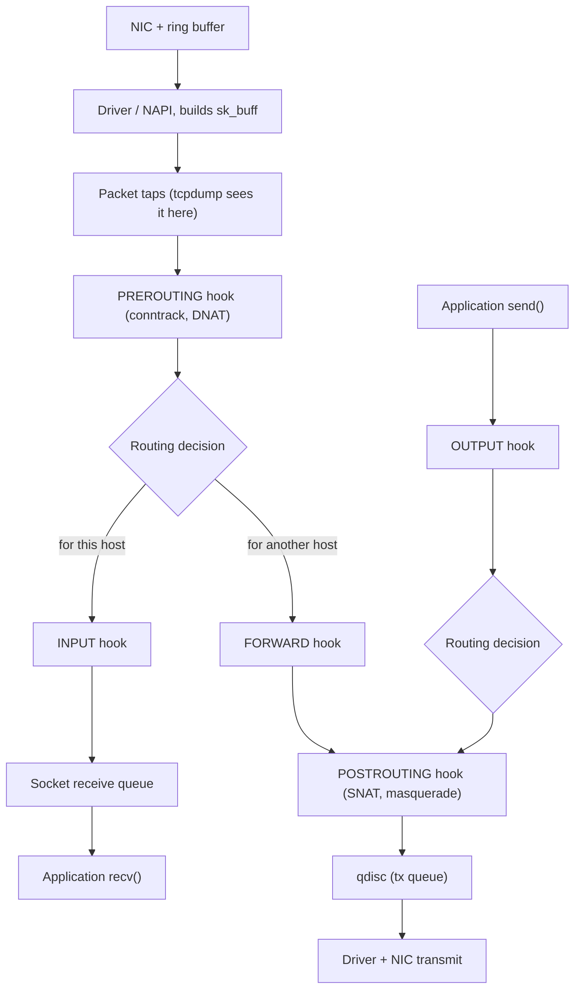
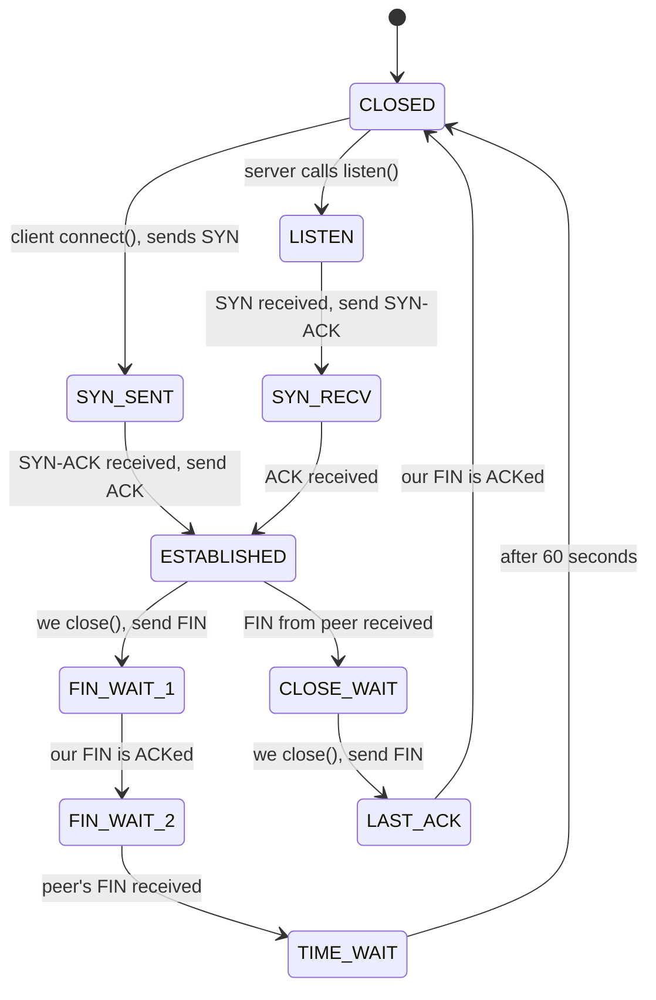
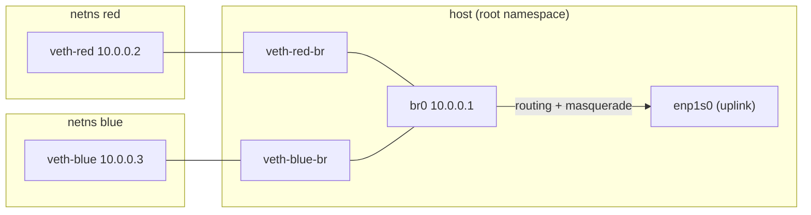

# Advanced networking

> **Level 6 · Chapter 5** · ⏱️ ~75 min read · Prerequisites: [Networking basics](../04-sysadmin/03-networking-basics.md), [Firewalls with ufw](../04-sysadmin/04-firewall-ufw.md), [Containers from scratch](01-containers-from-scratch.md)

This chapter follows a packet through the Linux kernel. You will capture and read real traffic with `tcpdump`, decode TCP connection states, build virtual networks out of namespaces, write a full `nftables` firewall, route by policy, connect two hosts with WireGuard, and measure network performance.

## Why it matters

A data team runs a nightly loader on a VM. It pulls files from an API, then writes them into PostgreSQL on another subnet. One morning the loader hangs. The API is up and `ping` to the database works. Nobody can say why.

An engineer runs `ss -tan` and sees 900 connections to the API stuck in `CLOSE-WAIT`. That state means the API already said goodbye, and the loader never closed its side. A bug in a retry loop leaks sockets. The loader has run out of file descriptors.

After a fix, the database step still fails. A capture with `tcpdump -i any -nn port 5432` shows the SYN packets leaving through the new VPN interface instead of the LAN. A route added by the VPN catches database traffic. One `ip rule` sends that subnet back through the right table, and the job finishes.

Neither problem shows up in `ping`. Both take a minute to diagnose once you can read sockets, packets, and routing tables. That is the skill this chapter builds.

## Concepts

### The packet's path through the kernel

When a frame arrives at your machine, it passes through several layers before any program sees it. Each layer is a place where things can go wrong, and a place you can observe.

1. **NIC (network interface card).** The hardware receives the electrical or radio signal and decodes an Ethernet **frame** (a link-layer packet with source and destination MAC addresses). The NIC copies the frame into a **ring buffer**, a circular queue in RAM that the NIC and the driver share. It uses **DMA (direct memory access)**, so the CPU does not have to copy the bytes.
2. **Interrupt and NAPI.** The NIC raises an interrupt to say "frames are waiting". Under heavy load, an interrupt per frame would swamp the CPU. So the driver switches to **NAPI** (the "new API"): it turns interrupts off and polls the ring buffer in batches. A kernel thread called `ksoftirqd` does this polling when the load is high.
3. **Driver and `sk_buff`.** The driver wraps each frame in an **`sk_buff`** ("socket buffer"), the kernel's data structure for one packet. From here on, every layer passes the `sk_buff` along and adds or reads metadata.
4. **Packet taps.** Raw sockets, which `tcpdump` uses, get a copy of the packet here. This is *before* the firewall. Remember this: `tcpdump` shows packets that your firewall later drops.
5. **Netfilter hooks.** **Netfilter** is the kernel framework for packet filtering, NAT, and connection tracking. It offers five **hooks**, fixed points in the path where rules can inspect a packet and decide its fate. `nftables`, `iptables`, `ufw`, and Docker all register rules on these hooks.
6. **Routing decision.** The kernel looks up the destination address. Is it one of my addresses? Then deliver it locally. Is it someone else's, and is forwarding on? Then forward it. Otherwise, drop it.
7. **Socket.** For local delivery, TCP or UDP finds the matching **socket** (the kernel object behind a file descriptor that a program reads and writes) and appends the data to its receive queue. The program's `recv()` or `read()` call wakes up and copies the data out.

Outgoing packets run the same path in reverse: socket, OUTPUT hook, routing, POSTROUTING hook, a **qdisc** (queueing discipline, the transmit queue that shapes and orders packets), the driver, and the NIC.



!!! info "Even earlier hooks: XDP and tc"
    Two programmable hooks sit before netfilter. **XDP** (eXpress Data Path) runs an eBPF program inside the driver, before an `sk_buff` even exists. **tc** (traffic control) hooks run just after. Load balancers and DDoS filters use them because they are very fast. You met eBPF in [Performance analysis](02-performance-analysis.md). For everyday firewalls, netfilter is the right layer.

### Netfilter hooks and connection tracking

Here are the five hooks and what each one is for:

| Hook | When a packet reaches it | Typical use |
|---|---|---|
| `prerouting` | Every incoming packet, before routing | Destination NAT (port forwarding) |
| `input` | Packets addressed to this host | Firewall for local services |
| `forward` | Packets passing through this host | Router or container firewall |
| `output` | Packets created by local programs | Filtering outgoing traffic |
| `postrouting` | Every outgoing packet, after routing | Source NAT, masquerade |

**Connection tracking (conntrack)** is the netfilter part that remembers every flow it has seen. A **flow** is the set of packets sharing the same source address, destination address, ports, and protocol. Conntrack gives each packet a state:

- **new**: the first packet of a flow, such as a TCP SYN.
- **established**: the flow has seen traffic in both directions.
- **related**: a new flow that belongs to an existing one, such as an ICMP "port unreachable" error for a UDP flow.
- **invalid**: the packet does not fit any known flow. An example is a stray ACK for a connection the host never saw.

Conntrack is what makes a firewall **stateful**. You write "allow new connections to port 443, and allow anything that belongs to an established connection". You no longer need separate rules for return traffic. NAT depends on conntrack too. The kernel rewrites the first packet of a flow and then applies the same rewrite to every later packet in that flow.

### TCP: the handshake and the state machine

TCP gives programs a reliable byte stream on top of unreliable packets. Every TCP **segment** (one TCP packet) carries a **sequence number** that counts bytes sent, and an **acknowledgment number** that says "I have received everything up to here". **Flags** mark special segments:

| Flag | Name | Meaning |
|---|---|---|
| `S` | SYN | "Let's start; here is my first sequence number" |
| `.` | ACK | The acknowledgment number is valid (set on almost every segment) |
| `P` | PSH | "Deliver this data to the application now" |
| `F` | FIN | "I have no more data to send" |
| `R` | RST | "Abort; this connection does not exist" |

A connection starts with the **three-way handshake**: the client sends SYN, the server replies SYN-ACK, and the client sends ACK. A connection ends with two FIN/ACK pairs, one in each direction, because each side closes its sending half on its own.

Each side keeps a state for every connection. Here is the TCP state machine, simplified to the paths you will actually see:



The side that closes first is the **active closer**. It walks the left path: `FIN-WAIT-1`, `FIN-WAIT-2`, then `TIME-WAIT`. The other side is the **passive closer**. It goes to `CLOSE-WAIT` and stays there *until the program calls `close()`*.

Two states cause most real-world confusion:

- **`TIME-WAIT`** is normal. The active closer waits 60 seconds (on Linux this is fixed in the kernel) before it forgets the connection. The wait makes sure a late, duplicated packet from the old connection cannot be mistaken for data in a new connection on the same ports. A busy client or proxy can have thousands of these, and that is usually fine.
- **`CLOSE-WAIT`** is a symptom. The kernel has received the peer's FIN and told the program (its next `read()` returns 0 bytes). The connection stays in `CLOSE-WAIT` until the program closes the socket. Many sockets in `CLOSE-WAIT` that never go away almost always mean a bug: the program leaks sockets.

!!! warning "Common mistake"
    Many blog posts say "lower `net.ipv4.tcp_fin_timeout` to get rid of TIME_WAIT". That setting controls the `FIN-WAIT-2` timeout, not `TIME-WAIT`. The TIME_WAIT length is compiled into the kernel. If TIME_WAIT really exhausts your ports, reuse connections (HTTP keep-alive, connection pools) instead.

### Network namespaces, veth pairs, and bridges

In [Containers from scratch](01-containers-from-scratch.md) you met **namespaces**, which give a process its own private view of a system resource. A **network namespace** is a private copy of the whole network stack: its own interfaces, IP addresses, routing table, firewall rules, and sockets. A new network namespace contains only a loopback interface, which is down. It cannot talk to anything.

To connect namespaces you use virtual devices:

- A **veth pair** (virtual Ethernet) is two interfaces joined by a virtual cable. A frame sent into one end comes out of the other. You put one end in a namespace and keep the other end outside.
- A **bridge** is a virtual Ethernet switch inside the kernel. You attach interfaces to it as **ports**, and it forwards frames between them by MAC address. Give the bridge itself an IP address, and the host becomes a member of that little LAN, so it can act as the router.



This is exactly what Docker does. `docker0` is a bridge, each container is a network namespace, and each container gets a veth pair. Once you build this by hand, Docker networking stops being magic.

### nftables: tables, chains, hooks, and priorities

**nftables** is the modern Linux packet filter. It replaced `iptables`, `ip6tables`, `arptables`, and `ebtables` with one tool, `nft`, and one rule language. On Ubuntu 24.04, even the `iptables` command is a compatibility layer (`iptables-nft`) that writes nftables rules underneath. `ufw` sits on top of that.

An nftables ruleset is built from four kinds of objects:

- A **table** is a namespace for chains and sets. It has a **family**: `ip` (IPv4), `ip6` (IPv6), `inet` (both at once), `arp`, `bridge`, or `netdev`. Use `inet` for host firewalls, so one rule covers IPv4 and IPv6.
- A **chain** holds rules in order. A **base chain** is attached to a netfilter hook and receives packets. A **regular chain** is not attached to a hook. It only runs when another rule jumps to it, which helps you organise rules.
- A **rule** is a list of matches (such as `tcp dport 22`) followed by a **verdict** (such as `accept`, `drop`, `reject`, `jump`).
- A **set** is a named collection of addresses, ports, or other values. A set can hold intervals, and entries can expire on a timer. Matching against a set of 10,000 addresses is about as fast as matching one, because sets use hash tables or trees.

A base chain declares three things:

```text
type filter hook input priority filter; policy drop;
```

- **type**: `filter` for accept or drop, `nat` for address translation, `route` for rerouting output packets.
- **hook**: which of the five hooks to attach to.
- **priority**: the order among chains on the same hook. Lower numbers run first. Names map to numbers: `raw` (-300), `mangle` (-150), `dstnat` (-100), `filter` (0), `security` (50), `srcnat` (100).
- **policy**: the verdict for packets that reach the end of the chain without matching a rule.

!!! warning "Accept is not final across tables"
    If two base chains sit on the same hook (say, your `inet filter` table and the one `ufw` creates), a packet must pass *both*. An `accept` ends processing only in its own chain. A `drop` anywhere is final. This is why mixing your own nftables rules with `ufw` or Docker leads to surprises. On one machine, pick one way to manage the firewall.

### Policy routing

Normal routing chooses a path using only the destination address. **Policy routing** can also look at the source address, the incoming interface, a firewall mark, and more.

Linux keeps several **routing tables**, numbered from 0 to 2^32-1. The `main` table (number 254) is the one `ip route` shows. The **routing policy database (RPDB)** is an ordered list of **rules**. Each rule says "packets matching X: look up table Y". The kernel checks rules in priority order, and the first table that has a matching route wins.

The default rules are:

```text
0:      from all lookup local
32766:  from all lookup main
32767:  from all lookup default
```

The `local` table holds your own addresses and broadcast routes. Policy routing means adding your own rules between 0 and 32766. A classic use is a server with two uplinks: replies must leave through the uplink their request came in on, or the remote side drops them.

### VLANs and bonding

A **VLAN** (virtual LAN, IEEE 802.1Q) splits one physical network into several isolated ones. The switch adds a 4-byte **tag** with a VLAN ID (1 to 4094) to each frame. On Linux, an interface such as `enp1s0.10` is a sub-interface that sends and receives frames tagged with VLAN 10. One cable can then carry, say, a management network and a storage network.

**Bonding** (also called link aggregation or teaming) combines several NICs into one logical interface, `bond0`. Common modes:

| Mode | Name | What it does |
|---|---|---|
| 1 | `active-backup` | One NIC carries traffic; another takes over if it fails. Works with any switch. |
| 4 | `802.3ad` (LACP) | All NICs carry traffic. The switch must support LACP and be configured for it. |
| 0 | `balance-rr` | Round-robin across NICs. Rarely a good idea, because packets can arrive out of order. |

### WireGuard

**WireGuard** is a VPN built into the Linux kernel (since 5.6). It creates an interface, usually `wg0`, and encrypts everything routed into it. Its design is small and opinionated:

- Each peer has a **key pair**: a private key that never leaves the machine, and a public key you give to the other side. There are no certificates, user names, or negotiation of ciphers.
- **Cryptokey routing**: each peer's config lists `AllowedIPs`. When sending, WireGuard picks the peer whose `AllowedIPs` contains the destination. When receiving, it accepts a decrypted packet only if its source address is in that peer's `AllowedIPs`. One list acts as both a routing table and an access control list.
- It runs over UDP (port 51820 by convention) and stays silent. It does not answer packets from unknown keys, so port scans see nothing.

## Commands and examples

!!! danger "⚠️ VM only"
    Almost everything in this section needs root and changes network state: capturing packets, creating interfaces, loading firewall rules, changing routes, and setting sysctls. A typo can cut you off from the machine. Run these in your throwaway VM, ideally from its console (not over SSH), never on your main machine. A reboot undoes everything that you did not make persistent.

The examples assume an Ubuntu 24.04 or Mint 22.3 VM whose uplink interface is `enp1s0` with address `192.168.122.50`. Check yours with `ip -br addr` and substitute your interface name.

### tcpdump: capturing packets

`tcpdump` captures packets from an interface and prints them, or saves them to a file. It is installed by default on Ubuntu and Mint. It needs root, or the `CAP_NET_RAW` capability, to open the raw socket.

List the interfaces it can capture on:

```bash
sudo tcpdump -D
```

```text
1.enp1s0 [Up, Running, Connected]
2.any (Pseudo-device that captures on all interfaces) [Up, Running]
3.lo [Up, Running, Loopback]
4.docker0 [Up, Disconnected]
...
```

The flags you will use all the time:

| Flag | Why it exists |
|---|---|
| `-i enp1s0` | Pick the interface. `-i any` captures on all of them, which helps when you don't know where traffic goes. |
| `-n` | Don't turn IPs into host names. Lookups are slow and can create DNS traffic that shows up in your own capture. |
| `-nn` | Also don't turn port numbers into service names, so you see `443`, not `https`. |
| `-c 20` | Stop after 20 packets. Good for scripts and for not drowning. |
| `-w file.pcap` | Write raw packets to a file instead of printing them. |
| `-r file.pcap` | Read packets from a file instead of an interface. No root needed. |
| `-A` / `-X` | Print the payload as ASCII, or as hex plus ASCII. |
| `-e` | Show the Ethernet header (MAC addresses). |
| `-v`, `-vv` | More detail: TTL, IP ID, checksums, and so on. |
| `-s 0` | Capture full packets. This is already the default (262144 bytes). |

A first capture: watch ICMP while you ping from another terminal.

```bash
sudo tcpdump -i enp1s0 -nn icmp
```

```text
tcpdump: verbose output suppressed, use -v[v]... for full protocol decode
listening on enp1s0, link-type EN10MB (Ethernet), snapshot length 262144 bytes
10:14:02.518934 IP 192.168.122.50 > 192.168.122.1: ICMP echo request, id 3, seq 1, length 64
10:14:02.519211 IP 192.168.122.1 > 192.168.122.50: ICMP echo reply, id 3, seq 1, length 64
^C
2 packets captured
2 packets received by filter
0 packets dropped by kernel
```

The footer matters. "Dropped by kernel" means `tcpdump` could not keep up and lost packets from its buffer. If you see drops, write to a file with `-w` and use a tighter filter.

### Capture filters (BPF syntax)

The expression at the end of the command is a **capture filter**. It is compiled into a small **BPF** (Berkeley Packet Filter) program that runs in the kernel. Packets that don't match are never copied to `tcpdump`, so a good filter keeps captures small and fast.

The syntax combines **primitives** with `and`, `or`, `not`, and parentheses:

| Filter | Matches |
|---|---|
| `host 10.0.0.5` | Packets to or from that address |
| `src host 10.0.0.5` | Packets from that address only |
| `net 10.0.0.0/24` | Packets to or from that subnet |
| `port 443` | TCP or UDP port 443, either direction |
| `tcp dst port 80` | TCP packets going to port 80 |
| `portrange 8000-8100` | Any port in the range |
| `udp port 53` | DNS queries and replies |
| `icmp or arp` | Pings and address resolution |
| `not port 22` | Everything except SSH. Use it when you capture over SSH, or your own session floods the output. |
| `tcp[tcpflags] & (tcp-syn|tcp-fin) != 0` | Only connection starts and ends |
| `tcp[tcpflags] & tcp-rst != 0` | Only resets, which shows refused or aborted connections |
| `greater 1000` | Packets longer than 1000 bytes |

Quote the whole expression in single quotes so the shell does not interpret `(`, `)`, `|`, or `&`:

```bash
sudo tcpdump -i enp1s0 -nn 'host 10.0.0.5 and not (port 22 or port 53)'
```

!!! tip "Capture filters vs display filters"
    Capture filters (BPF) decide what gets captured. Wireshark also has **display filters**, a different and richer language (`http.request.method == "GET"`, `tcp.analysis.retransmission`). It runs on packets you already captured. Don't paste one into the other.

### Saving and reading captures

On servers, the usual workflow is: capture to a file on the server, copy the file home, and analyse it at leisure.

```bash
sudo tcpdump -i enp1s0 -nn -w /tmp/web.pcap 'tcp port 80'
```

```text
tcpdump: listening on enp1s0, link-type EN10MB (Ethernet), snapshot length 262144 bytes
^C
9 packets captured
9 packets received by filter
0 packets dropped by kernel
```

Nothing prints while it runs. `-w` writes raw packets, not text. Read the file back (no `sudo` needed):

```bash
tcpdump -nn -r /tmp/web.pcap
```

!!! warning "Common mistake"
    On Ubuntu and Mint, `tcpdump` runs under an AppArmor profile. That profile only lets it write files with capture-like extensions such as `.pcap`. `sudo tcpdump -w /tmp/capture.txt` fails with "Permission denied", even as root. Always name capture files `something.pcap`.

For long captures, rotate files so you don't fill the disk. `-C 100` starts a new file every 100 MB and `-W 5` keeps only five of them: `sudo tcpdump -i enp1s0 -w /tmp/ring.pcap -C 100 -W 5`.

### Reading a TCP handshake and an HTTP request

Here is a complete HTTP exchange: `curl http://10.0.0.10/` from `10.0.0.5`, read back from a capture file.

```bash
tcpdump -nn -r /tmp/web.pcap
```

```text
reading from file /tmp/web.pcap, link-type EN10MB (Ethernet), snapshot length 262144
10:20:41.100000 IP 10.0.0.5.51234 > 10.0.0.10.80: Flags [S], seq 1000, win 64240, options [mss 1460,sackOK,TS val 4096 ecr 0,nop,wscale 7], length 0
10:20:41.100350 IP 10.0.0.10.80 > 10.0.0.5.51234: Flags [S.], seq 5000, ack 1001, win 65160, options [mss 1460,sackOK,TS val 4096 ecr 0,nop,wscale 7], length 0
10:20:41.100700 IP 10.0.0.5.51234 > 10.0.0.10.80: Flags [.], ack 1, win 502, options [nop,nop,TS val 4097 ecr 9000], length 0
10:20:41.101050 IP 10.0.0.5.51234 > 10.0.0.10.80: Flags [P.], seq 1:73, ack 1, win 502, options [nop,nop,TS val 4097 ecr 9000], length 72: HTTP: GET / HTTP/1.1
10:20:41.101400 IP 10.0.0.10.80 > 10.0.0.5.51234: Flags [.], ack 73, win 509, options [nop,nop,TS val 9001 ecr 4097], length 0
10:20:41.101750 IP 10.0.0.10.80 > 10.0.0.5.51234: Flags [P.], seq 1:78, ack 73, win 509, options [nop,nop,TS val 9001 ecr 4097], length 77: HTTP: HTTP/1.1 200 OK
10:20:41.102100 IP 10.0.0.5.51234 > 10.0.0.10.80: Flags [F.], seq 73, ack 78, win 502, options [nop,nop,TS val 4098 ecr 9001], length 0
10:20:41.102450 IP 10.0.0.10.80 > 10.0.0.5.51234: Flags [F.], seq 78, ack 74, win 509, options [nop,nop,TS val 9002 ecr 4098], length 0
10:20:41.102800 IP 10.0.0.5.51234 > 10.0.0.10.80: Flags [.], ack 79, win 502, options [nop,nop,TS val 4098 ecr 9002], length 0
```

Each line reads: time, protocol, `source.port > destination.port`, flags, then details. Line by line:

1. **SYN.** The client picks a random high port (`51234`) and an initial sequence number (`1000`; real ones are random 32-bit numbers). The options announce the **MSS** (maximum segment size: the largest chunk of data it accepts per segment, 1460 bytes on Ethernet), support for selective ACKs, a timestamp, and a **window scale** (a multiplier for the receive window, so windows can exceed 64 KB).
2. **SYN-ACK** (`[S.]`). The server sends its own sequence number (`5000`) and acknowledges the client's SYN with `ack 1001`. A SYN counts as one byte, so the next byte the server expects is 1001.
3. **ACK.** The handshake is done; both sides are `ESTABLISHED`. From here, `tcpdump` shows **relative** sequence numbers that start at 1, which are easier to read. Use `-S` to see the absolute ones.
4. **Request.** `[P.]` with `seq 1:73` and `length 72`: the client sends bytes 1 to 72, the HTTP request. `tcpdump` peeks at it and prints the first line, `GET / HTTP/1.1`.
5. **ACK** from the server: "I have everything up to byte 73".
6. **Response.** 77 bytes of HTTP response, starting with `HTTP/1.1 200 OK`.
7. **FIN** from the client (`[F.]`). curl is done, so it closes first. The client is the active closer and enters `FIN-WAIT-1`.
8. **FIN** from the server, which also acknowledges the client's FIN (`ack 74`).
9. **Final ACK.** The server's socket closes. The client's socket sits in `TIME-WAIT` for 60 seconds.

`win` is the receive window. It tells the other side how much more data it may send before waiting for an ACK, in units scaled by `wscale`.

To see the request itself, add `-A` and filter on segments that carry data:

```bash
tcpdump -nn -A -r /tmp/web.pcap 'tcp[tcpflags] & tcp-push != 0'
```

```text
10:20:41.101050 IP 10.0.0.5.51234 > 10.0.0.10.80: Flags [P.], seq 1001:1073, ack 5001, win 502, options [nop,nop,TS val 4097 ecr 9000], length 72: HTTP: GET / HTTP/1.1
E..|.4@.@..:
...
..
.".P............>......
......#(GET / HTTP/1.1
Host: 10.0.0.10
User-Agent: curl/8.5.0
Accept: */*


10:20:41.101750 IP 10.0.0.10.80 > 10.0.0.5.51234: Flags [P.], seq 1:78, ack 72, win 509, options [nop,nop,TS val 9001 ecr 4097], length 77: HTTP: HTTP/1.1 200 OK
...
HTTP/1.1 200 OK
Content-Type: text/html
Content-Length: 13

Hello, world
```

The junk at the start of each payload is the IP and TCP headers printed as ASCII. Below it is the plain-text HTTP. This is why plain HTTP is unsafe on untrusted networks: anyone on the path can read it. With HTTPS (see [Web servers and TLS](../04-sysadmin/11-web-servers-and-tls.md)) you would see the handshake and then only encrypted bytes.

!!! tip "Patterns that diagnose most problems"
    - SYN repeated every 1, 2, 4 seconds with no reply: a firewall silently drops packets, or the route is wrong.
    - SYN answered by `[R.]`: the host is reachable but nothing listens on that port.
    - Handshake works, then a big response stalls: suspect an MTU problem, often on VPNs.

### Wireshark

**Wireshark** is the graphical packet analyser. It reads the same `.pcap` files, decodes hundreds of protocols, and follows a whole TCP conversation with "Follow → TCP Stream". Install it on your desktop (`sudo apt install wireshark`), copy the capture from the server with `scp`, and open it. During installation, Ubuntu asks whether non-root users may capture packets. Answer "No" unless you understand that the `wireshark` group then gets capture rights. `tshark` is its command-line twin, handy for scripts.

### Reading TCP states with ss

`ss` (from [Networking basics](../04-sysadmin/03-networking-basics.md)) prints sockets and their TCP state. A quick census of all TCP states on a busy machine:

```bash
ss -tan | awk 'NR>1 {print $1}' | sort | uniq -c | sort -rn
```

```text
   2534 TIME-WAIT
     62 ESTAB
     35 LISTEN
```

Lots of `TIME-WAIT` with few `ESTAB` is a sign of many short connections, such as a client that opens a new connection for every HTTP request. It is not an error.

Filter by state, and add `-o` to see timers:

```bash
ss -o -tan state time-wait | head -3
```

```text
Recv-Q Send-Q Local Address:Port    Peer Address:Port Process
0      0          127.0.0.1:39775      127.0.0.1:54696 timer:(timewait,3.024ms,0)
0      0          127.0.0.1:35297      127.0.0.1:37334 timer:(timewait,52sec,0)
```

Each socket counts down from 60 seconds and then disappears.

Now a real leak. This short Python server accepts connections and never closes them. It is safe to run as a normal user on any machine:

```python
# lazy_server.py: a deliberately buggy server
import socket

srv = socket.socket()
srv.setsockopt(socket.SOL_SOCKET, socket.SO_REUSEADDR, 1)
srv.bind(("127.0.0.1", 9090))
srv.listen()
conns = []
while True:
    conn, addr = srv.accept()
    conns.append(conn)          # bug: we never close() the connection
```

Run it in one terminal with `python3 lazy_server.py`. In another, connect and disconnect three times, then look:

```bash
for i in 1 2 3; do python3 -c "import socket; s=socket.create_connection(('127.0.0.1',9090)); s.close()"; done
ss -tan '( sport = :9090 or dport = :9090 )'
```

```text
State      Recv-Q Send-Q Local Address:Port  Peer Address:Port Process
LISTEN     0      128        127.0.0.1:9090       0.0.0.0:*
CLOSE-WAIT 1      0          127.0.0.1:9090     127.0.0.1:33186
CLOSE-WAIT 1      0          127.0.0.1:9090     127.0.0.1:33174
FIN-WAIT-2 0      0          127.0.0.1:33174    127.0.0.1:9090
FIN-WAIT-2 0      0          127.0.0.1:33186    127.0.0.1:9090
FIN-WAIT-2 0      0          127.0.0.1:33194    127.0.0.1:9090
CLOSE-WAIT 1      0          127.0.0.1:9090     127.0.0.1:33194
```

The clients closed first, so they sit in `FIN-WAIT-2`, waiting for a FIN that never comes. The server side is stuck in `CLOSE-WAIT`. `Recv-Q 1` is the unread FIN. The client sockets give up after `tcp_fin_timeout` (60 s). The server's sockets stay as long as the process lives. Add `-p` to find the guilty process:

```bash
ss -tanp state close-wait '( sport = :9090 )'
```

```text
Recv-Q Send-Q Local Address:Port Peer Address:Port Process
1      0          127.0.0.1:9090    127.0.0.1:33186 users:(("python3",pid=4815,fd=5))
1      0          127.0.0.1:9090    127.0.0.1:33174 users:(("python3",pid=4815,fd=4))
1      0          127.0.0.1:9090    127.0.0.1:33194 users:(("python3",pid=4815,fd=6))
```

`ss -ti` adds TCP internals for each connection: round-trip time (`rtt`), congestion window (`cwnd`), retransmissions, and the congestion control algorithm. Retransmission counts that keep climbing point to packet loss.

### Hands-on: two namespaces and a veth pair

Create two namespaces and wire them together directly. `ip netns add` creates a named namespace and keeps it alive with a file under `/run/netns/`.

```bash
sudo ip netns add red
sudo ip netns add blue
ip netns list
```

```text
blue
red
```

Create a veth pair and move one end into each namespace:

```bash
sudo ip link add veth-red type veth peer name veth-blue
sudo ip link set veth-red netns red
sudo ip link set veth-blue netns blue
```

Give each end an address and bring it up. `ip -n red ...` is short for "run this `ip` command inside namespace `red`":

```bash
sudo ip -n red addr add 10.0.0.2/24 dev veth-red
sudo ip -n red link set veth-red up
sudo ip -n red link set lo up
sudo ip -n blue addr add 10.0.0.3/24 dev veth-blue
sudo ip -n blue link set veth-blue up
sudo ip -n blue link set lo up
```

`ip netns exec` runs *any* command inside a namespace:

```bash
sudo ip netns exec red ping -c 2 10.0.0.3
```

```text
PING 10.0.0.3 (10.0.0.3) 56(84) bytes of data.
64 bytes from 10.0.0.3: icmp_seq=1 ttl=64 time=0.107 ms
64 bytes from 10.0.0.3: icmp_seq=2 ttl=64 time=0.053 ms

--- 10.0.0.3 ping statistics ---
2 packets transmitted, 2 received, 0% packet loss, time 1001ms
rtt min/avg/max/mdev = 0.053/0.080/0.107/0.027 ms
```

Look at the world from inside `red`. It sees only its own interfaces:

```bash
sudo ip netns exec red ip -br addr
```

```text
lo               UNKNOWN        127.0.0.1/8 ::1/128
veth-red@if2     UP             10.0.0.2/24 fe80::e0ec:6aff:fe01:d8e7/64
```

`@if2` tells you the peer is interface number 2 in another namespace. Deleting a namespace destroys the interfaces inside it, and deleting one end of a veth pair destroys the other end too:

```bash
sudo ip netns del red
sudo ip netns del blue
```

### Hands-on: a bridge with internet access

A direct veth pair joins only two namespaces. For more, use a bridge on the host, like `docker0`. This lab builds the diagram from the Concepts section.

```bash
# namespaces
sudo ip netns add red
sudo ip netns add blue

# the bridge, which is also the gateway at 10.0.0.1
sudo ip link add br0 type bridge
sudo ip addr add 10.0.0.1/24 dev br0
sudo ip link set br0 up

# one veth pair per namespace; the "-br" end plugs into the bridge
for ns in red blue; do
  sudo ip link add veth-$ns type veth peer name veth-$ns-br
  sudo ip link set veth-$ns netns $ns
  sudo ip link set veth-$ns-br master br0
  sudo ip link set veth-$ns-br up
  sudo ip -n $ns link set lo up
  sudo ip -n $ns link set veth-$ns up
done

sudo ip -n red  addr add 10.0.0.2/24 dev veth-red
sudo ip -n blue addr add 10.0.0.3/24 dev veth-blue
sudo ip -n red  route add default via 10.0.0.1
sudo ip -n blue route add default via 10.0.0.1
```

Check the bridge ports:

```bash
bridge link
```

```text
5: veth-red-br@if4: <BROADCAST,MULTICAST,UP,LOWER_UP> mtu 1500 master br0 state forwarding priority 32 cost 2
7: veth-blue-br@if6: <BROADCAST,MULTICAST,UP,LOWER_UP> mtu 1500 master br0 state forwarding priority 32 cost 2
```

`red` can now reach `blue` and the host at `10.0.0.1`. It still cannot reach the internet, for two reasons:

1. The host does not forward packets between interfaces. Forwarding is off by default.
2. Even if it did, `10.0.0.2` is a private address. Replies from the internet would never find their way back.

Fix the first with a sysctl, and the second with **masquerade**. Masquerade is source NAT that rewrites the source address to whatever address the outgoing interface has.

```bash
sudo sysctl -w net.ipv4.ip_forward=1

sudo nft add table ip lab_nat
sudo nft add chain ip lab_nat postrouting '{ type nat hook postrouting priority srcnat; policy accept; }'
sudo nft add rule ip lab_nat postrouting ip saddr 10.0.0.0/24 oifname "enp1s0" masquerade
sudo nft list table ip lab_nat
```

```text
table ip lab_nat {
	chain postrouting {
		type nat hook postrouting priority srcnat; policy accept;
		ip saddr 10.0.0.0/24 oifname "enp1s0" masquerade
	}
}
```

The rule reads: "on the postrouting hook, if a packet comes from the lab subnet and leaves via `enp1s0`, replace its source with `enp1s0`'s address". Conntrack remembers the mapping and reverses it for replies.

```bash
sudo ip netns exec red ping -c 1 1.1.1.1
```

```text
PING 1.1.1.1 (1.1.1.1) 56(84) bytes of data.
64 bytes from 1.1.1.1: icmp_seq=1 ttl=55 time=14.2 ms
...
```

!!! warning "Common mistake: ufw or Docker block forwarding"
    If the ping hangs, look at `sudo nft list ruleset | grep -B2 'hook forward'`. With `ufw` enabled, its forward chain has policy `drop`, and Docker does the same. Your NAT table cannot override that drop (remember: accept is not final across tables). In the lab VM, allow it with `sudo ufw route allow in on br0 out on enp1s0`. Docker also loads the `br_netfilter` module, which sends even traffic *between bridge ports* through the forward hook. On a VM with Docker installed, `red` may fail to ping `blue` for the same reason. Use a VM without Docker for these labs.

DNS is a second trap. `ip netns exec` keeps the host's `/etc/resolv.conf`, which points to `127.0.0.53`. That is the systemd-resolved stub, and inside the namespace `127.0.0.53` is the namespace's own empty loopback. `ip netns exec` looks for `/etc/netns/<name>/resolv.conf` first, so give the namespace its own:

```bash
sudo mkdir -p /etc/netns/red
echo "nameserver 1.1.1.1" | sudo tee /etc/netns/red/resolv.conf
sudo ip netns exec red curl -sI https://example.com | head -1
```

```text
HTTP/2 200
```

Clean up:

```bash
sudo ip netns del red; sudo ip netns del blue
sudo ip link del br0
sudo nft delete table ip lab_nat
sudo rm -r /etc/netns/red
```

### nftables in depth

Look at what is loaded right now. On a VM with `ufw` enabled you will see several tables that `iptables-nft` created:

```bash
sudo nft list tables
```

```text
table ip filter
table ip6 filter
```

`sudo nft list ruleset` prints everything. The output is valid nftables syntax, so you can save it and load it again later.

#### Building a ruleset step by step

You can build rules one command at a time. Each command changes the live ruleset immediately:

```bash
sudo nft add table inet demo
sudo nft add chain inet demo input '{ type filter hook input priority filter; policy accept; }'
sudo nft add rule inet demo input tcp dport 8080 counter drop
sudo nft -a list chain inet demo input
```

```text
table inet demo {
	chain input { # handle 1
		type filter hook input priority filter; policy accept;
		tcp dport 8080 counter packets 0 bytes 0 drop # handle 2
	}
}
```

`-a` shows **handles**, numeric IDs you use to place or delete a specific rule. Let one admin host through to port 8080 by inserting a rule *before* the drop (handle 2), then remove the drop, then the whole table:

```bash
sudo nft insert rule inet demo input position 2 ip saddr 10.0.0.5 tcp dport 8080 accept
sudo nft delete rule inet demo input handle 2
sudo nft delete table inet demo
```

`add` appends to the end of a chain. `insert` puts the rule at the top, or before the rule whose handle you give with `position`. A handle belongs to a rule, so `position` must name an existing rule, not the chain.

#### Sets

Sets keep long lists out of your rules. **Anonymous sets** sit inline in a rule, as in `tcp dport { 80, 443 }`. **Named sets** have a name, can be changed at runtime, and are referenced with `@`:

```bash
sudo nft add table inet demo
sudo nft add set inet demo blocklist '{ type ipv4_addr; flags interval; }'
sudo nft add element inet demo blocklist '{ 198.51.100.0/24, 203.0.113.99 }'
sudo nft list set inet demo blocklist
```

```text
table inet demo {
	set blocklist {
		type ipv4_addr
		flags interval
		elements = { 198.51.100.0/24, 203.0.113.99 }
	}
}
```

`flags interval` allows ranges and prefixes. `flags timeout` lets elements expire, and `flags dynamic` lets rules add elements themselves. Updating a set doesn't touch the rules that use it, and the change is atomic.

#### A complete stateful ruleset

Real firewalls live in a file loaded in one go. `nft -f` applies the whole file **atomically**: either all of it loads or none of it does, so you never run with half a firewall. This ruleset is for a web server: SSH open to admin networks, rate-limited for everyone else, HTTP and HTTPS open to the world, and everything else dropped.

```text
#!/usr/sbin/nft -f
# /etc/nftables.conf: firewall for a web server

flush ruleset

table inet filter {
    # trusted admin networks: SSH without rate limits
    set admin_nets {
        type ipv4_addr
        flags interval
        elements = { 10.0.0.0/24, 203.0.113.7 }
    }

    # addresses we block by hand: nft add element inet filter blocklist { x.x.x.x }
    set blocklist {
        type ipv4_addr
        flags interval
    }

    # per-source rate meter for new SSH connections; entries expire
    set ssh_meter {
        type ipv4_addr
        size 65535
        flags dynamic, timeout
        timeout 1m
    }

    chain input {
        type filter hook input priority filter; policy drop;

        # 1. return traffic for connections we already allowed
        ct state established,related accept
        ct state invalid drop

        # 2. loopback is always fine
        iif "lo" accept

        # 3. known bad actors
        ip saddr @blocklist drop

        # 4. ICMP and ICMPv6 (ping, path MTU discovery, IPv6 neighbor discovery)
        meta l4proto { icmp, ipv6-icmp } accept

        # 5. SSH: admins always; others at most 4 new connections per minute
        tcp dport 22 ip saddr @admin_nets accept
        tcp dport 22 ct state new add @ssh_meter { ip saddr limit rate over 4/minute } drop
        tcp dport 22 accept

        # 6. the web
        tcp dport { 80, 443 } accept

        # 7. log a sample of what we drop, then the policy drops it
        limit rate 5/minute log prefix "nft-input-drop: "
        counter
    }

    chain forward {
        type filter hook forward priority filter; policy drop;
    }

    chain output {
        type filter hook output priority filter; policy accept;
    }
}
```

How it works, in order:

1. `ct state established,related accept` comes first because most packets belong to existing connections. Matching them early makes the firewall fast. It also means later rules only judge *new* connections.
2. Loopback must be open. Many local services (systemd-resolved at `127.0.0.53`, databases on `localhost`) break without it.
3. The blocklist is a set, so blocking another address doesn't need a rule change.
4. Dropping all ICMP is a classic mistake. It breaks **path MTU discovery** (the "fragmentation needed" messages) and, for IPv6, neighbor discovery. Without those, IPv6 stops working entirely.
5. The SSH meter keeps one rate limiter per source address. The rule matches, and drops, only when that source exceeds 4 new connections per minute.
6. `{ 80, 443 }` is an anonymous set.
7. `limit ... log` writes at most 5 lines a minute to the kernel log (`journalctl -k`), so a flood can't fill your disk. The final `counter` shows how many packets fell through to the policy.

!!! danger "⚠️ VM only"
    `flush ruleset` deletes *every* table, including those of `ufw` and Docker. Never load this on a machine that uses `ufw` or Docker. Disable `ufw` first (`sudo ufw disable`) in your VM. Also test from the console: if your SSH rule has a typo, the `policy drop` locks you out.

Check the syntax without applying it, then load it:

```bash
sudo nft -c -f /etc/nftables.conf && echo "syntax OK"
sudo nft -f /etc/nftables.conf
sudo nft list chain inet filter input
```

`-c` (check) parses the file and validates it against the kernel without changing anything. Ubuntu ships an `nftables.service` that loads `/etc/nftables.conf` at boot:

```bash
sudo systemctl enable --now nftables.service
```

!!! tip "A safety net for remote changes"
    Before you change a remote firewall, schedule a rollback: `sudo systemd-run --on-active=5min nft flush ruleset`. If you lock yourself out, the rules vanish in five minutes. If everything works, cancel it with `systemctl list-timers` and `sudo systemctl stop <unit>.timer`.

Watch the counters and logs while you test from another machine:

```bash
sudo nft list ruleset | grep counter
sudo journalctl -k -g nft-input-drop -n 5
```

```text
		counter packets 37 bytes 2104
Oct 02 10:41:13 mint kernel: nft-input-drop: IN=enp1s0 OUT= MAC=52:54:00:12:34:56:52:54:00:ab:cd:ef:08:00 SRC=203.0.113.44 DST=192.168.122.50 LEN=60 TOS=0x00 PREC=0x00 TTL=52 ID=31337 DF PROTO=TCP SPT=40112 DPT=3306 WINDOW=64240 RES=0x00 SYN URGP=0
...
```

Someone probed MySQL (port 3306) and was dropped.

### Policy routing

Picture a VM with two uplinks: `enp1s0` (`192.168.122.50`, the default route) and `enp7s0` (`203.0.113.50`, a second provider). A request arrives on `enp7s0`. The reply looks up the `main` table, which sends it out via `enp1s0` with source `203.0.113.50`. The first provider drops it as spoofed. The fix is to send traffic *from* `203.0.113.50` through its own table.

Give the table a name (optional, but readable):

```bash
echo "100 isp2" | sudo tee -a /etc/iproute2/rt_tables
```

Put a default route in table 100, and add a rule that sends traffic from that source address there:

```bash
sudo ip route add default via 203.0.113.1 dev enp7s0 table isp2
sudo ip rule add from 203.0.113.50 table isp2 priority 1000
ip rule show
```

```text
0:	from all lookup local
1000:	from 203.0.113.50 lookup isp2
32766:	from all lookup main
32767:	from all lookup default
```

Ask the kernel which route it would pick. `ip route get` is the best debugging tool for routing:

```bash
ip route get 1.1.1.1
ip route get 1.1.1.1 from 203.0.113.50
```

```text
1.1.1.1 via 192.168.122.1 dev enp1s0 src 192.168.122.50 uid 1000
    cache
1.1.1.1 from 203.0.113.50 via 203.0.113.1 dev enp7s0 table isp2 uid 1000
    cache
```

Same destination, different path, chosen by source. Rules can also match an incoming interface (`iif`), a firewall mark set by nftables (`fwmark`), or a destination (`to 10.20.0.0/16`). `ip route show table isp2` lists a table's routes.

These commands do not survive a reboot. On Ubuntu servers, make them permanent in netplan with the `routes:` (including `table:`) and `routing-policy:` keys under the interface.

### VLANs and bonding (briefly)

A VLAN sub-interface for VLAN 10 on `enp1s0`:

```bash
sudo ip link add link enp1s0 name enp1s0.10 type vlan id 10
sudo ip addr add 10.0.10.5/24 dev enp1s0.10
sudo ip link set enp1s0.10 up
ip -d link show enp1s0.10 | grep vlan
```

```text
    vlan protocol 802.1Q id 10 <REORDER_HDR> addrgenmode eui64 ...
```

An active-backup bond from two NICs (the NICs must be down before you enslave them):

```bash
sudo ip link add bond0 type bond mode active-backup miimon 100
sudo ip link set enp7s0 down; sudo ip link set enp7s0 master bond0
sudo ip link set enp8s0 down; sudo ip link set enp8s0 master bond0
sudo ip link set bond0 up
grep -E 'Mode|Active|MII Status' /proc/net/bonding/bond0
```

```text
Bonding Mode: fault-tolerance (active-backup)
Currently Active Slave: enp7s0
MII Status: up
MII Status: up
MII Status: up
```

`miimon 100` checks link state every 100 ms. On a real server you would declare both in `/etc/netplan/*.yaml` under `vlans:` and `bonds:` and run `sudo netplan try`, which rolls back automatically if you lose connectivity.

### WireGuard between two hosts

You need two VMs that can reach each other. Here, `vm-a` is `192.168.122.10` and `vm-b` is `192.168.122.11`. The tunnel uses `10.0.0.1` and `10.0.0.2`. On both:

```bash
sudo apt install wireguard-tools
```

Generate a key pair on each host. `umask 077` makes the private key readable only by its owner:

```bash
sudo -i
cd /etc/wireguard
umask 077
wg genkey | tee private.key | wg pubkey > public.key
cat public.key
exit
```

```text
xTIBA5rboUvnH4htodjb6e697QjLERt1NAB4mZqp8Dg=
```

`wg genkey` prints a random private key in base64. `wg pubkey` derives the matching public key from it. Swap the **public** keys between the hosts. The private keys never leave their machines.

On `vm-a`, create `/etc/wireguard/wg0.conf`:

```ini
[Interface]
Address = 10.0.0.1/24
ListenPort = 51820
PrivateKey = <contents of vm-a's private.key>

[Peer]
# vm-b
PublicKey = <vm-b's public key>
AllowedIPs = 10.0.0.2/32
```

On `vm-b`:

```ini
[Interface]
Address = 10.0.0.2/24
PrivateKey = <contents of vm-b's private.key>

[Peer]
# vm-a
PublicKey = <vm-a's public key>
Endpoint = 192.168.122.10:51820
AllowedIPs = 10.0.0.0/24
PersistentKeepalive = 25
```

What each line does:

- `Address` is the tunnel IP for this host. `wg-quick` assigns it to `wg0`.
- `ListenPort` is the UDP port to receive on. Only the side others connect *to* needs a fixed port.
- `Endpoint` tells `vm-b` where to find `vm-a`. `vm-a` has no `Endpoint` for `vm-b`. It learns `vm-b`'s address from the first valid packet, and it updates it if `vm-b` roams.
- `AllowedIPs` is the cryptokey routing from the Concepts section. `vm-a` accepts only `10.0.0.2` from `vm-b`. `vm-b` sends the whole `10.0.0.0/24` to `vm-a`.
- `PersistentKeepalive = 25` sends a tiny packet every 25 seconds. It keeps NAT mappings alive when `vm-b` sits behind a home router.

Open the port on `vm-a` (with `ufw`: `sudo ufw allow 51820/udp`). Then bring the tunnel up on both:

```bash
sudo wg-quick up wg0
```

```text
[#] ip link add wg0 type wireguard
[#] wg setconf wg0 /dev/fd/63
[#] ip -4 address add 10.0.0.2/24 dev wg0
[#] ip link set mtu 1420 up dev wg0
```

`wg-quick` is a helper script. It runs the `ip` and `wg` commands it prints. Note the MTU of 1420, which leaves room for WireGuard's 80 bytes of overhead inside a 1500-byte packet. Test, then inspect:

```bash
ping -c 2 10.0.0.1
sudo wg show
```

```text
interface: wg0
  public key: TrMvSoP4jYQlY6RIzBgbssQqY3vxI2Pi+y71lOWWXX0=
  private key: (hidden)
  listening port: 41907

peer: xTIBA5rboUvnH4htodjb6e697QjLERt1NAB4mZqp8Dg=
  endpoint: 192.168.122.10:51820
  allowed ips: 10.0.0.0/24
  latest handshake: 8 seconds ago
  transfer: 1.02 KiB received, 1.21 KiB sent
  persistent keepalive: every 25 seconds
```

"latest handshake" is the health check. If it is missing or older than about two minutes while traffic flows, the peers can't talk. Usually a key was swapped wrongly or the UDP port is blocked. Start at boot with the systemd template unit:

```bash
sudo systemctl enable --now wg-quick@wg0
```

### Network performance: iperf3, ethtool, and sysctl

**iperf3** measures throughput between two hosts. It removes disks and applications from the picture, so you measure only the network. Install it on both (`sudo apt install iperf3`; answer "No" when asked to run it as a daemon). Start a server on one:

```bash
iperf3 -s
```

```text
-----------------------------------------------------------
Server listening on 5201 (test #1)
-----------------------------------------------------------
```

Run the client on the other:

```bash
iperf3 -c 10.0.0.10 -t 10
```

```text
Connecting to host 10.0.0.10, port 5201
[  5] local 10.0.0.5 port 43512 connected to 10.0.0.10 port 5201
[ ID] Interval           Transfer     Bitrate         Retr  Cwnd
[  5]   0.00-1.00   sec   112 MBytes   939 Mbits/sec    0    411 KBytes
[  5]   1.00-2.00   sec   111 MBytes   932 Mbits/sec    0    411 KBytes
...
- - - - - - - - - - - - - - - - - - - - - - - - -
[ ID] Interval           Transfer     Bitrate         Retr
[  5]   0.00-10.00  sec  1.09 GBytes   936 Mbits/sec    0             sender
[  5]   0.00-10.00  sec  1.09 GBytes   934 Mbits/sec                  receiver

iperf Done.
```

About 936 Mbit/s is what a healthy gigabit link delivers after protocol overhead. `Retr` counts TCP retransmissions. A steady stream of them means loss somewhere. Useful flags: `-R` reverses direction (server sends), `-P 4` runs four parallel streams, `-u -b 100M` tests UDP at 100 Mbit/s and reports jitter and loss, and `-J` prints JSON for scripts.

**ethtool** queries and configures NIC hardware:

```bash
sudo ethtool enp1s0 | grep -E 'Speed|Duplex|Link detected'
ethtool -i enp1s0
```

```text
	Speed: 1000Mb/s
	Duplex: Full
	Link detected: yes
driver: e1000e
version: 6.8.0-45-generic
firmware-version: 0.13-4
bus-info: 0000:00:1f.6
...
```

A link that negotiated `100Mb/s` or `Half` duplex is a classic cause of "the network is slow", often from a bad cable. In a VM with `virtio_net`, speed shows `Unknown!`, which is normal. Other useful options: `ethtool -S enp1s0` prints driver statistics (look for growing `rx_missed`, `rx_no_buffer`, or `drop` counters), `ethtool -g` shows ring buffer sizes, and `ethtool -k` lists **offloads** (work such as checksums and segmentation that the NIC does instead of the CPU).

**sysctl tunables.** The kernel's network stack has hundreds of settings under `/proc/sys/net/`. Read a few:

```bash
sysctl net.core.somaxconn net.ipv4.tcp_congestion_control net.ipv4.tcp_rmem net.ipv4.ip_local_port_range
```

```text
net.core.somaxconn = 4096
net.ipv4.tcp_congestion_control = cubic
net.ipv4.tcp_rmem = 4096	131072	33554432
net.ipv4.ip_local_port_range = 32768	60999
```

| Setting | What it controls | When to touch it |
|---|---|---|
| `net.core.somaxconn` | Upper limit of a listening socket's accept backlog | Servers that receive bursts of new connections |
| `net.ipv4.tcp_rmem` / `tcp_wmem` | Min, default, and max TCP buffer sizes, auto-tuned between them | Fast links with high latency (long fat networks) |
| `net.ipv4.ip_local_port_range` | Ports used for outgoing connections | Proxies that open many outgoing connections |
| `net.ipv4.tcp_congestion_control` | The algorithm that paces sending | `bbr` can help on lossy long-distance links |
| `net.ipv4.ip_forward` | Whether the host routes between interfaces | Routers, NAT gateways, container hosts |

To try BBR in your VM, and make it permanent with a drop-in file:

```bash
sudo modprobe tcp_bbr
printf 'net.core.default_qdisc = fq\nnet.ipv4.tcp_congestion_control = bbr\n' | sudo tee /etc/sysctl.d/90-bbr.conf
sudo sysctl --system
```

!!! warning "Common mistake"
    Copying a "Linux network tuning" list from a blog and applying all of it. Modern kernels auto-tune buffers well. Change one setting at a time, measure with `iperf3` before and after, and keep the change only if it helps. [Kernel basics](04-kernel-basics.md) covers `sysctl` itself in detail.

## Exercises

### Exercise 1: Read your own HTTP request (easy)

In your VM, start a web server with `python3 -m http.server 8000` in one terminal. In a second terminal, capture loopback traffic on port 8000 into `/tmp/http.pcap`. In a third, run `curl -s http://127.0.0.1:8000/ > /dev/null`. Stop the capture, read it back, and identify the three handshake packets, the request line, and which side closed first.

??? success "Solution"

    ```bash
    sudo tcpdump -i lo -nn -w /tmp/http.pcap 'tcp port 8000'
    # run curl in another terminal, then press Ctrl+C here
    tcpdump -nn -r /tmp/http.pcap
    tcpdump -nn -A -r /tmp/http.pcap 'tcp[tcpflags] & tcp-push != 0' | grep -E 'GET|HTTP/1'
    ```

    The first three lines are `Flags [S]` (client to `.8000`), `Flags [S.]` (server reply), and `Flags [.]` (client ACK). The `[P.]` packet from the client carries `GET / HTTP/1.1`. Python's `http.server` closes the connection after the response, so the first `[F.]` usually comes from port `8000`. The server is the active closer, so the server side ends up in `TIME-WAIT`. Check with `ss -tan state time-wait '( sport = :8000 )'` within 60 seconds.

    You must use `-i lo`: traffic to `127.0.0.1` never touches `enp1s0`.

### Exercise 2: Create and fix CLOSE-WAIT (easy)

Run the `lazy_server.py` example from this chapter (no root needed). Make five connections, confirm five `CLOSE-WAIT` sockets, and find the process ID with `ss`. Then fix the server so that it detects the client's FIN and closes the socket. Confirm that `CLOSE-WAIT` no longer appears.

??? success "Solution"

    ```bash
    ss -tanp state close-wait '( sport = :9090 )' | tail -n +2 | wc -l
    ```

    ```text
    5
    ```

    A fixed version reads from each connection. `recv()` returns `b""` when the peer has closed, and the server then calls `close()`. The simplest correct structure handles each client in turn:

    ```python
    import socket

    srv = socket.socket()
    srv.setsockopt(socket.SOL_SOCKET, socket.SO_REUSEADDR, 1)
    srv.bind(("127.0.0.1", 9090))
    srv.listen()
    while True:
        conn, addr = srv.accept()
        with conn:                      # closes the socket on exit
            while conn.recv(4096):      # b"" means the peer sent FIN
                pass
    ```

    After a client disconnects, the server's socket goes to `LAST-ACK` and then disappears. The `with` block guarantees `close()` even on errors. That is the real-world lesson: every code path must close its sockets.

### Exercise 3: Three namespaces on a bridge, with internet (medium)

⚠️ VM only. Build a bridge `br-lab` with address `10.0.0.1/24`, and three namespaces `ns1`, `ns2`, `ns3` at `.11`, `.12`, `.13`. All three must ping each other and `1.1.1.1`. Then prove that NAT happens: capture on `enp1s0` while `ns1` pings, and show that the source address is the VM's, not `10.0.0.11`.

??? success "Solution"

    ```bash
    sudo ip link add br-lab type bridge
    sudo ip addr add 10.0.0.1/24 dev br-lab
    sudo ip link set br-lab up
    for n in 1 2 3; do
      sudo ip netns add ns$n
      sudo ip link add v$n type veth peer name v$n-br
      sudo ip link set v$n netns ns$n
      sudo ip link set v$n-br master br-lab
      sudo ip link set v$n-br up
      sudo ip -n ns$n link set lo up
      sudo ip -n ns$n link set v$n up
      sudo ip -n ns$n addr add 10.0.0.1$n/24 dev v$n
      sudo ip -n ns$n route add default via 10.0.0.1
    done
    sudo sysctl -w net.ipv4.ip_forward=1
    sudo nft add table ip lab_nat
    sudo nft add chain ip lab_nat postrouting '{ type nat hook postrouting priority srcnat; }'
    sudo nft add rule ip lab_nat postrouting ip saddr 10.0.0.0/24 oifname "enp1s0" masquerade
    sudo ip netns exec ns1 ping -c 1 10.0.0.13
    ```

    In one terminal run `sudo tcpdump -i enp1s0 -nn icmp`. In another run `sudo ip netns exec ns1 ping -c 2 1.1.1.1`:

    ```text
    10:52:10.001233 IP 192.168.122.50 > 1.1.1.1: ICMP echo request, id 7, seq 1, length 64
    10:52:10.015871 IP 1.1.1.1 > 192.168.122.50: ICMP echo reply, id 7, seq 1, length 64
    ```

    The source is `192.168.122.50`, so masquerade worked. Capture on `br-lab` instead and you see `10.0.0.11`, because NAT happens at postrouting on the way out. If pings to `1.1.1.1` fail, check for a `ufw` or Docker forward drop. To clean up, delete the namespaces, `br-lab`, and the `lab_nat` table.

### Exercise 4: Firewall a namespace "server" (hard)

⚠️ VM only. Reuse the bridge from Exercise 3. Inside `ns2`, run `python3 -m http.server 80` and `python3 -m http.server 8080`. Then load an nftables ruleset *inside `ns2` only* (`sudo ip netns exec ns2 nft -f ns2.nft`) that has a default-drop input policy, allows established traffic, ICMP and port 80 from anyone, and port 8080 only from `ns1`. Prove it from `ns1` and `ns3`.

??? success "Solution"

    A namespace has its own netfilter rules, so this cannot break the host. `ns2.nft`:

    ```text
    flush ruleset
    table inet filter {
        chain input {
            type filter hook input priority filter; policy drop;
            ct state established,related accept
            ct state invalid drop
            iif "lo" accept
            meta l4proto { icmp, ipv6-icmp } accept
            tcp dport 80 accept
            tcp dport 8080 ip saddr 10.0.0.11 accept
            counter
        }
    }
    ```

    ```bash
    sudo ip netns exec ns2 nft -f ns2.nft
    sudo ip netns exec ns2 python3 -m http.server 80 >/dev/null 2>&1 &
    sudo ip netns exec ns2 python3 -m http.server 8080 >/dev/null 2>&1 &
    sudo ip netns exec ns1 curl -s -o /dev/null -w '%{http_code}\n' http://10.0.0.12:8080/
    sudo ip netns exec ns3 curl -s -o /dev/null -w '%{http_code}\n' --max-time 3 http://10.0.0.12:8080/
    sudo ip netns exec ns3 curl -s -o /dev/null -w '%{http_code}\n' http://10.0.0.12/
    ```

    ```text
    200
    000
    200
    ```

    `000` with a timeout means the SYN was silently dropped. `sudo ip netns exec ns2 nft list ruleset` shows the final `counter` going up. Here, `flush ruleset` is safe because it only affects `ns2`.

### Exercise 5: WireGuard between two namespaces (hard)

⚠️ VM only. You can test WireGuard on a single VM. Use `ns1` (`10.0.0.11`) and `ns3` (`10.0.0.13`) from Exercise 3 as the two "hosts". Create `wg0` inside each namespace with tunnel addresses `10.99.0.1` and `10.99.0.2`, and make them ping each other through the tunnel. Then capture on `br-lab` and show that you see only UDP port 51820, never ICMP.

??? success "Solution"

    ```bash
    sudo apt install wireguard-tools
    cd "$(mktemp -d)"; umask 077
    wg genkey | tee k1 | wg pubkey > p1
    wg genkey | tee k3 | wg pubkey > p3

    # ns1 side
    sudo ip -n ns1 link add wg0 type wireguard
    sudo ip netns exec ns1 wg set wg0 private-key ./k1 listen-port 51820 \
        peer "$(cat p3)" allowed-ips 10.99.0.2/32 endpoint 10.0.0.13:51820
    sudo ip -n ns1 addr add 10.99.0.1/24 dev wg0
    sudo ip -n ns1 link set wg0 up

    # ns3 side
    sudo ip -n ns3 link add wg0 type wireguard
    sudo ip netns exec ns3 wg set wg0 private-key ./k3 listen-port 51820 \
        peer "$(cat p1)" allowed-ips 10.99.0.1/32 endpoint 10.0.0.11:51820
    sudo ip -n ns3 addr add 10.99.0.2/24 dev wg0
    sudo ip -n ns3 link set wg0 up

    sudo ip netns exec ns1 ping -c 2 10.99.0.2
    ```

    In another terminal, `sudo tcpdump -i br-lab -nn` shows lines like:

    ```text
    11:03:44.120934 IP 10.0.0.11.51820 > 10.0.0.13.51820: UDP, length 128
    11:03:44.121102 IP 10.0.0.13.51820 > 10.0.0.11.51820: UDP, length 128
    ```

    The ICMP packets are inside the encrypted UDP payload. `sudo ip netns exec ns1 wg show` reports a recent handshake. A WireGuard interface remembers the namespace where it was *created* and sends its UDP packets from there. Because you created each `wg0` inside its namespace, the encrypted packets travel over `br-lab`. This is the same trick that container networking uses.

## Check yourself

1. You capture with `tcpdump` and see SYN packets arriving for port 5432, but the client says "connection timed out". Name two different causes, and say how you would tell them apart.

    ??? note "Answer"

        `tcpdump` sees packets *before* netfilter's input hook. So the SYN arriving proves nothing about the firewall. Cause one: a firewall rule drops the SYN. You see no SYN-ACK at all, and the counters on the drop rule go up (`nft list ruleset`, or a `log` rule). Cause two: the reply leaves by a different path, through asymmetric routing or a wrong route. You see a SYN-ACK on a different interface (`tcpdump -i any`), or `ip route get <client> from <server-ip>` shows an unexpected path. If PostgreSQL were not listening at all, you would see an immediate RST, not a timeout.

2. What is the difference between `TIME-WAIT` and `CLOSE-WAIT`, and which one is more likely to be a bug?

    ??? note "Answer"

        `TIME-WAIT` is held by the side that closed first (the active closer), for 60 seconds. It keeps stray old packets from corrupting a new connection on the same ports. It is normal, even in large numbers. `CLOSE-WAIT` is held by the side that *received* a FIN and whose program has not yet called `close()`. It lasts until the program closes the socket. Many long-lived `CLOSE-WAIT` sockets usually mean the program leaks sockets, so `CLOSE-WAIT` is the likely bug.

3. Why should `ct state established,related accept` usually be the first rule in an input chain?

    ??? note "Answer"

        Most packets belong to connections that are already allowed, so matching them first makes the firewall faster. It also means the rest of the chain only has to decide about *new* connections. Without it, you would need extra rules for return traffic, such as replies to your own DNS queries and outgoing connections.

4. Your nftables table accepts forwarded traffic from a namespace, but packets still don't leave the host. `ufw` is enabled. Why?

    ??? note "Answer"

        Every base chain on a hook must let the packet through. An `accept` only ends processing in its own chain, while a `drop` anywhere is final. `ufw` (through `iptables-nft`) has its own forward chain with policy drop, so it drops the packet after your table accepted it. Either allow the route in `ufw` (`ufw route allow ...`) or manage the whole firewall with one tool.

5. What do a veth pair and a bridge each do, and how does Docker use them?

    ??? note "Answer"

        A veth pair is a virtual cable: two interfaces, and a frame sent into one comes out of the other. Putting one end in a network namespace connects that namespace to the outside. A bridge is a virtual switch that forwards frames between its ports. Docker creates the bridge `docker0`, gives each container a network namespace, plugs one end of a veth pair into the container (as `eth0`), and attaches the other end to `docker0`. Masquerade on the host gives containers outbound access.

6. In WireGuard, what does `AllowedIPs` do on the sending side and on the receiving side?

    ??? note "Answer"

        Sending: it works like a routing table. A packet in `wg0` goes to the peer whose `AllowedIPs` contains the destination address. Receiving: it works like an access list. After decrypting a packet from a peer, WireGuard accepts it only if its source address is in that peer's `AllowedIPs`, and drops it otherwise. This is called cryptokey routing.

7. What problem does policy routing solve on a host with two uplinks, and which two commands set it up?

    ??? note "Answer"

        With one main table, replies use the default route even when the request came in on the other uplink. They leave with the "wrong" source address and get dropped. Policy routing picks a table based on the source address: `ip route add default via <gw2> dev <if2> table 100` creates the second table, and `ip rule add from <ip2> table 100` sends traffic from the second address there. `ip route get <dst> from <ip2>` verifies the result.

8. Why does `ip netns exec red curl https://example.com` fail on Ubuntu even when `ping 1.1.1.1` works from the namespace?

    ??? note "Answer"

        The namespace uses the host's `/etc/resolv.conf`, which points to the systemd-resolved stub at `127.0.0.53`. Inside the namespace, `127.0.0.53` is the namespace's own loopback, and nothing listens there, so name lookups fail. Create `/etc/netns/red/resolv.conf` with a reachable name server. `ip netns exec` mounts it over `/etc/resolv.conf` for that namespace.

## Key takeaways

- A received packet goes NIC → driver → packet taps (where `tcpdump` sees it) → netfilter hooks → routing → socket. Knowing the order tells you where to look.
- `tcpdump -nn -i <if> -w file.pcap '<BPF filter>'` captures on servers, and `-r` reads at leisure. Learn the handshake and the flags, and most network bugs become readable.
- `TIME-WAIT` is normal for the side that closes first. Lasting `CLOSE-WAIT` means a program is not closing its sockets.
- Network namespaces, veth pairs, bridges, and masquerade are the building blocks of all container networking.
- nftables organises rules into tables (by family), base chains (hook + priority + policy), rules, and sets. Load whole rulesets atomically with `nft -f`, and don't mix it with `ufw` or Docker on one host.
- `ip rule` and multiple routing tables route by source and more. `ip route get` shows what the kernel would actually do.
- WireGuard is small: key pairs, `AllowedIPs`, and `wg-quick`. Measure network changes with `iperf3` and `ethtool`, not by feel.

## Next

You have built virtual networks out of namespaces. Next, you will build whole virtual machines: [Virtualization with KVM, QEMU, and libvirt](06-virtualization.md).
