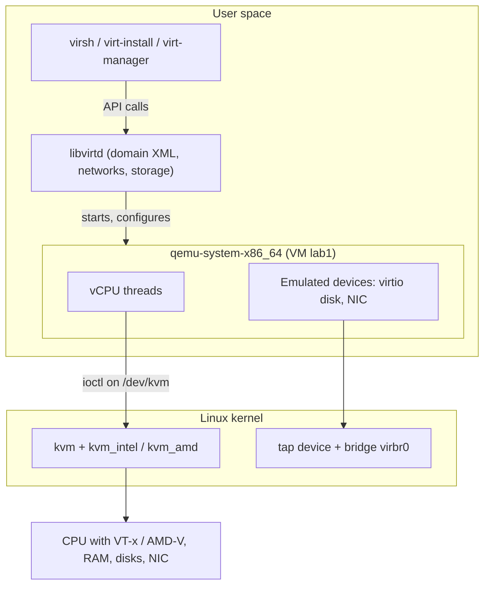
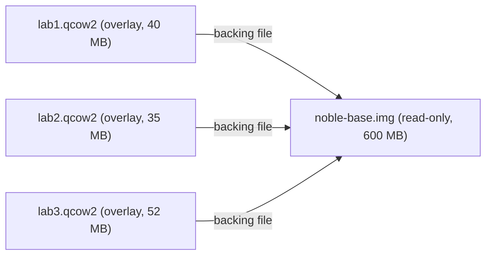

# Virtualization with KVM, QEMU, and libvirt

> **Level 6 · Chapter 6** · ⏱️ ~65 min read · Prerequisites: [Kernel basics](04-kernel-basics.md), [Advanced networking](05-advanced-networking.md), [Containers from scratch](01-containers-from-scratch.md)

This chapter explains how one Linux machine runs many complete operating systems at once. You will check your CPU for hardware support, learn how KVM, QEMU, and libvirt divide the work, create VMs from cloud images with cloud-init in under a minute, manage them with `virsh`, handle disk images and snapshots, and see when a VM beats a container.

## Why it matters

A data engineer has to upgrade three production servers from Ubuntu 22.04 to 24.04. Each one runs PostgreSQL and a set of ETL services. The plan is to test the upgrade first. The old way: download an ISO, click through the installer three times, configure each VM by hand, and lose an afternoon. When the first test upgrade goes wrong, she has to start over.

Instead, she downloads the official Ubuntu cloud image once and writes a ten-line cloud-init file with her SSH key. One `virt-install` command per VM gives her three fresh servers in about 40 seconds each. She takes a snapshot of each, runs the upgrade, and finds that one ETL service breaks. She reverts the snapshot in two seconds, fixes her runbook, and tries again. By lunchtime the procedure works three times in a row on clean machines.

Throughout this handbook you have been told to run risky steps "in a VM only". This chapter shows how to make those VMs quickly, reset them in seconds, and understand what runs underneath.

## Concepts

### What a virtual machine is

A **virtual machine (VM)** is a complete computer simulated in software: CPUs, memory, disks, network cards, and firmware. It runs its own operating system, with its own kernel. That OS is the **guest**. The machine that runs it is the **host**. The software that creates and runs VMs is the **hypervisor**, also called the **virtual machine monitor (VMM)**.

The key difference from containers: a container shares the host's kernel (you built one with namespaces in [Containers from scratch](01-containers-from-scratch.md)). A VM brings its own kernel. That is why a Linux host can run a Windows or FreeBSD VM, but not a Windows container.

### Type 1 and type 2 hypervisors

Hypervisors are traditionally sorted into two types:

| | Type 1 ("bare metal") | Type 2 ("hosted") |
|---|---|---|
| Runs on | The hardware directly | A normal operating system, as an application |
| Examples | VMware ESXi, Xen, Microsoft Hyper-V | VirtualBox, VMware Workstation, Parallels |
| Typical use | Data centres, clouds | Desktops and laptops |
| Overhead | Lower | Higher, because the host OS sits in between |

**KVM** blurs this line. It is a Linux kernel module that turns the Linux kernel itself into a hypervisor. The kernel already manages CPUs, memory, and devices, so KVM adds only the virtualization parts. A Linux machine with KVM is a type 1 hypervisor that also happens to be a full Linux system. KVM powers most public clouds, including Google Cloud, AWS (Nitro is KVM-based), and many OpenStack clouds.

### Hardware virtualization: VT-x and AMD-V

A guest kernel expects full control of the CPU. It wants to change page tables, handle interrupts, and run privileged instructions. If the hypervisor let it do that directly, the guest would take over the host. Early hypervisors solved this in software by rewriting guest code on the fly, which was slow and complicated.

Since about 2006, x86 CPUs have had **hardware virtualization** extensions: **Intel VT-x** (CPU flag `vmx`) and **AMD-V** (CPU flag `svm`, for Secure Virtual Machine). They add a new CPU mode for guests. The guest kernel runs at full speed in that mode, and it believes it has full control. When it does something sensitive, such as touching a device or a control register, the CPU automatically stops the guest and hands control to the hypervisor. That event is a **VM exit**. The hypervisor handles it and resumes the guest with a **VM entry**.

Two more features make it fast:

- **EPT** (Intel) and **NPT** (AMD) let the CPU translate guest memory addresses to host memory addresses in hardware. Without them, the hypervisor had to maintain "shadow" page tables in software.
- **VT-d** (Intel) and **AMD-Vi** add an **IOMMU** (input/output memory management unit). It lets you hand a real PCI device, such as a GPU or NIC, directly to a guest. This is called **PCI passthrough**.

The firmware (BIOS/UEFI) can switch VT-x or AMD-V off. If the checks below fail on a modern CPU, look for "Intel Virtualization Technology" or "SVM Mode" in the firmware settings.

### KVM, QEMU, and libvirt: who does what

On Linux, "a KVM virtual machine" is really three projects working together:

- **KVM** (`kvm.ko` plus `kvm_intel.ko` or `kvm_amd.ko`) lives in the kernel. It exposes `/dev/kvm`. A program opens it and uses `ioctl()` calls to create a VM, add memory, and create virtual CPUs. KVM then runs guest code with VT-x or AMD-V and handles VM exits it can deal with itself. KVM does *not* emulate disks, network cards, or screens.
- **QEMU** (`qemu-system-x86_64`) is a user-space program. It emulates a whole PC: the chipset, firmware, disk controllers, NICs, USB, and display. Without KVM it emulates the CPU in software too, which is very slow. With KVM (the `-accel kvm` option), it uses `/dev/kvm` for the CPU and memory, and only emulates devices. **Each VM is one `qemu-system-x86_64` process** on the host. Each virtual CPU is a thread in that process. So `top`, `kill`, cgroups, and everything from Level 3 apply to VMs too.
- **libvirt** is a management layer. Its daemon (`libvirtd`; newer releases split it into `virtqemud` and friends) starts and stops QEMU processes, sets up networks and storage, applies AppArmor confinement, and keeps each VM's configuration as an XML document. Tools talk to libvirt, not to QEMU directly. Those tools are `virsh` (command line), `virt-install` (create VMs), and `virt-manager` (GUI). libvirt calls a VM a **domain**.



libvirt has two connection **URIs**. `qemu:///system` is the system-wide daemon running as root. Its VMs can use bridges and system networks, and their disks live in `/var/lib/libvirt/images`. `qemu:///session` runs VMs as your own user, with more limited networking. This chapter uses `qemu:///system`, which is what `virt-manager` uses by default.

!!! warning "The libvirt group is root-equivalent"
    Members of the `libvirt` group can manage `qemu:///system` without `sudo`. They can also define a VM that mounts the host's `/` as a disk. Treat membership like `sudo` rights, just as you will treat the `docker` group in the next chapter.

### Disk images: raw and qcow2

A VM's disk is usually a file on the host. Two formats matter:

- **raw** is a plain byte-for-byte disk image. Byte 0 of the file is byte 0 of the virtual disk. It is the fastest format and the simplest. On Linux filesystems a raw file can be **sparse**: blocks that were never written take no space, so a "20 GB" raw file may use only 1 GB.
- **qcow2** (QEMU copy-on-write, version 2) is a structured format. It adds features: it grows as data is written, it can hold internal **snapshots**, it can be compressed, and it can have a **backing file**.

A **backing file** makes an image copy-on-write. The new image (the **overlay**) starts empty and records only the blocks that differ from its backing file. Reads of unchanged blocks fall through to the backing file. Many VMs can share one read-only base image, and each overlay holds only that VM's changes. This is a **linked clone**, and it is how clouds start hundreds of VMs from one image.



!!! danger "Never modify a backing file"
    If anything writes to the base image (booting it directly, for example), every overlay built on it is silently corrupted. Their recorded differences no longer match. Keep base images read-only (`chmod 444`).

### Virtual networking

libvirt creates a **virtual network** called `default` when you install it. You built its parts by hand in [Advanced networking](05-advanced-networking.md):

- A bridge named **`virbr0`** with address `192.168.122.1/24`.
- A `dnsmasq` process that hands out DHCP leases (`192.168.122.2` to `.254`) and answers DNS for the guests.
- Masquerade rules, so guests reach the internet through the host's address. Outside machines cannot reach the guests directly.
- A **tap device** per VM (`vnet0`, `vnet1`, ...). A tap device is a virtual NIC whose "wire" is a file descriptor held by the QEMU process. QEMU reads and writes the guest's Ethernet frames through it. Each tap is a port on `virbr0`.

This **NAT** mode suits labs. When VMs must be first-class members of your LAN, with addresses from the real router, you use **bridged** networking instead. You create a bridge `br0` on the host, enslave the physical NIC to it, and attach VMs to `br0`. An **isolated** network is a third option: guests talk to each other and the host, with no outside access at all.

### Emulated devices and virtio

QEMU can emulate real hardware, such as an Intel e1000 NIC or a SATA controller. Every guest OS has drivers for them. But real hardware interfaces were designed for silicon, not software. Each register access in the guest causes a VM exit and an expensive round trip into QEMU.

**virtio** is a family of **paravirtualized** devices. The guest knows it is virtualized and uses a device designed for that. Guest and host share ring buffers in memory (the same idea as a NIC's ring buffer) and exchange batches of requests with very few exits. Linux has virtio drivers built in: `virtio_blk` and `virtio_scsi` for disks, `virtio_net` for networking, and `virtio_balloon` for memory. Always use virtio for Linux guests. In the guest, the disks show up as `/dev/vda` (virtio-blk) instead of `/dev/sda`.

### Cloud images and cloud-init

A **cloud image** is a small, pre-installed disk image published by a distribution for use in clouds. It contains no user accounts, no passwords, and no SSH keys. It expects to be configured on first boot by **cloud-init**, a program that runs early at boot. cloud-init looks for configuration from a **datasource**. On AWS that is a metadata web service. On a home lab, the simplest one is **NoCloud**, which reads two files from a small disk labelled `cidata`:

- **`meta-data`**: the instance's identity, mainly `instance-id`. cloud-init runs its first-boot steps once per instance ID.
- **`user-data`**: what to configure. It is a YAML document that starts with `#cloud-config`, listing users, SSH keys, packages, files, and commands.

You will meet cloud-init again in [Automation with Ansible](08-automation-ansible.md). It handles first boot, and Ansible handles everything after.

### VMs versus containers

| | Virtual machine | Container |
|---|---|---|
| Kernel | Own kernel per VM | Shares the host kernel |
| Isolation | Strong, enforced by hardware | Namespaces, cgroups, seccomp: a kernel bug can break it |
| Guest OS | Any: Linux, Windows, BSD | Same kernel type as the host (Linux on Linux) |
| Boot time | Seconds to a minute | Milliseconds |
| Memory overhead | Hundreds of MB per VM (a whole OS) | A few MB per container |
| Image size | Hundreds of MB to GB | MB to hundreds of MB |
| Density | Tens per host | Hundreds per host |
| Kernel features | Load modules, change sysctls, test kernels freely | Limited, because the kernel is shared |
| Good for | Testing whole systems, kernels, firewalls, multi-tenant isolation | Packaging and shipping applications |

In practice they combine. Clouds run your containers inside VMs, so that tenants are separated by hardware and apps are packaged by containers.

## Commands and examples

### Checking hardware support

These checks are read-only and safe on your main machine. First, the summary from `lscpu`:

```bash
lscpu | grep -E 'Model name|Virtualization|Hypervisor'
```

```text
Model name:                              13th Gen Intel(R) Core(TM) i7-1360P
Virtualization:                          VT-x
```

`Virtualization: VT-x` (or `AMD-V`) means the CPU supports it and the firmware has it enabled. Inside a VM you would see `Hypervisor vendor: KVM` and `Virtualization type: full` instead.

The classic check counts lines in `/proc/cpuinfo` that mention the flags:

```bash
egrep -c '(vmx|svm)' /proc/cpuinfo
```

```text
egrep: warning: egrep is obsolescent
32
```

Any number above 0 means yes. This 16-thread CPU shows 32 because each processor entry has a `flags` line and a `vmx flags` line. `egrep` still works, but grep 3.8 and later warn that it is obsolete. The modern spelling is `grep -E -c '(vmx|svm)' /proc/cpuinfo`.

`kvm-ok` from the `cpu-checker` package (`sudo apt install cpu-checker`) combines the checks:

```bash
kvm-ok
```

```text
INFO: /dev/kvm exists
KVM acceleration can be used
```

And the kernel modules:

```bash
lsmod | grep kvm
```

```text
kvm_intel             569344  0
kvm                  1445888  1 kvm_intel
```

On AMD you see `kvm_amd`. The last column says `kvm` is used by `kvm_intel`, the vendor-specific part.

### Installing the virtualization stack

!!! danger "⚠️ VM only"
    Installing libvirt changes the host: it adds daemons, a bridge (`virbr0`), firewall rules, and group memberships. Following the handbook rule, do it inside your lab VM, which then runs VMs of its own. That is **nested virtualization**. On a KVM host, nesting is on by default for Intel and AMD (`cat /sys/module/kvm_intel/parameters/nested` prints `Y`). Create the lab VM with `--cpu host-passthrough` so it sees `vmx`/`svm`. In VirtualBox, enable "Nested VT-x/AMD-V" in the VM's processor settings. Run `kvm-ok` inside the lab VM to confirm. Nested VMs are slower, but fine for learning.

```bash
sudo apt update
sudo apt install qemu-system-x86 qemu-utils libvirt-daemon-system libvirt-clients virtinst cloud-image-utils cpu-checker
```

What each package brings:

| Package | Provides |
|---|---|
| `qemu-system-x86` | The `qemu-system-x86_64` emulator (the old name `qemu-kvm` still installs it) |
| `qemu-utils` | `qemu-img` and friends |
| `libvirt-daemon-system` | The libvirt daemon, the `default` network, and AppArmor profiles |
| `libvirt-clients` | `virsh` |
| `virtinst` | `virt-install` and `virt-clone` |
| `cloud-image-utils` | `cloud-localds` for NoCloud seed images |

On a desktop, add `virt-manager` for the GUI. Then add yourself to the groups, and log out and in again so the membership applies:

```bash
sudo usermod -aG libvirt,kvm alex
```

Because you are not root, `virsh` connects to `qemu:///session` by default. Point it at the system daemon permanently:

```bash
echo 'export LIBVIRT_DEFAULT_URI=qemu:///system' >> ~/.bashrc
source ~/.bashrc
virsh uri
```

```text
qemu:///system
```

### Creating a VM from a cloud image with cloud-init

This is the fastest way to a working server. All files go in `/var/lib/libvirt/images`. libvirt's AppArmor profile allows QEMU to read files there, while files in your home directory can fail with "Permission denied".

**Step 1: download the base image once.**

```bash
cd /var/lib/libvirt/images
sudo wget https://cloud-images.ubuntu.com/noble/current/noble-server-cloudimg-amd64.img -O noble-base.img
sudo chmod 444 noble-base.img
qemu-img info noble-base.img
```

```text
image: noble-base.img
file format: qcow2
virtual size: 3.5 GiB (3758096384 bytes)
disk size: 583 MiB
cluster_size: 65536
...
```

The `.img` name is misleading: the file is qcow2. Always check with `qemu-img info` instead of trusting the extension.

**Step 2: create an overlay disk for the VM**, and make it 20 GB. The guest grows its root filesystem to fill the disk on first boot.

```bash
sudo qemu-img create -f qcow2 -F qcow2 -b noble-base.img lab1.qcow2 20G
```

```text
Formatting 'lab1.qcow2', fmt=qcow2 cluster_size=65536 extended_l2=off compression_type=zlib size=21474836480 backing_file=noble-base.img backing_fmt=qcow2 lazy_refcounts=off refcount_bits=16
```

`-b` names the backing file and `-F` its format. Always pass `-F`. Without it, current versions of `qemu-img` stop with "Backing file specified without backing format", because guessing the format of a file is a security risk.

**Step 3: write the cloud-init files.** Work in a scratch directory. `user-data`:

```yaml
#cloud-config
hostname: lab1
users:
  - name: alex
    groups: [sudo]
    shell: /bin/bash
    sudo: "ALL=(ALL) NOPASSWD:ALL"
    ssh_authorized_keys:
      - ssh-ed25519 AAAAC3Nza...your-public-key... alex@mint
package_update: true
packages:
  - qemu-guest-agent
runcmd:
  - systemctl start qemu-guest-agent
```

Paste your real public key from `~/.ssh/id_ed25519.pub` (see [SSH](../04-sysadmin/05-ssh.md)). The `users` list replaces the image's default `ubuntu` user. `packages` installs the **QEMU guest agent**, a small service in the guest that lets the host ask for its IP addresses, freeze filesystems, and request a clean shutdown.

`meta-data`:

```yaml
instance-id: lab1
local-hostname: lab1
```

**Step 4: build the NoCloud seed image.** `cloud-localds` packs both files into a tiny ISO labelled `cidata`:

```bash
cloud-localds lab1-seed.iso user-data meta-data
sudo mv lab1-seed.iso /var/lib/libvirt/images/
file /var/lib/libvirt/images/lab1-seed.iso
```

```text
/var/lib/libvirt/images/lab1-seed.iso: ISO 9660 CD-ROM filesystem data 'cidata'
```

**Step 5: define and boot the VM.**

```bash
virt-install \
  --name lab1 \
  --memory 2048 \
  --vcpus 2 \
  --cpu host-passthrough \
  --disk path=/var/lib/libvirt/images/lab1.qcow2,format=qcow2,bus=virtio \
  --disk path=/var/lib/libvirt/images/lab1-seed.iso,device=cdrom \
  --osinfo ubuntu24.04 \
  --network network=default,model=virtio \
  --import \
  --graphics none \
  --noautoconsole
```

```text
Starting install...
Creating domain...
Domain creation completed.
```

Flag by flag:

- `--memory 2048` is in MiB. `--vcpus 2` gives two virtual CPUs.
- `--cpu host-passthrough` shows the guest your exact CPU model and flags. That gives the best performance and allows nested virtualization, but makes live migration to a different CPU model impossible.
- `--disk ...,bus=virtio` attaches the overlay as a virtio disk, `/dev/vda` in the guest.
- `--disk ...,device=cdrom` attaches the seed ISO, where cloud-init finds it.
- `--osinfo ubuntu24.04` tells libvirt which defaults suit this OS. `virt-install --osinfo list` shows valid names.
- `--import` means "the disk already has an OS; skip the installer and boot it".
- `--graphics none` gives no virtual screen. You use the serial console or SSH.
- `--noautoconsole` returns immediately instead of attaching to the console.

!!! tip "Shortcut"
    virt-install 4.x can build the seed for you: replace the seed `--disk` with `--cloud-init user-data=user-data,meta-data=meta-data`. The manual ISO is worth knowing, because the same `cidata` disk works with plain QEMU, other hypervisors, and even bare metal on a USB stick.

**Step 6: find its address and log in.** Wait 20 to 40 seconds for first boot, then:

```bash
virsh domifaddr lab1
```

```text
 Name       MAC address          Protocol     Address
-------------------------------------------------------------------------------
 vnet0      52:54:00:6b:3c:1a    ipv4         192.168.122.57/24
```

```bash
ssh alex@192.168.122.57
cloud-init status --wait
```

```text
status: done
```

On the guest, `cloud-init status --wait` blocks until first-boot configuration finishes. If something went wrong, the full story is in `/var/log/cloud-init-output.log` on the guest.

### Managing VMs with virsh

`virsh` is libvirt's shell. Every subcommand takes the domain name.

```bash
virsh list --all
```

```text
 Id   Name   State
-----------------------
 1    lab1   running
 -    lab2   shut off
```

Running VMs have a numeric ID. Defined but stopped VMs show `-`. Without `--all`, stopped VMs are hidden, a frequent source of "where did my VM go?".

| Command | What it does |
|---|---|
| `virsh start lab1` | Boots a defined VM |
| `virsh shutdown lab1` | Asks the guest to shut down cleanly (ACPI power button, or the guest agent) |
| `virsh reboot lab1` | Asks the guest to reboot |
| `virsh destroy lab1` | Pulls the virtual power plug. Despite the name, nothing is deleted. |
| `virsh suspend` / `resume lab1` | Pauses and resumes the vCPUs. Memory stays allocated. |
| `virsh console lab1` | Attaches to the serial console. Leave with `++ctrl+bracket-right++`. |
| `virsh dominfo lab1` | Summary: state, CPUs, memory, autostart |
| `virsh dumpxml lab1` | The full domain XML |
| `virsh edit lab1` | Edits the XML in `$EDITOR`, validates it, and saves it |
| `virsh autostart lab1` | Starts the VM when the host boots |
| `virsh undefine lab1 --remove-all-storage` | Deletes the VM *and* its disks |

```bash
virsh shutdown lab1
virsh start lab1
virsh console lab1
```

```text
Domain 'lab1' is being shutdown

Domain 'lab1' started

Connected to domain 'lab1'
Escape character is ^] (Ctrl + ])

lab1 login:
```

`shutdown` only *asks*. If the guest ignores it (it is hung, or it lacks ACPI support), the VM keeps running. Then use `destroy`, which has the same risk as pulling the plug on a real machine.

`dumpxml` shows everything libvirt knows. Trimmed:

```bash
virsh dumpxml lab1
```

```xml
<domain type='kvm' id='1'>
  <name>lab1</name>
  <memory unit='KiB'>2097152</memory>
  <vcpu placement='static'>2</vcpu>
  <os>
    <type arch='x86_64' machine='pc-q35-noble'>hvm</type>
    <boot dev='hd'/>
  </os>
  <cpu mode='host-passthrough' check='none' migratable='on'/>
  <devices>
    <emulator>/usr/bin/qemu-system-x86_64</emulator>
    <disk type='file' device='disk'>
      <driver name='qemu' type='qcow2'/>
      <source file='/var/lib/libvirt/images/lab1.qcow2'/>
      <target dev='vda' bus='virtio'/>
    </disk>
    <interface type='network'>
      <mac address='52:54:00:6b:3c:1a'/>
      <source network='default'/>
      <target dev='vnet0'/>
      <model type='virtio'/>
    </interface>
    ...
  </devices>
</domain>
```

`type='kvm'` confirms hardware acceleration. `machine='pc-q35-noble'` is the emulated chipset, a modern Q35 PC in Ubuntu 24.04's version. The XML is the source of truth: `virt-install` only generates it. Keep a copy with `virsh dumpxml lab1 > lab1.xml`, and recreate the VM anywhere with `virsh define lab1.xml`.

The VM really is just a process on the host:

```bash
ps -o pid,user,%cpu,rss,cmd -p "$(pgrep -f 'guest=lab1')" | cut -c1-110
```

```text
    PID USER     %CPU   RSS CMD
   4127 libvirt+  3.1 912344 /usr/bin/qemu-system-x86_64 -name guest=lab1,debug-threads=on -S -object {"qom-type
```

It runs as the unprivileged `libvirt-qemu` user, confined by AppArmor. `RSS` shows about 900 MB of host RAM actually used by the 2 GB guest so far.

### Snapshots

A **snapshot** records a VM's state at a moment so you can return to it. With qcow2 disks, libvirt can make **internal** snapshots stored inside the qcow2 file. On a running VM, an internal snapshot also saves the RAM, so reverting puts you back mid-session with programs running.

```bash
virsh snapshot-create-as lab1 clean-install "Fresh Ubuntu, cloud-init done"
virsh snapshot-list lab1
```

```text
Domain snapshot clean-install created

 Name            Creation Time               State
---------------------------------------------------------
 clean-install   2026-10-02 10:31:07 +0000   running
```

Now break something on purpose, for example `sudo rm -rf /etc/ssh` in the guest. Then go back:

```bash
virsh snapshot-revert lab1 clean-install
virsh snapshot-delete lab1 clean-install
```

The revert takes a couple of seconds, and the guest has its `/etc/ssh` back. That is the whole "VM only" safety net of this handbook in one command.

!!! warning "Common mistake"
    Snapshots are not backups. They live inside the same qcow2 file, on the same disk. If the file or the disk is lost, the snapshots go with it. Also, a long chain of old snapshots slows disk I/O. Delete snapshots you no longer need.

If `snapshot-create-as` fails with a message that internal snapshots are not supported with pflash firmware, the VM boots with UEFI. Use a disk-only external snapshot instead: `virsh snapshot-create-as lab1 before-upgrade --disk-only --atomic`.

### Working with disk images: qemu-img

`qemu-img` works on image files directly. Never run it in write mode on a disk that a running VM is using. These examples are safe in any scratch directory, with no root needed.

Create a sparse 10 GB qcow2 and look at it:

```bash
qemu-img create -f qcow2 base.qcow2 10G
qemu-img info base.qcow2
```

```text
Formatting 'base.qcow2', fmt=qcow2 cluster_size=65536 extended_l2=off compression_type=zlib size=10737418240 lazy_refcounts=off refcount_bits=16
image: base.qcow2
file format: qcow2
virtual size: 10 GiB (10737418240 bytes)
disk size: 196 KiB
cluster_size: 65536
Format specific information:
    compat: 1.1
    compression type: zlib
    lazy refcounts: false
    refcount bits: 16
    corrupt: false
    extended l2: false
...
```

**Virtual size** is what the guest sees, 10 GiB. **Disk size** is what the file uses on the host, 196 KiB of metadata so far. A raw file is sparse in the same way:

```bash
qemu-img create -f raw disk.raw 1G
ls -lhs disk.raw
```

```text
Formatting 'disk.raw', fmt=raw size=1073741824
4.0K -rw-r--r-- 1 alex alex 1.0G Oct  2 10:38 disk.raw
```

`ls -s` (first column) shows 4 KB actually allocated, while the apparent size is 1 GB.

!!! warning "Common mistake"
    Copying a sparse image with a tool that doesn't understand holes, or over the network, can turn 4 KB into 1 GB. Use `cp --sparse=always`, `rsync --sparse`, or convert to qcow2 first.

Build a backing chain and inspect it:

```bash
qemu-img create -f qcow2 -F qcow2 -b base.qcow2 vm1.qcow2
qemu-img info --backing-chain vm1.qcow2 | grep -E '^image|backing file:|disk size'
```

```text
image: vm1.qcow2
disk size: 20.3 MiB
backing file: base.qcow2
image: base.qcow2
disk size: 100 MiB
```

Here the base holds 100 MiB of data and the overlay holds only the 20 MiB the "VM" changed. Other everyday operations:

```bash
# convert formats: raw -> qcow2 (-p shows progress); -c compresses
qemu-img convert -p -f raw -O qcow2 disk.raw disk.qcow2

# flatten an overlay into a standalone image (no backing file)
qemu-img convert -O qcow2 vm1.qcow2 vm1-standalone.qcow2

# grow the virtual disk by 5 GB (then grow the partition inside the guest)
qemu-img resize vm1.qcow2 +5G

# check a qcow2 file for corruption
qemu-img check base.qcow2
```

```text
Image resized.
No errors were found on the image.
Image end offset: 262144
```

`qemu-img convert` also reads VMware (`vmdk`), VirtualBox (`vdi`), and Hyper-V (`vhdx`) images, which makes it the standard tool for moving VMs between hypervisors.

| | raw | qcow2 |
|---|---|---|
| Speed | Fastest, no translation layer | Slightly slower; close to raw with `preallocation=metadata` |
| Thin provisioning | Only through filesystem sparseness | Built in |
| Snapshots | No | Internal and external |
| Backing files | No | Yes |
| Compression | No | Yes (`convert -c`) |
| Best for | Maximum I/O performance, LVM or block devices | Labs, templates, most general use |

### Virtual networks

List libvirt networks and look at `default`:

```bash
virsh net-list --all
virsh net-dumpxml default
```

```text
 Name      State    Autostart   Persistent
--------------------------------------------
 default   active   yes         yes
```

```xml
<network>
  <name>default</name>
  <forward mode='nat'>
    <nat>
      <port start='1024' end='65535'/>
    </nat>
  </forward>
  <bridge name='virbr0' stp='on' delay='0'/>
  <ip address='192.168.122.1' netmask='255.255.255.0'>
    <dhcp>
      <range start='192.168.122.2' end='192.168.122.254'/>
    </dhcp>
  </ip>
</network>
```

`forward mode='nat'` produces the masquerade rules. The `<dhcp>` block configures `dnsmasq`. On the host you can see the pieces:

```bash
ip -br addr show virbr0
bridge link | grep virbr0
virsh net-dhcp-leases default
```

```text
virbr0           UP             192.168.122.1/24
9: vnet0: <BROADCAST,MULTICAST,UP,LOWER_UP> mtu 1500 master virbr0 state forwarding priority 32 cost 2
 Expiry Time           MAC address         Protocol   IP address          Hostname   Client ID or DUID
------------------------------------------------------------------------------------------------------------
 2026-10-02 11:31:07   52:54:00:6b:3c:1a   ipv4       192.168.122.57/24   lab1       ff:56:50:4d:98:00:02:00:00:ab:11:2f:...
```

`vnet0` is the VM's tap device, plugged into the `virbr0` bridge, exactly like the veth ends in the last chapter.

**Bridged networking** puts VMs directly on your LAN. Create a bridge on the host that takes over the wired NIC. Wi-Fi interfaces generally cannot be bridged, so this only works on wired hosts.

=== "Ubuntu Server (netplan)"

    ```yaml
    # /etc/netplan/01-br0.yaml
    network:
      version: 2
      ethernets:
        enp3s0:
          dhcp4: false
      bridges:
        br0:
          interfaces: [enp3s0]
          dhcp4: true
    ```

    Apply it with `sudo netplan try`, which reverts automatically after 120 seconds unless you confirm.

=== "Mint desktop (NetworkManager)"

    ```bash
    nmcli connection add type bridge ifname br0 con-name br0
    nmcli connection add type ethernet ifname enp3s0 master br0 con-name br0-port
    nmcli connection up br0
    ```

    Then deactivate the old wired connection for `enp3s0`.

Then attach VMs with `--network bridge=br0,model=virtio`. They get addresses from your real router, and other machines on the LAN can reach them.

### virtio and performance

Inside the guest, check that it uses virtio devices:

```bash
lspci | grep -i virtio
lsmod | grep virtio
```

```text
01:00.0 Ethernet controller: Red Hat, Inc. Virtio 1.0 network device (rev 01)
04:00.0 SCSI storage controller: Red Hat, Inc. Virtio 1.0 block device (rev 01)
05:00.0 Unclassified device [00ff]: Red Hat, Inc. Virtio 1.0 memory balloon (rev 01)
virtio_net             77824  0
virtio_blk             36864  3
virtio_balloon         28672  0
...
```

(Red Hat appears because it maintains the virtio device IDs.) A short performance checklist:

- **virtio everywhere**: disk `bus=virtio` (or `virtio-scsi` with `discard=unmap`, so space freed in the guest is returned to the host), NIC `model=virtio`.
- **CPU model**: `host-passthrough` exposes all host CPU features such as AVX, which data workloads benefit from.
- **Disk cache**: `cache=none` with `io=native` bypasses the host page cache. The guest already caches, and caching twice wastes RAM. For example: `--disk path=...,bus=virtio,cache=none,io=native`.
- **Don't overcommit memory blindly.** If the sum of guest RAM exceeds host RAM, the host swaps, and every guest slows to a crawl.
- **Install the guest agent** for clean shutdowns, accurate `domifaddr`, and consistent snapshots.

From the host, `virsh domstats lab1` and `virt-top` show per-VM CPU, disk, and network usage. Because each VM is a process, `top` and `pidstat` from [Performance analysis](02-performance-analysis.md) work too.

### Quick labs: Multipass and Vagrant

Typing `virt-install` gets old when you just want "an Ubuntu box, now". Two tools wrap the whole workflow.

**Multipass** (by Canonical) launches Ubuntu VMs with one command. It is distributed as a snap. Linux Mint blocks snap by default with `/etc/apt/preferences.d/nosnap.pref`, so on Mint you must remove that file and install `snapd` first.

```bash
sudo snap install multipass
multipass launch 24.04 --name lab --cpus 2 --memory 2G --disk 10G --cloud-init user-data
multipass list
multipass shell lab
```

```text
Name                    State             IPv4             Image
lab                     Running           10.0.0.45        Ubuntu 24.04 LTS
```

`multipass delete lab && multipass purge` removes it. It accepts the same cloud-init `user-data` you wrote above.

**Vagrant** (by HashiCorp) describes VMs in a `Vagrantfile` that you commit to Git, so the whole team gets the same lab. It supports VirtualBox, libvirt (through the `vagrant-libvirt` plugin), and others. It is not in Ubuntu's repositories since its 2023 license change, so install it from HashiCorp's apt repository. A minimal `Vagrantfile`:

```ruby
Vagrant.configure("2") do |config|
  config.vm.box = "bento/ubuntu-24.04"
  config.vm.hostname = "lab1"
  config.vm.network "private_network", ip: "192.168.56.10"
  config.vm.provider "virtualbox" do |vb|
    vb.memory = 2048
    vb.cpus = 2
  end
  config.vm.provision "shell", inline: "apt-get update && apt-get install -y nginx"
end
```

`vagrant up` downloads the box and boots it. `vagrant ssh` logs in, `vagrant destroy -f` deletes it, and `vagrant up` recreates it identically. The `provision` step can call Ansible instead of a shell line, which you will use in [Automation with Ansible](08-automation-ansible.md).

## Exercises

### Exercise 1: Check your hardware (easy)

On your main machine (read-only, safe), find out: (a) whether your CPU supports hardware virtualization and which kind, (b) whether `/dev/kvm` exists and which group owns it, (c) whether nested virtualization is enabled. Then do the same inside your lab VM and explain any differences.

??? success "Solution"

    ```bash
    lscpu | grep -E 'Virtualization|Hypervisor'
    grep -E -c '(vmx|svm)' /proc/cpuinfo
    ls -l /dev/kvm
    cat /sys/module/kvm_intel/parameters/nested 2>/dev/null || cat /sys/module/kvm_amd/parameters/nested
    ```

    On the host you expect `Virtualization: VT-x` (or `AMD-V`), a non-zero count, `crw-rw----+ 1 root kvm 10, 232 ... /dev/kvm`, and `Y` (or `1`) for nested.

    Inside the VM, `lscpu` shows `Hypervisor vendor: KVM` (or `VirtualBox`). The `vmx`/`svm` count is 0 unless the hypervisor passes the flag through (`host-passthrough` in libvirt, "Nested VT-x/AMD-V" in VirtualBox). Without it there is no `/dev/kvm` in the guest and `kvm-ok` says "KVM acceleration can NOT be used".

### Exercise 2: Linked clones with qemu-img (easy)

Without root, in a scratch directory: create a 5 GB qcow2 `golden.qcow2`, then three overlays `web1`, `web2`, `web3` backed by it. Show the backing chain of `web2`. Then flatten `web3` into a standalone image and prove it has no backing file.

??? success "Solution"

    ```bash
    mkdir -p ~/scratch/images && cd ~/scratch/images
    qemu-img create -f qcow2 golden.qcow2 5G
    chmod 444 golden.qcow2
    for n in 1 2 3; do qemu-img create -f qcow2 -F qcow2 -b golden.qcow2 web$n.qcow2; done
    qemu-img info --backing-chain web2.qcow2 | grep -E '^image|backing file'
    qemu-img convert -O qcow2 web3.qcow2 web3-flat.qcow2
    qemu-img info web3-flat.qcow2 | grep -c 'backing file'
    ```

    ```text
    image: web2.qcow2
    backing file: golden.qcow2
    image: golden.qcow2
    0
    ```

    `chmod 444` on the golden image protects every overlay from accidental writes to the base. The flattened copy contains all data from both layers, so it no longer needs `golden.qcow2` and can be moved to another host by itself.

### Exercise 3: A cloud-init VM with two users and a package (medium)

⚠️ VM only (nested). Create a VM called `etl1` from the Ubuntu cloud image with 1 vCPU, 1.5 GB RAM, and a 15 GB overlay disk. cloud-init must create user `alex` with your SSH key and sudo rights, plus a user `etl` without sudo, install `postgresql-client` and `jq`, and write a file `/etc/motd` saying "ETL lab VM". Log in and verify each item.

??? success "Solution"

    `user-data`:

    ```yaml
    #cloud-config
    hostname: etl1
    users:
      - name: alex
        groups: [sudo]
        shell: /bin/bash
        sudo: "ALL=(ALL) NOPASSWD:ALL"
        ssh_authorized_keys:
          - ssh-ed25519 AAAAC3Nza...your-key... alex@mint
      - name: etl
        shell: /bin/bash
    package_update: true
    packages: [postgresql-client, jq, qemu-guest-agent]
    write_files:
      - path: /etc/motd
        content: |
          ETL lab VM
    ```

    ```bash
    printf 'instance-id: etl1\nlocal-hostname: etl1\n' > meta-data
    cloud-localds etl1-seed.iso user-data meta-data
    cd /var/lib/libvirt/images
    sudo mv ~/etl1-seed.iso .        # adjust to where you built it
    sudo qemu-img create -f qcow2 -F qcow2 -b noble-base.img etl1.qcow2 15G
    virt-install --name etl1 --memory 1536 --vcpus 1 \
      --disk path=/var/lib/libvirt/images/etl1.qcow2,format=qcow2,bus=virtio \
      --disk path=/var/lib/libvirt/images/etl1-seed.iso,device=cdrom \
      --osinfo ubuntu24.04 --network network=default,model=virtio \
      --import --graphics none --noautoconsole
    virsh domifaddr etl1
    ssh alex@192.168.122.x 'cloud-init status --wait; id etl; which psql jq; cat /etc/motd'
    ```

    `id etl` shows a user without the `sudo` group. If something is missing, read `/var/log/cloud-init-output.log`. A YAML indentation error makes cloud-init ignore the whole file. On the guest, `cloud-init schema --system` validates the user-data it received.

### Exercise 4: Break it and revert (medium)

⚠️ VM only. On `lab1`, take a snapshot named `pre-break`. Inside the guest, run `sudo apt purge -y openssh-server` and reboot it. Confirm you can no longer SSH in, but can still log in through `virsh console` if a password were set. Revert to `pre-break` and confirm SSH works again. Finally, list and delete the snapshot.

??? success "Solution"

    ```bash
    virsh snapshot-create-as lab1 pre-break "before breaking ssh"
    ssh alex@192.168.122.57 'sudo apt purge -y openssh-server && sudo reboot'
    ssh -o ConnectTimeout=5 alex@192.168.122.57      # Connection refused
    virsh snapshot-revert lab1 pre-break
    ssh alex@192.168.122.57 hostname                  # works again
    virsh snapshot-list lab1
    virsh snapshot-delete lab1 pre-break
    ```

    The snapshot was taken while running, so the revert restores memory too. The VM resumes from that moment with `sshd` already running. Note that our cloud-init user has no password, so `virsh console` shows a login prompt you can't use. That is a reason some people add a console password in lab `user-data` (`chpasswd` / `lock_passwd: false`), never in production.

### Exercise 5: A three-VM lab in one script (hard)

⚠️ VM only. Write a bash script `mklab.sh` that takes VM names as arguments (`./mklab.sh web1 web2 db1`). For each name it creates an overlay disk, a seed ISO with that hostname, and the VM. Then it waits until each VM has an IP and prints a `name ip` table. Add a `--destroy` option that removes the VMs and their disks. Use `set -euo pipefail`.

??? success "Solution"

    ```bash
    #!/usr/bin/env bash
    set -euo pipefail

    IMG_DIR=/var/lib/libvirt/images
    BASE=$IMG_DIR/noble-base.img
    PUBKEY=$(cat ~/.ssh/id_ed25519.pub)
    export LIBVIRT_DEFAULT_URI=qemu:///system

    destroy() {
      for vm in "$@"; do
        virsh destroy "$vm" 2>/dev/null || true
        virsh undefine "$vm" --remove-all-storage 2>/dev/null || true
        sudo rm -f "$IMG_DIR/$vm-seed.iso"
      done
    }

    create() {
      local vm=$1 tmp
      tmp=$(mktemp -d)
      cat > "$tmp/user-data" <<EOF
    #cloud-config
    hostname: $vm
    users:
      - name: alex
        groups: [sudo]
        shell: /bin/bash
        sudo: "ALL=(ALL) NOPASSWD:ALL"
        ssh_authorized_keys: ["$PUBKEY"]
    packages: [qemu-guest-agent]
    runcmd: [systemctl start qemu-guest-agent]
    EOF
      printf 'instance-id: %s\nlocal-hostname: %s\n' "$vm" "$vm" > "$tmp/meta-data"
      cloud-localds "$tmp/seed.iso" "$tmp/user-data" "$tmp/meta-data"
      sudo mv "$tmp/seed.iso" "$IMG_DIR/$vm-seed.iso"
      sudo qemu-img create -q -f qcow2 -F qcow2 -b "$BASE" "$IMG_DIR/$vm.qcow2" 10G
      virt-install --name "$vm" --memory 1024 --vcpus 1 \
        --disk "path=$IMG_DIR/$vm.qcow2,format=qcow2,bus=virtio" \
        --disk "path=$IMG_DIR/$vm-seed.iso,device=cdrom" \
        --osinfo ubuntu24.04 --network network=default,model=virtio \
        --import --graphics none --noautoconsole >/dev/null
      rm -r "$tmp"
    }

    ip_of() {
      virsh domifaddr "$1" 2>/dev/null | awk '/ipv4/ {sub(/\/.*/, "", $4); print $4}'
    }

    if [[ ${1:-} == --destroy ]]; then shift; destroy "$@"; exit 0; fi
    [[ $# -ge 1 ]] || { echo "usage: $0 [--destroy] vm..." >&2; exit 1; }

    for vm in "$@"; do create "$vm"; done
    for vm in "$@"; do
      until [[ -n $(ip_of "$vm") ]]; do sleep 2; done
      printf '%-8s %s\n' "$vm" "$(ip_of "$vm")"
    done
    ```

    ```text
    web1     192.168.122.61
    web2     192.168.122.140
    db1      192.168.122.93
    ```

    `undefine --remove-all-storage` deletes the disks attached to the VM, which are the overlay and the seed ISO. The shared base image survives, because it is only the overlay's backing file, not a disk of the VM. The extra `rm -f` covers a VM whose definition is already gone. Pass `shellcheck mklab.sh` before you trust it (see the Level 2 chapters).

## Check yourself

1. What does KVM do, what does QEMU do, and what does libvirt do?

    ??? note "Answer"

        KVM is a kernel module that uses VT-x/AMD-V to run guest code directly on the CPU and exposes this through `/dev/kvm`. QEMU is a user-space process (one per VM) that emulates the machine's devices (disks, NICs, firmware) and uses KVM for CPU and memory. libvirt is the management layer: it stores VM definitions as XML, starts and stops QEMU processes, sets up networks, storage, and security, and offers one API to `virsh`, `virt-install`, and `virt-manager`.

2. Why is KVM often called a type 1 hypervisor even though it runs "inside Linux"?

    ??? note "Answer"

        KVM is part of the Linux kernel itself, so the kernel that controls the hardware *is* the hypervisor. No separate host OS sits between the hypervisor and the hardware, unlike VirtualBox, which runs as an application on top of an OS. Linux contributes its scheduler, memory manager, and drivers to the hypervisor's job.

3. `egrep -c '(vmx|svm)' /proc/cpuinfo` prints `0` inside your lab VM. What does that mean, and how do you fix it?

    ??? note "Answer"

        The VM's virtual CPU does not expose hardware virtualization, so the guest cannot use KVM and nested VMs would fall back to slow software emulation. Enable nested virtualization: on a KVM host, make sure the `nested` module parameter is `Y` and give the VM `--cpu host-passthrough` (or `host-model`). In VirtualBox, enable "Nested VT-x/AMD-V". Then power-cycle the VM (a reboot inside the guest is not enough).

4. What is a backing file, and what goes wrong if you boot the base image directly?

    ??? note "Answer"

        A backing file is a read-only base image under a qcow2 overlay. The overlay stores only changed blocks, and unchanged reads fall through to the base. If you boot the base directly, its blocks change underneath the overlays. Each overlay's recorded differences now apply to different data, so their filesystems become corrupted. Keep base images read-only.

5. What is the difference between `virsh shutdown` and `virsh destroy`?

    ??? note "Answer"

        `shutdown` asks the guest OS to shut down cleanly, through an ACPI power-button event or the guest agent. The guest may take time, or ignore it. `destroy` immediately kills the QEMU process, like pulling the power cord. It risks filesystem damage in the guest, but it does not delete the VM's definition or disks, despite the name.

6. Name the two files cloud-init's NoCloud datasource reads, and what each contains. How does cloud-init find them?

    ??? note "Answer"

        `meta-data` holds the instance identity (`instance-id`, and optionally `local-hostname`). `user-data` holds the configuration: a `#cloud-config` YAML document with users, keys, packages, files, and commands. cloud-init looks for a filesystem labelled `cidata` (or `CIDATA`) attached to the VM, such as the ISO that `cloud-localds` creates.

7. Why are virtio devices faster than emulated e1000 or SATA devices?

    ??? note "Answer"

        Emulated devices mimic real hardware registers, so every register access in the guest traps out to the hypervisor (a VM exit) and into QEMU, which is expensive. virtio devices are designed for virtualization: guest and host share ring buffers in memory and pass batches of requests with very few exits or notifications. The guest needs virtio drivers, which Linux has built in.

8. Give two situations where you would choose a VM over a container, and one where you would choose a container.

    ??? note "Answer"

        VM: testing something that touches the kernel (modules, sysctls, firewall rules, a kernel upgrade), running a different OS such as Windows or BSD, or running untrusted tenants that need hardware-enforced isolation. Container: packaging and shipping an application with its dependencies, or running many instances quickly and densely, such as a web app's workers in CI.

## Key takeaways

- Hardware virtualization (VT-x/`vmx`, AMD-V/`svm`) lets guest kernels run at full speed. Check it with `lscpu`, `grep -E -c '(vmx|svm)' /proc/cpuinfo`, and `kvm-ok`.
- KVM (kernel) runs the CPU and memory, QEMU (one process per VM) emulates devices, and libvirt manages it all through XML, `virsh`, and `virt-install`.
- Cloud images plus a cloud-init NoCloud seed (`cloud-localds`) plus `virt-install --import` give you a configured server in under a minute.
- qcow2 overlays with backing files make linked clones cheap. Keep base images read-only, and use `qemu-img info`, `convert`, and `resize` to manage images.
- Snapshots (`virsh snapshot-create-as` and `snapshot-revert`) are the ideal undo button for "VM only" experiments, but they are not backups.
- The default network is NAT on `virbr0` (192.168.122.0/24). Use a bridge when VMs must be on the real LAN. Always use virtio devices for Linux guests.
- VMs give strong isolation and their own kernel. Containers give speed and density. Real systems often run containers inside VMs.

## Next

VMs bring their own kernel. Containers share yours, and they are how most software ships today. Next: [Docker and Podman](07-docker-and-podman.md).
