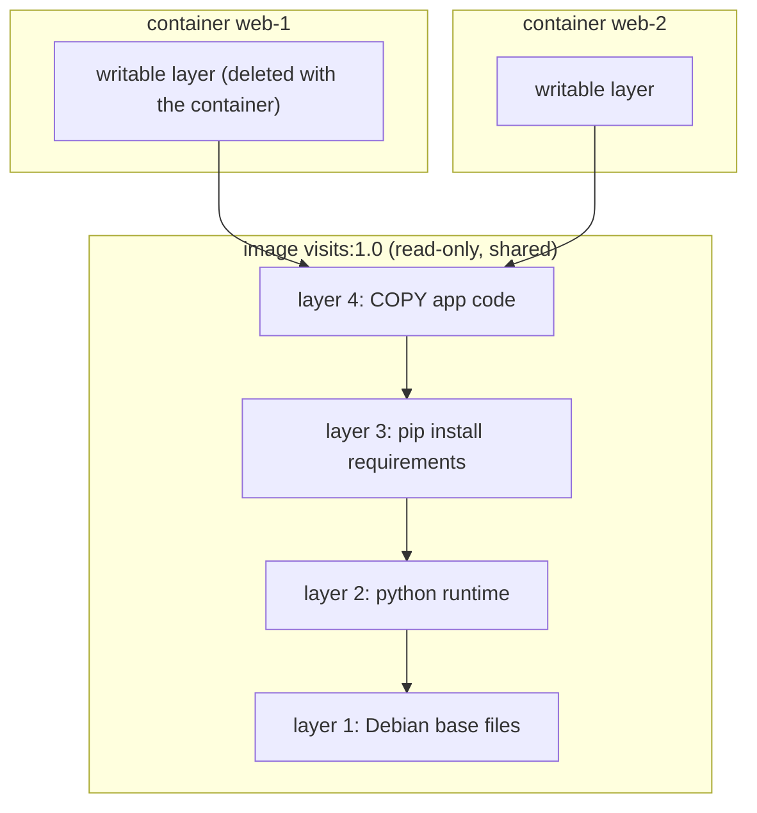
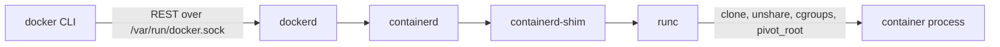

# Docker and Podman

> **Level 6 · Chapter 7** · ⏱️ ~75 min read · Prerequisites: [Containers from scratch](01-containers-from-scratch.md), [Advanced networking](05-advanced-networking.md), [Your program as a service](../05-programming/05-services-with-systemd.md)

You built a container by hand with `unshare` and cgroups. This chapter covers the tools that do it for you every day. You will install Docker Engine correctly on Ubuntu or Mint, run and inspect containers, write good Dockerfiles, handle storage and networking, run a web app and a database with Compose, use Podman rootless under systemd, and keep images secure and your disk clean.

## Why it matters

A data engineer writes a Python job that reads CSV exports, cleans them with pandas, and loads them into PostgreSQL. It works on her laptop. On the shared server, it fails: the server has Python 3.10, a different pandas, and a missing C library. A colleague "fixes" it by installing packages globally, which breaks another team's job.

She packages the job as a Docker image instead. The image holds the exact Python version, libraries, and code, and it runs the same on her laptop, the server, and in CI. A Compose file starts PostgreSQL next to it for testing.

Then a security scan flags the server. Port 5432 is open to the internet, even though `ufw` allows only SSH. Her Compose file said `ports: - "5432:5432"`, and Docker's own firewall rules run *before* ufw's. The fix is one line: `127.0.0.1:5432:5432`, or no published port at all.

Containers are easy to start and easy to get subtly wrong. This chapter covers both sides.

## Concepts

### From unshare to Docker

In [Containers from scratch](01-containers-from-scratch.md) you combined three kernel features:

- **Namespaces** gave a process its own view of PIDs, mounts, hostname, network, and users.
- **cgroups** limited its CPU, memory, and number of processes.
- A separate **root filesystem** (with `chroot` or `pivot_root`) gave it its own `/`.

Docker adds no new kernel magic. It automates those steps and adds what you need to work at scale: an image format, a way to download and share images, layered filesystems, networking (the bridge, veth pairs, and NAT from [Advanced networking](05-advanced-networking.md)), volumes, logs, and restart policies. Every `docker run` still ends with a process on your host, in namespaces, in a cgroup. You can see it with `ps`.

### Images, layers, and containers

An **image** is a read-only template for a container's filesystem, plus metadata: the default command, environment variables, the working directory, and exposed ports. An image is made of **layers**. Each layer is a tarball of filesystem changes: files added, changed, or deleted. Each instruction in a Dockerfile that changes files creates a layer.

A **container** is a running (or stopped) instance of an image. When Docker starts a container, it stacks the image's read-only layers with **overlayfs** (a union filesystem in the kernel) and adds one thin **writable layer** on top. Writes go to the writable layer by **copy-on-write**: modifying a file from a lower layer first copies it up. The image itself never changes.



This has three consequences you will meet constantly:

1. Ten containers from one image share its layers on disk and in the page cache. Starting a container takes milliseconds because nothing is copied.
2. **Data written inside a container disappears when the container is removed.** Anything worth keeping must go in a volume.
3. Layers are cached and reused between images. The order of Dockerfile instructions decides how much of that cache you hit.

The analogy for a programmer: an image is like a class, and a container is like an object instantiated from it.

### OCI: the standards underneath

Docker started the container boom, and the **Open Container Initiative (OCI)** later standardised it:

- The **image spec** defines the image format: layers as tarballs, plus a JSON config and a manifest. Any OCI image runs in Docker, Podman, Kubernetes, and others.
- The **runtime spec** defines how to run a container from an unpacked filesystem plus a `config.json`. **runc** is the reference **low-level runtime**. It makes the namespace, cgroup, and mount system calls you made by hand. **crun** is a faster alternative written in C.
- The **distribution spec** defines the HTTP API of a **registry**, a server that stores images, such as Docker Hub, GitHub Container Registry (`ghcr.io`), or quay.io.

Docker itself is several pieces:



`docker` is just a client. `dockerd` is the daemon, running as root, that manages images, networks, and volumes. **containerd** manages container lifecycles. It is also what Kubernetes uses directly. For each container, a small **shim** process stays as its parent, so containers keep running when `dockerd` restarts. `runc` sets up the container and exits.

An image name has up to four parts: `registry/repository:tag@digest`. `nginx:1.27` is short for `docker.io/library/nginx:1.27`. A **tag** is a movable label: `nginx:1.27` today may be a different image next month. A **digest** (`@sha256:...`) is the hash of the exact content and never changes.

### The docker group is root

`dockerd` runs as root, and anyone who can talk to its socket `/var/run/docker.sock` can tell it to do anything. That includes starting a container that mounts the host's `/`:

```bash
docker run --rm -v /:/host alpine cat /host/etc/shadow
```

That command prints the host's password hashes without `sudo`. Adding a user to the `docker` group is the same as giving them passwordless root. The Docker docs say so too. On a personal lab machine that may be an acceptable trade-off. On a shared server, it is not. **Rootless** container engines, covered under Podman below, avoid the problem.

### Storage: volumes, bind mounts, tmpfs

Three ways to give a container storage that outlives its writable layer:

| Type | Syntax | Lives in | Use it for |
|---|---|---|---|
| **Named volume** | `-v pgdata:/var/lib/postgresql/data` | `/var/lib/docker/volumes/`, managed by Docker | Databases and app state in production |
| **Bind mount** | `-v /srv/site:/usr/share/nginx/html:ro` | Any host path you choose | Config files, source code during development |
| **tmpfs** | `--tmpfs /tmp` | RAM only | Scratch data that must never touch disk |

Volumes are portable, easy to back up with `docker run --rm -v pgdata:/data ...`, and when empty they are pre-filled from the image's content at that path. Bind mounts depend on the host's directory layout and on UID matching: a container process running as UID 999 writes files owned by UID 999 on the host.

### Networking: bridge, host, and user-defined networks

Docker creates three networks at install time:

- **bridge** (`docker0`, `172.17.0.0/16`): the default. Each container gets a network namespace, a veth pair plugged into `docker0`, and an IP address. Outbound traffic is masqueraded. This is exactly the bridge lab from [Advanced networking](05-advanced-networking.md).
- **host**: no network namespace. The container uses the host's interfaces directly. It is fastest, but it has no isolation and no port mapping.
- **none**: only a loopback interface.

**User-defined bridge networks** (`docker network create appnet`) are what you should use for multi-container apps. Unlike the default bridge, they provide **DNS between containers**. Docker runs an embedded DNS server at `127.0.0.11` inside each container, so the container `web` can reach `db` by name. Compose creates one for each project automatically.

**Publishing a port** (`-p 8080:80`) adds a DNAT rule in the `nat` table's prerouting chain: traffic to host port 8080 is rewritten to the container's IP, port 80. DNAT happens *before* the routing decision, so the packet goes through the forward hook, not input. `ufw`'s rules are in the input chain, so they never see it.

!!! danger "Published ports bypass ufw"
    `docker run -p 5432:5432 postgres` makes PostgreSQL reachable from the whole internet, even if `ufw status` says only port 22 is allowed. Publish only to loopback (`-p 127.0.0.1:5432:5432`) unless the service is meant to be public. Better still, don't publish database ports at all, and let other containers reach the database over a user-defined network.

### PID 1 inside a container

The first process in a PID namespace becomes **PID 1** there, and PID 1 is special in two ways:

1. **Signals.** The kernel does not apply the default action of a signal to PID 1 in a namespace. A normal process dies on `SIGTERM` if it has no handler. PID 1 without a handler simply ignores it. `docker stop` sends `SIGTERM`, waits 10 seconds, and then sends `SIGKILL`. If your app is PID 1 and has no `SIGTERM` handler (plain Python scripts don't install one), every stop takes 10 seconds and ends in a kill, with no clean shutdown.
2. **Zombies.** PID 1 must **reap** orphaned child processes by calling `wait()`. If it doesn't, finished children pile up as zombies, which you met in Level 3 and Level 5.

A related trap is the **shell form** of `CMD` (`CMD python app.py`, without brackets). Docker runs it as `/bin/sh -c "python app.py"`, so the *shell* is PID 1, and `dash` does not forward `SIGTERM` to its child.

The fixes: use the **exec form** (`CMD ["python", "app.py"]`), use `exec` in entrypoint scripts so the app replaces the shell, handle `SIGTERM` in your app, or run with **`--init`**. That flag makes Docker start a tiny init (`tini`) as PID 1. It forwards signals and reaps zombies.

### Podman: daemonless and rootless

**Podman** is a container engine from Red Hat with a Docker-compatible CLI (`alias docker=podman` mostly just works). It differs in two important ways:

- **Daemonless.** No long-running root daemon. Each `podman run` forks the container directly (through `conmon`, a small monitor process, and `crun` or `runc`). Containers are ordinary children of your session or of systemd.
- **Rootless by default.** Run as a normal user, Podman uses a **user namespace**. Your UID becomes root *inside* the container, and the extra UIDs the container needs come from a range assigned to you in `/etc/subuid` and `/etc/subgid` (for example `alex:100000:65536`). A process that escapes the container is just `alex` on the host, not root.

Podman also has **pods**: groups of containers that share a network namespace, the same idea as Kubernetes pods. Its systemd integration is first-class through **Quadlet**: you write a small `.container` file, and systemd turns it into a service.

## Commands and examples

### Installing Docker Engine on Ubuntu and Mint

!!! danger "⚠️ VM only"
    Docker adds a root daemon, rewrites firewall rules (its forward policy is `drop`, and published ports bypass `ufw`), and loads kernel modules such as `br_netfilter`. Learn it in your lab VM first. Install it on your main machine later, once you understand those effects.

There are three ways to get "Docker" on Ubuntu, and they are easy to confuse:

| Package | Source | Notes |
|---|---|---|
| `docker-ce` | Docker's own apt repository | The current upstream version. Recommended. |
| `docker.io` | Ubuntu's repository | Maintained by Ubuntu, a bit older, works fine |
| Docker Desktop | A `.deb` from Docker | Runs the engine inside a VM, with a GUI. A different product. |

Install from Docker's repository. First remove any conflicting packages (it is fine if none are installed):

```bash
for pkg in docker.io docker-doc docker-compose docker-compose-v2 podman-docker containerd runc; do
  sudo apt-get remove -y $pkg
done
```

Add Docker's signing key and repository:

```bash
sudo apt-get update
sudo apt-get install -y ca-certificates curl
sudo install -m 0755 -d /etc/apt/keyrings
sudo curl -fsSL https://download.docker.com/linux/ubuntu/gpg -o /etc/apt/keyrings/docker.asc
sudo chmod a+r /etc/apt/keyrings/docker.asc

sudo tee /etc/apt/sources.list.d/docker.sources > /dev/null <<EOF
Types: deb
URIs: https://download.docker.com/linux/ubuntu
Suites: $(. /etc/os-release && echo "${UBUNTU_CODENAME:-$VERSION_CODENAME}")
Components: stable
Architectures: $(dpkg --print-architecture)
Signed-By: /etc/apt/keyrings/docker.asc
EOF
```

The `Suites:` line is the one that matters on Mint. Docker publishes packages per *Ubuntu* release codename. Mint has its own codenames, and its `/etc/os-release` carries both:

```bash
grep CODENAME /etc/os-release
```

```text
VERSION_CODENAME=zena
UBUNTU_CODENAME=noble
```

`${UBUNTU_CODENAME:-$VERSION_CODENAME}` means "use `UBUNTU_CODENAME` if it is set, otherwise `VERSION_CODENAME`". On Mint 22.3 that gives `noble`, and on Ubuntu 24.04 it gives `noble` too.

!!! warning "Common mistake"
    Many guides use `$(lsb_release -cs)`. On Mint that prints `zena`, and `apt update` fails with `The repository 'https://download.docker.com/linux/ubuntu zena Release' does not have a Release file`. The opposite mistake is worse: hard-coding an old codename such as `jammy` works, but silently installs packages built for Ubuntu 22.04. Check with `cat /etc/apt/sources.list.d/docker.*`.

Install the engine, CLI, containerd, and the Buildx and Compose plugins:

```bash
sudo apt-get update
sudo apt-get install -y docker-ce docker-ce-cli containerd.io docker-buildx-plugin docker-compose-plugin
sudo docker run --rm hello-world
```

```text
Unable to find image 'hello-world:latest' locally
latest: Pulling from library/hello-world
...
Hello from Docker!
This message shows that your installation appears to be working correctly.
...
```

The service starts automatically and is enabled at boot (`systemctl status docker`). To run `docker` without `sudo`, add yourself to the `docker` group (`sudo usermod -aG docker alex`, then log out and in again). Remember the warning above: that group is root.

### Images and containers

Pull an image and list what you have:

```bash
docker pull nginx:1.27
docker images
```

```text
REPOSITORY    TAG       IMAGE ID       CREATED       SIZE
nginx         1.27      a8b7c6d5e4f3   3 weeks ago   192MB
hello-world   latest    d2c94e258dcb   17 months ago 13.3kB
```

`docker history nginx:1.27` shows the layers and the Dockerfile instruction that created each one. Run a container and list containers:

```bash
docker run -d --name web -p 127.0.0.1:8080:80 nginx:1.27
docker ps
```

```text
3f2a9c1b7d4e8a6f0e5d4c3b2a1908f7e6d5c4b3a2918f7e6d5c4b3a2918f7e6
CONTAINER ID   IMAGE        COMMAND                  CREATED         STATUS         PORTS                    NAMES
3f2a9c1b7d4e   nginx:1.27   "/docker-entrypoint.…"   5 seconds ago   Up 4 seconds   127.0.0.1:8080->80/tcp   web
```

`docker run -d` prints the full container ID. `docker ps` shows running containers. `docker ps -a` also shows stopped ones, which stay around until you remove them with `docker rm`.

### docker run flags

| Flag | What it does | Why you want it |
|---|---|---|
| `-d` | Detached: run in the background, print the ID | Services |
| `-it` | `-i` keeps stdin open, `-t` allocates a terminal | Interactive shells: `docker run -it ubuntu:24.04 bash` |
| `--rm` | Remove the container when it exits | One-off commands, so `ps -a` doesn't fill with corpses |
| `-p 127.0.0.1:8080:80` | Publish container port 80 on host port 8080, loopback only | Reaching the service from the host |
| `-v pgdata:/var/lib/...` | Mount a volume or a host path | Persistent data |
| `-e KEY=value` | Set an environment variable (`--env-file .env` for many) | Configuration |
| `--name web` | Give it a fixed name instead of a random one | Refer to it in commands and DNS |
| `--restart unless-stopped` | Restart on crash and on reboot, unless you stopped it | Long-running services |
| `--init` | Run `tini` as PID 1 | Correct signal handling and zombie reaping |
| `--memory 512m --cpus 1.5` | cgroup limits | Keep one container from starving the host |
| `-u 1000:1000` | Run as this UID:GID | Avoid root inside the container |

Restart policies are `no` (the default), `on-failure[:N]` (only after a non-zero exit, up to N times), `always` (even after a manual stop, once the daemon restarts), and `unless-stopped` (like `always`, but respects a manual `docker stop`).

A quick one-off: run a throwaway Ubuntu shell, which is gone when you exit:

```bash
docker run --rm -it ubuntu:24.04 bash
```

```console
root@5d1e0c7f9a2b:/# cat /etc/os-release | head -2
PRETTY_NAME="Ubuntu 24.04.3 LTS"
NAME="Ubuntu"
root@5d1e0c7f9a2b:/# echo $$
1
root@5d1e0c7f9a2b:/# exit
```

The hostname is the container ID, and `bash` is PID 1 (`$$` is the shell's own PID): that is the PID namespace at work. Notice also that the image is minimal. Even `ps` is missing until you `apt install procps`.

### Inspecting running containers

```bash
docker logs -f --tail 20 web          # stdout/stderr of the main process; -f follows
docker exec -it web bash              # a new shell inside the running container
docker top web                        # its processes, as seen from the host
docker stats --no-stream              # live CPU, memory, network, I/O per container
docker inspect web                    # everything, as JSON
```

```text
CONTAINER ID   NAME   CPU %     MEM USAGE / LIMIT     MEM %     NET I/O         BLOCK I/O       PIDS
3f2a9c1b7d4e   web    0.00%     9.1MiB / 7.66GiB      0.12%     5.2kB / 2.1kB   0B / 8.19kB     17
```

`docker logs` works because containers should log to stdout and stderr, not to files. Docker captures both streams (by default as JSON files under `/var/lib/docker/containers/`). Pull single fields out of `inspect` with a Go template:

```bash
docker inspect -f '{{.State.Status}} pid={{.State.Pid}} restarts={{.RestartCount}}' web
docker inspect -f '{{range .NetworkSettings.Networks}}{{.IPAddress}}{{end}}' web
```

```text
running pid=6120 restarts=0
172.17.0.2
```

`pid=6120` is the container's PID 1 as seen from the host. `ps -fp 6120` on the host shows an ordinary nginx process, and `sudo ls -l /proc/6120/ns/` shows the namespaces you met with `unshare`.

### Writing a Dockerfile

Here is a small web app that counts visits in PostgreSQL. It is used again in the Compose section. Project layout:

```text
visits/
├── app.py
├── requirements.txt
├── Dockerfile
├── .dockerignore
└── compose.yaml
```

`app.py`:

```python
import os

import psycopg
from flask import Flask

app = Flask(__name__)
DSN = os.environ["DATABASE_URL"]


@app.get("/")
def index():
    with psycopg.connect(DSN) as conn:
        conn.execute("CREATE TABLE IF NOT EXISTS hits (at timestamptz DEFAULT now())")
        conn.execute("INSERT INTO hits DEFAULT VALUES")
        (count,) = conn.execute("SELECT count(*) FROM hits").fetchone()
    return f"Hello from {os.uname().nodename}! Visits: {count}\n"


@app.get("/health")
def health():
    return "ok\n"
```

`requirements.txt`:

```text
flask==3.0.3
gunicorn==22.0.0
psycopg[binary]==3.2.1
```

`Dockerfile`:

```dockerfile
# syntax=docker/dockerfile:1
FROM python:3.12-slim

ENV PYTHONDONTWRITEBYTECODE=1 \
    PYTHONUNBUFFERED=1

WORKDIR /app

# A system user with a fixed UID. This layer almost never changes.
RUN useradd --system --uid 10001 --no-create-home appuser

# Dependencies first: this layer stays cached until requirements.txt changes.
COPY requirements.txt .
RUN pip install --no-cache-dir -r requirements.txt

# The code last, because it changes most often.
COPY . .

USER appuser
EXPOSE 8000
ENTRYPOINT ["gunicorn", "--bind", "0.0.0.0:8000", "--workers", "2"]
CMD ["app:app"]
```

Instruction by instruction:

- `FROM` picks the base image. `python:3.12-slim` is Debian with Python and little else. Always pin at least a minor version: `python:latest` changes under you.
- `ENV` sets environment variables for build and runtime. `PYTHONUNBUFFERED=1` makes `print()` output appear in `docker logs` immediately.
- `WORKDIR` sets (and creates) the working directory.
- `RUN` executes a command at build time and saves the resulting filesystem changes as a layer.
- `COPY` copies files from the **build context** (the directory you pass to `docker build`) into the image.
- `USER` switches to a non-root user for everything after it, including the running container. The code was copied as root and stays owned by root, so the app can read it but not modify it. That is a small but real security win.
- `EXPOSE` is documentation only. It does not publish anything.
- `ENTRYPOINT` and `CMD` define what runs (see below).

**Layer caching.** Docker reuses a cached layer if the instruction and its inputs are unchanged. Once one layer changes, every layer after it is rebuilt. That is why `requirements.txt` is copied and installed *before* the rest of the code. Editing `app.py` then re-runs only the last `COPY`, not a 60-second `pip install`.

```bash
docker build -t visits:1.0 .
```

```text
[+] Building 14.2s (11/11) FINISHED                                 docker:default
 => [internal] load build definition from Dockerfile                           0.0s
 => [internal] load metadata for docker.io/library/python:3.12-slim            1.1s
 => [internal] load .dockerignore                                              0.0s
 => [1/6] FROM docker.io/library/python:3.12-slim@sha256:9c1d...               3.2s
 => [internal] load build context                                              0.0s
 => [2/6] WORKDIR /app                                                         0.1s
 => [3/6] RUN useradd --system --uid 10001 --no-create-home appuser            0.4s
 => [4/6] COPY requirements.txt .                                              0.0s
 => [5/6] RUN pip install --no-cache-dir -r requirements.txt                   8.9s
 => [6/6] COPY . .                                                             0.0s
 => exporting to image                                                         0.4s
 => => naming to docker.io/library/visits:1.0                                  0.0s
```

Edit `app.py` and build again. Steps 2 to 5 now say `CACHED`, and the build takes about a second.

**`.dockerignore`** keeps files out of the build context. That makes builds faster, keeps caches valid, and keeps secrets out of images:

```text
.git
.venv
__pycache__/
*.pyc
.env
*.csv
Dockerfile
compose.yaml
```

!!! warning "Common mistake"
    Without `.dockerignore`, `COPY . .` copies your `.env` file with real passwords, a 2 GB `data/` folder, and `.git` into the image. Anyone who pulls the image can extract them. Deleting a file in a later layer does not help either: the earlier layer still contains it.

### ENTRYPOINT vs CMD

Both define what runs when the container starts. They combine:

| | Purpose | Overridden by |
|---|---|---|
| `ENTRYPOINT` | The executable: what this image *is* | `docker run --entrypoint ...` |
| `CMD` | Default arguments to the entrypoint, or the whole command if there is no entrypoint | Anything after the image name in `docker run` |

With the Dockerfile above, `docker run visits:1.0` runs `gunicorn --bind 0.0.0.0:8000 --workers 2 app:app`. `docker run visits:1.0 --help` runs `gunicorn --bind 0.0.0.0:8000 --workers 2 --help`. The arguments after the image name replace `CMD`.

Always write both in **exec form** (a JSON array). The shell form (`CMD gunicorn app:app`) wraps the command in `/bin/sh -c`, which causes the PID 1 problem described in Concepts.

### The PID 1 gotcha, demonstrated

```bash
docker run -d --name slow python:3.12-slim python -c "import time; time.sleep(600)"
time docker stop slow
```

```text
slow

real	0m10.38s
user	0m0.02s
sys	0m0.01s
```

Ten seconds: Python is PID 1, it has no `SIGTERM` handler, so the kernel ignores the signal. Docker waits, then sends `SIGKILL`. Now with `--init`:

```bash
docker rm slow
docker run -d --init --name fast python:3.12-slim python -c "import time; time.sleep(600)"
time docker stop fast
```

```text
fast

real	0m0.41s
...
```

`tini` is PID 1. It forwards `SIGTERM` to Python, which is no longer PID 1, so the default action applies and Python exits. For your own apps, handle `SIGTERM` properly, as you learned in Level 5 and in [Your program as a service](../05-programming/05-services-with-systemd.md). Gunicorn, nginx, and PostgreSQL already do.

!!! tip "Entrypoint scripts"
    If you need a shell script to prepare things before starting the app, end it with `exec "$@"` or `exec gunicorn ...`. `exec` replaces the shell with the app, so the app becomes PID 1 and receives signals directly.

### Multi-stage builds

Build tools (compilers, headers, `pip` caches) are needed to *build* an image, not to *run* it. A **multi-stage build** uses several `FROM` stages and copies only the results into a small final image.

```dockerfile
# syntax=docker/dockerfile:1
# ---- stage 1: build a virtualenv with all dependencies ----
FROM python:3.12 AS build
RUN python -m venv /venv
COPY requirements.txt .
RUN /venv/bin/pip install --no-cache-dir -r requirements.txt

# ---- stage 2: the runtime image ----
FROM python:3.12-slim
RUN useradd --system --uid 10001 --no-create-home appuser
COPY --from=build /venv /venv
ENV PATH="/venv/bin:$PATH" PYTHONUNBUFFERED=1
WORKDIR /app
COPY . .
USER appuser
ENTRYPOINT ["gunicorn", "--bind", "0.0.0.0:8000", "--workers", "2"]
CMD ["app:app"]
```

The `build` stage uses the full `python:3.12` image (about 1 GB, with gcc and headers) so that packages with C extensions can compile. The final image starts again from `slim` and copies only `/venv`. Nothing from the first stage's compilers ends up in the result. The venv works after copying because both stages have Python at the same path and version.

For compiled languages, the gain is dramatic. A Go service built in `golang:1.22` (over 800 MB) can be copied as a single static binary into `scratch` (an empty image) or `gcr.io/distroless/static`, for a final image under 15 MB. `docker build --target build` builds only up to a named stage, which is handy for debugging.

### Volumes and bind mounts in practice

```bash
docker volume create pgdata
docker run -d --name pg -e POSTGRES_PASSWORD=example \
  -v pgdata:/var/lib/postgresql/data postgres:16
docker volume ls
docker volume inspect pgdata --format '{{.Mountpoint}}'
```

```text
DRIVER    VOLUME NAME
local     pgdata
/var/lib/docker/volumes/pgdata/_data
```

Remove the container with `docker rm -f pg` and start a new one with the same `-v pgdata:...`, and the data is still there. The volume's lifecycle is independent of the container's.

A bind mount for development, read-only, using the long `--mount` syntax, which is more explicit and fails loudly if the source is missing:

```bash
mkdir -p ~/site && echo '<h1>Hello from a bind mount</h1>' > ~/site/index.html
docker run -d --name site -p 127.0.0.1:8081:80 \
  --mount type=bind,source="$HOME/site",target=/usr/share/nginx/html,readonly \
  nginx:1.27
curl -s http://127.0.0.1:8081/
```

```text
<h1>Hello from a bind mount</h1>
```

Edit `~/site/index.html` on the host and reload: the change appears immediately. With the short `-v` syntax, a typo in the host path silently creates an empty directory owned by root. That's a common source of "my files vanished".

### Networking in practice

```bash
docker network ls
```

```text
NETWORK ID     NAME      DRIVER    SCOPE
4b1d2c3e4f5a   bridge    bridge    local
7e8f9a0b1c2d   host      host      local
0a1b2c3d4e5f   none      null      local
```

On the default bridge, containers cannot find each other by name. On a user-defined network they can:

```bash
docker network create appnet
docker run -d --name db --network appnet -e POSTGRES_PASSWORD=example postgres:16
docker run --rm --network appnet alpine ping -c 1 db
```

```text
PING db (172.18.0.2): 56 data bytes
64 bytes from 172.18.0.2: seq=0 ttl=64 time=0.112 ms

--- db ping statistics ---
1 packets transmitted, 1 packets received, 0% packet loss
round-trip min/avg/max = 0.112/0.112/0.112 ms
```

The same `ping` on the default bridge (`docker run --rm alpine ping -c 1 db`) fails with `ping: bad address 'db'`. Inside a container on `appnet`, `/etc/resolv.conf` points at `nameserver 127.0.0.11`, Docker's embedded DNS server.

Host networking skips all of this:

```bash
docker run --rm --network host alpine ip -br addr
```

The output lists the *host's* interfaces. A server inside such a container listens directly on the host's ports, and `-p` is ignored.

### Docker Compose: a web app and a database

**Docker Compose** describes a multi-container application in one YAML file and manages it as a unit called a **project**. Today it is a Docker CLI plugin, `docker compose` (with a space). The old Python tool `docker-compose` (with a hyphen) is retired.

`compose.yaml` in the `visits/` directory:

```yaml
services:
  web:
    build: .
    image: visits:1.0
    ports:
      - "127.0.0.1:8000:8000"
    environment:
      DATABASE_URL: postgresql://visits:${DB_PASSWORD}@db:5432/visits
    depends_on:
      db:
        condition: service_healthy
    restart: unless-stopped

  db:
    image: postgres:16
    environment:
      POSTGRES_USER: visits
      POSTGRES_PASSWORD: ${DB_PASSWORD}
      POSTGRES_DB: visits
    volumes:
      - pgdata:/var/lib/postgresql/data
    healthcheck:
      test: ["CMD-SHELL", "pg_isready -U visits -d visits"]
      interval: 5s
      timeout: 3s
      retries: 10
    restart: unless-stopped

volumes:
  pgdata:
```

And a `.env` file next to it, which Compose reads automatically for `${...}` substitution. It is listed in `.dockerignore` and should be in `.gitignore` too:

```ini
DB_PASSWORD=change-me-please
```

What the file does:

- Two **services**. `web` is built from the local Dockerfile and tagged `visits:1.0`. `db` uses the official PostgreSQL image.
- Compose creates a network `visits_default` for the project, so `web` reaches the database at host name `db`. The database publishes no port at all: nothing outside the project can reach it.
- `depends_on` with `condition: service_healthy` starts `web` only after `db`'s **healthcheck** passes. Without it, `web` can start before PostgreSQL accepts connections.
- The named volume `pgdata` keeps the data across restarts and rebuilds. It is pinned to `postgres:16`, because major versions use different data formats and even different data paths.

Run it:

```bash
docker compose up -d --build
```

```text
[+] Building 12.9s (11/11) FINISHED
...
[+] Running 4/4
 ✔ Network visits_default   Created                                     0.1s
 ✔ Volume "visits_pgdata"   Created                                     0.0s
 ✔ Container visits-db-1    Healthy                                     5.8s
 ✔ Container visits-web-1   Started                                     6.0s
```

```bash
docker compose ps
curl -s http://127.0.0.1:8000/
curl -s http://127.0.0.1:8000/
```

```text
NAME           IMAGE         COMMAND                  SERVICE   CREATED          STATUS                    PORTS
visits-db-1    postgres:16   "docker-entrypoint.s…"   db        30 seconds ago   Up 29 seconds (healthy)   5432/tcp
visits-web-1   visits:1.0    "gunicorn --bind 0.0…"   web       30 seconds ago   Up 23 seconds             127.0.0.1:8000->8000/tcp
Hello from 8c2f1a9e7b3d! Visits: 1
Hello from 8c2f1a9e7b3d! Visits: 2
```

Day-to-day commands:

| Command | Effect |
|---|---|
| `docker compose logs -f web` | Follow one service's logs |
| `docker compose exec db psql -U visits` | A shell or command inside a running service |
| `docker compose up -d --build` | Rebuild and recreate whatever changed |
| `docker compose down` | Stop and remove containers and the network. **Keeps volumes.** |
| `docker compose down -v` | Also delete named volumes, which **destroys the database** |
| `docker compose config` | Print the fully resolved file, which validates YAML and variables |

### Podman

Podman is in Ubuntu's repositories (version 4.9 on 24.04):

```bash
sudo apt install podman
podman info --format '{{.Host.NetworkBackend}}'
```

```text
netavark
```

The network backend should be `netavark`, together with the `aardvark-dns` package, which provides DNS between containers. Both are installed as recommended packages. If you see `cni`, install `netavark aardvark-dns` and run `podman system reset` (this deletes all Podman containers and images).

Run a container as your normal user, with no `sudo` and no group membership:

```bash
podman run -d --name web -p 8080:80 docker.io/library/nginx:1.27
podman ps
```

```text
CONTAINER ID  IMAGE                           COMMAND               CREATED        STATUS        PORTS                 NAMES
b7e1c0d2a3f4  docker.io/library/nginx:1.27    nginx -g daemon o...  4 seconds ago  Up 4 seconds  0.0.0.0:8080->80/tcp  web
```

!!! warning "Common mistake"
    `podman run nginx` on Ubuntu may fail with `short-name "nginx" did not resolve to an alias and no unqualified-search registries are defined`. Podman won't guess a registry for short names, because a look-alike image on the wrong registry is a supply-chain risk. Write the full name `docker.io/library/nginx:1.27`.

See rootless mode at work:

```bash
grep alex /etc/subuid
podman unshare cat /proc/self/uid_map
ps -o user,pid,cmd -C nginx | head -3
```

```text
alex:100000:65536
         0       1000          1
         1     100000      65536
USER         PID CMD
alex       24310 nginx: master process nginx -g daemon off;
100100     24333 nginx: worker process
```

The UID map reads: container UID 0 is host UID 1000 (you), and container UIDs 1 to 65536 are host UIDs 100000 onwards. The nginx master runs as "root" in the container, but as `alex` on the host. Its worker (the `nginx` user, UID 101 inside) is host UID 100100, which owns nothing on your system. Rootless containers cannot bind host ports below 1024 by default. That is why the example uses 8080.

#### Running Podman containers under systemd with Quadlet

Because there is no daemon, something else must restart containers and start them at boot: systemd. The older way was `podman generate systemd --new --files --name web`, which writes a unit file. In Podman 4.4 and later, that command prints a deprecation notice that recommends **Quadlet** instead.

With Quadlet, you write a `.container` file and systemd's generator turns it into a service. For a rootless service, create `~/.config/containers/systemd/web.container`:

```ini
[Unit]
Description=Static site in nginx

[Container]
Image=docker.io/library/nginx:1.27
PublishPort=127.0.0.1:8080:80
Volume=%h/site:/usr/share/nginx/html:ro

[Service]
Restart=always

[Install]
WantedBy=default.target
```

```bash
podman rm -f web                      # remove the manual container from before
systemctl --user daemon-reload        # runs the Quadlet generator
systemctl --user start web.service
systemctl --user status web.service --no-pager | head -4
```

```text
● web.service - Static site in nginx
     Loaded: loaded (/home/alex/.config/containers/systemd/web.container; generated)
     Active: active (running) since Fri 2026-10-02 11:12:40 UTC; 3s ago
   Main PID: 25102 (conmon)
```

`generated` means systemd built the unit from your `.container` file. `%h` is systemd's specifier for your home directory. To see the generated unit, run `/usr/libexec/podman/quadlet -dryrun -user`. User services normally stop when you log out. Enable **lingering** so yours start at boot and keep running:

```bash
sudo loginctl enable-linger alex
```

Everything from [Your program as a service](../05-programming/05-services-with-systemd.md) applies: `journalctl --user -u web` shows the container's logs. For system-wide (rootful) Quadlet services, put the file in `/etc/containers/systemd/`.

Podman runs most Compose files too, through `podman compose` (which calls the `podman-compose` or `docker-compose` program) or Podman's Docker-compatible API socket.

### Image security

A container image is software you run. Treat it like any other dependency.

- **Use minimal base images.** Fewer packages mean fewer vulnerabilities and less for an attacker to use. Roughly from largest to smallest: `ubuntu`/`debian` → `python:3.12-slim` → `alpine` (musl libc, which some Python wheels dislike) → **distroless** images (only the runtime, no shell or package manager) → `scratch` for static binaries.
- **Pin versions**, and for production pin digests (`python:3.12-slim@sha256:...`). Rebuild regularly to pick up security fixes.
- **Don't run as root.** Use `USER` in the Dockerfile. At runtime, add `--cap-drop ALL` (then add back only the capabilities the app needs; see [Security](03-security.md)), `--read-only` with a `--tmpfs /tmp`, and `--security-opt no-new-privileges`.
- **Never use `--privileged`** except for tools that truly need it. It turns off most isolation.
- **Never bake secrets into images.** Pass them at runtime as environment variables or mounted files, and use `RUN --mount=type=secret` for build-time secrets.
- **Scan images** for known vulnerabilities (CVEs). **Trivy** is a popular open-source scanner, and `docker scout cves` is Docker's own:

```bash
trivy image --severity HIGH,CRITICAL visits:1.0
```

```text
visits:1.0 (debian 13.1)
Total: 3 (HIGH: 3, CRITICAL: 0)
┌──────────────┬────────────────┬──────────┬────────┬───────────────────┬───────────────┐
│   Library    │ Vulnerability  │ Severity │ Status │ Installed Version │ Fixed Version │
├──────────────┼────────────────┼──────────┼────────┼───────────────────┼───────────────┤
...
Python (python-pkg)
Total: 0 (HIGH: 0, CRITICAL: 0)
```

Scan in CI, and fail the build on fixable criticals. Unfixed findings in the base image are a reason to rebuild on a newer base, or to switch to a smaller one.

### Cleanup

Docker never deletes anything on its own, and `/var/lib/docker` grows quietly until the disk is full. That is one of the most common causes of a full disk on container hosts. See what uses the space:

```bash
docker system df
```

```text
TYPE            TOTAL     ACTIVE    SIZE      RECLAIMABLE
Images          12        3         4.12GB    3.05GB (74%)
Containers      5         2         1.2MB     1.1MB (91%)
Local Volumes   4         1         312MB     280MB (89%)
Build Cache     48        0         1.3GB     1.3GB
```

Clean up in increasing order of aggressiveness:

```bash
docker container prune          # stopped containers
docker image prune              # dangling images (untagged leftovers from rebuilds)
docker builder prune            # build cache
docker system prune             # all of the above, plus unused networks
docker system prune -a          # also every image not used by a container
```

!!! danger "Volumes hold your data"
    `docker system prune --volumes` and `docker volume prune` delete volumes not used by a container. If your database container is stopped at that moment, its data is gone. Back up volumes first, and never run these with `-f` in a cron job without thinking.

Podman has the same commands: `podman system df` and `podman system prune`.

## Exercises

### Exercise 1: A static site on loopback (easy)

⚠️ VM only (Docker installed). Create `~/site/index.html`. Run nginx 1.27 named `site`, serving that directory read-only, published only on `127.0.0.1:8081`, restarting unless stopped. Verify with `curl`, then prove the port is not reachable on the VM's LAN address. Find the container's PID on the host.

??? success "Solution"

    ```bash
    mkdir -p ~/site && echo '<h1>It works</h1>' > ~/site/index.html
    docker run -d --name site --restart unless-stopped \
      -p 127.0.0.1:8081:80 -v "$HOME/site":/usr/share/nginx/html:ro nginx:1.27
    curl -s http://127.0.0.1:8081/
    curl -s --max-time 3 http://192.168.122.50:8081/ || echo "not reachable on LAN"
    docker inspect -f '{{.State.Pid}}' site
    ```

    ```text
    <h1>It works</h1>
    not reachable on LAN
    6532
    ```

    `ss -tlnp | grep 8081` on the host shows `docker-proxy` listening on `127.0.0.1:8081` only. `ps -fp 6532` shows the nginx master process as a normal host process.

### Exercise 2: Why does docker stop take 10 seconds? (medium)

⚠️ VM only. Create a Dockerfile with `FROM python:3.12-slim`, a `loop.py` that prints a line every second forever, and `CMD python loop.py` (shell form). Measure `time docker stop`. Then fix it in three different ways and measure each one: (a) exec form, (b) `--init`, (c) a `SIGTERM` handler in Python. Explain why (a) alone is not enough.

??? success "Solution"

    `loop.py`:

    ```python
    import time
    while True:
        print("working", flush=True)
        time.sleep(1)
    ```

    With shell form, `/bin/sh -c "python loop.py"` is PID 1. `dash` does not forward `SIGTERM`, and as PID 1 it ignores it too. Result: about 10 s, then `SIGKILL`.

    (a) `CMD ["python", "loop.py"]`: now Python is PID 1. But Python installs no `SIGTERM` handler, and the kernel ignores unhandled signals for PID 1, so it *still* takes 10 s. That is why exec form alone is not enough.

    (b) Keep the image and run `docker run --init ...`: `tini` is PID 1, forwards `SIGTERM` to Python (not PID 1), and the default action kills it. Stop takes under a second.

    (c) Handle the signal:

    ```python
    import signal, sys, time

    def stop(signum, frame):
        print("shutting down cleanly", flush=True)
        sys.exit(0)

    signal.signal(signal.SIGTERM, stop)
    while True:
        print("working", flush=True)
        time.sleep(1)
    ```

    With exec form, stop is instant, and `docker logs` shows "shutting down cleanly". Option (c) is the best for real apps, because it lets you finish in-flight work.

### Exercise 3: A lean, non-root image for a CSV tool (medium)

⚠️ VM only. Write a Python script `summarize.py` that reads a CSV path from `argv[1]` and prints its row count and column names (use the `csv` module). Package it so that `docker run --rm -v "$PWD":/data csvsum /data/sales.csv` works, the process runs as a non-root user, and the image uses `python:3.12-slim`. Compare the image size with a build on `python:3.12`. Confirm the user with `docker run --rm --entrypoint id csvsum`.

??? success "Solution"

    ```python
    import csv, sys

    with open(sys.argv[1], newline="") as f:
        reader = csv.reader(f)
        header = next(reader)
        rows = sum(1 for _ in reader)
    print(f"rows={rows} columns={','.join(header)}")
    ```

    ```dockerfile
    # syntax=docker/dockerfile:1
    FROM python:3.12-slim
    RUN useradd --system --uid 10001 --no-create-home app
    WORKDIR /app
    COPY summarize.py .
    USER app
    ENTRYPOINT ["python", "/app/summarize.py"]
    ```

    ```bash
    docker build -t csvsum .
    printf 'date,region,amount\n2026-01-01,eu,10\n2026-01-02,us,12\n' > sales.csv
    docker run --rm -v "$PWD":/data:ro csvsum /data/sales.csv
    docker run --rm --entrypoint id csvsum
    docker images csvsum
    ```

    ```text
    rows=2 columns=date,region,amount
    uid=10001(app) gid=999(app) groups=999(app)
    ```

    The file path after the image name becomes an argument to the `ENTRYPOINT`. The `slim` image is roughly 150 MB, against about 1 GB for `python:3.12`, and it has far fewer packages to patch. The UID 10001 can read the bind-mounted CSV because the file is world-readable. If it weren't, you would pass `-u "$(id -u)"` or adjust permissions.

### Exercise 4: Compose and data that survives (medium)

⚠️ VM only. Build the `visits` project from this chapter. Hit the page five times. Run `docker compose down` and `up -d` again: the count must continue from 5. Then run `docker compose down -v` and `up -d`: the count must restart at 1. Explain both results, and show that port 5432 is not reachable from the host.

??? success "Solution"

    ```bash
    cd visits
    docker compose up -d --build
    for i in 1 2 3 4 5; do curl -s http://127.0.0.1:8000/; done
    docker compose down && docker compose up -d
    curl -s http://127.0.0.1:8000/          # Visits: 6
    docker compose down -v && docker compose up -d
    curl -s http://127.0.0.1:8000/          # Visits: 1
    nc -zv -w 2 127.0.0.1 5432              # fails: connection refused
    ```

    `down` removes containers and the network, but named volumes survive, so PostgreSQL finds its data again. `down -v` deletes the `visits_pgdata` volume, so PostgreSQL initialises an empty database. Port 5432 is reachable only on the project network (`docker compose exec web python -c "import socket; socket.create_connection(('db', 5432))"` succeeds), because the `db` service has no `ports:` entry.

### Exercise 5: Rootless Podman service at boot (hard)

⚠️ VM only. As user `alex`, with Podman, run the `visits:1.0` image (export it from Docker with `docker save visits:1.0 | podman load`, or rebuild it with `podman build`) and a `docker.io/library/postgres:16` container, as two Quadlet units on a shared Quadlet network. The services must start at boot without anyone logging in. Reboot the VM and prove it works.

??? success "Solution"

    Files in `~/.config/containers/systemd/`:

    `visits.network`:

    ```ini
    [Network]
    ```

    `visits-db.container`:

    ```ini
    [Container]
    Image=docker.io/library/postgres:16
    ContainerName=db
    Network=visits.network
    Environment=POSTGRES_USER=visits
    Environment=POSTGRES_PASSWORD=change-me-please
    Environment=POSTGRES_DB=visits
    Volume=visits-pgdata:/var/lib/postgresql/data

    [Service]
    Restart=always

    [Install]
    WantedBy=default.target
    ```

    `visits-web.container`:

    ```ini
    [Unit]
    Requires=visits-db.service
    After=visits-db.service

    [Container]
    Image=localhost/visits:1.0
    Network=visits.network
    Environment=DATABASE_URL=postgresql://visits:change-me-please@db:5432/visits
    PublishPort=127.0.0.1:8000:8000

    [Service]
    Restart=always

    [Install]
    WantedBy=default.target
    ```

    ```bash
    podman build -t visits:1.0 ~/visits
    systemctl --user daemon-reload
    systemctl --user start visits-web.service       # pulls in visits-db.service
    sudo loginctl enable-linger alex
    sudo reboot
    # after reboot, without logging in at the console, from another machine:
    ssh alex@192.168.122.50 'curl -s http://127.0.0.1:8000/'
    ```

    The `.network` file creates a Podman network named `systemd-visits`, with DNS, so `web` reaches `db` by its container name. `Requires`/`After` replace Compose's `depends_on`. It orders the start but does not wait for PostgreSQL to be ready, so the app may log a failed first request. A `HealthCmd=` plus `Notify=healthy` in the db unit closes that gap on newer Podman versions. Lingering makes the user's systemd instance start at boot.

## Check yourself

1. What is the difference between an image and a container, and what happens to files a container writes outside any volume when you `docker rm` it?

    ??? note "Answer"

        An image is a read-only stack of filesystem layers plus metadata (command, environment, and so on). A container is an instance of an image: the image layers, plus a thin writable layer on top (combined with overlayfs), plus a process in namespaces and cgroups. Files written outside volumes go to the writable layer, which is deleted with the container.

2. Why is being in the `docker` group equivalent to having root?

    ??? note "Answer"

        The `docker` group grants access to `/var/run/docker.sock`, which controls `dockerd`, a daemon running as root. Any member can start a container that bind-mounts the host's `/` and runs as root inside it, then read or modify any host file (for example `/etc/shadow` or `/etc/sudoers`). No `sudo` password is involved.

3. On Linux Mint, why must the Docker apt source use `UBUNTU_CODENAME` rather than `lsb_release -cs`?

    ??? note "Answer"

        Docker publishes repositories per Ubuntu codename (`noble`, `jammy`, ...). Mint has its own codenames (`zena` for 22.3), which `lsb_release -cs` and `VERSION_CODENAME` return. Docker has no `zena` repository, so `apt update` fails. Mint's `/etc/os-release` also sets `UBUNTU_CODENAME=noble`, the Ubuntu release it is based on, and that is the right one.

4. Why should `COPY requirements.txt` and `RUN pip install` come before `COPY . .` in a Dockerfile?

    ??? note "Answer"

        Docker caches each layer and rebuilds every layer after the first one that changed. Code changes often and dependencies rarely. Installing dependencies before copying the code means a code edit reuses the cached dependency layer, so only the final `COPY` reruns. In the other order, every code edit would rerun the slow `pip install`.

5. Your container takes exactly 10 seconds to stop. Explain the mechanism and give two fixes.

    ??? note "Answer"

        `docker stop` sends `SIGTERM`, waits 10 seconds, then sends `SIGKILL`. The process is PID 1 in its PID namespace, and the kernel does not apply default signal actions to PID 1, so without a handler `SIGTERM` is ignored. A shell-form `CMD` makes it worse, because `sh` becomes PID 1 and does not forward signals. Fixes: run with `--init` (tini as PID 1 forwards signals), use the exec form and install a `SIGTERM` handler in the app, or `exec` the app from the entrypoint script.

6. What does a user-defined bridge network give you that the default `bridge` network does not?

    ??? note "Answer"

        Automatic DNS between containers: containers on the same user-defined network resolve each other by container name (and service name in Compose) through Docker's embedded DNS server at `127.0.0.11`. It also gives isolation from unrelated containers, which sit on other networks. On the default bridge, containers can only reach each other by IP address.

7. Your server has `ufw` allowing only SSH, but `docker run -p 6379:6379 redis` is reachable from the internet. Why, and what is the fix?

    ??? note "Answer"

        Publishing a port creates a DNAT rule at the prerouting hook. The packet is rewritten to the container's address before routing, so it goes through the forward path, not input. `ufw`'s rules filter the input chain and never see the packet. Publish on loopback only (`-p 127.0.0.1:6379:6379`), don't publish at all and use a user-defined network, or filter in Docker's `DOCKER-USER` chain.

8. What makes Podman "daemonless" and "rootless", and how do you run a Podman container as a systemd service today?

    ??? note "Answer"

        Daemonless: there is no central long-running daemon. `podman` starts containers directly as child processes (through `conmon` and `crun`/`runc`). Rootless: as a normal user, Podman runs containers in a user namespace that maps container root to your UID, and extra UIDs to your `/etc/subuid` range, so an escape yields only your privileges. For systemd, write a Quadlet `.container` file in `~/.config/containers/systemd/` (or `/etc/containers/systemd/`), then run `systemctl --user daemon-reload` and start the generated service. Use `loginctl enable-linger` to start it at boot. `podman generate systemd` is the older, deprecated approach.

## Key takeaways

- Docker automates what you did with `unshare`: namespaces, cgroups, overlayfs layers, veth and bridge networking, all following the OCI image and runtime standards (`dockerd` → `containerd` → `runc`).
- Install Docker Engine from Docker's apt repository using `UBUNTU_CODENAME` (vital on Mint). Treat the `docker` group as root.
- Images are read-only layers, and containers add a disposable writable layer. Keep data in volumes, order Dockerfile steps for caching, use `.dockerignore`, run as a non-root `USER`, and use multi-stage builds for lean images.
- Use the exec form for `ENTRYPOINT` and `CMD`, and handle `SIGTERM` or use `--init`, because PID 1 ignores unhandled signals.
- Use user-defined networks for DNS between containers. Published ports bypass `ufw`, so bind to `127.0.0.1` unless a service must be public.
- `docker compose` runs multi-container apps from one file. `down` keeps volumes, and `down -v` deletes them.
- Podman gives you the same workflow rootless and daemonless, and integrates with systemd through Quadlet. Scan images, keep them minimal, and prune regularly, but carefully.

## Next

You can now package and run software reproducibly. The last step is to configure whole servers reproducibly: [Automation with Ansible](08-automation-ansible.md).
