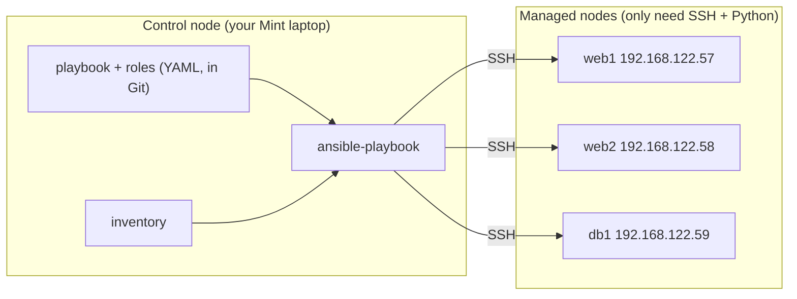
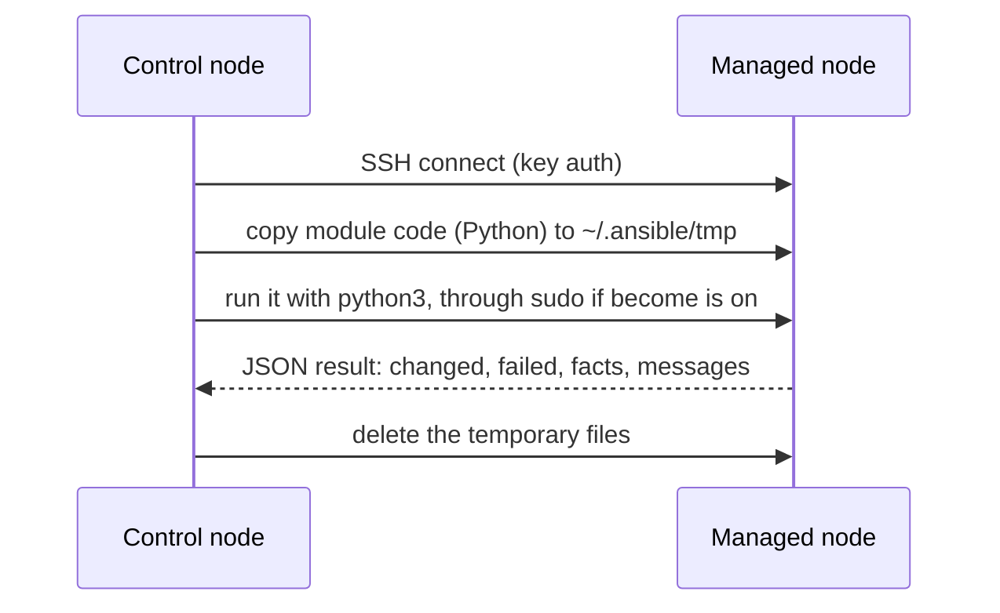

# Automation with Ansible

> **Level 6 · Chapter 8** · ⏱️ ~75 min read · Prerequisites: [SSH](../04-sysadmin/05-ssh.md), [systemd and journalctl](../04-sysadmin/01-systemd-and-journalctl.md), [Firewalls with ufw](../04-sysadmin/04-firewall-ufw.md), [Virtualization](06-virtualization.md)

This chapter turns the server you built by hand in Level 4 into code. You will learn why infrastructure as code and idempotency matter, how Ansible works over plain SSH, and how to write inventories, ad-hoc commands, playbooks, handlers, templates, roles, and encrypted secrets. It ends with a playbook that rebuilds the whole Level 4 capstone server from scratch in a few minutes.

## Why it matters

For the Level 4 capstone you spent an evening setting up a server: SSH hardening, `ufw`, an app user, a systemd service, and a backup timer. It worked. Three months later the VM's disk dies. You open your notes and find gaps. Did you set `MaxAuthTries`? Which port did the app use? What was in the backup script? You rebuild it from memory, and it comes out *almost* the same.

Now picture three servers built that way by three people over a year. Each one is slightly different. That is called **configuration drift**. A fix applied to one server is forgotten on the others. When something breaks at 2 a.m., nobody knows what "correct" looks like.

With Ansible, the server's configuration lives in a few text files in Git. Rebuilding is `ansible-playbook site.yml`, three minutes later you are done, and the result is identical every time. Need a second server? Add one line to the inventory. Want to know whether production still matches? Run with `--check --diff`, and Ansible lists every difference without changing anything.

## Concepts

### Infrastructure as code

**Infrastructure as code (IaC)** means describing servers, networks, and their configuration in files that a tool applies, instead of typing commands by hand. The files get the same treatment as application code:

- **Version control.** `git log` shows who changed the SSH config, when, and why.
- **Review.** Changes go through pull requests before they reach production.
- **Repeatability.** The same files produce the same server, today or in two years.
- **Documentation.** The code *is* the up-to-date description of the system.

You have already seen IaC on a small scale: a cloud-init `user-data` file in [Virtualization](06-virtualization.md), and a Dockerfile in [Docker and Podman](07-docker-and-podman.md). Ansible applies the idea to whole fleets of running servers.

### Idempotency

An operation is **idempotent** if running it once or many times gives the same result. This is the most important idea in configuration management.

Compare two ways to set a sysctl:

```bash
# not idempotent: every run appends another copy of the line
echo "vm.swappiness = 10" | sudo tee -a /etc/sysctl.d/99-tuning.conf

# idempotent: describe the desired state; a tool adds the line only if it is missing
#   lineinfile: path=/etc/sysctl.d/99-tuning.conf line="vm.swappiness = 10"
```

Run the first one five times and the file has five identical lines. The second checks first and changes the file only when needed.

Idempotency is what makes automation safe to re-run. You can apply the same playbook every hour and nothing happens unless something drifted. Then Ansible fixes exactly that, and reports it as `changed`.

Ansible modules are **declarative**: you describe the *desired state* ("nginx is installed", "this line is present", "this service is running and enabled"), not the *steps*. The module works out the steps. Shell scripts are **imperative**: they list steps, and making them idempotent is your job.

### How Ansible works

**Ansible** is an open-source automation tool written in Python. Its key design choice is that it is **agentless**: you install nothing special on the servers it manages. It needs only:

- **SSH access** to each server (with the keys you set up in [SSH](../04-sysadmin/05-ssh.md)), and
- **Python 3** on each server, which every Ubuntu and Mint install already has.

The machine where you install Ansible and run it is the **control node**. Your Mint laptop is a fine control node. The servers it configures are **managed nodes**. The list of managed nodes is the **inventory**.



When Ansible runs one task on one host, this happens:



A **module** is a small program that does one kind of job, such as installing a package, copying a file, or managing a service. It runs on the managed node, compares the current state with the desired state, makes changes only if needed, and reports back in JSON. Ansible ships thousands of modules in **collections**: `ansible.builtin` (always present), `ansible.posix`, `community.general`, and many more.

This is a **push** model: you run Ansible when you want changes, and it connects out to the servers. Tools like Puppet and Chef use a **pull** model, where an agent on each server fetches its configuration periodically.

### The vocabulary

| Term | Meaning |
|---|---|
| **Inventory** | The hosts Ansible manages, sorted into groups |
| **Module** | A unit of work, such as `apt`, `copy`, or `service` |
| **Task** | One call to a module with arguments, plus a human-readable `name` |
| **Play** | A list of tasks applied to a group of hosts |
| **Playbook** | A YAML file with one or more plays |
| **Handler** | A task that runs only when notified by a task that changed something, such as "restart nginx" |
| **Facts** | Information Ansible gathers about each host (OS, IPs, memory) at the start of a play |
| **Variables** | Named values that make playbooks reusable |
| **Template** | A file with Jinja2 placeholders, filled in per host |
| **Role** | A reusable bundle of tasks, handlers, templates, files, and defaults |
| **Become** | Privilege escalation, normally `sudo` |

### Where Ansible fits among other tools

| Tool | Job | Typical use |
|---|---|---|
| **cloud-init** | First-boot setup, run once inside a new VM | Create a user, add SSH keys, install the basics |
| **Terraform** / OpenTofu | **Provisioning**: create and destroy infrastructure through cloud APIs | VMs, networks, DNS records, load balancers |
| **Ansible** | **Configuration management**: configure what runs on existing machines | Packages, files, services, users, firewalls |
| **NixOS** | The whole OS defined declaratively in one config, rebuilt atomically | Fully reproducible machines, with rollback to any earlier generation |

A common real-world pipeline: Terraform creates VMs, cloud-init gives them a user and an SSH key, and Ansible configures everything else. Containers often take over the application layer, while Ansible prepares the hosts that run them.

## Commands and examples

!!! danger "⚠️ VM only"
    Ansible makes real changes as root on every host in your inventory, and a wrong host pattern can hit machines you didn't intend. Practice against throwaway VMs only. Never put your main machine in the inventory. Run Ansible *from* your Mint machine (the control node; installing Ansible there is safe), *against* VMs.

### Lab setup

You need one or two Ubuntu 24.04 VMs that you can reach with SSH as `alex` using a key, with passwordless `sudo`. The cloud-init method from [Virtualization](06-virtualization.md) gives you exactly that. This chapter assumes:

| Host | Address | Role |
|---|---|---|
| `web1` | `192.168.122.57` | Web server |
| `web2` | `192.168.122.58` | Web server |

Check that plain SSH works first (`ssh alex@192.168.122.57 true`). Ansible cannot fix a broken SSH setup.

### Installing Ansible

Two good options on the control node:

=== "apt (simplest)"

    ```bash
    sudo apt update
    sudo apt install ansible
    ```

    This installs the `ansible` package (version 9.x on Ubuntu 24.04), which includes `ansible-core` 2.16 and a set of popular collections such as `community.general` and `ansible.posix`. It is stable but not the newest.

=== "pipx (newest)"

    ```bash
    sudo apt install pipx
    pipx ensurepath
    pipx install --include-deps ansible
    ```

    **pipx** installs a Python application into its own private virtual environment and puts its commands on your `PATH`. `--include-deps` also exposes the commands of `ansible-core`, such as `ansible-playbook`. Upgrade later with `pipx upgrade --include-injected ansible`.

Check it:

```bash
ansible --version
```

```text
ansible [core 2.16.3]
  config file = None
  configured module search path = ['/home/alex/.ansible/plugins/modules', '/usr/share/ansible/plugins/modules']
  ansible python module location = /usr/lib/python3/dist-packages/ansible
  ansible collection location = /home/alex/.ansible/collections:/usr/share/ansible/collections
  executable location = /usr/bin/ansible
  python version = 3.12.3 (main, ...) [GCC 13.2.0] (/usr/bin/python3)
  jinja version = 3.1.2
  libyaml = True
```

`config file = None` means no `ansible.cfg` was found. You will add one next. Nothing is installed on the managed nodes.

### A project directory and ansible.cfg

Keep each Ansible project in its own directory, under Git:

```bash
mkdir -p ~/ansible-lab && cd ~/ansible-lab
git init
```

Ansible looks for `ansible.cfg` in the current directory first. A small one saves typing:

```ini
# ~/ansible-lab/ansible.cfg
[defaults]
inventory = inventory.ini
remote_user = alex
host_key_checking = True
callback_result_format = yaml
retry_files_enabled = False

[privilege_escalation]
become_method = sudo
```

`inventory` sets the default inventory file, so you don't need `-i` every time. `remote_user` is the SSH user. Keep `host_key_checking` on. Connect to each VM once with plain `ssh` to accept its host key, rather than disabling the check that protects you from man-in-the-middle attacks. `callback_result_format = yaml` prints task results as readable YAML instead of dense JSON.

### Inventory: INI and YAML

The **inventory** lists hosts and groups. The INI format is the most common:

```ini
# inventory.ini
[webservers]
web1 ansible_host=192.168.122.57
web2 ansible_host=192.168.122.58

[dbservers]
db1 ansible_host=192.168.122.59

[production:children]
webservers
dbservers
```

- `[webservers]` is a **group**. A host can be in several groups.
- `web1` is the inventory name Ansible uses in output. `ansible_host` is the address it actually connects to. You could also write plain IPs or DNS names.
- `[production:children]` makes a group of groups.
- Two groups always exist: `all` (every host) and `ungrouped`.

The same inventory in YAML, which scales better once you have many variables:

```yaml
# inventory.yml
all:
  children:
    webservers:
      hosts:
        web1:
          ansible_host: 192.168.122.57
        web2:
          ansible_host: 192.168.122.58
    dbservers:
      hosts:
        db1:
          ansible_host: 192.168.122.59
    production:
      children:
        webservers:
        dbservers:
```

Check how Ansible understands it:

```bash
ansible-inventory --graph
```

```text
@all:
  |--@ungrouped:
  |--@production:
  |  |--@webservers:
  |  |  |--web1
  |  |  |--web2
  |  |--@dbservers:
  |  |  |--db1
```

For the rest of this chapter, the lab inventory has only `web1` and `web2` in `webservers`.

#### host_vars and group_vars

Don't cram variables into the inventory file. Ansible automatically loads YAML files from two directories next to the inventory (or the playbook):

```text
ansible-lab/
├── ansible.cfg
├── inventory.ini
├── group_vars/
│   ├── all.yml              # every host
│   └── webservers.yml       # hosts in [webservers]
└── host_vars/
    └── web1.yml             # only web1
```

```yaml
# group_vars/webservers.yml
webapp_port: 8080
admin_users: [alex]
```

```yaml
# host_vars/web1.yml
webapp_greeting: "Hello from the first web server"
```

A more specific level wins: `host_vars` beats `group_vars/webservers.yml`, which beats `group_vars/all.yml`. A file can also be a directory of files (`group_vars/webservers/vars.yml`, `group_vars/webservers/vault.yml`), which you will use for secrets.

### Ad-hoc commands

An **ad-hoc command** runs one module against hosts from the command line, with no playbook. It is good for quick checks and one-off jobs. The form is `ansible <pattern> -m <module> -a "<arguments>"`.

The first test is always `ping`. It is not ICMP ping: it checks that Ansible can SSH in and run Python.

```bash
ansible all -m ping
```

```text
web1 | SUCCESS => {
    "ansible_facts": {
        "discovered_interpreter_python": "/usr/bin/python3"
    },
    "changed": false,
    "ping": "pong"
}
web2 | SUCCESS => {
    "ansible_facts": {
        "discovered_interpreter_python": "/usr/bin/python3"
    },
    "changed": false,
    "ping": "pong"
}
```

Hosts run **in parallel** (5 at a time by default; change it with `-f 20`), so output order varies.

Run a command (the default module is `command`, so `-m command` is optional):

```bash
ansible webservers -a "uptime"
```

```text
web1 | CHANGED | rc=0 >>
 10:41:07 up  2:13,  1 user,  load average: 0.00, 0.01, 0.00
web2 | CHANGED | rc=0 >>
 10:41:07 up  2:12,  1 user,  load average: 0.08, 0.03, 0.01
```

`CHANGED` appears because Ansible cannot know what an arbitrary command did, so it assumes the worst. That is one reason to prefer real modules over `command` and `shell`.

Install a package. That needs root, so add `-b` (**become**, which uses `sudo` on the managed node):

```bash
ansible webservers -b -m apt -a "name=htop state=present update_cache=true"
```

```text
web1 | CHANGED => {
    "cache_update_time": 1759401667,
    "cache_updated": true,
    "changed": true,
    ...
}
```

Run it again: now it says `SUCCESS` with `"changed": false`, because htop is already present. That is idempotency in action. If your `sudo` asks for a password, add `-K` (`--ask-become-pass`).

More useful ad-hoc commands:

```bash
ansible web1 -m setup -a "filter=ansible_distribution*"    # facts
ansible webservers -b -m service -a "name=cron state=restarted"
ansible webservers -m shell -a "df -h / | tail -1"         # shell allows pipes
ansible 'webservers:!web2' -m ping                          # pattern: all webservers except web2
```

```text
web1 | SUCCESS => {
    "ansible_facts": {
        "ansible_distribution": "Ubuntu",
        "ansible_distribution_file_parsed": true,
        "ansible_distribution_file_path": "/etc/os-release",
        "ansible_distribution_file_variety": "Debian",
        "ansible_distribution_major_version": "24",
        "ansible_distribution_release": "noble",
        "ansible_distribution_version": "24.04"
    },
    "changed": false
}
```

### Your first playbook

A **playbook** is a YAML file. Here is one play with three tasks:

```yaml
# nginx.yml
- name: Install and run nginx
  hosts: webservers
  become: true

  tasks:
    - name: Install nginx
      ansible.builtin.apt:
        name: nginx
        state: present
        update_cache: true
        cache_valid_time: 3600

    - name: Deploy a home page
      ansible.builtin.copy:
        content: "<h1>Managed by Ansible on {{ inventory_hostname }}</h1>\n"
        dest: /var/www/html/index.html
        owner: root
        group: root
        mode: "0644"

    - name: Ensure nginx is running and enabled at boot
      ansible.builtin.service:
        name: nginx
        state: started
        enabled: true
```

Reading it:

- The top level is a list of plays (`- name: ...`). This file has one.
- `hosts: webservers` targets that inventory group. `become: true` runs every task with `sudo`.
- Each task has a `name` (shown in output) and one module, written by its **fully qualified collection name (FQCN)**: `ansible.builtin.apt`. The short name `apt` also works, but FQCNs avoid ambiguity and `ansible-lint` asks for them.
- `cache_valid_time: 3600` skips `apt update` if the cache is less than an hour old, which keeps re-runs fast.
- `{{ inventory_hostname }}` is a Jinja2 expression. Ansible fills in the host's inventory name.
- `mode: "0644"` is quoted. Unquoted, YAML would read `0644` as the octal number 420 and pass that on, which is a classic source of wrong permissions.

Run it:

```bash
ansible-playbook nginx.yml
```

```text
PLAY [Install and run nginx] ***************************************************

TASK [Gathering Facts] *********************************************************
ok: [web1]
ok: [web2]

TASK [Install nginx] ***********************************************************
changed: [web1]
changed: [web2]

TASK [Deploy a home page] ******************************************************
changed: [web1]
changed: [web2]

TASK [Ensure nginx is running and enabled at boot] *****************************
ok: [web1]
ok: [web2]

PLAY RECAP *********************************************************************
web1                       : ok=4    changed=2    unreachable=0    failed=0    skipped=0    rescued=0    ignored=0
web2                       : ok=4    changed=2    unreachable=0    failed=0    skipped=0    rescued=0    ignored=0
```

`ok` means "already in the desired state". `changed` means "Ansible changed something". The service task says `ok` because installing nginx on Ubuntu already starts and enables it. Run the playbook a second time:

```text
PLAY RECAP *********************************************************************
web1                       : ok=4    changed=0    unreachable=0    failed=0    skipped=0    rescued=0    ignored=0
web2                       : ok=4    changed=0    unreachable=0    failed=0    skipped=0    rescued=0    ignored=0
```

`changed=0` is the goal of every second run. If a second run reports changes, something in the playbook is not idempotent.

Useful flags: `--limit web1` runs on a subset, `--start-at-task "Deploy a home page"` resumes after a failure, `-v`/`-vvv` gives more detail (`-vvvv` shows SSH debugging), and `--list-tasks` and `--list-hosts` preview a run.

### The modules you will use most

| Module | Desired state it manages | Example arguments |
|---|---|---|
| `ansible.builtin.apt` | Packages | `name: [nginx, git]`, `state: present`/`absent`/`latest` |
| `ansible.builtin.copy` | A file with fixed content | `src: files/app.py` or `content: ...`, `dest`, `owner`, `mode` |
| `ansible.builtin.template` | A file rendered from a Jinja2 template | `src: sshd.conf.j2`, `dest`, `mode`, `validate` |
| `ansible.builtin.file` | Directories, symlinks, permissions, deletion | `path`, `state: directory`/`link`/`absent`/`touch`, `mode` |
| `ansible.builtin.lineinfile` | One line in an existing file | `path`, `regexp`, `line` |
| `ansible.builtin.user` | Users | `name`, `system: true`, `shell`, `groups`, `append: true` |
| `ansible.builtin.service` | Service state (works with any init system) | `name`, `state: started`/`restarted`/`reloaded`, `enabled` |
| `ansible.builtin.systemd_service` | systemd specifics | as `service`, plus `daemon_reload: true` |
| `community.general.ufw` | ufw rules and state | `rule: allow`, `port: "22"`, `proto: tcp`, `state: enabled` |
| `ansible.posix.authorized_key` | SSH public keys | `user`, `key` |
| `ansible.builtin.command` / `shell` | Run anything (last resort) | `cmd`, `creates:` to make it idempotent |

`ansible-doc ansible.builtin.lineinfile` shows full documentation with examples, offline. `ansible-doc -l | wc -l` shows how many modules you have installed.

A `lineinfile` example. Its `regexp` finds an existing line to replace, so re-runs don't add duplicates:

```yaml
- name: Lower swappiness
  ansible.builtin.lineinfile:
    path: /etc/sysctl.d/99-tuning.conf
    regexp: '^vm\.swappiness'
    line: "vm.swappiness = 10"
    create: true
    mode: "0644"
```

!!! warning "Common mistake"
    Reaching for `shell` first: `shell: echo "vm.swappiness = 10" >> /etc/sysctl.d/99-tuning.conf`. It always reports `changed` and appends a duplicate on every run. When you truly need `command` or `shell`, add `creates: /path` (skip the task if the file exists) or `changed_when:` so it stays honest.

### Handlers

Some actions should happen only *when something changed*. Restarting nginx after every run would cause needless blips. Restarting it after its config changed is required. A **handler** is a task that runs only when another task **notifies** it *and* that task reported `changed`. Handlers run once, at the end of the play, even if notified several times.

```yaml
- name: Configure nginx
  hosts: webservers
  become: true

  tasks:
    - name: Deploy nginx site config
      ansible.builtin.template:
        src: templates/site.conf.j2
        dest: /etc/nginx/sites-available/default
        mode: "0644"
        validate: nginx -t -c /etc/nginx/nginx.conf
      notify: Reload nginx

  handlers:
    - name: Reload nginx
      ansible.builtin.service:
        name: nginx
        state: reloaded
```

`validate` tests the new file *before* it replaces the old one. Here it runs `nginx -t` against the main config. If validation fails, the task fails and the old config stays in place. Unchanged config means no notification, so there is no reload.

```text
TASK [Deploy nginx site config] ************************************************
changed: [web1]
ok: [web2]

RUNNING HANDLER [Reload nginx] *************************************************
changed: [web1]
```

Only `web1`'s config changed, so only `web1` reloads.

### Variables and facts

**Variables** can be defined in many places: inventory, `group_vars`/`host_vars`, a play's `vars:`, a role's `defaults/`, the command line (`-e webapp_port=9000`, which beats everything), and more. The full precedence list has over 20 levels. In practice, remember three rules: role defaults are the weakest, `host_vars` beats `group_vars`, and `-e` wins.

**Facts** are variables Ansible discovers on each host during "Gathering Facts", using the `setup` module. They live under `ansible_facts`:

```yaml
- name: Show some facts
  hosts: webservers
  tasks:
    - name: Print OS, memory, and main IP
      ansible.builtin.debug:
        msg: >-
          {{ inventory_hostname }} runs {{ ansible_facts['distribution'] }}
          {{ ansible_facts['distribution_version'] }} with
          {{ ansible_facts['memtotal_mb'] }} MB RAM at
          {{ ansible_facts['default_ipv4']['address'] }}
```

```text
TASK [Print OS, memory, and main IP] *******************************************
ok: [web1] =>
  msg: web1 runs Ubuntu 24.04 with 1967 MB RAM at 192.168.122.57
ok: [web2] =>
  msg: web2 runs Ubuntu 24.04 with 1967 MB RAM at 192.168.122.58
```

You can also capture a task's result with **`register`** and use it later:

```yaml
- name: Check whether a reboot is required
  ansible.builtin.stat:
    path: /var/run/reboot-required
  register: reboot_flag

- name: Reboot if the kernel was updated
  ansible.builtin.reboot:
  when: reboot_flag.stat.exists
```

### Jinja2 templates

**Jinja2** is the templating language Ansible uses everywhere: in `{{ }}` expressions in playbooks and in template files. A template file (by convention ending in `.j2`) is rendered on the control node with the host's variables, then copied to the host.

```jinja
{# templates/sshd-hardening.conf.j2 - this comment is not copied #}
# Managed by Ansible. Manual changes will be overwritten.
PermitRootLogin no
PasswordAuthentication no
KbdInteractiveAuthentication no
MaxAuthTries {{ ssh_max_auth_tries | default(3) }}
AllowUsers {{ admin_users | join(' ') }}

Port {{ ssh_port }}

```

The syntax:

- `{{ expression }}` prints a value.
- `` is logic: `if`, `for`, and so on.
- `{# ... #}` is a comment.
- `|` applies a **filter**: `default(3)` gives a fallback, and `join(' ')` turns a list into a string. Others you'll use: `upper`, `lower`, `int`, `bool`, `to_nice_yaml`, `password_hash('sha512')`, `regex_replace`.

With `admin_users: [alex]`, web1 gets:

```text
# Managed by Ansible. Manual changes will be overwritten.
PermitRootLogin no
PasswordAuthentication no
KbdInteractiveAuthentication no
MaxAuthTries 3
AllowUsers alex
```

The "Managed by Ansible" header warns anyone editing the file on the server that their change will be overwritten on the next run.

### Loops and conditionals

`loop` repeats a task for each item, available as `item`:

```yaml
- name: Create admin users
  ansible.builtin.user:
    name: "{{ item.name }}"
    groups: sudo
    append: true
    shell: /bin/bash
  loop:
    - { name: alex }
    - { name: sam }

- name: Install base tools
  ansible.builtin.apt:
    name: [git, curl, htop, jq]
    state: present
```

The second task needs no loop: `apt` accepts a list and installs everything in one transaction, which is much faster than a loop.

`when` runs a task only if a condition is true. It takes a raw Jinja2 expression, with no `{{ }}`:

```yaml
- name: Install unattended-upgrades on Debian-family systems only
  ansible.builtin.apt:
    name: unattended-upgrades
    state: present
  when: ansible_facts['os_family'] == "Debian"

- name: Warn about low memory
  ansible.builtin.debug:
    msg: "{{ inventory_hostname }} has under 1 GB RAM"
  when: ansible_facts['memtotal_mb'] < 1024
```

### Roles

As playbooks grow, you split them into **roles**. A role is a directory with a fixed layout that Ansible understands. `ansible-galaxy role init` creates the skeleton:

```bash
ansible-galaxy role init --init-path roles webapp
```

```text
- Role webapp was created successfully
```

```text
roles/webapp/
├── defaults/main.yml     # default variables (lowest precedence; meant to be overridden)
├── files/                # static files for copy
├── handlers/main.yml     # handlers
├── meta/main.yml         # metadata and role dependencies
├── tasks/main.yml        # the task list (entry point)
├── templates/            # Jinja2 templates
├── tests/                # sample inventory and playbook
├── vars/main.yml         # role variables (high precedence; not meant to be overridden)
└── README.md
```

Inside a role, `copy: src=app.py` looks in the role's `files/` automatically, and `template: src=x.j2` looks in its `templates/`. Delete the directories you don't use. A playbook then simply lists roles:

```yaml
- name: Web servers
  hosts: webservers
  become: true
  roles:
    - ssh_hardening
    - webapp
```

Roles are how you share and reuse automation. **Ansible Galaxy** (`galaxy.ansible.com`) hosts thousands of community roles and collections, installable with `ansible-galaxy install` and `ansible-galaxy collection install`. Read a community role's code before you run it as root on your servers.

### Secrets with ansible-vault

Playbooks live in Git, so passwords and API tokens must not be stored in plain text. **ansible-vault** encrypts files (or single values) with AES-256 using a password. Ansible decrypts them in memory at run time.

The common layout keeps plain variables and secrets side by side, and makes the secrets visible by name:

```text
group_vars/webservers/
├── vars.yml      # plain:     webapp_api_token: "{{ vault_webapp_api_token }}"
└── vault.yml     # encrypted: vault_webapp_api_token: s3cr3t...
```

Create the encrypted file:

```bash
ansible-vault create group_vars/webservers/vault.yml
```

```text
New Vault password:
Confirm New Vault password:
```

Your editor opens. Type the secret as normal YAML:

```yaml
vault_webapp_api_token: "tok_9f8e7d6c5b4a"
```

On disk it is now ciphertext, safe to commit:

```bash
head -3 group_vars/webservers/vault.yml
```

```text
$ANSIBLE_VAULT;1.1;AES256
62313365396662343061393464336163383764373764613633653634306231386433626264366566
6430366263323530316565653961643031346265636162350a646130613234663337346662306562
```

The `vars.yml` indirection (`webapp_api_token: "{{ vault_webapp_api_token }}"`) means `grep -r webapp_api_token` still finds where a variable comes from, even though its value is encrypted.

Other vault commands:

```bash
ansible-vault view group_vars/webservers/vault.yml     # decrypt to the screen
ansible-vault edit group_vars/webservers/vault.yml     # decrypt, edit, re-encrypt
ansible-vault rekey group_vars/webservers/vault.yml    # change the password
ansible-vault encrypt_string 'tok_9f8e7d6c5b4a' --name 'vault_webapp_api_token'
```

`encrypt_string` prints an inline encrypted value you can paste into any YAML file:

```text
vault_webapp_api_token: !vault |
          $ANSIBLE_VAULT;1.1;AES256
          38613931633962353764353438613735663436363337613338613935356432616566383233
          ...
Encryption successful
```

Run playbooks with `--ask-vault-pass`, or point to a password file kept *outside* the repository: `--vault-password-file ~/.ansible-vault-pass` (with `chmod 600`). Add `no_log: true` to tasks that handle secrets, so values don't appear in output or logs.

### Dry runs: --check and --diff

`--check` runs the playbook in **check mode**: each module reports what it *would* change, without changing anything. `--diff` shows the line-by-line difference for files. Together they answer "what will this playbook do to production?":

```bash
ansible-playbook site.yml --check --diff --limit web1
```

```text
TASK [ssh_hardening : Deploy sshd hardening drop-in] ***************************
--- before: /etc/ssh/sshd_config.d/10-hardening.conf
+++ after: /home/alex/.ansible/tmp/ansible-local-51893x2k/tmpq1w8/sshd-hardening.conf.j2
@@ -2,5 +2,5 @@
 PermitRootLogin no
 PasswordAuthentication no
 KbdInteractiveAuthentication no
-MaxAuthTries 6
+MaxAuthTries 3
 AllowUsers alex

changed: [web1]
```

Someone changed `MaxAuthTries` by hand on the server. The playbook would put it back. Running `--check --diff` on a schedule is a simple **drift detector**.

!!! warning "Common mistake"
    Check mode is a simulation. Tasks that depend on an earlier change (for example, starting a service whose package is not yet installed) may fail or mislead in check mode, and `command`/`shell` tasks are skipped entirely. Treat `--check` as a strong hint, not a guarantee. Always do the real run against a VM before production.

### ansible-lint

**ansible-lint** checks playbooks and roles for bugs, deprecated syntax, and bad practice. It is the `shellcheck` of Ansible. Install it with `sudo apt install ansible-lint` or `pipx install ansible-lint`, then run it in the project directory:

```bash
ansible-lint
```

```text
WARNING  Listing 2 violation(s) that are fatal
name[missing]: All tasks should be named.
roles/webapp/tasks/main.yml:12 Task/Handler: ansible.builtin.copy src=app.py dest=/opt/webapp/app.py

no-changed-when: Commands should not change things if nothing needs doing.
site.yml:20 Task/Handler: Show uptime

Read documentation for instructions on how to ignore specific rule violations.

                  Rule Violation Summary
 count tag              profile rule associated tags
     1 name[missing]    basic   idiom
     1 no-changed-when  shared  command-shell, idempotency

Failed: 2 failure(s), 0 warning(s) on 14 files.
```

Fix each one. A task without a name makes output unreadable. A `command` without `changed_when` lies about changes. Run `ansible-playbook site.yml --syntax-check` for a quick parse check, and `ansible-lint` before every commit.

### The capstone as code: rebuilding the Level 4 server

Now the payoff. This project rebuilds the Level 4 capstone server on a fresh Ubuntu 24.04 VM. Your own capstone may differ in details (app, ports, paths). Adapt the variables. It sets up:

1. **SSH hardening**: key-only logins, no root login, limited users, with the config validated before it is applied.
2. **Firewall**: `ufw` with default deny incoming, SSH rate-limited, and the app port open.
3. **App user and app**: a system user `webapp` and a small Python web app.
4. **systemd service**: the app as a sandboxed service that restarts on failure.
5. **Backups**: a nightly `systemd` timer that archives the app's data and deletes old archives.

Layout:

```text
capstone/
├── ansible.cfg
├── inventory.ini
├── site.yml
├── group_vars/
│   └── webservers/
│       ├── vars.yml
│       └── vault.yml              # encrypted
└── roles/
    ├── ssh_hardening/
    │   ├── handlers/main.yml
    │   ├── tasks/main.yml
    │   └── templates/sshd-hardening.conf.j2   (shown in the Jinja2 section)
    ├── firewall/
    │   └── tasks/main.yml
    ├── webapp/
    │   ├── files/app.py
    │   ├── handlers/main.yml
    │   ├── tasks/main.yml
    │   └── templates/
    │       ├── webapp.env.j2
    │       └── webapp.service.j2
    └── backup/
        ├── tasks/main.yml
        └── templates/
            ├── backup-webapp.sh.j2
            ├── backup-webapp.service.j2
            └── backup-webapp.timer.j2
```

`ansible.cfg` and `inventory.ini` are as shown earlier (the inventory needs only the `[webservers]` group). `site.yml` ties the roles together:

```yaml
# site.yml
- name: Rebuild the Level 4 capstone server
  hosts: webservers
  become: true

  pre_tasks:
    - name: Update the apt cache and install base packages
      ansible.builtin.apt:
        name: [python3, ufw, tar, unattended-upgrades]
        state: present
        update_cache: true
        cache_valid_time: 3600

  roles:
    - ssh_hardening
    - firewall
    - webapp
    - backup
```

`pre_tasks` run before the roles. Roles run in the order listed.

**Variables.** `group_vars/webservers/vars.yml`:

```yaml
admin_users: [alex]
ssh_max_auth_tries: 3

webapp_user: webapp
webapp_port: 8080
webapp_greeting: "Hello from the capstone server"
webapp_api_token: "{{ vault_webapp_api_token }}"

backup_dir: /var/backups/webapp
backup_keep_days: 14
backup_time: "*-*-* 02:30:00"
```

`group_vars/webservers/vault.yml` (create it with `ansible-vault create`):

```yaml
vault_webapp_api_token: "tok_9f8e7d6c5b4a"
```

**Role `ssh_hardening`.** `roles/ssh_hardening/tasks/main.yml`:

```yaml
- name: Ensure admin users have their SSH keys
  ansible.posix.authorized_key:
    user: "{{ item }}"
    key: "{{ lookup('ansible.builtin.file', '~/.ssh/id_ed25519.pub') }}"
  loop: "{{ admin_users }}"

- name: Deploy sshd hardening drop-in
  ansible.builtin.template:
    src: sshd-hardening.conf.j2
    dest: /etc/ssh/sshd_config.d/10-hardening.conf
    owner: root
    group: root
    mode: "0644"
    validate: /usr/sbin/sshd -t -f %s
  notify: Reload ssh
```

`roles/ssh_hardening/handlers/main.yml`:

```yaml
- name: Reload ssh
  ansible.builtin.service:
    name: ssh
    state: reloaded
```

The key task runs *first*, so you can't lock yourself out by disabling passwords before your key is in place. The `lookup` reads your public key on the control node. `validate` runs `sshd -t` on the rendered file (`%s` is its temporary path) before installing it. A syntax error fails the task instead of breaking SSH. The file is a drop-in in `/etc/ssh/sshd_config.d/`, which Ubuntu's main `sshd_config` includes at the top. For sshd, the *first* value it reads wins, so the low number `10-` beats later files such as the cloud image's `60-cloudimg-settings.conf`. Reloading keeps your current session alive.

**Role `firewall`.** `roles/firewall/tasks/main.yml`:

```yaml
- name: Rate-limit SSH (allow it before enabling the firewall)
  community.general.ufw:
    rule: limit
    port: "22"
    proto: tcp

- name: Allow the web app port
  community.general.ufw:
    rule: allow
    port: "{{ webapp_port | string }}"
    proto: tcp

- name: Deny incoming by default and enable ufw
  community.general.ufw:
    state: enabled
    direction: incoming
    policy: deny
```

Order is the safety mechanism: the SSH rule exists before the firewall is switched on. `rule: limit` is ufw's built-in rate limit (more than 6 connections in 30 seconds from one address gets denied), as covered in [Firewalls with ufw](../04-sysadmin/04-firewall-ufw.md).

**Role `webapp`.** The app, `roles/webapp/files/app.py`, uses only the Python standard library:

```python
#!/usr/bin/env python3
"""Tiny demo web app: counts hits in its state directory."""
import argparse
import os
from http.server import BaseHTTPRequestHandler, ThreadingHTTPServer
from pathlib import Path

STATE = Path(os.environ.get("STATE_DIRECTORY", "/var/lib/webapp")) / "hits.log"
GREETING = os.environ.get("WEBAPP_GREETING", "Hello")


class Handler(BaseHTTPRequestHandler):
    def do_GET(self):
        with STATE.open("a") as f:
            f.write(self.client_address[0] + "\n")
        with STATE.open() as f:
            hits = sum(1 for _ in f)
        body = f"{GREETING}! Hits so far: {hits}\n".encode()
        self.send_response(200)
        self.send_header("Content-Type", "text/plain")
        self.send_header("Content-Length", str(len(body)))
        self.end_headers()
        self.wfile.write(body)


if __name__ == "__main__":
    parser = argparse.ArgumentParser()
    parser.add_argument("--port", type=int, default=8000)
    args = parser.parse_args()
    ThreadingHTTPServer(("0.0.0.0", args.port), Handler).serve_forever()
```

`roles/webapp/templates/webapp.env.j2`, the environment file. It holds the secret, so only root may read it:

```jinja
# Managed by Ansible.
WEBAPP_GREETING={{ webapp_greeting }}
WEBAPP_API_TOKEN={{ webapp_api_token }}
```

`roles/webapp/templates/webapp.service.j2`, the unit, with the sandboxing options from [Your program as a service](../05-programming/05-services-with-systemd.md):

```jinja
# Managed by Ansible.
[Unit]
Description=Capstone demo web app
After=network-online.target
Wants=network-online.target

[Service]
User={{ webapp_user }}
Group={{ webapp_user }}
EnvironmentFile=/etc/webapp/env
ExecStart=/usr/bin/python3 /opt/webapp/app.py --port {{ webapp_port }}
StateDirectory=webapp
Restart=on-failure
RestartSec=2
NoNewPrivileges=yes
ProtectSystem=strict
ProtectHome=yes
PrivateTmp=yes

[Install]
WantedBy=multi-user.target
```

`StateDirectory=webapp` makes systemd create `/var/lib/webapp`, owned by the service user, and pass its path in `$STATE_DIRECTORY`. `ProtectSystem=strict` makes the rest of the filesystem read-only for the app.

`roles/webapp/tasks/main.yml`:

```yaml
- name: Create the app's system user
  ansible.builtin.user:
    name: "{{ webapp_user }}"
    system: true
    shell: /usr/sbin/nologin
    create_home: false

- name: Create app and config directories
  ansible.builtin.file:
    path: "{{ item.path }}"
    state: directory
    owner: root
    group: root
    mode: "{{ item.mode }}"
  loop:
    - { path: /opt/webapp, mode: "0755" }
    - { path: /etc/webapp, mode: "0700" }

- name: Install the application code
  ansible.builtin.copy:
    src: app.py
    dest: /opt/webapp/app.py
    owner: root
    group: root
    mode: "0755"
  notify: Restart webapp

- name: Install the environment file (contains a secret)
  ansible.builtin.template:
    src: webapp.env.j2
    dest: /etc/webapp/env
    owner: root
    group: root
    mode: "0600"
  no_log: true
  notify: Restart webapp

- name: Install the systemd unit
  ansible.builtin.template:
    src: webapp.service.j2
    dest: /etc/systemd/system/webapp.service
    mode: "0644"
  notify: Restart webapp

- name: Enable and start the service
  ansible.builtin.systemd_service:
    name: webapp
    state: started
    enabled: true
    daemon_reload: true
```

`roles/webapp/handlers/main.yml`:

```yaml
- name: Restart webapp
  ansible.builtin.systemd_service:
    name: webapp
    state: restarted
    daemon_reload: true
```

The code is owned by root, so the `webapp` user can run it but not change it. The env file is readable only by root (`0600`). That is enough, because systemd reads `EnvironmentFile=` as root before it switches to the `webapp` user. The app receives the values as environment variables but cannot read the file itself. `no_log: true` keeps the token out of Ansible's output. Three tasks notify the same handler, but it runs once.

**Role `backup`.** `roles/backup/templates/backup-webapp.sh.j2`:

```jinja
#!/usr/bin/env bash
# Managed by Ansible. Nightly backup of the web app's state.
set -euo pipefail

dest="{{ backup_dir }}"
stamp=$(date +%Y-%m-%d_%H%M%S)

tar -czf "$dest/webapp-$stamp.tar.gz" -C /var/lib webapp
find "$dest" -name 'webapp-*.tar.gz' -mtime +{{ backup_keep_days }} -delete
echo "backup written: $dest/webapp-$stamp.tar.gz"
```

`roles/backup/templates/backup-webapp.service.j2`:

```jinja
# Managed by Ansible.
[Unit]
Description=Back up the web app's state

[Service]
Type=oneshot
ExecStart=/usr/local/sbin/backup-webapp
```

`roles/backup/templates/backup-webapp.timer.j2`:

```jinja
# Managed by Ansible.
[Unit]
Description=Nightly web app backup

[Timer]
OnCalendar={{ backup_time }}
Persistent=true
RandomizedDelaySec=15m

[Install]
WantedBy=timers.target
```

`roles/backup/tasks/main.yml`:

```yaml
- name: Create the backup directory
  ansible.builtin.file:
    path: "{{ backup_dir }}"
    state: directory
    owner: root
    group: root
    mode: "0700"

- name: Install the backup script
  ansible.builtin.template:
    src: backup-webapp.sh.j2
    dest: /usr/local/sbin/backup-webapp
    mode: "0750"

- name: Install the backup service and timer units
  ansible.builtin.template:
    src: "{{ item }}.j2"
    dest: "/etc/systemd/system/{{ item }}"
    mode: "0644"
  loop:
    - backup-webapp.service
    - backup-webapp.timer

- name: Enable and start the timer
  ansible.builtin.systemd_service:
    name: backup-webapp.timer
    state: started
    enabled: true
    daemon_reload: true
```

Only the *timer* is enabled. The service is started by the timer. `Persistent=true` runs a missed backup at the next boot if the server was off at 02:30. `RandomizedDelaySec` spreads the load when many servers share the schedule. These are the same choices as in Level 4, now written down forever.

**Run it** against a fresh VM:

```bash
cd ~/capstone
ansible-lint
ansible-playbook site.yml --syntax-check
ansible-playbook site.yml --ask-vault-pass
```

```text
PLAY [Rebuild the Level 4 capstone server] *************************************

TASK [Gathering Facts] *********************************************************
ok: [web1]

TASK [Update the apt cache and install base packages] **************************
changed: [web1]

TASK [ssh_hardening : Ensure admin users have their SSH keys] ******************
ok: [web1] => (item=alex)

TASK [ssh_hardening : Deploy sshd hardening drop-in] ***************************
changed: [web1]

TASK [firewall : Rate-limit SSH (allow it before enabling the firewall)] *******
changed: [web1]
...
TASK [backup : Enable and start the timer] *************************************
changed: [web1]

RUNNING HANDLER [ssh_hardening : Reload ssh] ***********************************
changed: [web1]

RUNNING HANDLER [webapp : Restart webapp] **************************************
changed: [web1]

PLAY RECAP *********************************************************************
web1                       : ok=19   changed=17   unreachable=0    failed=0    skipped=0    rescued=0    ignored=0
```

Verify it the way you verified the capstone by hand, but across every server at once:

```bash
curl -s http://192.168.122.57:8080/
ansible webservers -b -a "ufw status"
ansible webservers -b -a "systemctl list-timers backup-webapp.timer --no-pager"
ansible webservers -b -a "sshd -T" | grep -E 'passwordauthentication|permitrootlogin|maxauthtries'
```

```text
Hello from the capstone server! Hits so far: 1
...
passwordauthentication no
permitrootlogin no
maxauthtries 3
```

Run the playbook again and the recap must show `changed=0`. Then destroy the VM, create a fresh one, and run it again. You get the same server. That is the whole point.

## Exercises

### Exercise 1: Inventory and ad-hoc commands (easy)

⚠️ VM only (managed nodes). Write `inventory.ini` with your two lab VMs in a group `lab`, plus an `ansible.cfg` that points at it. Using only ad-hoc commands: ping both, show each host's kernel version, install `tree` on both with become, and show the free memory on `web2` only.

??? success "Solution"

    ```ini
    # inventory.ini
    [lab]
    web1 ansible_host=192.168.122.57
    web2 ansible_host=192.168.122.58
    ```

    ```ini
    # ansible.cfg
    [defaults]
    inventory = inventory.ini
    remote_user = alex
    ```

    ```bash
    ansible lab -m ping
    ansible lab -a "uname -r"
    ansible lab -b -m apt -a "name=tree state=present update_cache=true"
    ansible web2 -a "free -h"
    ```

    The kernel version could also come from facts: `ansible lab -m setup -a "filter=ansible_kernel"`. Run the `apt` command twice: the second run reports `SUCCESS` and `"changed": false`.

### Exercise 2: Make a script idempotent (easy)

⚠️ VM only. This shell snippet is run on every server after provisioning. Rewrite it as a playbook that reports `changed=0` on its second run:

```bash
apt-get install -y chrony
echo "Europe/Berlin" > /etc/timezone
echo "alias ll='ls -alF'" >> /etc/bash.bashrc
mkdir /srv/data
chmod 775 /srv/data
```

??? success "Solution"

    ```yaml
    - name: Post-provisioning basics
      hosts: lab
      become: true
      tasks:
        - name: Install chrony
          ansible.builtin.apt:
            name: chrony
            state: present
            update_cache: true
            cache_valid_time: 3600

        - name: Set the timezone
          community.general.timezone:
            name: Europe/Berlin

        - name: Add the ll alias once
          ansible.builtin.lineinfile:
            path: /etc/bash.bashrc
            regexp: "^alias ll="
            line: "alias ll='ls -alF'"

        - name: Create /srv/data
          ansible.builtin.file:
            path: /srv/data
            state: directory
            mode: "0775"
    ```

    The original fails on its second run (`mkdir` errors because the directory exists) and appends duplicate aliases. On Ubuntu, writing `/etc/timezone` alone also doesn't change the active timezone. The `timezone` module does it properly through `timedatectl`. Each module checks the current state first, so the second run reports `changed=0`.

### Exercise 3: A template with a loop and a handler (medium)

⚠️ VM only. Install nginx on both VMs and deploy `/var/www/html/index.html` from a Jinja2 template. It must show the host's inventory name, its OS version from facts, and an HTML list of team members from a variable `team: [alex, sam, priya]` defined in `group_vars/lab.yml`. Also deploy `/etc/nginx/conf.d/status.conf` with a `server_tokens off;` line, which must reload nginx through a handler only when it changes. Prove the handler doesn't fire on the second run.

??? success "Solution"

    `templates/index.html.j2`:

    ```jinja
    <h1>{{ inventory_hostname }}</h1>
    <p>Running {{ ansible_facts['distribution'] }} {{ ansible_facts['distribution_version'] }}</p>
    <ul>
    
      <li>{{ person }}</li>
    
    </ul>
    ```

    `web.yml`:

    ```yaml
    - name: Web servers with a templated page
      hosts: lab
      become: true
      tasks:
        - name: Install nginx
          ansible.builtin.apt:
            name: nginx
            state: present
            update_cache: true
            cache_valid_time: 3600

        - name: Deploy the home page
          ansible.builtin.template:
            src: templates/index.html.j2
            dest: /var/www/html/index.html
            mode: "0644"

        - name: Hide the nginx version
          ansible.builtin.copy:
            content: "server_tokens off;\n"
            dest: /etc/nginx/conf.d/status.conf
            mode: "0644"
          notify: Reload nginx

      handlers:
        - name: Reload nginx
          ansible.builtin.service:
            name: nginx
            state: reloaded
    ```

    The first run shows `RUNNING HANDLER [Reload nginx]`. The second run shows no handler section and `changed=0`. Check with `curl -sI http://192.168.122.57/ | grep Server`, which prints `Server: nginx` without a version number. The page itself doesn't need a reload: nginx serves files from disk on every request.

### Exercise 4: Vault and a role (medium)

⚠️ VM only. Turn Exercise 3 into a role `website` (with `ansible-galaxy role init`), moving tasks, handlers, and templates into it. Add an encrypted variable `vault_admin_email`, exposed as `admin_email` in `group_vars/lab/vars.yml`, and show it in the page footer. Run with `--ask-vault-pass` and confirm that `git grep` for the email address finds nothing in the repository.

??? success "Solution"

    ```bash
    ansible-galaxy role init --init-path roles website
    mv templates/index.html.j2 roles/website/templates/
    mkdir -p group_vars/lab
    mv group_vars/lab.yml group_vars/lab/vars.yml
    echo 'admin_email: "{{ vault_admin_email }}"' >> group_vars/lab/vars.yml
    ansible-vault create group_vars/lab/vault.yml    # vault_admin_email: "ops@example.com"
    ```

    Move the three tasks into `roles/website/tasks/main.yml` and the handler into `roles/website/handlers/main.yml`. Change the template `src` to `index.html.j2`, because role paths are relative to the role's `templates/`. Add `<footer>Contact: {{ admin_email }}</footer>` to the template. The playbook becomes:

    ```yaml
    - name: Web servers
      hosts: lab
      become: true
      roles:
        - website
    ```

    ```bash
    ansible-playbook web.yml --ask-vault-pass
    git add -A && git grep -n "ops@example.com" || echo "not found in plain text"
    ```

    ```text
    not found in plain text
    ```

    The address exists only inside the encrypted `vault.yml` (and on the rendered page on the servers).

### Exercise 5: Prove the capstone is reproducible (hard)

⚠️ VM only. Build the full capstone project from this chapter. Then: (1) run it on a fresh VM and confirm every Level 4 requirement; (2) run it again and get `changed=0`; (3) on the server, by hand, set `MaxAuthTries 6` in the drop-in and run `sudo ufw allow 3306`; (4) detect both changes with `--check --diff`; (5) explain why the ufw change is *not* detected, and change the firewall role so that it would be.

??? success "Solution"

    Steps (1) to (3) follow the chapter. For step (4), `ansible-playbook site.yml --check --diff --ask-vault-pass` shows a diff for `10-hardening.conf` (`-MaxAuthTries 6` / `+MaxAuthTries 3`) and reports it as `changed`.

    (5) The extra ufw rule is not reported. The `ufw` module tasks only ensure that *the rules listed exist*. They say nothing about rules that should *not* exist. This is a general property of declarative tools: they manage what you declare, not everything on the machine.

    One fix is to reset ufw to a known state first, then add the wanted rules. For example, add this task at the start of the firewall role:

    ```yaml
    - name: Detect unexpected ufw rules
      ansible.builtin.command: ufw show added
      register: ufw_added
      changed_when: false
      check_mode: false

    - name: Fail if rules exist that we did not declare
      ansible.builtin.assert:
        that: "'3306' not in ufw_added.stdout"
        fail_msg: "Unmanaged ufw rule found: {{ ufw_added.stdout }}"
    ```

    A more complete approach is `community.general.ufw: state=reset` followed by all declared rules, accepting that this briefly re-applies the firewall on each run. Another is to manage the firewall rules file itself as a template. Real teams choose based on how strict they need drift detection to be.

## Check yourself

1. What does idempotent mean, and why is it the most important property of configuration management?

    ??? note "Answer"

        An idempotent operation gives the same result whether it runs once or many times. It makes automation safe to re-run: applying a playbook to an already-correct server changes nothing, and applying it to a drifted server fixes only the drift. Without it, re-runs would duplicate lines, fail on existing objects, or restart services needlessly, so you couldn't run your automation routinely.

2. What does "agentless" mean for Ansible, and what must a managed node have?

    ??? note "Answer"

        Nothing Ansible-specific is installed or kept running on managed nodes. The control node connects over SSH, copies small module programs to a temporary directory, runs them, and deletes them. A managed node needs an SSH server you can log in to (normally with a key), Python 3, and `sudo` rights for tasks that use `become`.

3. What is the difference between `ok` and `changed` in Ansible output, and what should a second run of a good playbook show?

    ??? note "Answer"

        `ok` means the resource was already in the desired state, so nothing was done. `changed` means the module modified something to reach the desired state. A second run of a well-written, idempotent playbook should report `changed=0` for every host.

4. When does a handler run, and why use one instead of a normal task that restarts the service?

    ??? note "Answer"

        A handler runs only if a task that notifies it reports `changed`, and then only once, at the end of the play (or when handlers are flushed), however many tasks notified it. A normal restart task would restart the service on every run, causing needless interruptions, and it couldn't merge several config changes into one restart.

5. Where do `host_vars/web1.yml` and `group_vars/webservers.yml` live, and which wins if both set the same variable?

    ??? note "Answer"

        Both directories sit next to the inventory file (or the playbook). Ansible loads them automatically for hosts and groups with matching names. Host variables are more specific, so `host_vars/web1.yml` wins over `group_vars/webservers.yml` for `web1`. Extra vars on the command line (`-e`) beat both.

6. How do you keep a database password in a Git repository safely with Ansible, and how do you keep it out of the run output?

    ??? note "Answer"

        Encrypt it with `ansible-vault`, either a whole file (for example `group_vars/webservers/vault.yml` with `vault_db_password: ...`) or a single value with `ansible-vault encrypt_string`. Reference it from a plain variable (`db_password: "{{ vault_db_password }}"`). Provide the vault password at run time with `--ask-vault-pass` or a password file kept outside the repository. Add `no_log: true` to tasks that use the secret so it doesn't appear in output or logs.

7. What do `--check` and `--diff` do, and what is one limitation of check mode?

    ??? note "Answer"

        `--check` runs modules in simulation mode: they report what they would change without changing anything. `--diff` shows line-by-line differences for files and templates. Limitation: tasks that depend on earlier changes can fail or mislead (for example, a service from a package not yet installed), and `command`/`shell` tasks are skipped unless marked `check_mode: false`. So check mode is a preview, not a guarantee.

8. How do Ansible, cloud-init, and Terraform divide the work in a typical setup?

    ??? note "Answer"

        Terraform (or OpenTofu) provisions the infrastructure through cloud APIs: it creates VMs, networks, disks, and DNS records. cloud-init runs once inside each new VM at first boot, to create a user, install SSH keys, and set the hostname. Ansible then configures the running machines (packages, files, services, users, firewalls) and keeps them in the desired state on later runs.

## Key takeaways

- Infrastructure as code puts server configuration in version-controlled files. Rebuilds become repeatable, reviewable, and fast, and configuration drift becomes visible.
- Idempotency (describe the desired state, change only what differs) makes automation safe to re-run. A second run should report `changed=0`.
- Ansible is agentless: a control node pushes small Python modules over SSH to managed nodes listed in an inventory, with `become` for root.
- Playbooks hold plays of named tasks that use modules (`apt`, `copy`, `template`, `service`, `user`, `file`, `lineinfile`, `ufw`). Handlers react to changes, and Jinja2 templates, variables, facts, loops, and `when` make them flexible.
- Roles package reusable automation, ansible-vault keeps secrets encrypted in Git, and `--check --diff` plus `ansible-lint` catch problems before they reach servers.
- Order tasks for safety: install the SSH key before disabling passwords, allow SSH before enabling the firewall, and validate configs before applying them.
- Ansible configures machines. cloud-init bootstraps them, Terraform provisions them, and NixOS takes the declarative idea to the whole OS.

## Next

You have reached the end of the Level 6 chapters. Put it all together in the [Level 6 capstone](../../exercises/level-6-capstone.md).
