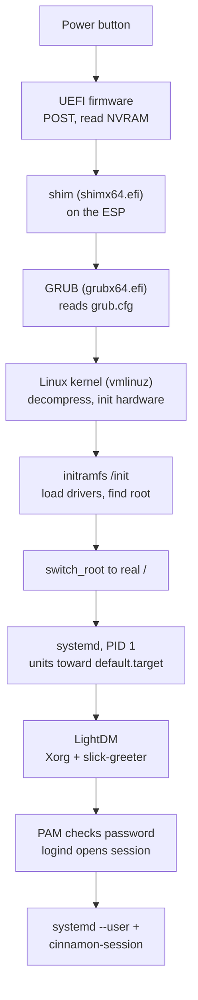
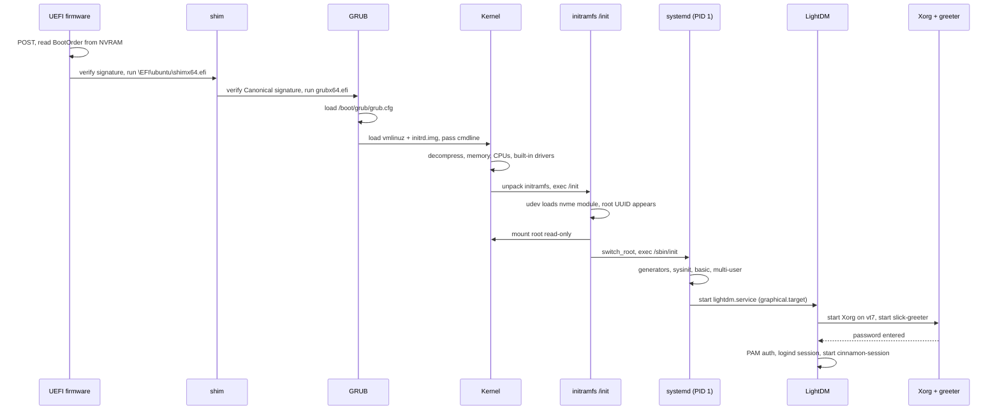
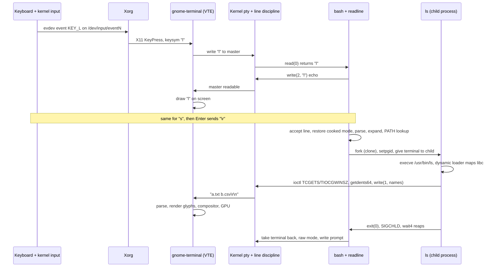

# Level 3 capstone: model answer

> **Level 3 · Capstone solution** · ⏱️ ~60 min read · Back to the [capstone brief](../level-3-capstone.md)

This is one complete answer to the [Level 3 capstone](../level-3-capstone.md). Your numbers, PIDs, UUIDs, and device names will differ. What should match is the list of components, their order, and the reasons each one exists. Sample output comes from a Linux Mint 22.3 laptop (user `alex`, hostname `mint`) booting from an NVMe SSD with UEFI.

!!! tip "How to use this answer"
    Compare section by section. Where your narrative skips a component or gets the order wrong, go back to the chapter that covers it, reread it, and rewrite your paragraph without looking here. Copying this text teaches you nothing; explaining it yourself is the whole exercise.

## Part 1: Investigation

### A1. Firmware and boot entries

```bash
ls -d /sys/firmware/efi && echo "UEFI boot"
efibootmgr
mokutil --sb-state
findmnt /boot/efi
```

```text
/sys/firmware/efi
UEFI boot
BootCurrent: 0000
Timeout: 0 seconds
BootOrder: 0000,0003,0004
Boot0000* Ubuntu	HD(1,GPT,6b2d0c11-4f1e-4f7a-9d55-2a8c0b7e1f30,0x800,0x100000)/File(\EFI\ubuntu\shimx64.efi)
Boot0003* UEFI:Removable Device	BBS(130,,0x0)
Boot0004* UEFI:Network Device	BBS(131,,0x0)
SecureBoot enabled
TARGET    SOURCE         FSTYPE OPTIONS
/boot/efi /dev/nvme0n1p1 vfat   rw,relatime,fmask=0077,dmask=0077,codepage=437,iocharset=iso8859-1,shortname=mixed,errors=remount-ro
```

- `/sys/firmware/efi` exists, so the kernel was started by UEFI firmware.
- `BootCurrent: 0000` → entry `Boot0000`, which runs `\EFI\ubuntu\shimx64.efi` from partition 1 of the GPT disk. Mint uses the `ubuntu` directory name for compatibility with Ubuntu's boot packages.
- That partition is the ESP, `/dev/nvme0n1p1`, a FAT32 (`vfat`) filesystem mounted at `/boot/efi`.
- Secure Boot is on, so the firmware verified shim's Microsoft signature before running it.

### A2. The bootloader

```bash
grep -v '^#' /etc/default/grub | grep .
cat /proc/cmdline
ls -l /boot | grep -E 'vmlinuz|initrd'
```

```text
GRUB_DEFAULT=0
GRUB_TIMEOUT_STYLE=hidden
GRUB_TIMEOUT=10
GRUB_DISTRIBUTOR=`( . /etc/os-release; echo ${NAME:-Ubuntu} ) 2>/dev/null || echo Ubuntu`
GRUB_CMDLINE_LINUX_DEFAULT="quiet splash"
GRUB_CMDLINE_LINUX=""
BOOT_IMAGE=/boot/vmlinuz-6.14.0-37-generic root=UUID=3f2a6c1e-8b4d-4e2a-9c7f-1d5e8a0b9c42 ro quiet splash
lrwxrwxrwx 1 root root       28 Aug 14 18:05 initrd.img -> initrd.img-6.14.0-37-generic
-rw-r--r-- 1 root root 85765999 Aug  6 22:11 initrd.img-6.14.0-37-generic
-rw-r--r-- 1 root root 84112384 Jun 12 10:02 initrd.img-6.8.0-90-generic
lrwxrwxrwx 1 root root       28 Aug 14 18:05 initrd.img.old -> initrd.img-6.8.0-90-generic
lrwxrwxrwx 1 root root       25 Aug 14 18:05 vmlinuz -> vmlinuz-6.14.0-37-generic
-rw------- 1 root root 15571336 Jun 10 00:08 vmlinuz-6.14.0-37-generic
-rw------- 1 root root 14936456 Jun  2 09:11 vmlinuz-6.8.0-90-generic
lrwxrwxrwx 1 root root       25 Aug 14 18:05 vmlinuz.old -> vmlinuz-6.8.0-90-generic
```

The command line parameters:

| Parameter | Meaning |
|---|---|
| `BOOT_IMAGE=/boot/vmlinuz-6.14.0-37-generic` | Added by GRUB: the kernel file it loaded |
| `root=UUID=3f2a...9c42` | The filesystem that becomes `/`, identified by UUID so device renaming can't break it |
| `ro` | Mount root read-only first so it can be checked; systemd remounts it read-write later |
| `quiet` | Fewer kernel messages on screen |
| `splash` | Show Plymouth's graphical boot animation |

`quiet splash` comes from `GRUB_CMDLINE_LINUX_DEFAULT`; `root=` and `ro` are added by GRUB's `10_linux` script when `update-grub` generates `/boot/grub/grub.cfg`. Two kernels are installed: the current one and the previous one as a fallback.

### A3. Kernel and initramfs

```bash
journalctl -k -b -o short-monotonic --no-pager \
  | grep -E 'Linux version|unpack rootfs|Run /init|mounted filesystem|running in system mode'
```

```text
[    0.000000] mint kernel: Linux version 6.14.0-37-generic (buildd@lcy02-amd64-022) ...
[    1.499747] mint kernel: Trying to unpack rootfs image as initramfs...
[    1.787865] mint kernel: Run /init as init process
[    4.405952] mint kernel: EXT4-fs (nvme0n1p2): mounted filesystem 3f2a6c1e-8b4d-4e2a-9c7f-1d5e8a0b9c42 ro with ordered data mode. Quota mode: none.
[    4.547701] mint systemd[1]: systemd 255.4-1ubuntu8 running in system mode (+PAM +AUDIT +SELINUX +APPARMOR ...)
```

- 0.0 s: the decompressed kernel starts logging.
- 1.50 s: the kernel unpacks the initramfs into an in-memory filesystem.
- 1.79 s: it runs `/init` from the initramfs.
- 4.41 s: the real root (`nvme0n1p2`, matching the UUID from the command line) is mounted **read-only** (`ro`).
- 4.55 s: systemd starts as PID 1 from the real root.

The driver the kernel needed:

```bash
grep -E '^CONFIG_BLK_DEV_NVME=' /boot/config-$(uname -r)
lsinitramfs /boot/initrd.img-$(uname -r) | grep 'nvme/host/nvme.ko'
```

```text
CONFIG_BLK_DEV_NVME=m
usr/lib/modules/6.14.0-37-generic/kernel/drivers/nvme/host/nvme.ko.zst
```

`=m` means the NVMe driver is a loadable module, not built in. It lives in the initramfs, which is how the kernel could reach the NVMe disk at all.

### A4. systemd

```bash
ps -o pid,comm,args -p 1
systemctl get-default
systemd-analyze
systemd-analyze critical-chain | head -12
systemctl status boot-efi.mount --no-pager | head -2
```

```text
    PID COMMAND         COMMAND
      1 systemd         /sbin/init splash
graphical.target
Startup finished in 6.912s (firmware) + 3.104s (loader) + 2.871s (kernel) + 8.226s (userspace) = 21.114s
graphical.target reached after 8.201s in userspace.
graphical.target @8.201s
└─multi-user.target @8.200s
  └─kerneloops.service @7.120s +26ms
    └─network-online.target @7.089s
      └─NetworkManager-wait-online.service @1.398s +5.691s
        └─NetworkManager.service @0.620s +773ms
          └─dbus.service @0.527s +66ms
            └─basic.target @0.511s
              └─sockets.target @0.511s
                └─sysinit.target @0.498s
● boot-efi.mount - /boot/efi
     Loaded: loaded (/etc/fstab; generated)
```

PID 1 was started as `/sbin/init`, a symlink to systemd. It received `splash` from the kernel command line (the kernel passes parameters it doesn't recognise to init). `boot-efi.mount` says `(/etc/fstab; generated)`: systemd's fstab generator created it from the `/boot/efi` line at boot. The critical chain shows that waiting for the network to be online was the slowest link to `graphical.target`.

### A5. Display manager and session

```bash
systemctl status display-manager --no-pager | sed -n '1,4p'
pstree -p "$(systemctl show -p MainPID --value lightdm)" | head -4
loginctl list-sessions --no-pager
pstree -s -p $$
```

```text
● lightdm.service - Light Display Manager
     Loaded: loaded (/usr/lib/systemd/system/lightdm.service; indirect; preset: enabled)
     Active: active (running) since Fri 2026-10-02 09:35:51 IST; 1h 30min ago
       Docs: man:lightdm(1)
lightdm(1262)-+-Xorg(1292)-+-{Xorg}(1309)
              |            `-{Xorg}(1310)
              |-lightdm(1591)-+-cinnamon-sessio(1918)-+-...
SESSION  UID USER SEAT  TTY  STATE  IDLE SINCE
     c2 1000 alex seat0 tty7 active no   -

1 sessions listed.
systemd(1)───systemd(1257)───gnome-terminal-(13712)───bash(13724)───pstree(14402)
```

- `display-manager.service` is LightDM. Its main process (1262) started the X server `Xorg` and a session child `lightdm(1591)`, which is now running `cinnamon-session` for alex (before login, it ran the slick-greeter instead).
- systemd-logind tracks alex's graphical session `c2` on seat0, tty7.
- The terminal's ancestry: PID 1 → `systemd --user` (1257, alex's per-user service manager, `user@1000.service`) → `gnome-terminal-server` → `bash` → the command.

### A6. Booting to multi-user (VM)

From the text console after a one-off `systemd.unit=multi-user.target` edit:

```text
$ systemctl get-default
graphical.target
$ cat /proc/cmdline
BOOT_IMAGE=/boot/vmlinuz-6.14.0-37-generic root=UUID=... ro quiet splash systemd.unit=multi-user.target
$ systemctl is-active lightdm
inactive
```

The *default* didn't change (the `default.target` symlink is untouched); only this boot's goal changed, via the kernel command line that systemd reads. Everything in `multi-user.target` started, but LightDM, which is only wanted by `graphical.target`, didn't. The edit is gone at the next boot because `grub.cfg` wasn't modified.

### B1. What is `ls`?

```bash
type -a ls
readlink -f "$(command -v ls)"
dpkg -S /usr/bin/ls
file /usr/bin/ls
```

```text
ls is aliased to `ls --color=auto'
ls is /usr/bin/ls
ls is /bin/ls
/usr/bin/ls
coreutils: /usr/bin/ls
/usr/bin/ls: ELF 64-bit LSB pie executable, x86-64, version 1 (SYSV), dynamically linked, interpreter /lib64/ld-linux-x86-64.so.2, BuildID[sha1]=4490...f0891, for GNU/Linux 3.2.0, stripped
```

Bash resolves a command name in this order: alias (expanded while the line is being read), function, builtin, then the `PATH` search. Mint's default `~/.bashrc` defines `alias ls='ls --color=auto'`, so the alias wins. The alias itself still runs the file `/usr/bin/ls`. `/bin/ls` appears too because `/bin` is a symlink to `usr/bin` on modern Ubuntu-based systems, and both directories are in `PATH`. The file is a dynamically linked ELF executable from the `coreutils` package, and its "interpreter" is the dynamic loader.

### B2. Your terminal

```bash
tty
ls -l /proc/$$/fd/{0,1,2}
stat -c '%F %Hr:%Lr' "$(tty)"
ps -o pid,comm -p "$(ps -o ppid= -p $$)"
ls -l /proc/13712/fd | grep ptmx
```

```text
/dev/pts/0
lrwx------ 1 alex alex 64 Oct  2 11:03 /proc/13724/fd/0 -> /dev/pts/0
lrwx------ 1 alex alex 64 Oct  2 11:03 /proc/13724/fd/1 -> /dev/pts/0
lrwx------ 1 alex alex 64 Oct  2 11:03 /proc/13724/fd/2 -> /dev/pts/0
character special file 136:0
    PID COMMAND
  13712 gnome-terminal-
lrwx------ 1 alex alex 64 Oct  2 11:03 13 -> /dev/ptmx
```

The shell's stdin, stdout, and stderr are all `/dev/pts/0`, the **slave** side of a pseudo-terminal: a character device, major 136 (the `pts` driver), minor 0. Its parent, `gnome-terminal-server`, holds the **master** side, opened through `/dev/ptmx` (fd 13).

### B3. The shell's side

```bash
strace -f -e trace=newfstatat,access,clone,execve,wait4 bash -c 'ls /tmp > /dev/null; true' 2>&1 | grep -v '^---' | sed -n '1,14p'
```

```text
execve("/usr/bin/bash", ["bash", "-c", "ls /tmp > /dev/null; true"], 0x7ffd... /* 52 vars */) = 0
newfstatat(AT_FDCWD, "/home/alex/.local/bin/ls", 0x7ffec121bf40, 0) = -1 ENOENT (No such file or directory)
newfstatat(AT_FDCWD, "/usr/local/sbin/ls", 0x7ffec121bf40, 0) = -1 ENOENT (No such file or directory)
newfstatat(AT_FDCWD, "/usr/local/bin/ls", 0x7ffec121bf40, 0) = -1 ENOENT (No such file or directory)
newfstatat(AT_FDCWD, "/usr/sbin/ls", 0x7ffec121bf40, 0) = -1 ENOENT (No such file or directory)
newfstatat(AT_FDCWD, "/usr/bin/ls", {st_mode=S_IFREG|0755, st_size=142312, ...}, 0) = 0
access("/usr/bin/ls", X_OK)             = 0
clone(child_stack=NULL, flags=CLONE_CHILD_CLEARTID|CLONE_CHILD_SETTID|SIGCHLD, child_tidptr=0x7ed1bf34ba10) = 14588
[pid 14587] wait4(-1,  <unfinished ...>
[pid 14588] execve("/usr/bin/ls", ["ls", "/tmp"], 0x62fe457bb4a0 /* 52 vars */) = 0
[pid 14588] +++ exited with 0 +++
<... wait4 resumed>[{WIFEXITED(s) && WEXITSTATUS(s) == 0}], 0, NULL) = 14588
+++ exited with 0 +++
```

The PATH search is a series of `newfstatat` probes, one directory at a time, until `/usr/bin/ls` exists and `access(..., X_OK)` confirms it's executable. Then `clone` (glibc's fork) creates child 14588, the parent sits in `wait4`, the child calls `execve` to become `ls`, exits with status 0, and `wait4` returns that status. (Non-interactive `bash -c` doesn't expand aliases, which is why `--color=auto` is missing here.)

### B4. Loading `ls`

```bash
ldd /usr/bin/ls
strace ls /tmp 2>&1 >/dev/null | sed -n '1,4p;9,14p'
```

```text
	linux-vdso.so.1 (0x00007cbfca85d000)
	libselinux.so.1 => /lib/x86_64-linux-gnu/libselinux.so.1 (0x00007cbfca7ec000)
	libc.so.6 => /lib/x86_64-linux-gnu/libc.so.6 (0x00007cbfca400000)
	libpcre2-8.so.0 => /lib/x86_64-linux-gnu/libpcre2-8.so.0 (0x00007cbfca752000)
	/lib64/ld-linux-x86-64.so.2 (0x00007cbfca85f000)
execve("/usr/bin/ls", ["ls", "/tmp"], 0x7fff2ca59c18 /* 52 vars */) = 0
brk(NULL)                               = 0x5b8dfa609000
mmap(NULL, 8192, PROT_READ|PROT_WRITE, MAP_PRIVATE|MAP_ANONYMOUS, -1, 0) = 0x71e760094000
access("/etc/ld.so.preload", R_OK)      = -1 ENOENT (No such file or directory)
openat(AT_FDCWD, "/lib/x86_64-linux-gnu/libselinux.so.1", O_RDONLY|O_CLOEXEC) = 3
read(3, "\177ELF\2\1\1\0\0\0\0\0\0\0\0\0\3\0>\0\1\0\0\0\0\0\0\0\0\0\0\0"..., 832) = 832
fstat(3, {st_mode=S_IFREG|0644, st_size=174472, ...}) = 0
mmap(NULL, 181960, PROT_READ, MAP_PRIVATE|MAP_DENYWRITE, 3, 0) = 0x71e760050000
mmap(0x71e760056000, 118784, PROT_READ|PROT_EXEC, MAP_PRIVATE|MAP_FIXED|MAP_DENYWRITE, 3, 0x6000) = 0x71e760056000
mmap(0x71e760073000, 24576, PROT_READ, MAP_PRIVATE|MAP_FIXED|MAP_DENYWRITE, 3, 0x23000) = 0x71e760073000
```

Everything between `execve` and the first `ls`-specific call is the **dynamic loader** (`ld-linux-x86-64.so.2`) at work: it checks `/etc/ld.so.preload`, reads `/etc/ld.so.cache` to find library paths, then for each library opens it, reads the ELF header (`\177ELF`), and `mmap`s its segments with the right permissions (read-only, then `PROT_EXEC` for code). `linux-vdso.so.1` isn't opened from disk at all: the kernel maps it into every process.

The mappings in a running `ls`:

```bash
ls -R / > /dev/null 2>&1 &
grep -E '/ls$|libc.so' /proc/$!/maps; kill $!
```

```text
558240a08000-558240a0c000 r--p 00000000 103:02 19013892                  /usr/bin/ls
558240a0c000-558240a21000 r-xp 00004000 103:02 19013892                  /usr/bin/ls
558240a21000-558240a29000 r--p 00019000 103:02 19013892                  /usr/bin/ls
558240a2b000-558240a2c000 rw-p 00022000 103:02 19013892                  /usr/bin/ls
783a9ec00000-783a9ec28000 r--p 00000000 103:02 19009455                  /usr/lib/x86_64-linux-gnu/libc.so.6
783a9ec28000-783a9edb1000 r-xp 00028000 103:02 19009455                  /usr/lib/x86_64-linux-gnu/libc.so.6
783a9ee04000-783a9ee06000 rw-p 00203000 103:02 19009455                  /usr/lib/x86_64-linux-gnu/libc.so.6
```

`ls`'s code (`r-xp`) sits low in the address space; libc's code and data sit in the mmap region near the top. Both are backed by their files (inode numbers in the fifth column), so their code pages are shared with every other process using the same files.

### B5. Doing the work: terminal vs pipe

On a terminal (with the alias's `--color=auto`):

```bash
strace -e trace=ioctl,getdents64,write ls --color=auto ~/scratch/demo
```

```text
ioctl(1, TCGETS, {c_iflag=ICRNL|IXON, c_oflag=NL0|CR0|TAB0|BS0|VT0|FF0|OPOST|ONLCR, ...}) = 0
ioctl(1, TIOCGWINSZ, {ws_row=40, ws_col=120, ws_xpixel=0, ws_ypixel=0}) = 0
getdents64(3, 0x5db5758ae580 /* 4 entries */, 32768) = 112
getdents64(3, 0x5db5758ae580 /* 0 entries */, 32768) = 0
write(1, "a.txt  b.csv\n", 13a.txt  b.csv
)          = 13
+++ exited with 0 +++
```

Into a pipe:

```bash
strace -e trace=ioctl,getdents64,write ls --color=auto ~/scratch/demo | cat
```

```text
ioctl(1, TCGETS, 0x7ffcbd55d250)        = -1 ENOTTY (Inappropriate ioctl for device)
getdents64(3, 0x6474bdc0fde0 /* 4 entries */, 32768) = 112
getdents64(3, 0x6474bdc0fde0 /* 0 entries */, 32768) = 0
write(1, "a.txt\nb.csv\n", 12)          = 12
+++ exited with 0 +++
a.txt
b.csv
```

- `ioctl(1, TCGETS)` is how `isatty(1)` is implemented: "give me the terminal settings of fd 1". On the pty it succeeds; on a pipe it fails with `ENOTTY`.
- On a terminal, `ls` then asks for the window size (`TIOCGWINSZ`) to lay out columns, and `--color=auto` enables colour escape codes (none appear here because these plain files get no colour). Into a pipe, it writes one name per line with no colour, so scripts and `grep` get clean output.
- `getdents64` reads directory entries in batches; the second call returning 0 means "end of directory". There are 4 entries because `.` and `..` are included; `ls` hides them.
- All output goes out in a single `write(1, ...)` because libc buffers `stdout` and flushes once at exit.

### B6. Terminal settings

```bash
stty -a | head -7
```

```text
speed 38400 baud; rows 40; columns 120; line = 0;
intr = ^C; quit = ^\; erase = ^?; kill = ^U; eof = ^D; eol = <undef>;
eol2 = <undef>; swtch = <undef>; start = ^Q; stop = ^S; susp = ^Z; rprnt = ^R;
werase = ^W; lnext = ^V; discard = ^O; min = 1; time = 0;
-parenb -parodd -cmspar cs8 -hupcl -cstopb cread -clocal -crtscts
-ignbrk -brkint -ignpar -parmrk -inpck -istrip -inlcr -igncr icrnl ixon -ixoff
opost -olcuc -ocrnl onlcr -onocr -onlret -ofill -ofdel nl0 cr0 tab0 bs0 vt0 ff0
```

- `onlcr` (with `opost`): on output, translate `\n` to `\r\n`, so a program printing a newline also returns the cursor to column 0.
- `isig` (further down, in the local flags) with `intr = ^C`: when the line discipline receives the byte `0x03` (++ctrl+c++), it sends `SIGINT` to the terminal's foreground process group instead of passing the byte on. `susp = ^Z` does the same with `SIGTSTP`.
- `icrnl`: on input, translate `\r` (what the Enter key sends) to `\n`.
- `icanon` and `echo` (also in the local flags) are the "cooked mode" switches: the kernel collects a whole line and echoes characters itself. These are the settings a program like `ls` runs under. While bash is waiting at the prompt, readline turns `icanon`, `echo`, and `icrnl` off (see Narrative 2).

### B7. The kernel's view

```bash
strace -e trace=openat ps -o pid,comm -p $$ 2>&1 | grep "/proc/$$"
strace -e trace=openat pstree -s $$ 2>&1 | grep -m3 '/proc/'
```

```text
openat(AT_FDCWD, "/proc/13724/stat", O_RDONLY) = 4
openat(AT_FDCWD, "/proc/13724/status", O_RDONLY) = 4
openat(AT_FDCWD, "/proc/13724/cmdline", O_RDONLY) = 4
openat(AT_FDCWD, "/proc", O_RDONLY|O_NONBLOCK|O_CLOEXEC|O_DIRECTORY) = 3
openat(AT_FDCWD, "/proc/1/stat", O_RDONLY) = 4
openat(AT_FDCWD, "/proc/2/stat", O_RDONLY) = 4
```

`ps` reads three files from the shell's `/proc` directory. `pstree` lists `/proc` and reads every process's `stat` to learn its parent. `tty`, `ls -l /proc/$$/fd`, and `/proc/PID/maps` were `/proc` reads by definition.

## Narrative 1: From power button to login screen

### The chain at a glance



### 1. Power on and POST

Pressing the power button tells the motherboard's power circuitry to bring the power supply up. Once voltages are stable, the CPU is released from reset and starts executing at a fixed address that maps to the **firmware** flash chip. At this point there's no operating system, no disk access, and only one CPU core running.

The firmware runs the **POST** (power-on self-test): it initializes the memory controller and trains the RAM, checks that the CPU, RAM, and essential chipset devices respond, and initializes enough of the platform (PCIe, USB, storage controllers, a basic display) to continue. A RAM failure stops here with beep codes or LED patterns, before anything on the disk is touched. The manufacturer's logo usually appears now.

### 2. The UEFI boot manager and NVRAM

Modern PCs use **UEFI** firmware rather than legacy BIOS. UEFI's boot manager reads its configuration from **NVRAM**, small non-volatile storage on the motherboard: a list of boot entries (`Boot0000`, `Boot0001`, ...) and a `BootOrder` variable. Each entry names a partition and a file. Mint's installer created `Boot0000`, pointing at `\EFI\ubuntu\shimx64.efi` on the disk's EFI System Partition.

The firmware tries the entries in `BootOrder`. If none works, it falls back to the removable-media path `\EFI\BOOT\BOOTX64.EFI`.

### 3. The ESP, Secure Boot, and shim

The **ESP** (EFI System Partition) is a small FAT32 partition, because FAT is the one filesystem every UEFI firmware can read. Bootloaders are just files on it.

With **Secure Boot** enabled, the firmware verifies a cryptographic signature on every EFI program before running it, against keys in its database. Those keys are almost always Microsoft's. Linux distributions solve this with **shim**: a tiny first-stage loader that Microsoft has signed. shim contains Canonical's certificate, so it can verify the next stage, GRUB, which Canonical has signed. shim also manages **MOK** (Machine Owner Keys) so users can trust their own signed kernel modules. The chain of trust is firmware → shim → GRUB → kernel, each link checking the next. Without Secure Boot, the firmware runs shim without checking, and shim still loads GRUB.

### 4. GRUB

**GRUB** (`grubx64.efi`) is the bootloader. It starts by reading a tiny `grub.cfg` stub on the ESP, which says "find the filesystem with this UUID and load `/boot/grub/grub.cfg` from it". GRUB has its own drivers for ext4, Btrfs, LVM, and more, so it reads `/boot` directly from the root partition.

`/boot/grub/grub.cfg` was generated earlier by `update-grub` from `/etc/default/grub` and the scripts in `/etc/grub.d/`. On Mint the menu is hidden (`GRUB_TIMEOUT_STYLE=hidden`), so GRUB waits briefly for ++esc++ or ++shift++ and then picks the first entry.

GRUB then loads two files into RAM, the kernel `vmlinuz-6.14.0-37-generic` and the matching `initrd.img-6.14.0-37-generic`, and jumps into the kernel, passing the **kernel command line**: `root=UUID=3f2a... ro quiet splash`. In Secure Boot mode, GRUB asks shim to verify the kernel's signature first.

### 5. The kernel starts

`vmlinuz` is a compressed image: a small uncompressed stub at its start decompresses the rest of the kernel (zstd on Ubuntu 24.04 kernels) into memory and jumps to it.

The kernel then takes over the machine. It reads the firmware's memory map and sets up its own memory management and page tables, switches on all CPU cores, initializes the scheduler, interrupt handling, timers, and ACPI, and initializes the drivers that are **built in** to the kernel image. It starts kernel threads (`kthreadd`, PID 2, is their parent). From here on, everything is logged into the kernel ring buffer that `dmesg` reads.

What it can't do yet is mount the root filesystem. The NVMe disk driver is a **module** (`CONFIG_BLK_DEV_NVME=m`), and modules live in `/usr/lib/modules` on the root filesystem, the very filesystem it can't read without the driver.

### 6. The initramfs

That chicken-and-egg problem is what the **initramfs** solves. GRUB loaded it into RAM alongside the kernel. It's a compressed archive containing a minimal userland: BusyBox tools, a `udev`, the kernel modules needed for storage and filesystems, and a script, `/init`, generated by `initramfs-tools` when the kernel was installed.

The kernel unpacks it into an in-memory filesystem (`Trying to unpack rootfs image as initramfs...`) and runs `/init` as the first process (`Run /init as init process`). The script:

1. mounts `/proc`, `/sys`, and `/dev` (devtmpfs) inside the initramfs;
2. starts `udevd`, which receives uevents for the hardware the kernel found and loads the matching modules, including `nvme`;
3. if root were encrypted (LUKS), on LVM, or on RAID, it would unlock or assemble it here, asking for a passphrase if needed;
4. waits for a block device whose filesystem UUID matches `root=UUID=3f2a...`;
5. optionally runs `fsck` on it, then mounts it **read-only** (the `ro` parameter) at `/root`;
6. calls `run-init` (a `switch_root` implementation): the real root becomes `/`, the initramfs contents are deleted to free their RAM, and the process `exec`s `/sbin/init` from the real disk, keeping PID 1.

### 7. systemd becomes PID 1

`/sbin/init` is a symlink to `/lib/systemd/systemd`. **systemd** is now PID 1: the ancestor of every user-space process, the reaper of orphans, and the one process that must never exit.

systemd reads its configuration and unit files (from `/usr/lib/systemd/system/` and `/etc/systemd/system/`), runs **generators** that turn other configuration into units (the fstab generator creates `-.mount`, `boot-efi.mount`, and `swapfile.swap` from `/etc/fstab`), and determines its goal: `default.target`, a symlink to `graphical.target` (unless the kernel command line overrides it with `systemd.unit=`).

It then builds a dependency graph of every unit that target needs, through `Requires=` and `Wants=`, and starts them **in parallel**, respecting `After=`/`Before=` ordering. The main milestones:

- **`sysinit.target`**: `systemd-journald` starts collecting logs (including the kernel's earlier messages); `systemd-udevd` replaces the initramfs's udev and processes all devices, creating `/dev/disk/by-uuid/` links and setting permissions; `systemd-remount-fs` remounts root read-write per fstab; local filesystems (`local-fs.target`) and swap are activated; the clock, kernel settings (`sysctl`), and AppArmor profiles are set up.
- **`basic.target`**: sockets, timers, and path units are ready; D-Bus (the desktop's message bus) can start.
- **`multi-user.target`**: the system's services: NetworkManager, cron, CUPS printing, Bluetooth, Docker if installed, and `getty@tty1.service` offering a text login on the first virtual console.
- **`graphical.target`**: `Requires=multi-user.target` and `Wants=display-manager.service`, which on Mint is a symlink to `lightdm.service`.

### 8. LightDM, Xorg, and the greeter

**LightDM** is the display manager. Its service starts `/usr/sbin/lightdm`, which:

1. starts the **X server** (`Xorg`) on virtual terminal 7. Xorg takes control of the GPU through the kernel's DRM/KMS driver (`i915` for Intel graphics) and of input devices through `/dev/input/event*`;
2. starts the **greeter**, `slick-greeter`, as an unprivileged `lightdm` user. The greeter is an X client that draws the login screen with your user list.

This is the moment the capstone's first journey ends: the login screen is on the display, waiting for a password.

### 9. Logging in (the epilogue)

When you type your password, the greeter hands it to LightDM, which calls **PAM** (Pluggable Authentication Modules). PAM's stack, configured in `/etc/pam.d/lightdm`, hashes the password and compares it with the hash in `/etc/shadow` (`pam_unix`), and runs session modules. One of them, `pam_systemd`, registers the session with **systemd-logind**, which records it (session `c2` on seat0, tty7), grants your user access to the devices on that seat, and ensures your per-user service manager is running: `user@1000.service`, which runs `systemd --user`.

LightDM then starts your session as you: `cinnamon-session` (the choice comes from `user-session=cinnamon` in Mint's LightDM configuration). It starts the Muffin window manager and compositor, the Cinnamon panel and desktop, Nemo for desktop icons, and autostart programs. When you later open a terminal, it's launched through `systemd --user`, which is why `gnome-terminal-server` appears as its child in `pstree`.

### Sequence diagram



## Narrative 2: From typing `ls` to seeing output

### Setting the scene

Before you touch a key, this is the state of the system:

- `gnome-terminal-server` (a child of `systemd --user`) owns a terminal window. For each tab it created a **pseudo-terminal** pair by opening `/dev/ptmx`: it holds the **master** side, and the **slave** side is `/dev/pts/0`.
- `bash` runs with its stdin, stdout, and stderr all connected to `/dev/pts/0`. It's the session leader, and its process group is the terminal's **foreground process group**.
- bash is inside **readline**, the line-editing library. Readline has switched the terminal into a raw-ish mode: it turned off `icanon` (so the kernel delivers each byte immediately rather than waiting for a full line), `echo` (so the kernel doesn't echo characters; readline does that itself), and `icrnl` (so it sees the Enter key's `\r` unchanged). `isig` stays on, so ++ctrl+c++ still becomes a signal.
- bash has printed its prompt by writing it to **stderr** (fd 2) and is blocked in `read(0, buf, 1)`: one byte at a time, in state `S` (sleeping), using no CPU.

### The whole journey in one diagram



### 1. The key press reaches the kernel

Pressing ++l++ closes a contact in the keyboard's key matrix. The keyboard's own microcontroller detects it and, for a USB keyboard, places a **HID report** (a few bytes listing which keys are down, identified by HID usage codes) ready for the host. The computer's USB controller (xHCI) polls the keyboard many times per second, picks up the report, and raises an **interrupt**.

The CPU stops what it's doing and runs the kernel's interrupt handler. The **USB HID driver** (`usbhid`, `hid-generic`) decodes the report and passes it to the kernel's **input subsystem**, which translates it into a standard event: key `KEY_L` (code 38), value 1 (pressed). The **evdev** driver makes that event available to user space as a read from the character device `/dev/input/eventN` (major 13), timestamped. A moment later the release generates a second event with value 0.

### 2. The X server routes the key to the terminal

**Xorg** has the keyboard's event device open (through its libinput driver) and wakes up when the event is readable. It converts the evdev code to an X keycode (evdev code + 8 = 46), and the **XKB** keyboard layout turns keycode 46 plus the current modifier state into the **keysym** `l`. (With ++shift++ held, the same keycode would map to `L`.)

X decides which window has keyboard focus. Cinnamon's window manager, Muffin, set focus to the terminal window when you clicked it. Xorg sends a `KeyPress` event over the X11 Unix socket to the client that owns that window: `gnome-terminal-server`.

### 3. The terminal emulator writes a byte to the pty master

GNOME Terminal is a GTK application; its terminal widget is **VTE**. GTK's event loop receives the `KeyPress`, and VTE converts the keysym into the bytes a terminal should send: for `l` in a UTF-8 terminal that's the single byte `0x6c`. (Special keys turn into escape sequences: an arrow key sends `\e[A`, for example.)

VTE writes that byte to the **pty master** file descriptor. From here on, it's no longer a "key"; it's just a byte flowing into the kernel.

### 4. The line discipline delivers it to bash

Inside the kernel, the pty pair is joined by the **TTY layer**, and the slave side runs a **line discipline** (`n_tty`), the code that implements terminal behaviour. In cooked mode it would buffer the byte, handle backspace, and echo it. But readline has disabled `icanon` and `echo`, so the line discipline simply makes `0x6c` readable on the slave immediately. `isig` is still active: if the byte had been `0x03` (++ctrl+c++), the line discipline would have swallowed it and sent `SIGINT` to the foreground process group instead.

bash's blocked `read(0, buf, 1)` wakes up: the scheduler moves bash from `S` to `R`, and the call returns `"l"`.

### 5. Readline echoes and redraws

Readline inserts `l` into its line buffer and updates the display by writing the character back out with `write(2, "l", 1)`, to stderr, which is also `/dev/pts/0`. **The echo you see comes from readline, not from the kernel and not from the terminal emulator.** (In cooked mode, for example when `cat` is reading from the terminal, the kernel's line discipline does the echoing instead.)

The byte goes through the line discipline's output side to the master. VTE's event loop sees the master become readable, reads `l`, places it in the next cell of its character grid, and redraws: GTK renders the glyph with Pango and Cairo, and the X server and the Muffin compositor put the updated window on screen through the GPU's DRM driver. All of this, from key press to glyph, typically takes a few milliseconds.

The same happens for `s`.

### 6. Enter: accepting the line

The ++enter++ key makes VTE send a carriage return, `\r` (0x0d). Because readline turned off `icrnl`, it arrives unchanged, and readline binds both `\r` and `\n` to **accept-line**. Readline writes a newline so the cursor moves down, adds `ls` to the **history** list, and returns the finished line `ls` to bash.

Before running anything, bash restores the terminal to the normal cooked settings (`icanon`, `echo`, `icrnl` back on, via `ioctl(0, TCSETSW, ...)`), so the command it runs sees a normal terminal. It also turns off bracketed-paste mode by writing an escape sequence.

### 7. Parsing and alias expansion

bash's parser breaks the line into **tokens** (words and operators like `|`, `;`, `>`) and recognizes the grammar: here, one **simple command** with a single word, `ls`.

As it reads the first word of a simple command, bash checks for an **alias**. Mint's `~/.bashrc` defines `alias ls='ls --color=auto'`, so the text is replaced and re-tokenized: the command becomes `ls --color=auto`. Aliases are a purely textual, interactive-shell feature, which is why they don't apply in scripts.

### 8. Expansions

bash then performs its expansions on every word, in a fixed order:

1. **brace expansion** (`{a,b}`),
2. **tilde expansion** (`~` → `/home/alex`),
3. **parameter and variable expansion** (`$HOME`), **command substitution** (`$(...)`), and **arithmetic expansion** (`$((...))`), left to right,
4. **word splitting** of unquoted expansion results on `$IFS`,
5. **pathname expansion** (globbing: `*.csv` becomes a list of matching names, by bash reading the directory itself),
6. **quote removal**.

For `ls --color=auto` there's nothing to expand, so the final argument list is `["ls", "--color=auto"]`. Had you typed `ls *.csv`, bash, not `ls`, would have read the directory and replaced the pattern with file names before `ls` ever started.

### 9. Finding the program

With the words ready, bash decides what `ls` is. It checks, in order: a **function** named `ls`, a **builtin** named `ls` (there isn't one), its **hash table** of previously found commands (`hash` lists it), and finally the directories in **`PATH`**, left to right. For each directory it calls `stat` (`newfstatat`) on `DIR/ls` until one exists: `/usr/local/sbin/ls`, `/usr/local/bin/ls`, `/usr/sbin/ls` fail with `ENOENT`, and `/usr/bin/ls` succeeds. It confirms the file is executable and remembers the result in the hash table, so the next `ls` skips the search.

### 10. fork: cloning the shell

bash calls `fork()`, which glibc implements with the `clone` system call. The kernel creates a new process, PID 14588, that is a near-exact copy of bash: same memory (shared **copy-on-write**, so nothing is physically copied yet), same open file descriptors (so it also has `/dev/pts/0` on 0, 1, and 2), same environment and working directory.

The kernel returns twice: in the parent, `fork` returns 14588; in the child, it returns 0. Now both run in parallel:

- **In the child**, bash's code puts the child in a new **process group** (`setpgid`) and makes that group the terminal's foreground group (`ioctl(TIOCSPGRP)`), so that ++ctrl+c++ will now go to `ls` and not to bash. It resets signal handlers to their defaults (bash ignores `SIGINT`, `SIGTSTP`, and others at the prompt; `ls` must not inherit that), and sets up any redirections (none here; for `ls > out.txt` it would open the file and `dup2` it onto fd 1 at this point).
- **In the parent**, bash makes the same `setpgid` and `TIOCSPGRP` calls (both sides do it to avoid a race over which runs first), then calls `wait4` and sleeps until the child changes state.

### 11. execve: becoming `ls`

The child calls `execve("/usr/bin/ls", ["ls", "--color=auto"], envp)`. Inside the kernel:

1. **Path resolution** through the VFS: `/` → `usr` → `bin` → `ls`, using the dentry cache, gives the inode on the ext4 root filesystem.
2. **Permission checks**: the execute bit for alex, and that the filesystem isn't mounted `noexec`.
3. **Format detection**: the first bytes are `\x7fELF`, so the ELF loader handles it. (`#!` at the start would have meant "run this interpreter instead", which is how scripts work.)
4. The ELF program headers include **`PT_INTERP`**: `/lib64/ld-linux-x86-64.so.2`. `ls` is dynamically linked and needs the dynamic loader.
5. The kernel **throws away the child's old address space** (the copy-on-write image of bash), and builds a new one: it maps `ls`'s segments from the file (code `r-x`, read-only data `r--`, data `rw-`) at a randomized base address (ASLR), maps the dynamic loader the same way, creates a fresh stack, and places on it `argv`, the environment, and the **auxiliary vector** (where `ls`'s program headers are, its entry point, page size, 16 random bytes for security cookies). It maps the vDSO.
6. File descriptors stay open (except those marked close-on-exec), signal handlers that bash had set are reset, and the PID stays 14588.
7. The kernel returns to user space at the **dynamic loader's** entry point, not `ls`'s.

Mapping a file doesn't read it. Pages of `ls` and libc are loaded on demand by **page faults** as code runs; since `ls` and libc are used constantly, their pages are almost certainly already in the **page cache**, so these are cheap minor faults and no disk I/O happens.

### 12. The dynamic loader and libc

`ld-linux-x86-64.so.2` now runs inside the new process. It:

1. checks `/etc/ld.so.preload` (absent);
2. opens `/etc/ld.so.cache`, a prebuilt index of library locations, and `mmap`s it;
3. for each library in `ls`'s `DT_NEEDED` list (`libselinux.so.1`, `libc.so.6`, and, through libselinux, `libpcre2-8.so.0`), opens the file, reads its ELF header, and `mmap`s its segments with the right permissions;
4. performs **relocations**: fills in the addresses of functions and variables that `ls` and the libraries use from each other (`printf`, `malloc`, `opendir`), through the GOT and PLT tables;
5. sets up thread-local storage (`arch_prctl(ARCH_SET_FS)`), then makes relocated data read-only with `mprotect` (RELRO hardening);
6. runs library initializers, and finally jumps to `ls`'s entry point, `_start`, which calls `__libc_start_main` in **libc**, which calls `ls`'s `main()`.

**libc** (GNU C library) is the layer between programs and the kernel: functions like `opendir`, `readdir`, `printf`, and `malloc` are libc functions that eventually make system calls.

### 13. `ls` does its work

`main()` in `ls`:

1. calls `setlocale`, which maps `/usr/lib/locale/locale-archive` to learn your language, character set, and sort order;
2. parses its arguments (`--color=auto`, no paths, so it lists `.`);
3. checks whether stdout is a terminal: `isatty(1)`, implemented as `ioctl(1, TCGETS)`. It succeeds, because fd 1 is `/dev/pts/0`. So `ls` asks for the window width with `ioctl(1, TIOCGWINSZ)` (it will print in columns) and, because of `--color=auto`, reads the `LS_COLORS` environment variable for its colour scheme;
4. opens the directory: `openat(AT_FDCWD, ".", O_RDONLY|O_DIRECTORY)`. The VFS routes this to ext4;
5. reads entries with **`getdents64`**: the kernel asks ext4 for the directory's contents (directory blocks from the page cache, or, if not cached, read from the NVMe SSD through the block layer and the `nvme` driver) and fills `ls`'s buffer with records of inode number, entry type, and name. A second call returns 0: end of directory;
6. `stat`s entries where it needs more than the type (for colouring, to see if a regular file is executable);
7. sorts the names with the locale's collation rules (`strcoll`), hides `.` and `..` and dotfiles, and computes the column layout for the window width;
8. formats the output, wrapping coloured names in ANSI escape sequences such as `\e[01;34m` (bold blue, for directories) and `\e[0m` (reset), into libc's `stdout` buffer;
9. returns from `main`; libc's exit handlers flush the buffer with one **`write(1, ...)`** system call, and the process calls `exit_group(0)`.

### 14. Back through the pty to the screen

`write(1, ...)` on `/dev/pts/0` goes into the TTY layer. The line discipline's output processing (`opost` + `onlcr`) turns each `\n` into `\r\n`, and the bytes are queued for the master side.

`gnome-terminal-server`'s event loop is waiting (via `poll`) on the master fd, wakes up, and reads the bytes. VTE parses them as a stream of characters and **escape sequences**: printable characters go into the cell grid at the cursor, `\e[01;34m` changes the current colour attributes, `\r` returns the cursor to column 0, `\n` moves it down (scrolling if needed). VTE then schedules a redraw: GTK lays out and renders the text with Pango and Cairo (glyphs rasterized from your font with FreeType and shaped with HarfBuzz) into the window's buffer, the X server and the Muffin compositor combine it with the rest of the desktop, and the GPU driver (`i915` via DRM/KMS) scans the new frame out to the display at the next refresh.

The file names appear.

### 15. Exit, SIGCHLD, and the reaping

When `ls` called `exit_group(0)`, the kernel tore down its address space (the page cache keeps the file pages of `ls` and libc for the next user), closed its file descriptors, and turned it into a **zombie** holding only its PID and exit status. It sent **`SIGCHLD`** to the parent, bash.

bash's `wait4` returns with the child's PID and status 0, which **reaps** the zombie (the process table entry disappears) and becomes `$?`. bash takes the terminal's foreground role back for its own process group (`ioctl(TIOCSPGRP)`), checks for other job state changes, runs `PROMPT_COMMAND` if set, and expands `PS1` into the prompt text (`alex@mint:~$ `).

### 16. Ready for the next command

Readline switches the terminal back to its raw-ish mode (no `icanon`, no `echo`, no `icrnl`), writes the prompt to stderr, and calls `read(0, buf, 1)`. bash goes back to sleep in state `S`, waiting for the next byte from the pty, exactly where this story began.

### Components checklist

| Component | Role in the journey | Evidence |
|---|---|---|
| Keyboard, xHCI controller, interrupt | Key press becomes an interrupt | `lsusb`, `/proc/interrupts` |
| HID driver, input subsystem, evdev | Interrupt becomes a `KEY_L` event | `ls -l /dev/input/by-path/` |
| Xorg + XKB | Event becomes keysym, routed to the focused window | `pgrep -a Xorg`, `setxkbmap -query` |
| GNOME Terminal (VTE) | Keysym becomes byte; output bytes become pixels | parent of your shell |
| Pseudo-terminal, line discipline | Joins terminal and shell; echo, signals, `\n`→`\r\n` | `tty`, `stty -a`, `/dev/pts/N` (major 136) |
| bash + readline | Read keys, echo, edit, history | `strace -p $$` from another terminal |
| Parser, alias, expansions | Turn text into an argument list | `type -a ls`, `set -x` |
| PATH lookup + hash table | Find `/usr/bin/ls` | `strace` `newfstatat` probes, `hash` |
| fork (clone), setpgid, TIOCSPGRP | Create child, give it the terminal | `strace -f` of bash |
| execve, ELF loader | Replace bash's image with `ls` | `strace`, `file /usr/bin/ls` |
| Dynamic loader + libc | Map shared libraries, start `main` | `ldd`, `/proc/PID/maps` |
| VFS, ext4, page cache, block layer, NVMe driver | Read the directory | `getdents64` in `strace` |
| `write` → pty → VTE → GTK → X → compositor → GPU | Show the output | `strace` `write(1, ...)` |
| exit, zombie, SIGCHLD, wait4 | Clean up and report status | `strace -f` of bash, `echo $?` |

## Next

You can now explain a Linux machine from power-on to output. Level 4 turns that understanding into administration skills: [systemd and journalctl](../../chapters/04-sysadmin/01-systemd-and-journalctl.md).
