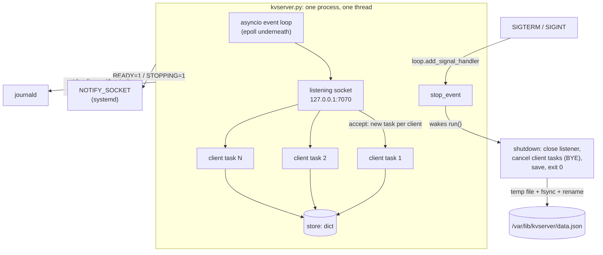
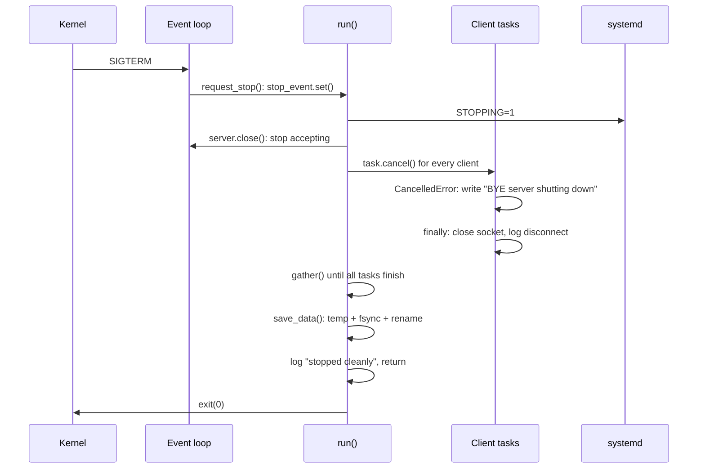

# Level 5 capstone: reference solution

> **Level 5 · Capstone solution** · Back to the [capstone task](../level-5-capstone.md)

This is one complete, working answer to the [Level 5 capstone](../level-5-capstone.md): the server, its unit files, an automated test script, and an explanation of each design decision. If you haven't made a serious attempt yet, go back and try first. You learn far more from debugging your own server than from reading this one.

Your solution doesn't have to look like this. It has to pass the acceptance criteria.

## How the pieces fit together



Everything runs in a single thread. The `asyncio` event loop waits on all sockets at once with epoll, and runs one coroutine per client. Because only one coroutine runs at a time, and each one only pauses at an `await`, the shared dictionary needs no locks: no other code can run in the middle of `self.store[key] = value`.

## The server

This file is also in the repository at `scripts/kvserver.py`.

```python title="kvserver.py"
#!/usr/bin/env python3
"""kvserver: a small line-based key-value server (Level 5 capstone).

Protocol (one command per line, UTF-8, lines end with \\n; \\r\\n is accepted):

    SET <key> <value>   -> OK                 value may contain spaces
    GET <key>           -> VALUE <value>  |  NOT_FOUND
    DEL <key>           -> DELETED        |  NOT_FOUND
    STATS               -> STATS keys=N clients=N connections=N commands=N uptime=S
    QUIT                -> BYE   (then the server closes the connection)

Anything else gets "ERR <reason>". On shutdown, connected clients receive
"BYE server shutting down" before their connection is closed.

Linux features used:
  * asyncio (epoll underneath) to serve many clients in one thread
  * SIGTERM / SIGINT handling for a clean, fast shutdown
  * sd_notify readiness (READY=1, STATUS=, STOPPING=1) when run by systemd
  * logs to stderr, so journald captures them; <N> priority prefixes when
    stderr is connected to the journal
  * optional persistence with an atomic write (temp file + fsync + rename)

Standard library only. Python 3.12+.
"""

from __future__ import annotations

import argparse
import asyncio
import json
import logging
import os
import signal
import socket
import sys
import tempfile
import time

MAX_LINE = 64 * 1024        # bytes; longer lines get an error and a disconnect
MAX_KEY = 250               # bytes
log = logging.getLogger("kvserver")


# --------------------------------------------------------------------------
# systemd integration (pure Python, no libsystemd needed)
# --------------------------------------------------------------------------
def sd_notify(state: str) -> bool:
    """Send a status message to systemd. Returns False when not under systemd."""
    address = os.environ.get("NOTIFY_SOCKET")
    if not address:
        return False
    if address.startswith("@"):                      # abstract socket namespace
        address = "\0" + address[1:]
    try:
        with socket.socket(socket.AF_UNIX, socket.SOCK_DGRAM | socket.SOCK_CLOEXEC) as s:
            s.connect(address)
            s.sendall(state.encode())
        return True
    except OSError as exc:
        log.warning("sd_notify(%r) failed: %s", state, exc)
        return False


class JournalFormatter(logging.Formatter):
    """Prefix each line with <N> so journald records the right priority."""
    PRIORITY = {logging.DEBUG: 7, logging.INFO: 6, logging.WARNING: 4,
                logging.ERROR: 3, logging.CRITICAL: 2}

    def format(self, record: logging.LogRecord) -> str:
        return f"<{self.PRIORITY.get(record.levelno, 6)}>{super().format(record)}"


def setup_logging(level: str) -> None:
    handler = logging.StreamHandler(sys.stderr)      # unbuffered line writes
    if os.environ.get("JOURNAL_STREAM"):             # stderr goes to journald:
        handler.setFormatter(JournalFormatter("%(message)s"))   # it adds timestamps
    else:
        handler.setFormatter(logging.Formatter(
            "%(asctime)s %(levelname)-7s %(message)s", "%H:%M:%S"))
    logging.basicConfig(level=level, handlers=[handler])


# --------------------------------------------------------------------------
# Storage
# --------------------------------------------------------------------------
def load_data(path: str | None) -> dict[str, str]:
    if not path or not os.path.exists(path):
        return {}
    with open(path, encoding="utf-8") as f:
        data = json.load(f)
    if not isinstance(data, dict):
        raise ValueError(f"{path}: expected a JSON object")
    return {str(k): str(v) for k, v in data.items()}


def save_data(path: str, data: dict[str, str]) -> None:
    """Atomically replace `path`: readers see the old file or the new one."""
    directory = os.path.dirname(os.path.abspath(path))
    fd, tmp = tempfile.mkstemp(dir=directory, prefix=".kvdata-")
    try:
        with os.fdopen(fd, "w", encoding="utf-8") as f:
            json.dump(data, f, indent=1, sort_keys=True)
            f.write("\n")
            f.flush()
            os.fsync(f.fileno())
        os.replace(tmp, path)
    except BaseException:
        os.unlink(tmp)
        raise
    dir_fd = os.open(directory, os.O_RDONLY | os.O_DIRECTORY)
    try:
        os.fsync(dir_fd)
    finally:
        os.close(dir_fd)


# --------------------------------------------------------------------------
# The server
# --------------------------------------------------------------------------
class KVServer:
    def __init__(self, host: str, port: int, data_path: str | None) -> None:
        self.host, self.port, self.data_path = host, port, data_path
        self.store: dict[str, str] = load_data(data_path)
        self.clients: dict[asyncio.Task, asyncio.StreamWriter] = {}
        self.total_connections = 0
        self.total_commands = 0
        self.started = time.monotonic()
        self.stop_event = asyncio.Event()

    # ---- protocol ---------------------------------------------------------
    def execute(self, line: str) -> tuple[str, bool]:
        """Run one command. Returns (reply, keep_connection_open)."""
        cmd, _, rest = line.partition(" ")
        cmd = cmd.upper()
        self.total_commands += 1

        if cmd == "SET":
            key, sep, value = rest.partition(" ")
            if not key or not sep:
                return "ERR usage: SET <key> <value>", True
            if len(key.encode()) > MAX_KEY:
                return f"ERR key longer than {MAX_KEY} bytes", True
            self.store[key] = value
            return "OK", True
        if cmd == "GET":
            key = rest.strip()
            if not key or " " in key:
                return "ERR usage: GET <key>", True
            value = self.store.get(key)
            return ("NOT_FOUND", True) if value is None else (f"VALUE {value}", True)
        if cmd == "DEL":
            key = rest.strip()
            if not key or " " in key:
                return "ERR usage: DEL <key>", True
            return ("DELETED", True) if self.store.pop(key, None) is not None else ("NOT_FOUND", True)
        if cmd == "STATS":
            uptime = time.monotonic() - self.started
            return (f"STATS keys={len(self.store)} clients={len(self.clients)} "
                    f"connections={self.total_connections} "
                    f"commands={self.total_commands} uptime={uptime:.0f}"), True
        if cmd == "QUIT":
            return "BYE", False
        if not cmd:
            self.total_commands -= 1          # blank line: ignore, don't count
            return "", True
        return f"ERR unknown command {cmd[:20]!r}", True

    # ---- one client -------------------------------------------------------
    async def handle_client(self, reader: asyncio.StreamReader,
                            writer: asyncio.StreamWriter) -> None:
        task = asyncio.current_task()
        self.clients[task] = writer
        self.total_connections += 1
        host, port = writer.get_extra_info("peername")[:2]
        peer = f"{host}:{port}"
        log.info("client connected: %s (%d online)", peer, len(self.clients))
        try:
            while True:
                try:
                    raw = await reader.readuntil(b"\n")
                except asyncio.IncompleteReadError:
                    break                             # EOF (client closed)
                except asyncio.LimitOverrunError:
                    writer.write(f"ERR line longer than {MAX_LINE} bytes\n".encode())
                    await writer.drain()
                    break
                line = raw.decode("utf-8", errors="replace").rstrip("\r\n")
                reply, keep_open = self.execute(line)
                if reply:
                    writer.write(reply.encode() + b"\n")
                    await writer.drain()
                if not keep_open:
                    break
        except asyncio.CancelledError:
            # Shutdown: say goodbye politely, then let the cancellation finish.
            try:
                writer.write(b"BYE server shutting down\n")
                await asyncio.wait_for(writer.drain(), timeout=1)
            except (OSError, asyncio.TimeoutError):
                pass
            raise
        except (ConnectionResetError, BrokenPipeError):
            pass
        finally:
            del self.clients[task]
            writer.close()
            try:
                await writer.wait_closed()
            except (OSError, asyncio.CancelledError):
                pass
            log.info("client disconnected: %s (%d online)", peer, len(self.clients))

    # ---- lifecycle --------------------------------------------------------
    def request_stop(self, signum: int) -> None:
        if self.stop_event.is_set():
            log.warning("got %s again; already stopping", signal.Signals(signum).name)
            return
        log.info("got %s, shutting down", signal.Signals(signum).name)
        self.stop_event.set()

    async def run(self) -> None:
        loop = asyncio.get_running_loop()
        for sig in (signal.SIGTERM, signal.SIGINT):
            loop.add_signal_handler(sig, self.request_stop, sig)

        server = await asyncio.start_server(
            self.handle_client, self.host, self.port, limit=MAX_LINE)
        bound = ", ".join(f"{a[0]}:{a[1]}" for a in
                          (s.getsockname() for s in server.sockets))
        log.info("listening on %s (pid %d, %d keys loaded)",
                 bound, os.getpid(), len(self.store))
        sd_notify(f"READY=1\nSTATUS=Serving on {bound}")

        await self.stop_event.wait()                 # ...until SIGTERM/SIGINT

        sd_notify("STOPPING=1\nSTATUS=Shutting down")
        server.close()                               # 1. stop accepting
        tasks = list(self.clients)
        for task in tasks:                           # 2. end every session
            task.cancel()
        await asyncio.gather(*tasks, return_exceptions=True)
        await server.wait_closed()
        if self.data_path:                           # 3. persist
            save_data(self.data_path, self.store)
            log.info("saved %d keys to %s", len(self.store), self.data_path)
        log.info("stopped cleanly after %d connections, %d commands",
                 self.total_connections, self.total_commands)


def main() -> int:
    parser = argparse.ArgumentParser(description="Line-based key-value server.")
    parser.add_argument("--host", default=os.environ.get("KV_HOST", "127.0.0.1"))
    parser.add_argument("--port", type=int, default=int(os.environ.get("KV_PORT", "7070")))
    parser.add_argument("--data", default=os.environ.get("KV_DATA"),
                        help="JSON file to load at start and save at shutdown")
    parser.add_argument("--log-level", default=os.environ.get("KV_LOG_LEVEL", "INFO"))
    args = parser.parse_args()

    setup_logging(args.log_level.upper())
    try:
        server = KVServer(args.host, args.port, args.data)
        asyncio.run(server.run())
    except OSError as exc:                           # e.g. port already in use
        log.error("cannot start: %s", exc)
        return 1
    except (ValueError, json.JSONDecodeError) as exc:
        log.error("bad data file: %s", exc)
        return 1
    return 0


if __name__ == "__main__":
    sys.exit(main())
```

## How it works

### The protocol: execute()

`execute()` is a pure function of one line of input: it parses the command, updates the store, and returns the reply text plus a flag saying whether to keep the connection open. It never touches sockets. That makes it easy to reason about and test, and it keeps all the network code in one place.

Parsing uses `str.partition(" ")`, which splits on the first space only and never raises. For `SET`, the remainder is partitioned again, so the value keeps any spaces it contains: `SET motd hello from mint` stores `hello from mint`. `GET` and `DEL` reject keys containing spaces, since `SET` could never have created one.

### One client: handle_client()

`asyncio.start_server` calls `handle_client` in a new task for each accepted connection, with a `StreamReader` and `StreamWriter` wrapped around the socket.

- **Framing.** `reader.readuntil(b"\n")` returns exactly one line, however the bytes arrived: a command split across two packets waits for the rest, and two commands in one packet come out one at a time. This is the newline framing from [Pipes and sockets](../../chapters/05-programming/04-pipes-and-sockets.md), done by the library.
- **Limits.** The server was started with `limit=MAX_LINE`, so if 64 KiB arrive without a newline, `readuntil` raises `LimitOverrunError` instead of buffering forever. The handler replies with `ERR` and closes that one connection. Without this, one client sending an endless line could make the server use unbounded memory.
- **EOF.** `IncompleteReadError` means the client closed the connection (possibly mid-line). The handler just leaves the loop.
- **Backpressure.** `await writer.drain()` waits if the client isn't reading its replies and the kernel's send buffer is full, so a slow client can't make the server buffer unlimited output.
- **Bookkeeping.** Each task registers itself in `self.clients` at the start and removes itself in `finally`, so the dictionary always holds exactly the live sessions. `STATS` reads its size, and shutdown uses it to find every session.
- **Errors.** `ConnectionResetError` and `BrokenPipeError` (a client vanishing mid-write) end only that session. In an event loop, an unhandled exception in shared code would take down every client, so per-client failures stay inside the handler.

### Shutdown, step by step



- **`loop.add_signal_handler`** instead of `signal.signal`. A handler installed with `signal.signal` could run between any two bytecodes, even in the middle of the event loop's own bookkeeping. `add_signal_handler` makes the loop run the callback as an ordinary event, at a safe point. The callback only sets an `asyncio.Event`, the tiny-handler rule from [Processes and signals in code](../../chapters/05-programming/03-processes-signals-in-code.md).
- **Why the main coroutine waits on an event.** `run()` does nothing after startup except `await self.stop_event.wait()`. That costs nothing while waiting, wakes up instantly when the signal arrives, and puts the whole shutdown sequence in one readable place.
- **Cancelling client tasks.** `task.cancel()` raises `CancelledError` inside each handler at its current `await` (usually `readuntil`). The handler catches it, sends the goodbye line with a 1-second limit (a client that has stopped reading can't hold up shutdown), and re-raises so the task really ends. `asyncio.gather(..., return_exceptions=True)` waits for all of them without stopping at the first `CancelledError`.
- **A second signal** while stopping is logged as a warning and otherwise ignored. It can't crash the shutdown.
- **Timing.** All of this takes a few milliseconds, far under systemd's `TimeoutStopSec=`. The test script below checks it stays under one second.

### Talking to systemd: sd_notify()

`sd_notify()` is the protocol from [Your program as a service](../../chapters/05-programming/05-services-with-systemd.md) in about fifteen lines: read `NOTIFY_SOCKET`, translate a leading `@` (abstract namespace) into a NUL byte, open an `AF_UNIX` datagram socket, and send the text. If the variable isn't set, it returns `False` and does nothing, so the same program runs unchanged in a terminal.

`READY=1` is sent only after `start_server` has returned, which means the socket is bound and listening. Anything ordered after `kvserver.service` therefore starts only when connections will really succeed. `STATUS=` sets the line `systemctl status` shows. `STOPPING=1` tells systemd that the shutdown it requested has begun.

### Logging for two audiences

All logs go through the `logging` module to stderr, never through `print()`. `StreamHandler` flushes after every record, so the buffering problem from chapter 5 can't happen even without `PYTHONUNBUFFERED`. (The unit sets it anyway, for any stray `print`.)

The format depends on where stderr goes. systemd sets `JOURNAL_STREAM` when a service's output is connected to the journal, and then `JournalFormatter` writes `<6>listening on ...`: no timestamp (journald records one), and a priority prefix that journald strips and stores, so `journalctl -p warning` works. In a terminal, the same program prints `11:38:02 INFO    listening on ...`.

### Persistence: load_data() and save_data()

At startup, `load_data()` reads the JSON file if it exists. A corrupt file is reported and the server exits with status 1, rather than starting empty and later overwriting the only copy of the data on shutdown.

`save_data()` is the atomic write from [File descriptors in code](../../chapters/05-programming/02-file-descriptors.md): `mkstemp` in the same directory, write, `flush`, `fsync`, `os.replace`, then `fsync` the directory. A crash or power cut at any point leaves either the complete old file or the complete new one. `mkstemp` creates the file with mode `0600`, which suits a data file only the service should read.

### Errors at startup

Binding a port that's in use raises `OSError` (errno 98, `EADDRINUSE`). `main()` catches it around `asyncio.run()`, logs one line, and returns 1. Under systemd, that exit status marks the start as failed, and `Restart=on-failure` retries every 2 seconds, which is the right behavior if the port is about to be freed.

## Running it by hand

```bash
python3 kvserver.py --data /tmp/kv-test.json
```

```text
11:49:46 INFO    listening on 127.0.0.1:7070 (pid 192732, 0 keys loaded)
```

In a second terminal:

```bash
printf 'SET user alex\nSET motd hello from mint\nGET user\nGET nope\nDEL user\nFLY\nSTATS\nQUIT\n' | nc -q1 127.0.0.1 7070
```

```text
OK
OK
VALUE alex
NOT_FOUND
DELETED
ERR unknown command 'FLY'
STATS keys=1 clients=1 connections=1 commands=7 uptime=12
BYE
```

Then leave one client connected (`(printf 'SET a 1\n'; sleep 30) | nc 127.0.0.1 7070 &`) and stop the server with `pkill -TERM -f '^python3 kvserver.py'`. The client prints `OK` and then `BYE server shutting down`, and the server's terminal shows:

```text
11:49:47 INFO    client connected: 127.0.0.1:44088 (1 online)
11:49:47 INFO    client disconnected: 127.0.0.1:44088 (0 online)
11:49:49 INFO    client connected: 127.0.0.1:44102 (1 online)
11:49:51 INFO    got SIGTERM, shutting down
11:49:51 INFO    client disconnected: 127.0.0.1:44102 (0 online)
11:49:51 INFO    saved 2 keys to /tmp/kv-test.json
11:49:51 INFO    stopped cleanly after 2 connections, 9 commands
```

The data file:

```bash
cat /tmp/kv-test.json
```

```text
{
 "a": "1",
 "motd": "hello from mint"
}
```

## The user service

For practice on your main machine. Copy `kvserver.py` to `~/kvserver/`, then create:

```ini title="~/.config/systemd/user/kvserver.service"
[Unit]
Description=Key-value server (practice copy)

[Service]
Type=notify
ExecStart=/usr/bin/python3 %h/kvserver/kvserver.py --port 7070 --data %S/kvserver/data.json
StateDirectory=kvserver
SyslogIdentifier=kvserver
Environment=PYTHONUNBUFFERED=1
Restart=on-failure
RestartSec=2
TimeoutStopSec=10

[Install]
WantedBy=default.target
```

```bash
systemd-analyze --user verify ~/.config/systemd/user/kvserver.service
systemctl --user daemon-reload
systemctl --user start kvserver
systemctl --user status kvserver
```

```text
● kvserver.service - Key-value server (practice copy)
     Loaded: loaded (/home/alex/.config/systemd/user/kvserver.service; disabled; preset: enabled)
     Active: active (running) since Fri 2026-10-02 11:40:12 UTC; 5s ago
   Main PID: 241877 (python3)
     Status: "Serving on 127.0.0.1:7070"
      Tasks: 1 (limit: 18382)
     Memory: 9.6M (peak: 9.9M)
        CPU: 61ms
     CGroup: /user.slice/user-1000.slice/user@1000.service/app.slice/kvserver.service
             └─241877 /usr/bin/python3 /home/alex/kvserver/kvserver.py --port 7070 --data /home/alex/.local/state/kvserver/data.json
```

Then work through the "As a user service" checks in the capstone: the journal, `time systemctl --user stop kvserver`, and the `SIGKILL` restart test. When you're done practicing, `systemctl --user disable --now kvserver` stops it and keeps it from starting again.

## The system service

!!! danger "⚠️ VM only"
    Everything in this section creates users, writes system directories, and installs a boot-time service. Run it in your throwaway VM, never on your main machine.

The hardened unit, with each group of directives explained in [Your program as a service](../../chapters/05-programming/05-services-with-systemd.md):

```ini title="/etc/systemd/system/kvserver.service"
[Unit]
Description=Line-based key-value server (handbook capstone)
After=network.target

[Service]
Type=notify
ExecStart=/opt/kvserver/venv/bin/python /opt/kvserver/kvserver.py --host 127.0.0.1 --port 7070 --data /var/lib/kvserver/data.json
User=kvserver
Group=kvserver
WorkingDirectory=/opt/kvserver
StateDirectory=kvserver
SyslogIdentifier=kvserver
EnvironmentFile=-/etc/kvserver/kvserver.env
Environment=PYTHONUNBUFFERED=1
Restart=on-failure
RestartSec=2
TimeoutStopSec=10

# Filesystem: everything read-only except /var/lib/kvserver
NoNewPrivileges=yes
ProtectSystem=strict
ProtectHome=yes
PrivateTmp=yes
PrivateDevices=yes
UMask=0077

# Kernel and system settings: hands off
ProtectKernelTunables=yes
ProtectKernelModules=yes
ProtectKernelLogs=yes
ProtectControlGroups=yes
ProtectClock=yes
ProtectHostname=yes

# What the process may do
CapabilityBoundingSet=
RestrictAddressFamilies=AF_INET AF_INET6 AF_UNIX
RestrictNamespaces=yes
RestrictRealtime=yes
RestrictSUIDSGID=yes
LockPersonality=yes
MemoryDenyWriteExecute=yes
SystemCallArchitectures=native
SystemCallFilter=@system-service

[Install]
WantedBy=multi-user.target
```

Install it:

```bash
sudo useradd --system --user-group --no-create-home \
    --home-dir /nonexistent --shell /usr/sbin/nologin kvserver
sudo mkdir -p /opt/kvserver /etc/kvserver
sudo cp kvserver.py /opt/kvserver/
sudo python3 -m venv /opt/kvserver/venv
echo 'KV_LOG_LEVEL=INFO' | sudo tee /etc/kvserver/kvserver.env > /dev/null
sudo chmod 600 /etc/kvserver/kvserver.env
sudo cp kvserver.service /etc/systemd/system/kvserver.service
sudo systemd-analyze verify /etc/systemd/system/kvserver.service
sudo systemctl daemon-reload
sudo systemctl enable --now kvserver
systemd-analyze security kvserver.service | tail -1
```

```text
→ Overall exposure level for kvserver.service: 1.7 OK 🙂
```

To use `DynamicUser=yes` instead of a static user, replace the `User=` and `Group=` lines with `DynamicUser=yes` and skip the `useradd`. `StateDirectory=` still provides a writable `/var/lib/kvserver` (systemd manages it as a link into `/var/lib/private/kvserver`), and the exposure drops to 1.6.

## The automated test script

Run this against any implementation to check most of the acceptance criteria in one go. It starts the server itself on port 7071 with a temporary data directory, so it won't disturb a server you already have running on 7070. It plays the part of systemd with its own notify socket.

```python title="test_kvserver.py"
#!/usr/bin/env python3
"""End-to-end tests for kvserver.py. Usage: python3 test_kvserver.py path/to/kvserver.py"""
import os
import signal
import socket
import subprocess
import sys
import tempfile
import threading
import time

SERVER = os.path.abspath(sys.argv[1] if len(sys.argv) > 1 else "kvserver.py")
HOST, PORT = "127.0.0.1", 7071          # a test port, not the service's 7070


class Client:
    """Tiny line-based client."""
    def __init__(self) -> None:
        self.sock = socket.create_connection((HOST, PORT), timeout=5)
        self.file = self.sock.makefile("rb")

    def cmd(self, line: str) -> str:
        self.sock.sendall(line.encode() + b"\n")
        return self.readline()

    def readline(self) -> str:
        return self.file.readline().decode().rstrip("\n")

    def close(self) -> None:
        self.file.close()
        self.sock.close()


def start_server(workdir: str, extra_env: dict | None = None) -> subprocess.Popen:
    env = {**os.environ, "PYTHONUNBUFFERED": "1", **(extra_env or {})}
    proc = subprocess.Popen(
        [sys.executable, SERVER, "--host", HOST, "--port", str(PORT),
         "--data", os.path.join(workdir, "data.json")],
        stderr=subprocess.PIPE, text=True, env=env)
    deadline = time.monotonic() + 5
    while time.monotonic() < deadline:        # wait until the port accepts
        try:
            socket.create_connection((HOST, PORT), timeout=0.2).close()
            return proc
        except OSError:
            time.sleep(0.05)
    proc.kill()
    raise RuntimeError("server did not start:\n" + proc.stderr.read())


def check(name: str, condition: bool, detail: str = "") -> None:
    print(f"  {'PASS' if condition else 'FAIL'}  {name}" + (f"  ({detail})" if detail else ""))
    if not condition:
        check.failures += 1
check.failures = 0


def main() -> int:
    workdir = tempfile.mkdtemp(prefix="kvtest-")

    # A fake systemd notify socket, to see READY=1 and STOPPING=1 arrive.
    notify_path = os.path.join(workdir, "notify.sock")
    notify = socket.socket(socket.AF_UNIX, socket.SOCK_DGRAM)
    notify.bind(notify_path)
    notify.settimeout(5)

    print("1. protocol basics")
    proc = start_server(workdir, {"NOTIFY_SOCKET": notify_path})
    ready = notify.recv(4096).decode()
    check("READY=1 sent to NOTIFY_SOCKET", "READY=1" in ready, ready.replace("\n", " | "))
    c = Client()
    check("SET", c.cmd("SET user alex") == "OK")
    check("SET value with spaces", c.cmd("SET motd hello from mint") == "OK")
    check("GET", c.cmd("GET user") == "VALUE alex")
    check("GET spaces kept", c.cmd("GET motd") == "VALUE hello from mint")
    check("GET missing", c.cmd("GET nope") == "NOT_FOUND")
    check("DEL", c.cmd("DEL user") == "DELETED")
    check("DEL missing", c.cmd("DEL user") == "NOT_FOUND")
    check("lowercase command", c.cmd("get motd") == "VALUE hello from mint")
    check("unknown command", c.cmd("FLY away").startswith("ERR"))
    check("SET without value", c.cmd("SET lonely").startswith("ERR"))
    check("CRLF accepted", c.cmd("GET motd\r") == "VALUE hello from mint")
    stats = c.cmd("STATS")
    check("STATS format", stats.startswith("STATS keys=1 clients=1"), stats)
    check("QUIT", c.cmd("QUIT") == "BYE")
    check("connection closed after QUIT", c.readline() == "")
    c.close()

    print("2. many concurrent clients")
    clients = [Client() for _ in range(25)]
    errors = []

    def worker(i: int, cl: Client) -> None:
        for n in range(40):
            if cl.cmd(f"SET k{i}-{n} v{i}-{n}") != "OK":
                errors.append(i)
            if cl.cmd(f"GET k{i}-{n}") != f"VALUE v{i}-{n}":
                errors.append(i)

    threads = [threading.Thread(target=worker, args=(i, cl)) for i, cl in enumerate(clients)]
    t0 = time.monotonic()
    for t in threads:
        t.start()
    for t in threads:
        t.join()
    elapsed = time.monotonic() - t0
    check("25 clients x 80 commands, no errors", not errors, f"{elapsed:.2f}s")
    stats = clients[0].cmd("STATS")
    check("STATS sees 25 clients", "clients=25" in stats, stats)

    print("3. graceful shutdown on SIGTERM with clients connected")
    t0 = time.monotonic()
    proc.send_signal(signal.SIGTERM)
    goodbyes = [cl.readline() for cl in clients]
    check("every client told BYE", all(g == "BYE server shutting down" for g in goodbyes),
          goodbyes[0])
    check("every connection closed", all(cl.readline() == "" for cl in clients))
    code = proc.wait(timeout=5)
    elapsed = time.monotonic() - t0
    check("exit status 0", code == 0, f"got {code}")
    check("stopped in under 1 s", elapsed < 1, f"{elapsed:.2f}s")
    stopping = notify.recv(4096).decode()
    check("STOPPING=1 sent", "STOPPING=1" in stopping)
    log = proc.stderr.read()
    check("log says stopped cleanly", "stopped cleanly" in log)
    check("data file written", os.path.exists(os.path.join(workdir, "data.json")))
    for cl in clients:
        cl.close()

    print("4. data survives a restart")
    proc = start_server(workdir)
    c = Client()
    check("key restored", c.cmd("GET k3-7") == "VALUE v3-7")
    check("key count restored", c.cmd("STATS").startswith("STATS keys=1001"))
    c.close()
    proc.send_signal(signal.SIGINT)
    check("SIGINT also exits 0", proc.wait(timeout=5) == 0)

    print("5. port in use is reported, not a traceback")
    blocker = socket.create_server((HOST, PORT))
    second = subprocess.run([sys.executable, SERVER, "--port", str(PORT)],
                            capture_output=True, text=True, timeout=5)
    blocker.close()
    check("exit status 1", second.returncode == 1, second.stderr.strip()[-60:])
    check("no traceback", "Traceback" not in second.stderr)

    notify.close()
    print(f"\n{'ALL TESTS PASSED' if check.failures == 0 else f'{check.failures} FAILED'}")
    return 1 if check.failures else 0


if __name__ == "__main__":
    sys.exit(main())
```

```bash
python3 test_kvserver.py kvserver.py
```

```text
1. protocol basics
  PASS  READY=1 sent to NOTIFY_SOCKET  (READY=1 | STATUS=Serving on 127.0.0.1:7071)
  PASS  SET
  PASS  SET value with spaces
  PASS  GET
  PASS  GET spaces kept
  PASS  GET missing
  PASS  DEL
  PASS  DEL missing
  PASS  lowercase command
  PASS  unknown command
  PASS  SET without value
  PASS  CRLF accepted
  PASS  STATS format  (STATS keys=1 clients=1 connections=2 commands=12 uptime=0)
  PASS  QUIT
  PASS  connection closed after QUIT
2. many concurrent clients
  PASS  25 clients x 80 commands, no errors  (0.09s)
  PASS  STATS sees 25 clients  (STATS keys=1001 clients=25 connections=27 commands=2014 uptime=0)
3. graceful shutdown on SIGTERM with clients connected
  PASS  every client told BYE  (BYE server shutting down)
  PASS  every connection closed
  PASS  exit status 0  (got 0)
  PASS  stopped in under 1 s  (0.07s)
  PASS  STOPPING=1 sent
  PASS  log says stopped cleanly
  PASS  data file written
4. data survives a restart
  PASS  key restored
  PASS  key count restored
  PASS  SIGINT also exits 0
5. port in use is reported, not a traceback
  PASS  exit status 1  ( bind on address ('127.0.0.1', 7071): address already in use)
  PASS  no traceback

ALL TESTS PASSED
```

What the sections prove:

1. **Protocol basics:** every command and error case, lowercase commands, CRLF, `QUIT` closing the connection, and the `READY=1` datagram arriving on the notify socket. (`STATS` shows `connections=2` because the script's startup check also connected once.)
2. **Concurrency:** 25 clients hammer the server from 25 threads at once with 2,000 commands. A one-client-at-a-time server would time out here.
3. **Graceful shutdown:** with all 25 clients still connected, `SIGTERM` produces a `BYE` line on every connection, an exit status of 0, `STOPPING=1`, a saved data file, and all within one second.
4. **Persistence:** a restarted server finds all 1,001 keys.
5. **Startup errors:** a busy port gives exit status 1 and no traceback.

The script itself uses only the standard library, and a few patterns worth stealing: `makefile("rb")` to read replies line by line from a socket, a polling `start_server` that waits until the port accepts connections instead of sleeping a fixed time, and `stderr=subprocess.PIPE` to inspect the server's log after it exits. (That last one is safe here only because this server logs a few kilobytes. A chatty server could fill the 64 KiB pipe and block. For long runs, redirect the log to a file instead.)

## Design decisions and alternatives

**Why asyncio, not threads?** Threads would work for the protocol. Shutdown is where they hurt: a thread blocked in `recv()` can't be cancelled from outside, so a threaded server has to close each client's socket from the main thread to unblock it, then join every thread. With asyncio, cancellation is built in, and there are no locks to get wrong around the shared dictionary.

**Why not selectors?** A `selectors` version is a good exercise, and closer to the kernel. It needs per-client input and output buffers, `EVENT_WRITE` handling for slow readers, and its own shutdown bookkeeping, roughly twice the code for the same behavior. `asyncio` is built on the same epoll calls, as `strace -e trace=epoll_wait` will show you.

**Why save only on shutdown?** It's the simplest thing that meets the requirements, and it makes the atomic write easy to observe. The cost: a crash or `SIGKILL` loses everything written since the last start. The stretch goal fixes that by calling `save_data()` after each `SET` or `DEL`. That's fine at this scale. A real store would append each change to a log file and periodically compact it, which is how Redis's AOF mode works.

**Why `Type=notify` and not socket activation?** Readiness notification is the more broadly useful skill, and it works with any server. Socket activation is a small addition on top (Exercise 5 in the services chapter shows the change), and it shines when you need restarts that never refuse a connection.

**What about authentication?** There is none. The server binds only to `127.0.0.1`, so only local processes can reach it. Before exposing anything like this on a network, you'd add authentication, TLS, and firewall rules ([Firewalls with ufw](../../chapters/04-sysadmin/04-firewall-ufw.md)), or switch to a Unix domain socket with file permissions as the access control.

## Ideas for going further

- **Durable writes:** save after every modifying command, then measure the cost with `strace -c` (count the `fsync` calls) and a load test.
- **Expiry:** `SET key value EX 60`, with a background task that deletes expired keys every second.
- **A client library:** a `KVClient` class with `get()`, `set()`, and `delete()` methods, one persistent connection, and a timeout, so batch jobs can use the server in two lines.
- **Metrics:** count commands per type and expose them through `STATS`, or periodically log them so `journalctl` becomes your metrics history.
- **Run it in a container** after [Level 6](../../chapters/06-expert/index.md), and compare the isolation you get with the systemd sandbox.
