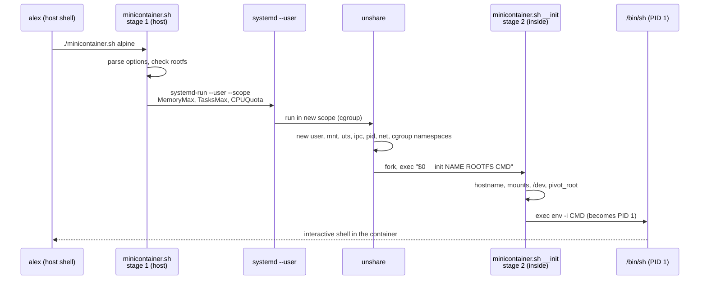

# Level 6 capstone solution

> **Level 6 · Capstone solution** · Task: [Level 6 capstone](../level-6-capstone.md)

Try the capstone yourself before reading this. The value is in the struggle with `pivot_root` errors and missing `/proc` mounts, not in the finished script.

This page has two parts: a complete, tested solution for **option A** (a minimal container), with a step-by-step explanation and verification output for every acceptance criterion, and a **milestone guide for option B** (Linux From Scratch).

## Option A: the minicontainer.sh solution

### Design

The script runs in two stages. The first runs on the host and sets up the cgroup and namespaces; the second runs inside the new namespaces and builds the container's filesystem. The script calls itself to get from one stage to the next.



In **rootless mode** (a normal user, which is the default on Mint), a user namespace maps you to root inside and systemd applies the cgroup limits through a transient scope. In **root mode** (⚠️ VM only), the script creates its own cgroup under `/sys/fs/cgroup`, writes the limit files directly, and can optionally connect the container to the host with a veth pair.

### The script

Save this as `minicontainer.sh` and make it executable (`chmod +x minicontainer.sh`). It's also in the repository as `scripts/minicontainer.sh`.

```bash
#!/usr/bin/env bash
# minicontainer.sh - a minimal container built from unshare, pivot_root and cgroups v2.
#
# Part of the Linux Handbook, Level 6 capstone (option A).
#
# Usage:
#   minicontainer.sh [-m MEM] [-p PIDS] [-c CPU] [-H NAME] [-n] ROOTFS [COMMAND [ARG...]]
#
#   -m MEM    memory limit, cgroup syntax (default: 64M)
#   -p PIDS   maximum number of tasks (default: 32)
#   -c CPU    CPU quota in percent of one CPU (default: 50)
#   -H NAME   hostname inside the container (default: minibox)
#   -n        private network with a veth pair to the host (root only, VM only)
#   ROOTFS    directory holding a root filesystem (for example an Alpine minirootfs)
#   COMMAND   program to run as PID 1 inside the container (default: /bin/sh)
#
# Two modes:
#   * As a normal user (rootless): a user namespace maps you to root inside,
#     and a transient systemd user scope applies the cgroup limits.
#   * As root (VM only): the script writes the cgroup v2 files itself under
#     /sys/fs/cgroup and can wire up a veth pair with -n.

set -euo pipefail

SELF=$(readlink -f "$0")

die() { echo "minicontainer: $*" >&2; exit 1; }

# ---------------------------------------------------------------------------
# Stage 2: runs INSIDE the new namespaces, as (namespaced) root.
# Arguments: __init NAME ROOTFS COMMAND [ARG...]
# ---------------------------------------------------------------------------
container_init() {
    local name=$1 root=$2
    shift 2

    # 1. Our own hostname (UTS namespace).
    hostname "$name"

    # 2. Stop mount events leaking back to the host (mount namespace).
    mount --make-rprivate /

    # 3. pivot_root needs the new root to be a mount point: bind it onto itself.
    mount --bind "$root" "$root"

    # 4. Kernel filesystems. proc shows only our PID namespace.
    mount -t proc -o nosuid,nodev,noexec proc "$root/proc"
    mount -t sysfs -o ro,nosuid,nodev,noexec sysfs "$root/sys"
    mount -t cgroup2 -o nosuid,nodev,noexec cgroup2 "$root/sys/fs/cgroup"
    mount -t tmpfs -o nosuid,nodev,mode=1777,size=16m tmpfs "$root/tmp"

    # 5. A tiny /dev: a tmpfs with a few host device files bind-mounted in.
    #    (Creating device nodes with mknod is not allowed in a user namespace.)
    mount -t tmpfs -o nosuid,noexec,mode=755,size=64k tmpfs "$root/dev"
    local dev
    for dev in null zero full random urandom tty; do
        touch "$root/dev/$dev"
        mount --bind "/dev/$dev" "$root/dev/$dev"
    done
    ln -s /proc/self/fd   "$root/dev/fd"
    ln -s /proc/self/fd/0 "$root/dev/stdin"
    ln -s /proc/self/fd/1 "$root/dev/stdout"
    ln -s /proc/self/fd/2 "$root/dev/stderr"

    # 6. Swap the root filesystem, then detach the old one.
    cd "$root"
    mkdir -p .oldroot
    pivot_root . .oldroot
    cd /
    # From here on, commands come from the container's rootfs.
    umount -l /.oldroot
    rmdir /.oldroot

    # 7. Replace this shell with the container's command. It becomes PID 1.
    export PATH=/usr/local/sbin:/usr/local/bin:/usr/sbin:/usr/bin:/sbin:/bin
    exec env -i PATH="$PATH" HOME=/root TERM="${TERM:-xterm}" HOSTNAME="$name" "$@"
}

if [[ ${1:-} == __init ]]; then
    shift
    container_init "$@"
fi

# ---------------------------------------------------------------------------
# Stage 1: runs on the host.
# ---------------------------------------------------------------------------
MEM=64M
PIDS=32
CPU=50
NAME=minibox
NET=no

usage() { sed -n '6,16p' "$SELF" | sed 's/^# \{0,1\}//'; exit "${1:-0}"; }

while getopts ':m:p:c:H:nh' opt; do
    case $opt in
        m) MEM=$OPTARG ;;
        p) PIDS=$OPTARG ;;
        c) CPU=$OPTARG ;;
        H) NAME=$OPTARG ;;
        n) NET=yes ;;
        h) usage 0 ;;
        :) die "option -$OPTARG needs a value" ;;
        *) die "unknown option -$OPTARG (try -h)" ;;
    esac
done
shift $((OPTIND - 1))

[[ $# -ge 1 ]] || usage 1
ROOTFS=$(readlink -f "$1")
shift
[[ $# -ge 1 ]] || set -- /bin/sh

[[ -x $ROOTFS/bin/sh ]] || die "$ROOTFS does not look like a root filesystem (no /bin/sh)"
for d in proc sys tmp dev; do
    [[ -d $ROOTFS/$d ]] || die "$ROOTFS/$d is missing (mkdir it first)"
done
[[ $PIDS =~ ^[0-9]+$ ]] || die "-p needs a number"
[[ $CPU =~ ^[0-9]+$ ]]  || die "-c needs a number (percent of one CPU)"

# Namespaces every container gets. --fork makes the command a child of
# unshare, so it lands in the new PID namespace as PID 1. --kill-child
# makes sure the container dies if unshare is killed.
NS_FLAGS=(--mount --uts --ipc --pid --cgroup --fork --kill-child)

if [[ $EUID -ne 0 ]]; then
    # ---------------- Rootless mode ----------------
    [[ $NET == no ]] || die "-n needs root (use your VM: sudo $0 -n ...)"
    if [[ $(cat /proc/sys/kernel/apparmor_restrict_unprivileged_userns 2>/dev/null || echo 0) == 1 ]]; then
        echo "minicontainer: warning: kernel.apparmor_restrict_unprivileged_userns=1;" \
             "user namespaces may be blocked (see the Containers chapter)" >&2
    fi
    echo "minicontainer: rootless, limits mem=$MEM pids=$PIDS cpu=${CPU}%" >&2
    exec systemd-run --user --scope --quiet --collect \
        -p MemoryMax="$MEM" -p MemorySwapMax=0 \
        -p TasksMax="$PIDS" -p CPUQuota="${CPU}%" \
        unshare --user --map-root-user --net "${NS_FLAGS[@]}" \
        "$SELF" __init "$NAME" "$ROOTFS" "$@"
fi

# ---------------- Root mode (VM only) ----------------
CG=/sys/fs/cgroup/minicontainer-$$
NETNS=mc$$
VETH=vh$$

# shellcheck disable=SC2329  # invoked via trap below
cleanup() {
    if [[ $NET == yes ]]; then
        ip netns delete "$NETNS" 2>/dev/null || true
        ip link delete "$VETH" 2>/dev/null || true
    fi
    # A cgroup can only be removed once it has no processes left.
    if [[ -d $CG ]]; then
        rmdir "$CG" 2>/dev/null || true
    fi
}
trap cleanup EXIT

# Make sure the root cgroup hands the controllers we need to its children.
for c in memory pids cpu; do
    grep -qw "$c" /sys/fs/cgroup/cgroup.subtree_control ||
        echo "+$c" > /sys/fs/cgroup/cgroup.subtree_control
done

mkdir "$CG"
echo "$MEM"                    > "$CG/memory.max"
echo 0                         > "$CG/memory.swap.max"
echo "$PIDS"                   > "$CG/pids.max"
echo "$((CPU * 1000)) 100000"  > "$CG/cpu.max"
echo "minicontainer: cgroup $CG mem=$MEM pids=$PIDS cpu=${CPU}%" >&2

WRAP=()
if [[ $NET == yes ]]; then
    ip netns add "$NETNS"
    ip link add "$VETH" type veth peer name eth0 netns "$NETNS"
    ip addr add 10.200.0.1/24 dev "$VETH"
    ip link set "$VETH" up
    ip -n "$NETNS" link set lo up
    ip -n "$NETNS" addr add 10.200.0.2/24 dev eth0
    ip -n "$NETNS" link set eth0 up
    ip -n "$NETNS" route add default via 10.200.0.1
    WRAP=(nsenter --net="/run/netns/$NETNS")
    echo "minicontainer: network host 10.200.0.1 <-> container 10.200.0.2" >&2
else
    NS_FLAGS+=(--net)
fi

rc=0
(
    # Move only this subshell into the cgroup, so the parent script can
    # still remove the cgroup afterwards.
    echo "$BASHPID" > "$CG/cgroup.procs"
    exec "${WRAP[@]}" unshare "${NS_FLAGS[@]}" "$SELF" __init "$NAME" "$ROOTFS" "$@"
) || rc=$?
exit "$rc"
```

### Step-by-step explanation

**Stage 1: on the host.**

1. **Option parsing** with `getopts` (from [Arguments and getopts](../../chapters/02-scripting/05-arguments-getopts.md)) sets the memory limit, PID limit, CPU quota, hostname, and network flag. The first remaining argument is the rootfs; anything after it is the command (default `/bin/sh`).
2. **Sanity checks** make sure the rootfs has `/bin/sh` and the four mount-point directories, so failures happen early with a clear message instead of halfway through the mounts.
3. **`NS_FLAGS`** lists the namespaces every container gets: mount, UTS, IPC, PID, and cgroup, plus `--fork` (so the command becomes PID 1) and `--kill-child` (so the container dies if `unshare` is killed).
4. **Rootless mode** `exec`s `systemd-run --user --scope`, which creates a transient scope (a cgroup) under your user manager with `MemoryMax`, `MemorySwapMax=0`, `TasksMax`, and `CPUQuota`. Inside it, `unshare --user --map-root-user --net` creates the user namespace first (so the rest can be created without real root), then the others. `--collect` makes systemd remove the scope even if the container exits with an error. The script warns if Ubuntu's AppArmor restriction on user namespaces is on.
5. **Root mode** (⚠️ VM only) makes sure the root cgroup delegates `memory`, `pids`, and `cpu` to its children, creates `/sys/fs/cgroup/minicontainer-PID`, and writes `memory.max`, `memory.swap.max`, `pids.max`, and `cpu.max` (`CPU × 1000` microseconds per 100,000). With `-n`, it creates a named network namespace and a veth pair (`10.200.0.1` on the host, `10.200.0.2` as `eth0` inside) and uses `nsenter --net=` to start the container in it. Then a **subshell moves only itself** into the cgroup (`echo $BASHPID > cgroup.procs`) and `exec`s `unshare`. The parent script stays outside the cgroup, so its `EXIT` trap can `rmdir` the cgroup and delete the network namespace afterwards.

**Stage 2: inside the namespaces (`__init`).** At this point the process is PID 1 of a new PID namespace and "root" in its own user namespace.

1. **`hostname "$name"`** sets the hostname in the new UTS namespace.
2. **`mount --make-rprivate /`** stops mount events propagating back to the host.
3. **`mount --bind "$root" "$root"`** makes the rootfs a mount point, which `pivot_root` requires.
4. **Kernel filesystems**: a fresh `proc` (it shows only the new PID namespace), a read-only `sysfs`, `cgroup2` on `/sys/fs/cgroup` (thanks to the cgroup namespace it shows the container's own cgroup as the root), and a size-limited `tmpfs` on `/tmp`. All are mounted with `nosuid`/`nodev`/`noexec` where sensible.
5. **`/dev`** is a 64 KB tmpfs with six harmless device files bind-mounted from the host, plus the `fd`, `stdin`, `stdout`, and `stderr` symlinks programs expect. A user namespace can't create device nodes with `mknod`, and the container gets no access to disks or `/dev/mem`.
6. **`pivot_root . .oldroot`** makes the rootfs `/`. From here on, external commands come from the container. `umount -l /.oldroot` and `rmdir /.oldroot` remove the host's filesystem from the container's mount table entirely.
7. **`exec env -i ... "$@"`** replaces the script with the requested command, with a clean environment. Because of `exec`, the command is PID 1.

### Verification

All of this runs rootless on Mint 22 as user `alex`, in `~/lab/capstone`, with the Alpine 3.20.3 minirootfs in `./alpine`.

**Script quality:**

```bash
shellcheck minicontainer.sh && echo "shellcheck: clean"
./minicontainer.sh -h
```

```text
shellcheck: clean
Usage:
  minicontainer.sh [-m MEM] [-p PIDS] [-c CPU] [-H NAME] [-n] ROOTFS [COMMAND [ARG...]]

  -m MEM    memory limit, cgroup syntax (default: 64M)
  -p PIDS   maximum number of tasks (default: 32)
  -c CPU    CPU quota in percent of one CPU (default: 50)
  -H NAME   hostname inside the container (default: minibox)
  -n        private network with a veth pair to the host (root only, VM only)
  ROOTFS    directory holding a root filesystem (for example an Alpine minirootfs)
  COMMAND   program to run as PID 1 inside the container (default: /bin/sh)
```

**Hostname:**

```bash
./minicontainer.sh alpine hostname
./minicontainer.sh -H lab1 alpine hostname
hostname
```

```text
minicontainer: rootless, limits mem=64M pids=32 cpu=50%
minibox
minicontainer: rootless, limits mem=64M pids=32 cpu=50%
lab1
mint
```

The status line goes to stderr, so it doesn't mix with the command's output if you pipe it. The host's hostname is unchanged.

**PID 1, interactively:**

```bash
./minicontainer.sh alpine
```

```console
/ # echo $$
1
/ # ps
PID   USER     TIME  COMMAND
    1 root      0:00 /bin/sh
   26 root      0:00 ps
/ # id
uid=0(root) gid=0(root) groups=65534(nobody),65534(nobody),...,0(root)
/ # exit
```

The shell is PID 1 and `ps` sees only the container. `ps` is PID 26 because the mounts, `touch`es, and `rmdir` in stage 2 already used PIDs 2–25 inside the new namespace. `id` says root, but supplementary groups that aren't mapped into the user namespace show up as `nobody`: this "root" has no power over host files.

**Root filesystem and mounts:**

```bash
./minicontainer.sh alpine sh -c 'cat /etc/alpine-release; ls -A /home; ls /.oldroot; cat /proc/mounts | cut -d" " -f1-3'
```

```text
minicontainer: rootless, limits mem=64M pids=32 cpu=50%
3.20.3
ls: /.oldroot: No such file or directory
/dev/sda2 / ext4
proc /proc proc
sysfs /sys sysfs
cgroup2 /sys/fs/cgroup cgroup2
tmpfs /tmp tmpfs
tmpfs /dev tmpfs
udev /dev/null devtmpfs
udev /dev/zero devtmpfs
udev /dev/full devtmpfs
udev /dev/random devtmpfs
udev /dev/urandom devtmpfs
udev /dev/tty devtmpfs
```

- The Alpine release file proves `/` is the rootfs.
- `ls -A /home` prints nothing: Alpine's empty `/home`, not yours.
- The old root is gone.
- The mount table has only the container's mounts. The first line names the host device that holds `~/lab/capstone/alpine` (yours may be `/dev/nvme0n1p2` or similar), because the rootfs is a bind mount of a directory on it. No host paths appear.

**cgroup limits visible inside:**

```bash
./minicontainer.sh alpine sh -c 'cat /proc/self/cgroup; cd /sys/fs/cgroup; cat memory.max memory.swap.max pids.max cpu.max'
```

```text
minicontainer: rootless, limits mem=64M pids=32 cpu=50%
0::/
67108864
0
32
50000 100000
```

`0::/` shows the cgroup namespace at work: the container thinks it's at the root of the tree. The four files match `-m 64M`, no swap, `-p 32`, and `-c 50`.

**Memory limit enforced:**

```bash
./minicontainer.sh -m 32M alpine sh -c 'dd if=/dev/zero of=/dev/null bs=100M count=1; echo "dd exit status: $?"; grep -E "^(max|oom_kill) " /sys/fs/cgroup/memory.events'
journalctl -k -n 1 --no-pager
```

```text
minicontainer: rootless, limits mem=32M pids=32 cpu=50%
Killed
dd exit status: 137
max 38
oom_kill 1
Oct 02 15:21:44 mint kernel: Memory cgroup out of memory: Killed process 25311 (dd) total-vm:104804kB, anon-rss:32128kB, file-rss:928kB, shmem-rss:0kB, UID:1000 pgtables:120kB oom_score_adj:0
```

`dd` tried to allocate a 100 MB buffer in a 32 MB cgroup and was killed by the OOM killer (137 = 128 + `SIGKILL`). `max 38` counts the times usage hit the limit before the kill. The shell (PID 1) survived because it was small; only the biggest process was chosen. The host's kernel log has the matching `Memory cgroup out of memory` line, with UID 1000: it's still alex's process from the host's point of view.

**PID limit enforced:**

```bash
./minicontainer.sh -p 8 alpine sh -c 'sh -c "for i in 1 2 3 4 5 6 7 8 9 10 11 12; do sleep 2 & done; wait"; echo "pids.peak=$(cat /sys/fs/cgroup/pids.peak)"; cat /sys/fs/cgroup/pids.events'
```

```text
minicontainer: rootless, limits mem=64M pids=8 cpu=50%
sh: can't fork: Resource temporarily unavailable
pids.peak=8
max 1
```

The inner shell hit the 8-task ceiling and BusyBox `sh` gave up with `can't fork` (`EAGAIN`). The loop runs in a child `sh -c` so that the outer shell survives to print the counters. A fork bomb in this container would stop at 8 tasks.

**CPU limit (stretch):**

```bash
./minicontainer.sh -c 25 alpine sh -c 'timeout 4 sh -c "while :; do :; done"; grep -E "usage_usec|nr_periods|nr_throttled|throttled_usec" /sys/fs/cgroup/cpu.stat'
```

```text
minicontainer: rootless, limits mem=64M pids=32 cpu=25%
Terminated
usage_usec 1096009
nr_periods 44
nr_throttled 44
throttled_usec 3250760
```

A busy loop ran for 4 seconds of wall-clock time but got only about 1.1 seconds of CPU (`usage_usec`): 25%, as configured. It was throttled in every one of the 44 scheduling periods (`nr_throttled`), for a total of 3.25 seconds.

**Isolated network:**

```bash
./minicontainer.sh alpine ip link
```

```text
minicontainer: rootless, limits mem=64M pids=32 cpu=50%
1: lo: <LOOPBACK> mtu 65536 qdisc noop qlen 1000
    link/loopback 00:00:00:00:00:00 brd 00:00:00:00:00:00
```

**Namespaces seen from the host.** Start a long-running container in one terminal:

```bash
./minicontainer.sh alpine sleep 300
```

In another:

```bash
P=$(pgrep -n -x sleep)
lsns -p "$P" -o NS,TYPE,PID,COMMAND
readlink /proc/self/ns/pid /proc/"$P"/ns/pid
cat /proc/"$P"/cgroup
```

```text
        NS TYPE      PID COMMAND
4026531834 time     1325 /usr/lib/systemd/systemd --user
4026533163 user    25480 /usr/bin/unshare --user --map-root-user --net --mount -
4026533195 mnt     25480 /usr/bin/unshare --user --map-root-user --net --mount -
4026533197 uts     25480 /usr/bin/unshare --user --map-root-user --net --mount -
4026533198 ipc     25480 /usr/bin/unshare --user --map-root-user --net --mount -
4026533199 pid     25486 └─sleep 300
4026533200 cgroup  25480 /usr/bin/unshare --user --map-root-user --net --mount -
4026533201 net     25480 /usr/bin/unshare --user --map-root-user --net --mount -
pid:[4026531836]
pid:[4026533199]
0::/user.slice/user-1000.slice/user@1000.service/app.slice/run-r3f0a5c2e9d7b4e61a0c2f1d8e5b7a903.scope
```

Seven of the eight namespace types are new (only `time` is shared with the host, which we didn't unshare). The `unshare` process (25480) is in all of them except the PID namespace, because unsharing a PID namespace only affects children. That's exactly why `--fork` exists. The host sees the container's real cgroup path, while inside it's `0::/`.

**Clean exit.** After the container exits:

```bash
findmnt | grep -c alpine
systemctl --user list-units --all --no-legend 'run-r*'
```

```text
0
```

No mounts leaked (they lived only in the container's mount namespace, which died with its last process), and `--collect` removed the transient scope.

### Root mode and networking (stretch, ⚠️ VM only)

!!! danger "⚠️ VM only"
    Run root mode only in your throwaway VM. It writes directly to the root of the cgroup tree, creates network interfaces and namespaces, and the container's root is real root (there's no user namespace in this mode).

Copy the script and the Alpine rootfs to the VM. Extract the rootfs as root there (`sudo tar -xzf ... -C alpine`), so the files are owned by root as Alpine expects. Then, in one VM terminal:

```bash
sudo ./minicontainer.sh -n -m 128M alpine
```

```console
minicontainer: cgroup /sys/fs/cgroup/minicontainer-4120 mem=128M pids=32 cpu=50%
minicontainer: network host 10.200.0.1 <-> container 10.200.0.2
/ # ip addr
1: lo: <LOOPBACK,UP,LOWER_UP> mtu 65536 qdisc noqueue qlen 1000
    link/loopback 00:00:00:00:00:00 brd 00:00:00:00:00:00
    inet 127.0.0.1/8 scope host lo
       valid_lft forever preferred_lft forever
2: eth0@if7: <BROADCAST,MULTICAST,UP,LOWER_UP,M-DOWN> mtu 1500 qdisc noqueue qlen 1000
    link/ether d6:f3:2b:41:9a:10 brd ff:ff:ff:ff:ff:ff
    inet 10.200.0.2/24 scope global eth0
       valid_lft forever preferred_lft forever
/ # ping -c 1 10.200.0.1
PING 10.200.0.1 (10.200.0.1): 56 data bytes
64 bytes from 10.200.0.1: seq=0 ttl=64 time=0.071 ms
```

In a second VM terminal, while the container runs:

```bash
ls -d /sys/fs/cgroup/minicontainer-*
cat /sys/fs/cgroup/minicontainer-*/memory.max
ip -brief addr show | grep vh
ping -c 1 10.200.0.2
```

```text
/sys/fs/cgroup/minicontainer-4120
134217728
vh4120@if2       UP             10.200.0.1/24 fe80::8c2e:61ff:fe0a:44b2/64
64 bytes from 10.200.0.2: icmp_seq=1 ttl=64 time=0.052 ms
```

`eth0@if7` and `vh4120@if2` are the two ends of the same veth pair: each `@ifN` names the interface index of its peer. After you `exit` the container, the `EXIT` trap deletes the network namespace (which destroys both veth ends) and removes the cgroup directory:

```bash
ls -d /sys/fs/cgroup/minicontainer-* 2>/dev/null | wc -l
ip netns list | wc -l
```

```text
0
0
```

To give the container internet access, you'd also need `net.ipv4.ip_forward=1`, a NAT masquerade rule for `10.200.0.0/24`, and an `/etc/resolv.conf` inside the rootfs: see the veth section of [Containers from scratch](../../chapters/06-expert/01-containers-from-scratch.md).

### What this container still lacks

Compare it with what runc does, to see what "production-grade" adds:

- **Capability dropping.** In root mode the container's root has every capability. runc keeps only 14 by default (`capsh --drop=...` or `setpriv --bounding-set` could do this).
- **seccomp and AppArmor.** No system call filter and no MAC profile.
- **A proper init.** Our PID 1 is whatever command you run. If it doesn't reap zombies or handle `SIGTERM`, the container misbehaves. Tools like `tini` exist for exactly this.
- **Image layers.** We run directly on an extracted rootfs, so changes are permanent. An overlayfs mount with a throwaway upper directory would give each run a fresh copy.
- **User-namespace ID ranges.** We map one UID. Real rootless runtimes map 65,536 IDs using `newuidmap` and `/etc/subuid`, so packages that create users work inside.
- **Rootless networking.** Podman uses `pasta` or `slirp4netns` to give rootless containers internet access without root.

Each of these is a good next project.

## Option B: Linux From Scratch milestone guide

There's no single "answer" for LFS: the book is the walkthrough, and you should follow it exactly. This guide gives you a check for each milestone, the mistakes that most often cause trouble there, and what you should understand before moving on. Chapter numbers refer to current LFS (12.x) books.

### Milestone 1: host ready (chapter 2)

**Check:**

```bash
bash version-check.sh | grep -v OK
echo "$LFS"
findmnt "$LFS"
```

The first command should print nothing except possibly a line about aliases; every tool should be `OK`. `$LFS` is `/mnt/lfs` and is a mounted ext4 filesystem on its own partition.

**Common trouble:** `/bin/sh` must point to `bash`, not `dash`, on Ubuntu hosts (the book's check catches this; fix it with `sudo ln -sf bash /bin/sh` in the VM). Missing `texinfo`, `bison`, or `gawk` packages on the host.

**Understand:** why LFS needs its own partition, and what `$LFS` is used for in every later command.

### Milestone 2: sources downloaded (chapter 3)

**Check:**

```bash
cd "$LFS/sources" && md5sum -c md5sums | grep -v ': OK$'
```

Prints nothing when every package downloaded correctly.

**Common trouble:** a mirror serving an HTML error page instead of a tarball. `md5sum` catches it.

### Milestone 3: build environment (chapter 4)

**Check (as the `lfs` user):**

```bash
whoami; echo "$LFS $LFS_TGT"; echo "$PATH"; set +h; echo "$MAKEFLAGS"
```

`whoami` prints `lfs`, `LFS_TGT` is like `x86_64-lfs-linux-gnu`, and `$LFS/tools/bin` comes first in `PATH`.

**Common trouble:** building as root by accident. Every chapter 5–6 command must run as `lfs`; a root build can overwrite host files.

**Understand:** why the book wipes the environment (`env -i` in `.bash_profile`) so host settings can't leak into the build.

### Milestone 4: cross toolchain (chapter 5)

**Check:** the book's sanity test after Glibc:

```bash
echo 'int main(){}' | "$LFS_TGT-gcc" -xc -
readelf -l a.out | grep ld-linux
```

```text
      [Requesting program interpreter: /lib64/ld-linux-x86-64.so.2]
```

**Common trouble:** skipping a package's `mkdir -v build; cd build` step; running a later step in a stale directory; forgetting `--with-sysroot=$LFS`.

**Understand:** what a **cross-compiler** is (a compiler that builds programs for a different target, here the `x86_64-lfs-linux-gnu` triplet) and why it's the trick that isolates the new system from the host's libraries.

### Milestone 5: temporary tools (chapter 6)

**Check:** the cross-compiled tools exist in the new tree:

```bash
ls "$LFS/usr/bin" | head
file "$LFS/usr/bin/bash"
```

`file` reports a dynamically linked x86-64 executable with interpreter `/lib64/ld-linux-x86-64.so.2`.

**Understand:** these tools are built *with* the cross toolchain but *for* the new system; they're enough to work inside a chroot.

### Milestone 6: into chroot (chapter 7)

**Check (inside chroot):**

```bash
ls /
cat /etc/passwd | head -3
gcc --version | head -1
```

You see the new system's root, the minimal `passwd` file you created, and the temporary GCC.

**Common trouble:** after a reboot, forgetting to mount the virtual kernel filesystems (`/dev`, `/dev/pts`, `/proc`, `/sys`, `/run`) before re-entering chroot. Many builds then fail in odd ways. Write a small script that mounts them and enters chroot, and use it every time.

**Understand:** how `chroot` here relates to [Containers from scratch](../../chapters/06-expert/01-containers-from-scratch.md): it's the same "different `/`" idea, without namespaces. **Back up `$LFS` now** (the book shows how): it's the most valuable restore point.

### Milestone 7: base system (chapter 8)

**Check:** the critical test suites pass. Save their logs:

```bash
make check 2>&1 | tee /sources/glibc-check.log | tail
```

For Glibc, GCC, and Binutils, compare failures against the book's list of known failures. After GCC, run the book's sanity checks again (compiling a dummy program and checking which `crt*.o` files and include paths it uses).

**Common trouble:** running out of disk space during the GCC test suite; skipping a package because "it built fine last time"; not stripping debug symbols and running out of space.

**Understand:** what Glibc, GCC, Binutils, Coreutils, Util-linux, and systemd (or SysVinit) each provide. These are the packages behind every command in this handbook.

### Milestone 8: system configuration (chapter 9)

**Check:** the files you wrote:

```bash
cat /etc/hostname /etc/hosts /etc/fstab
ls /etc/systemd/network/ 2>/dev/null || cat /etc/sysconfig/ifconfig.*
```

**Common trouble:** the wrong network interface name (check what the VM calls it with `ip link` on the host, and remember the LFS kernel may name it differently); `/etc/fstab` pointing at the wrong partition.

### Milestone 9: kernel and bootloader (chapter 10)

**Check:**

```bash
ls -l /boot
grep -E 'CONFIG_EXT4_FS=|CONFIG_DEVTMPFS=|CONFIG_VIRTIO_BLK=' /usr/src/linux-*/.config
grep -A6 menuentry /boot/grub/grub.cfg
```

`/boot` contains your `vmlinuz-...-lfs-...`, `System.map`, and `config`. Drivers for your root disk and filesystem must be `=y` (built in), because there's no initramfs. On a QEMU/KVM VM that usually means `CONFIG_VIRTIO_BLK=y` and `CONFIG_VIRTIO_PCI=y`.

**Common trouble:** the root disk driver built as a module (`=m`); a `root=` in `grub.cfg` that names the wrong partition; installing GRUB to the host's disk instead of the LFS disk (snapshot first!).

**Understand:** everything you learned in [Kernel basics](../../chapters/06-expert/04-kernel-basics.md) and [The boot process](../../chapters/03-internals/01-boot-process.md) is now concrete: you chose the command line, the built-in drivers, and the bootloader entry yourself.

### Milestone 10: first boot (chapter 11)

**Check (on the booted LFS system):**

```bash
cat /etc/lfs-release
uname -a
cat /proc/cmdline
gcc --version | head -1
ldd --version | head -1
ip addr
```

**Common trouble:** `Kernel panic - not syncing: VFS: Unable to mount root fs on unknown-block(0,0)`. The `(0,0)` means the kernel found no usable root disk at all: almost always a missing built-in disk driver. `unknown-block(8,2)` with a real number means the driver works but the filesystem type isn't built in, or `root=` is wrong.

When it boots, you've built a Linux system from nothing but source code. From here, [Beyond Linux From Scratch](https://www.linuxfromscratch.org/blfs/) adds SSH, a package manager, Python, a desktop, and more.
