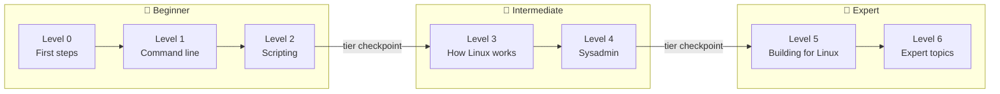

---
hide:
  - navigation
  - toc
---

# The Linux Handbook

## From your first `ls` to building containers from scratch

A hands-on handbook that takes you from zero Linux knowledge to expert level.
You'll learn to work fast at the command line, understand what the system is
doing underneath, and build scripts, services, and programs that run well on
Linux. Every command runs on **Linux Mint 22.3 / Ubuntu 24.04**, and every
level ends with a capstone that proves the skills.

[Start here](start-here.md){ .md-button .md-button--primary }
[See the full roadmap](roadmap.md){ .md-button }
[Set up your lab](lab-setup.md){ .md-button }

## Three tiers, seven levels

The handbook has **54 chapters** in seven levels, grouped into three tiers.
Each tier has a clear goal and a checkpoint that tells you when you're ready
for the next one.

-   :material-sprout:{ .lg .middle } **🌱 Beginner: Levels 0–2**

    ---

    **Goal: fluency.** Go from never having opened a terminal to moving
    around any system, slicing through logs with pipelines, editing in vim,
    and writing robust bash scripts.

    - Level 0: First steps
    - Level 1: Command-line fluency
    - Level 2: Shell scripting

    [:octicons-arrow-right-24: Beginner tier](tiers/beginner.md)

-   :material-wrench:{ .lg .middle } **🔧 Intermediate: Levels 3–4**

    ---

    **Goal: understanding, then operations.** Learn how boot, processes,
    memory, and filesystems really work, then run real servers: systemd,
    networking, firewalls, SSH, disks, logs, and TLS.

    - Level 3: How Linux works
    - Level 4: System administration

    [:octicons-arrow-right-24: Intermediate tier](tiers/intermediate.md)

-   :material-rocket-launch:{ .lg .middle } **🚀 Expert: Levels 5–6**

    ---

    **Goal: building and mastery.** Write software that works with the
    kernel, then master containers, performance analysis, security,
    virtualization, and automation.

    - Level 5: Building for Linux
    - Level 6: Expert topics

    [:octicons-arrow-right-24: Expert tier](tiers/expert.md)

## The learning path

Each level ends with a **capstone**: a larger hands-on project that proves
you can use the skills, not just recognize them.

The [full roadmap](roadmap.md) lists every chapter and the concepts it
teaches.

## The seven levels

-   :material-shoe-print:{ .lg .middle } **Level 0: First steps**

    ---

    What Linux is, the terminal and shell, your first commands, getting
    help without a browser, the filesystem layout, users, and `sudo`.

    [:octicons-arrow-right-24: Start](chapters/00-first-steps/index.md)

-   :material-console:{ .lg .middle } **Level 1: Command line**

    ---

    Files, globbing, permissions, pipes, `grep`/`sed`/`awk`, finding files,
    shell productivity, archives, vim, and tmux.

    [:octicons-arrow-right-24: Start](chapters/01-command-line/index.md)

-   :material-script-text-outline:{ .lg .middle } **Level 2: Scripting**

    ---

    Bash scripts that are safe and maintainable: quoting, arrays, control
    flow, error handling, `getopts`, and when to switch to Python.

    [:octicons-arrow-right-24: Start](chapters/02-scripting/index.md)

-   :material-chip:{ .lg .middle } **Level 3: How Linux works**

    ---

    Boot, processes and signals, memory and the page cache, inodes and
    links, `/proc` and `/sys`, and how software gets installed.

    [:octicons-arrow-right-24: Start](chapters/03-internals/index.md)

-   :material-server:{ .lg .middle } **Level 4: Sysadmin**

    ---

    systemd, scheduling, networking, firewalls, SSH, disks and backups,
    users and PAM, logging, LVM and RAID, web servers and TLS, and
    troubleshooting.

    [:octicons-arrow-right-24: Start](chapters/04-sysadmin/index.md)

-   :material-code-braces:{ .lg .middle } **Level 5: Building for Linux**

    ---

    System calls, file descriptors, processes and signals in code, pipes
    and sockets, services, building native software, and debugging.

    [:octicons-arrow-right-24: Start](chapters/05-programming/index.md)

-   :material-atom:{ .lg .middle } **Level 6: Expert topics**

    ---

    Containers from scratch, performance, security, kernel basics, advanced
    networking, virtualization, Docker and Podman, and Ansible.

    [:octicons-arrow-right-24: Start](chapters/06-expert/index.md)

-   :material-flag-checkered:{ .lg .middle } **Capstones**

    ---

    Seven projects, one per level. Don't move on until the capstone works
    without notes.

    [:octicons-arrow-right-24: See all capstones](exercises/index.md)

## Three goals

Every chapter serves at least one of these.

| Goal | What it means |
|---|---|
| :material-keyboard-outline: **Fluency** | Get comfortable with the command line and become fast at everyday tasks. |
| :material-cogs: **Understanding** | Learn how Linux actually works underneath: boot, kernel, processes, memory, filesystems, networking. |
| :material-hammer-wrench: **Building** | Write scripts, programs, and services that run well on Linux. |

## Who this is for

This handbook is for you if:

- You have **never used Linux**, or you only copy commands from the internet
  and want to understand what they do.
- You are a **developer or data person** whose code, pipelines, or databases
  run on Linux servers, and you want to stop feeling lost when you SSH in.
- You want to go **deep**: not just "which command", but how the kernel,
  shell, and system services fit together.

You don't need any prior Linux knowledge. Each chapter builds only on the
chapters before it, and every new term is defined the first time it appears.
Already comfortable with the shell? [Start here](start-here.md) explains how
to find your starting level.

## How each chapter is organized

Every chapter follows the same five parts, so you always know where to look.

| Part | What you get |
|---|---|
| **1. Why it matters** | A short, real situation where this knowledge saves time or prevents a mistake. |
| **2. Concepts** | The ideas in plain language, with diagrams, including how things work underneath. |
| **3. Commands and examples** | Runnable commands with real output, explained line by line. |
| **4. Exercises** | 3–5 hands-on tasks, from easy to hard, each with a hidden solution. |
| **5. Check yourself** | Questions to answer without notes, with hidden answers. |

Each chapter closes with **key takeaways** and a link to what comes next.

## Practice safely: the ⚠️ VM only rule

Some exercises delete system files, partition disks, change firewall rules,
or tune kernel settings. On your main machine, a mistake there can cost you a
working system or your data. Those steps are always marked like this:

!!! danger "⚠️ VM only"
    Run this in your throwaway VM, never on your main machine. A mistake here
    can leave the system unbootable or lock you out.

Set up a practice VM before you reach Level 3. The
[lab setup guide](lab-setup.md) walks you through it, including snapshots so
you can undo any damage in seconds.

## Ready?

Read [how to use this handbook](start-here.md) first. It takes ten minutes
and makes the rest of the handbook far more effective.

[Start here](start-here.md){ .md-button .md-button--primary }
[Cheat sheets](cheatsheets/index.md){ .md-button }
