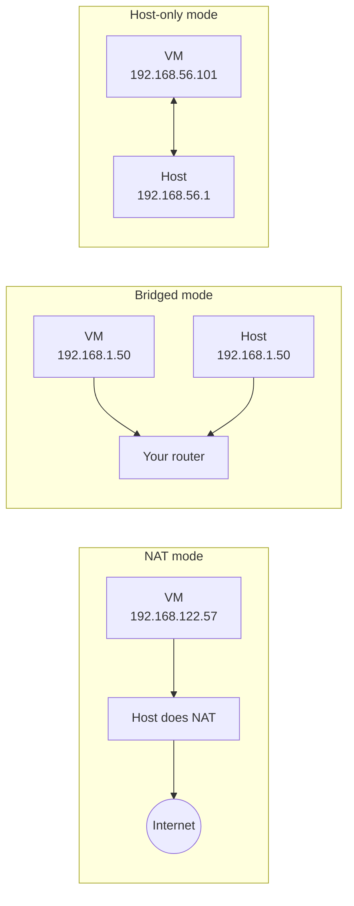

# Set Up Your Practice Lab

A good lab lets you break things without fear. This page shows you how to
build one: a **virtual machine** for risky work, plus a properly set up main
machine for everyday exercises.

## Why a VM?

A **virtual machine (VM)** is a complete computer simulated in software. It
has its own virtual CPU, memory, disk, and network card, and it runs its own
operating system, called the **guest**. Your real computer is the **host**.
The program that runs VMs is a **hypervisor**.

For learning Linux, a VM gives you four things your main machine can't:

- **Safety.** You can delete `/etc`, break the bootloader, or lock yourself
  out with a firewall rule. The host is untouched.
- **Undo.** A **snapshot** saves the VM's exact state. When you break
  something, you roll back in seconds instead of reinstalling.
- **A real server.** Ubuntu Server in a VM behaves like a cloud server: no
  desktop, accessed over SSH. That's exactly what the Level 4 capstone needs.
- **A clean slate.** You can build a fresh machine to prove your setup
  scripts work from scratch.

!!! danger "⚠️ VM only means VM only"
    Anything marked **⚠️ VM only** in this handbook must run in a VM, never on
    your main machine. Set up your VM before you reach Level 3.

## Choose your hypervisor

| Your host | Best choice | Alternatives |
|---|---|---|
| Linux (Mint, Ubuntu) | **virt-manager with KVM** | GNOME Boxes (simplest), VirtualBox, Multipass |
| Windows 10/11 | **VirtualBox** | Hyper-V (Pro/Enterprise/Education), WSL2 for everyday practice |
| macOS on Apple Silicon (M1 and later) | **UTM** | Multipass, VMware Fusion, Parallels (paid) |
| macOS on Intel | **VirtualBox** or UTM | Multipass |
| No spare RAM or disk | A cheap **cloud VPS** | See [Cloud alternatives](#cloud-alternatives) |

A quick description of each:

**KVM, QEMU, and virt-manager (Linux hosts).**
:   **KVM** (Kernel-based Virtual Machine) is a part of the Linux kernel that
    turns Linux itself into a hypervisor. **QEMU** emulates the virtual
    hardware. **libvirt** is a management service, and **virt-manager** is its
    graphical front end. It's fast, free, and the same stack many clouds use.

**GNOME Boxes (Linux hosts).**
:   A very simple front end for the same QEMU/KVM stack. Good if virt-manager
    feels like too many buttons, but it hides the networking options you'll
    want later.

**VirtualBox (Windows, Intel Mac, Linux).**
:   A free, cross-platform hypervisor from Oracle. Easy to use and well
    documented. On Linux hosts it needs its own kernel module.

**UTM (Apple Silicon Macs).**
:   A friendly front end for QEMU on macOS. Apple Silicon Macs have ARM CPUs,
    so install the **ARM64 (AArch64)** build of Ubuntu Server. Linux Mint has
    no ARM build, so use Ubuntu Server or Ubuntu Desktop for ARM instead.

**Hyper-V (Windows Pro, Enterprise, Education).**
:   Microsoft's built-in hypervisor. Fast, and its "Quick Create" can download
    Ubuntu for you.

**Multipass (Linux, Windows, macOS).**
:   Canonical's tool for launching Ubuntu VMs with one command. Perfect for a
    quick throwaway server, but it only runs Ubuntu and has no desktop.

**WSL2 (Windows).**
:   The **Windows Subsystem for Linux** runs a real Linux kernel in a
    lightweight VM managed by Windows. It's great for daily command-line
    practice, but it is *not* a normal Linux machine. See the caveats below.

!!! warning "Pick one hypervisor on Linux"
    KVM and VirtualBox both want exclusive use of your CPU's virtualization
    features. On recent kernels, VirtualBox may refuse to start a VM while the
    KVM modules are loaded. On a Linux host, use virt-manager unless you have
    a specific reason to choose VirtualBox.

### WSL2 caveats

WSL2 is excellent for Levels 0–2, but it differs from a real installation in
ways that matter later:

- **No real boot.** There's no firmware, no GRUB, and no boot process you
  control. Windows starts the Linux kernel directly. The boot chapter's
  exercises don't apply.
- **A different init.** WSL traditionally used its own minimal init instead
  of systemd. Current Ubuntu images enable systemd by default (set in
  `/etc/wsl.conf` with `systemd=true` under `[boot]`), but behavior around
  services, timers, and shutdown still differs from a real machine.
- **Microsoft's kernel.** You can't freely load kernel modules or change
  many kernel settings.
- **Different networking.** WSL2 sits behind a virtual NAT managed by
  Windows. Firewall rules and listening ports don't behave like a normal
  server's.
- **Slow cross-filesystem access.** Files under `/mnt/c` live on the Windows
  drive and are much slower than files in your Linux home directory.

Use WSL2 for fluency practice, and a real VM from Level 3 onward. To install
it, run this in an administrator PowerShell, then reboot:

```powershell
wsl --install -d Ubuntu-24.04
```

## Check that your CPU supports virtualization

Hardware virtualization (Intel **VT-x** or AMD **AMD-V**) makes VMs fast. It
must be supported by the CPU and enabled in your firmware (BIOS/UEFI)
settings. On a Linux host, check with:

```bash
grep -Ec '(vmx|svm)' /proc/cpuinfo
```

```text
8
```

Any number above `0` means the CPU supports it (the number is how many CPU
threads report the feature). `0` means it's unsupported or disabled in the
firmware. Reboot into your firmware setup and look for "Intel Virtualization
Technology", "VT-x", "SVM Mode", or "AMD-V".

Then check that the KVM device exists:

```bash
ls -l /dev/kvm
```

```text
crw-rw----+ 1 root kvm 10, 232 Oct  2 09:35 /dev/kvm
```

## Option A: virt-manager and KVM on Mint (recommended)

### 1. Install the packages

```bash
sudo apt update
sudo apt install -y virt-manager qemu-system-x86 qemu-utils libvirt-daemon-system libvirt-clients
```

What each package provides:

| Package | Provides |
|---|---|
| `virt-manager` | The graphical VM manager |
| `qemu-system-x86` | QEMU, the emulator that runs x86 VMs with KVM acceleration |
| `qemu-utils` | `qemu-img`, for creating and converting disk images |
| `libvirt-daemon-system` | The libvirt service (`libvirtd`) and its default NAT network |
| `libvirt-clients` | `virsh`, the command-line tool for libvirt |

### 2. Join the libvirt and kvm groups

Members of the `libvirt` group can manage system VMs without `sudo`:

```bash
sudo usermod -aG libvirt,kvm "$USER"
```

The `-a` flag means *append*. Without it, `usermod -G` replaces all your
groups, which can remove you from `sudo`. Group changes take effect at your
next login, so **log out and log back in**, then check:

```bash
groups
```

```text
alex adm cdrom sudo dip plugdev kvm lpadmin libvirt sambashare
```

### 3. Check the default network

```bash
virsh -c qemu:///system net-list --all
```

```text
 Name      State    Autostart   Persistent
--------------------------------------------
 default   active   yes         yes
```

The `default` network is a NAT network (`192.168.122.0/24`) that gives VMs
internet access. If it shows `inactive`, start it and make it start at boot:

```bash
virsh -c qemu:///system net-start default
virsh -c qemu:///system net-autostart default
```

### 4. Create a VM

1. Download an ISO (see [Install Ubuntu Server](#install-ubuntu-server-2404)
   below).
2. Open **Virtual Machine Manager** from the menu.
3. Click **Create a new virtual machine** → **Local install media** →
   **Browse** to the ISO. Leave "Automatically detect" on, or pick
   "Ubuntu 24.04".
4. Set memory and CPUs (see [Resource sizing](#resource-sizing)).
5. Create a disk image (20–25 GB for a server). The image is a **qcow2**
   file that grows as the VM writes data, so it doesn't use the full size
   right away.
6. Name the VM `lab`, keep the network on **Virtual network 'default': NAT**,
   and click **Finish**.

!!! tip "If the ISO is in your home directory"
    virt-manager may warn that the `libvirt-qemu` user can't read your
    Downloads folder and offer to fix the permissions. Accept, or move ISOs
    to `/var/lib/libvirt/images/`.

## Option B: VirtualBox

### On a Mint host

```bash
sudo apt update
sudo apt install -y virtualbox virtualbox-ext-pack
sudo usermod -aG vboxusers "$USER"
```

Log out and back in for the group change. The `virtualbox-ext-pack` package
asks you to accept a license; it adds USB 2/3 passthrough and similar
extras, and you can skip it.

!!! warning "Secure Boot and kernel modules"
    VirtualBox needs kernel modules that are built when you install it. If
    your PC uses Secure Boot, the installer asks you to set a password and
    enroll a **MOK** (Machine Owner Key) at the next reboot. Follow the blue
    screen at boot, or the modules won't load. If the Ubuntu package's
    module fails to build on a newer kernel, install the current release from
    virtualbox.org instead.

### On Windows or an Intel Mac

Download the installer from virtualbox.org and run it.

### Create a VM

1. Click **New**. Name it `lab`, choose the ISO, and set the type to
   **Linux / Ubuntu (64-bit)**.
2. Tick **Skip Unattended Installation**, so you do the install yourself
   and learn what each step means.
3. Give it memory, CPUs, and a 25 GB **dynamically allocated** disk.
4. Before starting, open **Settings → Network** and review the adapter
   mode (see [Networking modes](#networking-modes)).
5. Click **Start**.

## Option C: Multipass for a quick Ubuntu server

Multipass gives you a fresh Ubuntu server in about a minute. On Linux it is
distributed as a **snap** package.

!!! note "Snaps on Mint"
    Linux Mint blocks `snapd` by default with the file
    `/etc/apt/preferences.d/nosnap.pref`. To use Multipass on Mint, you must
    remove that file and install `snapd` first. Read the Mint documentation
    on snap before doing that, or use virt-manager instead.

```bash
sudo snap install multipass
multipass launch 24.04 --name lab --cpus 2 --memory 2G --disk 20G
multipass list
multipass shell lab
```

```text
Name                    State             IPv4             Image
lab                     Running           10.88.125.214    Ubuntu 24.04 LTS
```

When you're done with it:

```bash
multipass stop lab
multipass delete lab
multipass purge
```

Multipass can't show a desktop and hides the install process, so use a full
VM for the boot and disk chapters.

## Install Ubuntu Server 24.04

Ubuntu Server is the best guest for this handbook's VM work. It has no
desktop, it boots fast, it needs little memory, and it matches what you'll
meet on real servers. It's the right base for the
[Level 4 capstone](exercises/level-4-capstone.md).

Download the **Ubuntu Server 24.04 LTS** ISO from ubuntu.com (the
`live-server-amd64` image for Intel/AMD hosts, or the ARM64 image for Apple
Silicon). Boot the VM from it and work through the installer:

1. **Language and keyboard.** Pick yours.
2. **Type of install.** Choose **Ubuntu Server** (not the minimized
   variant, which strips out tools like `man` pages).
3. **Network.** Leave the default DHCP setting. The installer shows the IP
   address the VM received.
4. **Proxy and mirror.** Leave the defaults.
5. **Storage.** Choose **Use an entire disk**, and keep **Set up this disk
   as an LVM group** ticked. It's a virtual disk, so nothing on your host is
   touched. LVM is covered in [LVM and RAID](chapters/04-sysadmin/10-lvm-and-raid.md).
6. **Profile.** Your name, a server name (`lab`), username `alex` (or your
   own), and a password you'll remember.
7. **Ubuntu Pro.** Skip for now.
8. **SSH.** Tick **Install OpenSSH server**. You'll SSH into the VM from your
   host instead of typing in the VM's window.
9. **Featured server snaps.** Select nothing.
10. Wait for the install to finish, choose **Reboot Now**, and press
    ++enter++ if asked to remove the installation medium.

Log in at the console, then check the VM's IP address:

```bash
ip -br addr
```

```text
lo               UNKNOWN        127.0.0.1/8 ::1/128
enp1s0           UP             192.168.122.57/24 fe80::5054:ff:fe3a:1b2c/64
```

Here the VM's address is `192.168.122.57`. Your interface name and address
will differ.

### A Mint desktop VM

For exercises that need a desktop (for example, exploring the boot process
with a graphical login, or testing something risky in your daily-driver
environment), install Mint 22.3 in a second VM. Download the Cinnamon ISO
from linuxmint.com, boot it, and double-click **Install Linux Mint** on the
live desktop. Choose **Erase disk and install Linux Mint**. Again, this only
erases the VM's virtual disk.

Give the Mint VM more memory than the server (see the next section), and
enable 3D acceleration in the hypervisor settings if the desktop feels slow.

## Resource sizing

| Guest | vCPUs | Memory | Disk |
|---|---|---|---|
| Ubuntu Server 24.04 | 2 | 2 GB (4 GB for Level 6 container and performance work) | 20–25 GB |
| Mint 22.3 Cinnamon | 2 | 4 GB | 30–40 GB |
| Multipass server | 1–2 | 1–2 GB | 10–20 GB |

Rules of thumb:

- Leave at least **half your host's RAM** and **two CPU threads** for the
  host. A starved host makes everything slow, including the VM.
- Use **thin-provisioned** disks (qcow2 in virt-manager, "dynamically
  allocated" in VirtualBox). They only use real space as the guest writes.
- Snapshots also take space. Delete ones you no longer need.
- Check what your host has with `nproc`, `free -h`, and `df -h ~`.

## Snapshots: take one before risky work

A **snapshot** records the VM's disk (and optionally its memory) at one
moment. Rolling back throws away everything after that moment.

Make it a habit: **take a snapshot before every ⚠️ VM only exercise.**

=== "virt-manager / virsh"

    In virt-manager, open the VM, then click the **Manage VM snapshots** icon
    (the last button in the toolbar) and the **+** button. Or from the
    command line, with the VM shut down:

    ```bash
    virsh -c qemu:///system snapshot-create-as lab before-firewall "Clean install, before ufw lab"
    virsh -c qemu:///system snapshot-list lab
    virsh -c qemu:///system snapshot-revert lab before-firewall
    virsh -c qemu:///system snapshot-delete lab before-firewall
    ```

    If creating a snapshot fails with an error about **pflash** or UEFI
    firmware, the VM was created with UEFI firmware. The libvirt version in
    Ubuntu 24.04 can't take internal snapshots of those. Recreate the VM with
    the default BIOS firmware (virt-manager's **Customize configuration
    before install** → **Overview** → **Firmware**).

=== "VirtualBox"

    In the VirtualBox Manager, select the VM, open the **Snapshots** view,
    and click **Take**. Or from the command line:

    ```bash
    VBoxManage snapshot lab take before-firewall --description "Clean install"
    VBoxManage snapshot lab list
    VBoxManage snapshot lab restore before-firewall
    VBoxManage snapshot lab delete before-firewall
    ```

    Restoring requires the VM to be powered off.

=== "Multipass"

    Multipass supports snapshots of stopped instances:

    ```bash
    multipass stop lab
    multipass snapshot lab --name before-firewall
    multipass restore lab.before-firewall
    ```

!!! warning "A snapshot is not a backup"
    Snapshots live on the same disk as the VM. If the host disk dies, they die
    too. Keep anything valuable (scripts, notes) in a git repository on your
    host or online.

## Networking modes

The hypervisor connects the VM's virtual network card to the outside world in
one of a few modes.



| Mode | VM can reach internet? | Host can reach VM? | Other LAN devices can reach VM? | Use it for |
|---|---|---|---|---|
| **NAT** | Yes | libvirt: yes, directly. VirtualBox: only with port forwarding | No | The default. Fine for almost everything. |
| **Bridged** | Yes | Yes | Yes | Making the VM a real machine on your LAN. Works poorly over Wi-Fi. |
| **Host-only** | No | Yes | No | A private lab network between host and VMs. |
| **NAT + host-only** (two adapters) | Yes | Yes | No | VirtualBox's best lab setup. |

**NAT** (Network Address Translation) hides the VM behind the host: the VM's
traffic leaves with the host's address, just as your home router hides your
devices behind one public IP. It's the safest mode, because nothing on your
LAN can connect to the VM.

### SSH into the VM from your host

Typing into the VM's window gets old fast. You can't copy and paste easily,
and real servers are always managed over SSH anyway.

=== "virt-manager (libvirt NAT)"

    With libvirt's default NAT network, the host can reach the VM directly.
    Find the VM's IP with `ip -br addr` inside the VM, or from the host:

    ```bash
    virsh -c qemu:///system domifaddr lab
    ```

    ```text
     Name       MAC address          Protocol     Address
    -------------------------------------------------------------------------------
     vnet0      52:54:00:3a:1b:2c    ipv4         192.168.122.57/24
    ```

    Then connect:

    ```bash
    ssh alex@192.168.122.57
    ```

=== "VirtualBox (NAT + port forwarding)"

    With VirtualBox's NAT, forward a host port to the VM's port 22. With the
    VM powered off:

    ```bash
    VBoxManage modifyvm lab --natpf1 "ssh,tcp,127.0.0.1,2222,,22"
    ```

    This forwards `127.0.0.1:2222` on the host to port 22 in the VM. Start
    the VM, then connect:

    ```bash
    ssh -p 2222 alex@127.0.0.1
    ```

    Alternatively, add a second **Host-only Adapter** in the VM's network
    settings and SSH to its `192.168.56.x` address.

The first time you connect, SSH asks you to confirm the server's host key
fingerprint. Type `yes`. Add the VM to `~/.ssh/config` on your host so you can
type `ssh lab`:

```text
Host lab
    HostName 192.168.122.57
    User alex
```

The [SSH chapter](chapters/04-sysadmin/05-ssh.md) covers keys, config files,
and hardening in depth, and the [SSH cheat sheet](cheatsheets/ssh.md) is a
quick reference.

!!! tip "Give the VM a fixed address"
    A DHCP address can change between boots. The
    [networking chapter](chapters/04-sysadmin/03-networking-basics.md) shows
    how to set a static IP with netplan. With libvirt, you can instead add a
    DHCP reservation for the VM's MAC address in the `default` network.

## Cloud alternatives

If your computer can't spare the memory or disk, rent a small Linux server
(a **VPS**, virtual private server) from a cloud provider such as Hetzner,
DigitalOcean, Linode (Akamai), Vultr, or AWS Lightsail. The smallest plans
usually cost a few US dollars a month, and many bill by the hour.

A VPS is a genuinely realistic lab: a public IP address, a real network, and
real attackers. That's also why you need care.

!!! warning "Cloud cautions"
    - **Set a billing alert or spending limit** on day one.
    - **Destroy the server when you're done.** A stopped server often still
      costs money, and so do snapshots, volumes, and reserved IP addresses.
    - **Bots scan new public IPs within minutes.** Use SSH keys, disable
      password login, and enable the firewall before you do anything else.
    - **Firewall and SSH exercises can lock you out.** Learn where your
      provider's web console is (it gives you a login prompt that doesn't
      depend on SSH) before you try them.
    - **"Free tier" is not always free.** Outbound traffic, extra storage,
      and larger instance types can be billed. Read the limits.

Snapshots work in the cloud too, but they're billed by size. A local VM is
still the better place for truly destructive exercises.

## First-day setup checklist

Do this on your main Mint machine now, and again inside each new VM.

### 1. Update the system

```bash
sudo apt update
sudo apt full-upgrade -y
```

`apt update` downloads the latest package lists. `apt full-upgrade`
installs all available updates, including ones that add or remove
dependencies. Reboot if the kernel was updated.

### 2. Install useful tools

```bash
sudo apt install -y build-essential curl git vim tree htop ncdu shellcheck tldr plocate strace sysstat jq
```

| Package | What it's for | First used in |
|---|---|---|
| `build-essential` | C compiler, `make`, and libraries to build software | Level 5 |
| `curl` | Transfer data to or from URLs (HTTP, downloads, APIs) | Level 4 |
| `git` | Version control for your scripts and notes | Now |
| `vim` | The full vim editor (Mint ships only a small version) | Level 1 |
| `tree` | Show directory trees | Level 0 |
| `htop` | Interactive process viewer, friendlier than `top` | Level 3 |
| `ncdu` | Interactive "what is eating my disk?" viewer | Level 3 |
| `shellcheck` | Lint shell scripts for bugs | Level 2 |
| `tldr` | Short, example-based help pages | Level 0 |
| `plocate` | Fast `locate` file search | Level 1 |
| `strace` | Trace the system calls a program makes | Level 5 |
| `sysstat` | `iostat`, `sar`, `pidstat`, `mpstat` performance tools | Level 6 |
| `jq` | Query and transform JSON from the command line | Level 1 |

After installing, download the `tldr` pages once:

```bash
tldr --update
```

### 3. Configure git

Tell git who you are (this goes into every commit), and set sensible
defaults:

```bash
git config --global user.name "Alex Example"
git config --global user.email "alex@example.com"
git config --global init.defaultBranch main
git config --global core.editor vim
git config --global --list
```

```text
user.name=Alex Example
user.email=alex@example.com
init.defaultBranch=main
core.editor=vim
```

Use `nano` instead of `vim` as the editor until you've read the
[vim chapter](chapters/01-command-line/09-vim-essentials.md), if you prefer.

### 4. Create your workspace

```bash
mkdir -p ~/lab ~/linux-notes
cd ~/linux-notes
git init
touch mistakes.md progress.md
```

`~/lab` is a scratch directory for exercises. `~/linux-notes` holds your
notes, your "mistakes I made" log, and your copy of the
[progress checklist](progress.md).

### 5. Checklist

- [ ] System updated
- [ ] Tools installed
- [ ] `tldr --update` run
- [ ] git configured
- [ ] `~/lab` and `~/linux-notes` created
- [ ] VM installed (before Level 3)
- [ ] Can SSH from host into the VM (before Level 4)
- [ ] First snapshot taken of the clean VM

Next: copy the [progress checklist](progress.md) into your notes, then start
[Level 0](chapters/00-first-steps/index.md).
