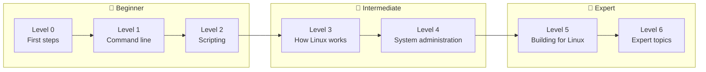

# The Full Roadmap

This page is the handbook's complete syllabus. It shows every tier, level, and chapter, plus the concepts each chapter teaches. Use it to see where you are, what's next, and how the pieces fit together.

| Tier | Levels | You go from… | …to | Time (est.) |
|---|---|---|---|---|
| 🌱 **Beginner** | 0–2 | Never having opened a terminal | Fluent on the command line, writing solid bash scripts | 6–10 weeks |
| 🔧 **Intermediate** | 3–4 | Using Linux | Understanding how it works and running real servers | 8–12 weeks |
| 🚀 **Expert** | 5–6 | Running servers | Building software for Linux, containers from scratch, performance, security, and automation | 10–16 weeks |

The time estimates assume about 45–60 minutes a day, most days. Go slower if you need to: understanding beats speed.

!!! tip "The one rule"
    Every level ends with a **capstone**. Don't move on until you can finish it **without notes**. The capstone proves you can use the skills, not just recognize them.

---

## 🌱 Beginner tier

**Goal:** Fluency. Get comfortable at the command line, fast at everyday tasks, and able to automate them with scripts.

**At the end of this tier you can:** move around any Linux system and find any file, config, or log; read and fix permissions; slice through gigabytes of logs with pipelines; edit files in vim over SSH; and write robust, shellcheck-clean bash scripts with options, logging, and error handling.

### Level 0: First steps

[Level overview →](chapters/00-first-steps/index.md)

| Chapter | Key concepts |
|---|---|
| [What is Linux?](chapters/00-first-steps/01-what-is-linux.md) | Kernel vs operating system · GNU · distributions and the Debian → Ubuntu → Mint family tree · desktop environments · open source licensing · where Linux runs |
| [The terminal, shell, and prompt](chapters/00-first-steps/02-terminal-shell-prompt.md) | Terminal emulator vs shell vs TTY · bash · anatomy of the prompt and of a command · how the shell finds commands (`PATH`, builtins, `type`) · exit status |
| [Your first commands](chapters/00-first-steps/03-first-commands.md) | `pwd`, `ls`, `cd`, `echo`, `clear` · absolute vs relative paths · `.`, `..`, `~`, `-` · tab completion |
| [Getting help](chapters/00-first-steps/04-getting-help.md) | `man` (sections, synopsis notation, searching) · `--help` · `apropos` · `help` for builtins · `info` · `tldr` |
| [The filesystem layout](chapters/00-first-steps/05-filesystem-layout.md) | The FHS · "everything is a file" · `/etc`, `/var`, `/usr`, `/home`, `/tmp`, `/dev`, `/proc`, `/sys`, `/boot`, `/opt`, `/run` · dotfiles |
| [Users, groups, and sudo](chapters/00-first-steps/06-users-groups-sudo.md) | UIDs and GIDs · `/etc/passwd`, `/etc/group`, `/etc/shadow` · root · `sudo` vs `su` · least privilege |

**Capstone:** [Navigate confidently, and explain where config, logs, programs, and personal files live](exercises/level-0-capstone.md)

### Level 1: Command-line fluency

[Level overview →](chapters/01-command-line/index.md)

| Chapter | Key concepts |
|---|---|
| [Working with files](chapters/01-command-line/01-working-with-files.md) | `cp`, `mv`, `rm`, `mkdir`, `touch` · timestamps (atime/mtime/ctime) · `cat`, `less`, `head`, `tail -f` · `file`, `stat`, `wc` |
| [Globbing and expansion](chapters/01-command-line/02-globbing-and-expansion.md) | `*`, `?`, `[...]` · brace expansion · tilde expansion · the order of shell expansions · `globstar`, `nullglob`, `dotglob` |
| [Permissions](chapters/01-command-line/03-permissions.md) | Reading `ls -l` · r/w/x on files vs directories · `chmod` (symbolic and octal) · `chown` · `umask` · setuid, setgid, and the sticky bit |
| [Pipes and redirection](chapters/01-command-line/04-pipes-and-redirection.md) | stdin/stdout/stderr · `>`, `>>`, `2>&1` · `/dev/null` · pipes · `tee` · here-docs · process substitution |
| [Text processing](chapters/01-command-line/05-text-processing.md) | Regular expressions · `grep`, `cut`, `sort`, `uniq`, `tr` · `sed` · `awk` · `xargs` · `paste`, `column`, `comm`, `diff` |
| [Finding files](chapters/01-command-line/06-finding-files.md) | `find` (tests, actions, `-exec`, `-print0`) · `locate` · `which`, `whereis`, `type` · `fd` |
| [Shell productivity](chapters/01-command-line/07-shell-productivity.md) | History and `++ctrl+r++` · readline shortcuts · aliases and functions · `.bashrc` vs `.profile` · environment variables · `PS1` |
| [Archives and compression](chapters/01-command-line/08-archives-and-compression.md) | `tar` in depth · gzip, bzip2, xz, zstd · `zip` · checksums with `sha256sum` · streaming tar over SSH |
| [Vim essentials](chapters/01-command-line/09-vim-essentials.md) | Modes · motions · the operator + motion grammar · text objects · search and replace · `.vimrc` · nano as a fallback |
| [tmux](chapters/01-command-line/10-tmux.md) | Sessions, windows, panes · detach and reattach · surviving SSH disconnects · `.tmux.conf` |

**Capstone:** [Answer real questions about a log file using only pipelines](exercises/level-1-capstone.md)

### Level 2: Shell scripting

[Level overview →](chapters/02-scripting/index.md)

| Chapter | Key concepts |
|---|---|
| [Your first script](chapters/02-scripting/01-first-script.md) | The shebang · `chmod +x` · `./script` vs `bash script` vs `source` · `~/.local/bin` · `printf` · `read` · shellcheck |
| [Variables, quoting, and arrays](chapters/02-scripting/02-variables-quoting-arrays.md) | Quoting rules and word splitting · `"$@"` · parameter expansion · command substitution · arithmetic · indexed and associative arrays |
| [Conditionals, loops, and functions](chapters/02-scripting/03-control-flow-functions.md) | Exit codes · `[` vs `[[` · `case` · `for`/`while`/`until` · reading files line by line · functions and `local` |
| [Error handling](chapters/02-scripting/04-error-handling.md) | `set -euo pipefail` and its gotchas · `trap` · `mktemp` · logging to stderr · debugging with `set -x` |
| [Arguments and getopts](chapters/02-scripting/05-arguments-getopts.md) | Positional parameters · `shift` · `getopts` · long options · usage messages and validation |
| [Bash or Python?](chapters/02-scripting/06-bash-vs-python.md) | Where bash stops being the right tool · the same task in both · calling the shell safely from Python |

**Capstone:** [A backup script with options, logging, rotation, and dry-run mode that passes shellcheck](exercises/level-2-capstone.md)

---

## 🔧 Intermediate tier

**Goal:** Understanding, then operations. Learn what Linux is doing underneath, and use that knowledge to run real servers.

**At the end of this tier you can:** explain the boot process and what happens when you run a command; read `top`, `free`, and `df` like a professional; manage packages, services, users, logs, disks, and firewalls; set up SSH, nginx, and TLS; and troubleshoot a broken server methodically.

### Level 3: How Linux works

[Level overview →](chapters/03-internals/index.md)

| Chapter | Key concepts |
|---|---|
| [The boot process](chapters/03-internals/01-boot-process.md) | UEFI/BIOS · GRUB · kernel and initramfs · systemd as PID 1 · targets · `systemd-analyze` |
| [Processes and signals](chapters/03-internals/02-processes-and-signals.md) | fork + exec · process states · zombies and orphans · `ps`, `top`, `htop` · load average · signals · `kill` · job control · `nice` |
| [Memory](chapters/03-internals/03-memory.md) | Virtual memory · pages and the MMU · the page cache · `free` and "available" · swap · the OOM killer · RSS vs VSZ |
| [Filesystems, inodes, and links](chapters/03-internals/04-filesystems-and-links.md) | ext4, xfs, btrfs, tmpfs · the VFS · inodes · hard vs symbolic links · mounting and `fstab` · `df` vs `du` |
| [Devices, /proc, and /sys](chapters/03-internals/05-devices-proc-sys.md) | Block vs character devices · major/minor numbers · udev · `/proc/PID/*` · `/sys` · `lspci`, `lsusb`, `lshw` |
| [Installing software](chapters/03-internals/06-installing-software.md) | dpkg vs apt · repositories and signing keys · PPAs · snap, flatpak, AppImage · building from source · pip and venvs |

**Capstone:** [Explain power-on to login screen, and keypress to `ls` output, naming every component](exercises/level-3-capstone.md)

### Level 4: System administration

[Level overview →](chapters/04-sysadmin/index.md)

| Chapter | Key concepts |
|---|---|
| [systemd and journalctl](chapters/04-sysadmin/01-systemd-and-journalctl.md) | Units and unit types · `systemctl` · writing service units · drop-in overrides · dependencies · user services · journald |
| [Scheduling tasks](chapters/04-sysadmin/02-scheduling.md) | cron syntax and pitfalls · anacron · `at` · systemd timers and `OnCalendar` · cron vs timers |
| [Networking basics](chapters/04-sysadmin/03-networking-basics.md) | TCP/IP layers · IPv4/CIDR · IPv6 · routing and NAT · TCP vs UDP · ports · DNS and systemd-resolved · `ip`, `ss`, `dig`, `curl` |
| [Firewalls with ufw](chapters/04-sysadmin/04-firewall-ufw.md) | netfilter → nftables → ufw · stateful filtering · default policies · rules · not locking yourself out |
| [SSH](chapters/04-sysadmin/05-ssh.md) | Host keys and TOFU · key authentication · `ssh-agent` · `~/.ssh/config` · `sshd` hardening · `scp`/`rsync` · tunnels |
| [Disks and backups](chapters/04-sysadmin/06-disks-and-backups.md) | MBR vs GPT · partitioning · `mkfs` · mounting by UUID · SMART · the 3-2-1 rule · rsync, Timeshift, restic/borg |
| [Troubleshooting](chapters/04-sysadmin/07-troubleshooting.md) | The USE method · runbooks: disk full, high CPU, out of memory, failing service, network unreachable, slow system |
| [User management and PAM](chapters/04-sysadmin/08-user-management.md) | `useradd`/`usermod`/`userdel` · password aging · `/etc/shadow` fields · `visudo` · PAM stacks · NSS and `getent` |
| [Logging and logrotate](chapters/04-sysadmin/09-logging-and-logrotate.md) | Kernel log, journald, rsyslog · facilities and severities · `/var/log` tour · logrotate · centralized logging |
| [LVM and RAID](chapters/04-sysadmin/10-lvm-and-raid.md) | PV → VG → LV · growing filesystems online · snapshots · RAID levels · `mdadm` · RAID is not a backup |
| [Web servers and TLS](chapters/04-sysadmin/11-web-servers-and-tls.md) | HTTP · nginx server blocks · reverse proxying · TLS and certificates · `openssl` · Let's Encrypt |

**Capstone:** [Build a secured server from scratch: SSH, firewall, a web app as a service, and nightly backups](exercises/level-4-capstone.md)

---

## 🚀 Expert tier

**Goal:** Building. Write software that works *with* Linux, and master the technologies that run modern infrastructure.

**At the end of this tier you can:** trace any program's system calls; write servers that handle signals and run as hardened systemd services; build, link, package, and debug native code; build a container from raw kernel features; find performance bottlenecks with perf and eBPF; harden a system; and automate whole fleets with Ansible.

### Level 5: Building for Linux

[Level overview →](chapters/05-programming/index.md)

| Chapter | Key concepts |
|---|---|
| [System calls and strace](chapters/05-programming/01-system-calls-strace.md) | User space vs kernel space · how a syscall happens · errno · the vDSO · `strace` for debugging |
| [File descriptors in code](chapters/05-programming/02-file-descriptors.md) | The fd table, open file descriptions, and inodes · open flags · buffering · `dup2` · atomic writes · file locking |
| [Processes and signals in code](chapters/05-programming/03-processes-signals-in-code.md) | fork/exec/wait in Python · a mini shell · `subprocess` done right · signal handlers · graceful shutdown |
| [Pipes and sockets](chapters/05-programming/04-pipes-and-sockets.md) | IPC options · pipes and FIFOs · Unix and TCP sockets · handling many clients (threads, selectors, asyncio) · framing |
| [Your program as a service](chapters/05-programming/05-services-with-systemd.md) | Service users · unit files · logging to journald · `sd_notify` · socket activation · sandboxing directives |
| [Building software](chapters/05-programming/06-building-software.md) | Compile → link · ELF · static vs shared libraries · `ld.so` and `ldd` · `make` · cmake · building a `.deb` |
| [Debugging](chapters/05-programming/07-debugging.md) | gdb · segfaults · core dumps and `coredumpctl` · pdb and py-spy · valgrind · AddressSanitizer |

**Capstone:** [A multi-client network server with clean signal handling, running as a systemd service](exercises/level-5-capstone.md)

### Level 6: Expert topics

[Level overview →](chapters/06-expert/index.md)

| Chapter | Key concepts |
|---|---|
| [Containers from scratch](chapters/06-expert/01-containers-from-scratch.md) | Namespaces · `unshare`/`nsenter` · `pivot_root` · cgroups v2 · overlayfs · how Docker, containerd, and runc map onto these |
| [Performance analysis](chapters/06-expert/02-performance-analysis.md) | USE and RED methods · the 60-second checklist · `sar`, `iostat`, `pidstat` · `perf` · flame graphs · eBPF with bcc and bpftrace |
| [Security](chapters/06-expert/03-security.md) | Threat models · capabilities · AppArmor · seccomp · auditd · unattended upgrades · a hardening checklist |
| [Kernel basics](chapters/06-expert/04-kernel-basics.md) | Kernel subsystems · modules · `sysctl` · `dmesg` · taint · writing a hello-world kernel module |
| [Advanced networking](chapters/06-expert/05-advanced-networking.md) | A packet's path through the kernel · `tcpdump` · TCP states · network namespaces · nftables · policy routing · WireGuard |
| [Virtualization](chapters/06-expert/06-virtualization.md) | Hypervisors · KVM/QEMU/libvirt · `virsh` · cloud images and cloud-init · qcow2 · virtual networks |
| [Docker and Podman](chapters/06-expert/07-docker-and-podman.md) | Images and layers · Dockerfiles · volumes · networks · compose · rootless Podman and Quadlet · image security |
| [Automation with Ansible](chapters/06-expert/08-automation-ansible.md) | Idempotency · inventories · playbooks · modules · templates · roles · vault · rebuilding the Level 4 server as code |

**Capstone:** [Build a minimal container with unshare and cgroups, or build Linux From Scratch](exercises/level-6-capstone.md)

---

## Alongside every level

- **[Cheat sheets](cheatsheets/index.md)**: one-page references to keep open while you practice.
- **[Glossary](cheatsheets/glossary.md)**: every term defined in one place.
- **[Progress checklist](progress.md)**: tick off chapters and capstones as you go.
- **A "mistakes I made" log**: write down every mistake and what it taught you. Rereading it is surprisingly effective.
